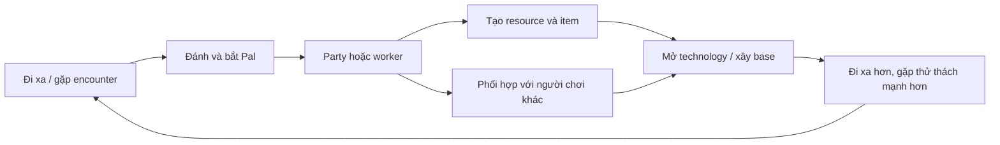

# Chương 2 — Palworld có gì vui?

Bạn bắt được một con Pal vào buổi sáng. Đến chiều, con Pal đó không còn là một cái tên trong danh sách nữa: nó đang đập đá ở căn cứ, hoặc đứng cạnh bạn trong một trận đánh, hoặc nằm trong quả cầu chờ lần ra ngoài tiếp theo. Đó là khoảnh khắc khiến Palworld khác một game sưu tầm thông thường. Niềm vui không nằm ở việc “có thêm một con”; nó nằm ở việc một thứ vừa được tìm thấy lập tức mở ra một cách sống mới.

Vì vậy, sáu nguồn vui dưới đây không nên được đọc như sáu ô trong một bảng tính. Chúng là sáu lực kéo móc vào nhau. Nếu một lực kéo biến mất, các lực còn lại vẫn có thể chạy vài phút, nhưng vòng lặp dài sẽ mất lực.

## Sáu nguồn vui

### 2.1 — Sưu tầm: gặp một thứ chưa có và biến nó thành của mình

Sưu tầm bắt đầu bằng một khoảng trống: trong roster còn thiếu một con, trong vùng đất chưa đi tới, trong bảng dữ liệu vẫn còn một row chưa biến thành thực thể. Người chơi đi ra ngoài vì muốn lấp khoảng trống đó. Nhưng phần thưởng không chỉ là hình ảnh mới; mỗi Pal có stat, passive, kỹ năng partner và work suitability khác nhau. `DT_PalMonsterParameter` được tài liệu mô tả có **663+ entries**, còn header nhân vật có các field combat, capture, speed, hunger, breeding và work. Con số này nói rằng collection có đủ chiều rộng để tạo lựa chọn, không chỉ đủ số lượng để làm đầy album. (REFERENCE; EXTRACTED).

Điểm vui nhất xảy ra khi người chơi nhận ra mình không bắt một Pal “tốt hơn” một cách trừu tượng. Mình bắt nó vì nó phù hợp với một việc cụ thể: con này chạy nhanh, con kia có skill chiến đấu, con khác có cấp độ việc đúng với dây chuyền đang thiếu. Collection vì thế là đầu vào của mọi quyết định sau đó.

### 2.2 — Tự động hóa: thứ mình bắt được tiếp tục có ích khi mình không cầm tay điều khiển

Một Pal được đưa vào base có thể chuyển từ sinh vật hoang thành lao động cụ thể. Header `EPalWorkSuitability` có **13 loại việc**; character data lại có các field suitability tương ứng. Đây là một hợp đồng dữ liệu rõ: Pal không chỉ có sức mạnh, nó có năng lực vận hành một căn cứ. (EXTRACTED).

Tự động hóa tạo ra cảm giác rất riêng: rời căn cứ với một danh sách việc dang dở, quay về thấy một phần việc đã được làm. Cảm giác đó chỉ có giá trị nếu hệ thống đôi khi thất bại. Hết nguyên liệu, công trình đầy, thợ không phù hợp, hoặc nhu cầu sinh tồn tụt xuống thì dây chuyền phải chậm lại. Nếu mọi thứ luôn chạy đúng, người chơi không còn quản lý; họ chỉ bật một công tắc.

### 2.3 — Tiến bộ: output hôm nay mở một khả năng mới ngày mai

Tiến bộ không chỉ là thanh level. Tài liệu DataTable ghi technology có **150+ nodes**, tier đầu có cost khoảng 1 point còn tier cao có thể lên 10 point; player level được mô tả từ 1 đến 55+, Pal khoảng 50. Những con số này tạo nhiều nhịp: mở khóa sớm để thấy phản hồi nhanh, rồi để dành khoảng trống cho mục tiêu dài. (REFERENCE).

Tiến bộ có ý nghĩa khi nó quay lại thế giới. Một recipe mới cho phép dùng tài nguyên cũ theo cách mới; một công trình mới làm base chứa được nhiều hơn; một kỹ năng mới biến encounter trước đây thành encounter có thể thử. Nếu unlock chỉ mở menu mà không thay đổi cách chơi, người chơi có lý do để bấm nhưng không có lý do để nhớ.

### 2.4 — Khan hiếm: quyết định phải có giá

Khan hiếm là phần làm cho việc lựa chọn trở nên thật. Capture có `CaptureRateCorrect`; loot có rate/min/max; item có stack và weight; build object có cost và HP. Tài liệu DataTable còn dùng ví dụ Wood HP 500 và Metal HP 5000 để minh họa khoảng cách vật liệu. Đây là các núm cân bằng, không phải những con số trang trí. (REFERENCE).

Khan hiếm không có nghĩa là bắt người chơi chờ vô hạn. Nó có nghĩa là người chơi phải chọn: dùng nguyên liệu cho vũ khí hay cho căn cứ, đem Pal này đi bắt hay để nó làm việc, mở technology này trước hay giữ điểm cho technology khác. Khi lựa chọn đó có thể đảo ngược bằng một chuyến đi hoặc một cách chơi khác, scarcity tạo chiến lược thay vì tạo bực bội.

### 2.5 — Sáng tạo: cùng một nguồn lực nhưng có nhiều đường giải

Sáng tạo xuất hiện khi hệ thống không ép một tài nguyên chỉ có một công dụng. Một Pal có thể là người chiến đấu, worker, partner hoặc nguyên liệu cho một tiến trình khác; một item có thể đi vào recipe, equipment, shop hoặc building. Đây là kết luận từ quan hệ giữa các data contract, không phải claim rằng mọi item trong game đều có đủ các đường dùng. (INFERRED).

Sáng tạo cũng cần giới hạn. Nếu mọi thứ làm được mọi thứ, lựa chọn trở thành nhiễu. Những field như work suitability, item type, cost, weight và technology requirement là cách dữ liệu vẽ ranh giới cho sáng tạo: người chơi được thử trong một không gian có hình dạng.

### 2.6 — Xã hội: những gì mình xây ra có người khác nhìn thấy và dùng được

Co-op làm cho base, roster và công trình không còn là nhật ký cá nhân. Một dây chuyền tự động hóa có thể giúp cả nhóm; một người đi bắt, người khác chuẩn bị vật liệu; một công trình trở thành điểm hẹn. Các nguồn đã khảo sát chưa đủ để xác nhận schema guild, quyền owner hay quy tắc chia save, nên phần “xã hội” ở đây là giá trị thiết kế suy ra từ co-op context, không phải mô tả một permission system cụ thể. (UNKNOWN ở mức runtime contract; INFERRED ở mức cảm giác).

Điều cần giữ là xã hội không nhất thiết phải bắt đầu bằng chat hay guild. Chỉ cần output của một người trở thành input hữu ích cho người khác, game đã có một lý do để phối hợp.

## Vòng lặp khóa sáu nguồn vui vào nhau

Hãy nhìn một chuyến chơi điển hình. Người chơi đi xa để gặp một Pal chưa có. Combat và capture làm cho việc bắt không chắc chắn; khi bắt được, Pal trở thành một instance có thể đưa vào party hoặc base. Ở base, work suitability biến nó thành năng lực sản xuất. Sản xuất tạo item và recipe mới. Technology mở công cụ để đi xa hơn hoặc xây tốt hơn. Lần đi xa tiếp theo đưa người chơi tới encounter khó hơn, nơi một Pal mới lại có giá trị.

Quan hệ nhân quả nằm ở chỗ output của bước này không chỉ là phần thưởng cuối bước; nó là năng lực làm bước kế tiếp. Capture cho collection. Collection cho utility. Utility cho production. Production cho progression. Progression trả lại exploration. Đó là lý do “bắt thú”, “xây base” và “craft” không thể thiết kế như ba feature độc lập rồi ghép ở cuối.

## Vòng lặp đứt ở đâu?

Có ít nhất năm chỗ dễ đứt.

**Đứt ở capture.** Nếu capture gần như luôn thành công, Pal không còn là phần thưởng đáng giành. Nếu capture quá khó mà người chơi không có cách cải thiện xác suất, thất bại không tạo chiến lược mà chỉ tạo phí thời gian.

**Đứt ở utility.** Nếu Pal bắt xong chỉ nằm trong party, người chơi không có lý do sưu tầm những con không đánh mạnh. Work suitability, partner skill và breeding là các đường phụ giữ collection có giá trị.

**Đứt ở production.** Nếu worker làm mọi thứ tự động mà không có giới hạn, base mất bài toán quản lý. Nếu worker không bao giờ tạo đủ output để cảm thấy khác biệt, automation thành một animation đẹp.

**Đứt ở progression.** Nếu technology mở khóa quá chậm, đầu game không có phản hồi; nếu mở tất cả quá nhanh, chuyến đi sau không còn mục tiêu. Nguyên tắc “first impression numbers matter most” và “leave room for upward mobility” trong tài liệu DataTable là hai cách chống đứt ở hai đầu nhịp tiến bộ. (REFERENCE).

**Đứt ở xã hội.** Nếu output của người chơi không giúp được ai khác, co-op chỉ còn là nhiều người đứng trong cùng một map. Nếu quyền sở hữu và save không rõ, phối hợp biến thành rủi ro mất tài sản. Schema guild/save chi tiết chưa có trong evidence hiện tại; đây là khoảng cần thiết kế riêng, không được giả vờ là đã biết. (UNKNOWN).

## Chống đứt bằng cách nào?

Cách chống đứt tốt nhất không phải thêm một nút thưởng. Nó là tạo nhiều đường nối giữa cùng hai trạng thái. Pal không chỉ dùng để đánh; nó còn làm việc. Resource không chỉ để craft; nó còn dùng cho building, shop hoặc tiến trình. Technology không chỉ mở recipe; nó còn thay đổi khả năng khám phá. Khi một đường bị nghẽn, người chơi vẫn còn một đường khác để tiến.

Nhưng nhiều đường nối không có nghĩa là bỏ qua thất bại. Hệ thống phải cho người chơi nhìn thấy nguyên nhân: thiếu nguyên liệu, thiếu cấp độ việc, công trình đầy, capture rate thấp, hoặc technology chưa mở. Nếu game chỉ nói “không thể”, vòng lặp vẫn đứt dù dữ liệu phía sau đầy đủ.

Cuối cùng, mỗi nguồn vui cần một nhịp phản hồi riêng. Sưu tầm trả lời ngay bằng encounter và capture result. Automation trả lời chậm bằng output khi quay về. Progression trả lời bằng unlock. Scarcity trả lời bằng lựa chọn. Creativity trả lời bằng build. Social trả lời bằng output được người khác nhìn thấy. Trộn tất cả thành một thanh điểm sẽ làm mất hình dạng của từng cảm giác.

---

**Bằng chứng cho chương này.** `DT_PalMonsterParameter` 663+ entries và 13 work suitability values là REFERENCE/EXTRACTED từ `Documents/Book/Palworld_Whitepaper/C01-Pal-Va-Stats.md` và source header. Technology 150+, tier cost 1→10, player level 1–55+ và Pal khoảng 50 lấy từ `C09-Progression.md` và `02.Palworld/Documents/11-Palworld DataTable Architecture/07-Progression and Special System Tables.txt`. Drop tám slot lấy từ `C12-Encounter-Dungeon-Boss.md`. WorkOutput 300s→60s, Wood 500/Metal 5000 và các nguyên tắc tuning lấy từ `C15-So-Hoc-Game-Design.md`. Vòng lặp và sáu nguồn vui là INFERRED; schema guild, permission và save co-op chi tiết vẫn UNKNOWN.
