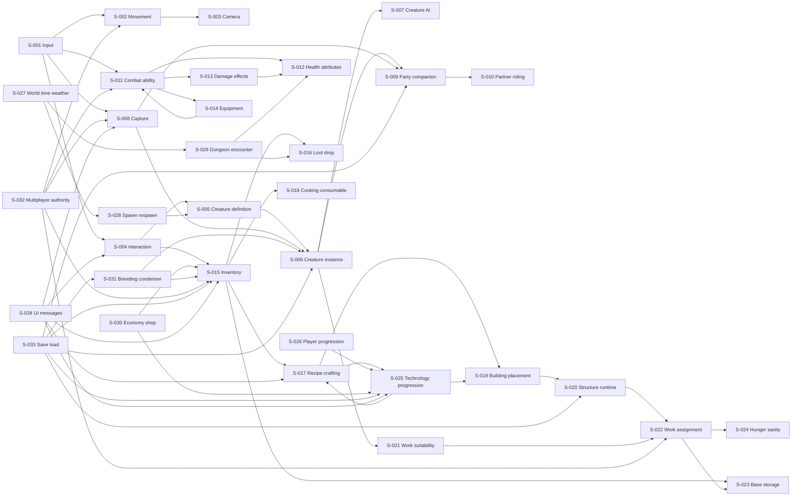

# Chương 5 — Bản đồ hệ thống và thứ tự dựng

Sau catalog, chúng ta có một vấn đề mới: hơn một trăm tính năng không phải hơn một trăm hệ thống. Nếu biến mỗi dòng `F-xxx` thành một module, project sẽ có một rừng tên mà không ai biết module nào giữ state, module nào chỉ đọc dữ liệu, module nào là điểm giao.

Chương này gom catalog thành các hệ thống có owner rõ hơn. Mỗi `S-xxx` dưới đây không nhất thiết là một Unreal module; nó là một boundary kiến trúc. Khi triển khai, một boundary có thể là component, subsystem, service, data domain hoặc plugin. Điều quan trọng là biết nó giữ state gì và những hệ thống nào được phép đi qua nó.

## 5.1 — Danh sách hệ thống

| Mã | Hệ thống | State chính giữ ở đâu |
|---|---|---|
| S-001 | Player input | Local input mapping, action state, intent gửi lên authority |
| S-002 | Movement & traversal | Transform/movement mode runtime; server truth và client prediction |
| S-003 | Camera | Local camera mode, yaw/pitch, zoom |
| S-004 | Interaction query | Focus target, trace result, interaction intent |
| S-005 | Creature definition | Static species stats, capture/work/breeding fields |
| S-006 | Creature instance | Stable ID, level, current stats, passive, owner |
| S-007 | Creature AI | Activity state, target, path/task runtime |
| S-008 | Capture | Attempt context, success/failure result, cooldown |
| S-009 | Party/companion | Roster order, active companion, summon context |
| S-010 | Partner/riding | Buff/equip state, mount mode, rider relationship |
| S-011 | Combat ability | Ability activation, cost, cooldown, targeting |
| S-012 | Health & attributes | Current/max health, stamina, status attributes |
| S-013 | Damage/effect | Damage request, effect instance, resistance/result |
| S-014 | Equipment | Equipped definition/instance, attachment, active weapon |
| S-015 | Inventory | Item instances, stacks, weight, capacity |
| S-016 | Loot/drop | Drop table selection, pickup result, claim state |
| S-017 | Recipe/crafting | Recipe definitions, queue, progress, consumed input |
| S-018 | Cooking/consumable | Cooking progress, result item, timed effects |
| S-019 | Building placement | Preview transform, validation result, committed structure |
| S-020 | Structure runtime | Stable structure ID, health, owner, workers/storage links |
| S-021 | Work suitability | Creature work levels and station requirements |
| S-022 | Work assignment | Worker–station assignment, queue, blocker, progress |
| S-023 | Base storage | Container inventory, capacity, access owner |
| S-024 | Hunger/sanity | Creature needs, decay timers, productivity modifiers |
| S-025 | Technology progression | Node definitions, unlocked stable IDs, points, version |
| S-026 | Player progression | XP, level, status points, level-up mutation |
| S-027 | World time/weather | Time-of-day, weather state, biome context |
| S-028 | Spawn/respawn | Weighted rows, live population budget, respawn scheduling |
| S-029 | Dungeon/encounter | Encounter tier, boss state, reward context |
| S-030 | Economy/shop | Currency/item balance, offers, purchase transaction |
| S-031 | Breeding/condenser | Parent links, progress, egg/result, upgrade rank |
| S-032 | Multiplayer authority | RPC intent, relevancy, replication and permissions |
| S-033 | Save/load | Schema version, stable IDs, serialization and migration |
| S-034 | UI/presentation messages | Widget state, prompts, HUD snapshots, gameplay messages |

Con số 34 là một cách gom để làm việc, không phải số module đã được extracted từ Palworld. Một số hệ thống có thể gộp khi prototype; một số khác nên tách sớm vì nhiều agent cùng chạm vào. Ví dụ `S-015 Inventory` và `S-023 Base storage` có thể dùng chung item contract, nhưng không nên để mọi container gọi thẳng vào player inventory.

Các nút dùng chung nhất là `S-012 Health & attributes`, `S-015 Inventory`, `S-016 Loot/drop`, `S-017 Recipe/crafting`, `S-021 Work suitability`, `S-025 Technology progression`, `S-032 Multiplayer authority` và `S-033 Save/load`. Chúng nằm trên nhiều đường đi khác nhau, nên một thay đổi nhỏ ở đây có bán kính ảnh hưởng lớn. Đây chính là các “ngã tư” mà Chương 6 sẽ mổ xẻ khi nhiều agent cùng làm.

## 5.2 — Quan hệ phụ thuộc

Sơ đồ dưới đây cố tình dùng quan hệ dữ liệu và intent, không giả vờ rằng mọi arrow là một `#include`. Một arrow nghĩa là hệ thống bên trái cần contract của hệ thống bên phải để hoàn thành trách nhiệm của mình.

Có hai loại arrow cần phân biệt. `S-001 → S-011` là intent: input yêu cầu combat ability. `S-011 → S-012` là mutation: ability sau khi validate có thể làm health đổi. `S-034` thường là observer/presentation, không nên trở thành owner của state. Nếu UI bắt đầu quyết định inventory hay technology, boundary đã bị đảo.

## 5.3 — Hệ thống nào dễ vỡ nhất?

**Inventory** là một ứng viên rõ ràng. Capture tạo item hoặc captured instance; loot đưa item vào; craft tiêu item; cooking biến item; shop đổi item/currency; equipment đọc item; building dùng item làm cost; save phải serialize item. Một field như stack count, weight hoặc stable ID thay đổi không chỉ ảnh hưởng một màn hình.

**Health/attributes và authority** cũng là nút thắt. Combat, capture, hunger, boss, status effect và UI đều muốn biết health. Nếu mỗi feature tự tạo một đường trừ máu, ta có nhiều nguồn sự thật cho cùng một state. `S-032 Multiplayer authority` làm vấn đề rộng hơn: mọi mutation cần biết client đang gửi intent hay đã tự ý sửa state.

**Work suitability, assignment và storage** là nút thắt của automation. `EPalWorkSuitability` có 13 loại việc, nhưng con số đó chỉ là taxonomy tĩnh; runtime còn phải biết station, capacity, queue, hunger, output và blocker. Chỉ cần một agent hiểu “worker level” khác agent khác, base sẽ có hai cách tính năng suất mà không có lỗi compile nào bắt được.

**Save/load** là nút thắt âm thầm nhất. Nó không nằm trên màn hình khi game đang chạy, nhưng mọi state persistent cuối cùng đều phải đi qua nó. Stable ID, schema version, migration và ownership không được để đến cuối project mới quyết định. Evidence hiện có `FPalInstanceID`/`FGuid`, breeding progress replicated và nhiều data rows; full save schema Palworld/guild chưa có, nên bản đồ này chỉ ghi boundary cần có, không tuyên bố runtime gốc. (EXTRACTED; UNKNOWN ở phần schema đầy đủ).

## 5.4 — Thứ tự dựng: luôn có một bản chơi được

Thứ tự dưới đây không phải danh sách “làm hết hệ thống nền rồi mới làm game”. Mỗi lát cắt phải tạo ra một vòng chơi có thể chạy, quan sát và sửa.

### Lát cắt 1 — Đi, nhìn, nhặt

Dựng `S-001`, `S-002`, `S-003`, `S-004`, một actor creature tối giản từ `S-005` và item pickup tối giản từ `S-015`. Definition of Done: người chơi di chuyển, nhìn camera, trace target và nhặt một item; UI hiển thị prompt; log có thể nói vì sao interaction fail.

### Lát cắt 2 — Đánh, bị đánh, có kết quả

Thêm `S-011`, `S-012`, `S-013` và `S-032` ở mức authority tối thiểu. Chưa cần đủ weapon catalog. Một attack có thể gửi intent, server validate, target mất health, client thấy reaction và death. Nếu lát cắt này không chạy trong hai client, đừng thêm breeding hay dungeon.

### Lát cắt 3 — Bắt một creature

Nối `S-008` với một capture item, `S-006` và `S-009`. Người chơi làm target yếu đi, thử capture, thấy success/failure và đưa instance vào roster. Chưa cần toàn bộ party UI; cần stable identity và một đường save/load giả lập để chứng minh instance không biến thành một dòng chữ.

### Lát cắt 4 — Một item, một recipe, một station

Dựng `S-015`, `S-017`, `S-018` ở quy mô nhỏ: một resource, một recipe, một station, một output. Đây là lúc phát hiện item definition, stack, weight và transaction có cùng một contract chưa. Chỉ thêm UI đủ để người chơi biết thiếu gì hoặc craft thành công.

### Lát cắt 5 — Một Pal làm một việc

Thêm `S-021`, `S-022`, `S-023`, `S-024`. Một worker, một work kind, một station, một storage. Cho phép người chơi rời base rồi quay lại thấy progress hoặc blocker. Đừng mở 13 loại việc cùng lúc; 13 là số extracted của taxonomy, không phải lý do để prototype 13 scheduler branch.

### Lát cắt 6 — Mở khóa và xây

Nối `S-025`, `S-026`, `S-019`, `S-020`. Một technology unlock mở một recipe hoặc structure; preview chạy client, validate/commit chạy authority; structure có stable ID. Khi build thất bại, người chơi biết thiếu cost, tech hay vị trí.

### Lát cắt 7 — Thế giới có nhịp

Thêm `S-027`, `S-028`, `S-029`, rồi economy/breeding ở mức một vertical slice. Spawn row có weight và điều kiện; encounter trả loot; breeding có progress rõ. Boss, dungeon tier và shop chỉ nên mở rộng sau khi item, health, authority và save đã chịu được vòng đầu.

### Lát cắt 8 — Co-op và persistence thật

Cuối cùng làm sâu `S-032`, `S-033`, `S-034`: reconnect, relevancy, save version, migration, UI messages và permission. “Cuối cùng” không có nghĩa bỏ qua từ đầu; contract của authority/save phải được ghi ở lát cắt 2–3, nhưng implementation đầy đủ chỉ đến khi vertical slice đã chứng minh game có gì để lưu và đồng bộ.

## 5.5 — Nguyên tắc kiểm tra trước khi sang Quyển 2

Một hệ thống chỉ được coi là sẵn sàng để nhiều agent dùng khi trả lời được năm câu: state owner là ai, mutation entry point là gì, read API nào được phép dùng, event/message nào phát ra, và test nào chứng minh failure case. Nếu thiếu một câu, agent tiếp theo sẽ tự đoán. Tự đoán là cách nhanh nhất để tạo hai contract song song.

Bản đồ này cũng chỉ ra vì sao Quyển 2 không thể chỉ nói “dùng module cho gọn”. Những hệ thống dùng chung nhất cần ownership, dependency direction và quy tắc phối hợp. Chúng là nơi nhiều tính năng đi qua, vì vậy cũng là nơi một thay đổi nhỏ có thể làm vỡ cả vòng chơi.

---

**Bằng chứng cho chương này.** Danh sách 34 hệ thống và các arrow là INFERRED từ catalog, không phải cây module runtime đã extracted. `EPalWorkSuitability` 13 loại việc, 663+ character entries, drop tám slot, technology 150+, `FPalInstanceID`/`FGuid` và breeding progress replicated là các điểm neo trong `Documents/Book/Palworld_Whitepaper/99-Evidence-Register.md` và các chapter C01–C14. Full guild/save schema, scheduler priority, runtime module boundaries và replication frequency vẫn UNKNOWN. Thứ tự lát cắt dọc là đề xuất clean-room dựa trên dependency, không phải roadmap chính thức của Palworld.
