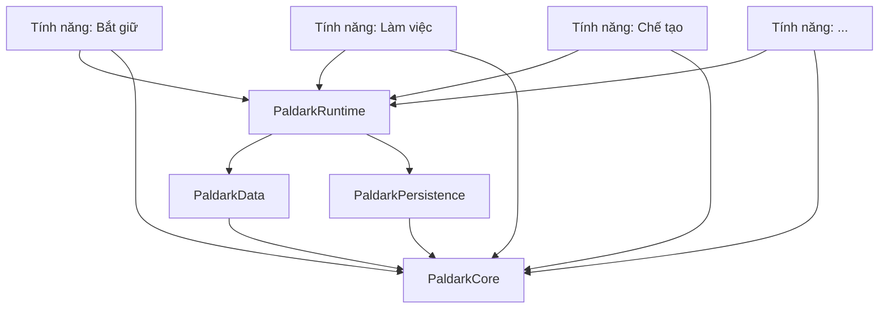

# Chương 13 — Bản đồ module

Hãy thử một phép kiểm rất thô: xóa plugin Bắt giữ khỏi project. Nếu compiler lập tức báo lỗi trong Work, Runtime hoặc lớp nhân vật chung, thì Bắt giữ chưa phải một tính năng tháo lắp được. Nó chỉ là một thư mục mang tên plugin, còn dây phụ thuộc vẫn chạy xuyên qua cả project.

Đến đây ta có luật ở Chương 11 và có danh mục ở Chương 12. Nhưng luật và tên gọi vẫn chưa cho code một hình dạng vật lý. Chương này vẽ ra cái hộp: dự án gồm những module nào, cái nào được phụ thuộc cái nào, và vì sao phép thử “xóa một feature” phải trở thành một việc bình thường thay vì một cuộc phẫu thuật.

Nguyên tắc dẫn đường rất đơn giản và tôi muốn nói trước, vì mọi quyết định phía sau đều suy ra từ nó:

> **Đồ thị phụ thuộc phải là một cây có chiều, không bao giờ có vòng, và tính năng luôn nằm ở tầng lá.**

Tính năng ở tầng lá nghĩa là: không có gì phụ thuộc vào một tính năng. Xóa bất kỳ tính năng nào khỏi dự án thì phần còn lại vẫn biên dịch được. Nếu có một tính năng mà xóa đi làm thứ khác gãy, ta đã vi phạm luật L2 ở đâu đó.

Đây cũng là bài kiểm tra nhanh nhất cho toàn bộ kiến trúc, và nó kiểm được bằng máy. Sơ đồ dưới đây là hình dạng tối thiểu thỏa điều kiện ấy; hãy đọc mũi tên như “được phép phụ thuộc vào”, không phải “gọi qua lại hai chiều”.

## 13.1 — Bốn tầng



**Tầng 1 — `PaldarkCore`.** Không phụ thuộc gì ngoài engine. Chứa những thứ mà mọi người đều cần và không ai được định nghĩa lại: các kiểu định danh, các struct yêu cầu, các interface, khung đăng ký, khung thông điệp, danh mục log, và nhãn gốc. Đây là nơi vật lý của "danh mục khái niệm" ở Chương 12.

Core là module **nhỏ nhất có thể**, và đây là chủ ý. Mỗi thứ đưa vào Core là một thứ cả nghìn agent phải sống chung. Ngưỡng vào Core là quy tắc ở mục 12.3.

**Tầng 2 — `PaldarkData` và `PaldarkPersistence`.** Hai module hạ tầng, không biết gì về gameplay.

`PaldarkData` lo mô hình định nghĩa – thực thể – mảnh, đọc file cấu hình văn bản, dựng và tra bảng đăng ký. `PaldarkPersistence` lo ghi và đọc trạng thái bền, quản lý phiên bản lược đồ, và di trú khi lược đồ đổi.

Tách hai cái này ra khỏi Core vì chúng có phụ thuộc hạ tầng riêng và có thể kiểm thử độc lập. Tách chúng ra khỏi nhau vì một cái đọc dữ liệu tĩnh lúc khởi động, một cái ghi dữ liệu động lúc chơi — hai vòng đời khác hẳn nhau.

**Tầng 3 — `PaldarkRuntime`.** Nơi ở của những lớp nền bị đóng băng theo luật L3: lớp nhân vật, lớp sinh vật, lớp điều khiển, trạng thái game, trạng thái người chơi. Cộng với cỗ máy gắn component từ bên ngoài, và bộ nạp kịch bản chơi.

Module này là chỗ dễ hỏng nhất về mặt kỷ luật. Nó "gần gameplay" nên ai cũng có lý do chính đáng để thêm một thứ nhỏ vào. Nên nó cần luật cứng nhất: mọi file trong đây nằm trong danh sách đóng băng, thay đổi phải qua duyệt riêng.

**Tầng 4 — các tính năng.** Mỗi tính năng một plugin trong `Plugins/Features/`. Phụ thuộc lên trên được, sang ngang thì không.

Bốn tầng không phải bốn “khu vực cho gọn”. Chúng tạo ra một chiều đi bắt buộc cho mọi dependency: feature có thể nhìn lên các hợp đồng ổn định, nhưng hạ tầng không nhìn xuống feature và hai feature không nắm tay nhau trực tiếp. Chính chiều đi này làm phép thử xóa plugin ở đầu chương có thể thành công.

## 13.2 — Vì sao chia đúng bốn tầng này

Có thể chia ít hơn hoặc nhiều hơn, nên tôi nói rõ lý do để sau này ai muốn đổi thì biết mình đang đánh đổi cái gì.

**Vì sao tách Core khỏi Data.** Nếu gộp, thì mọi tính năng chỉ cần một kiểu định danh cũng phải kéo theo cả cỗ máy đọc cấu hình. Quan trọng hơn: Core phải kiểm thử được mà không cần dựng thế giới, và trộn phần đọc file vào sẽ làm mất tính chất đó.

**Vì sao tách Persistence ra riêng.** Vì lưu trữ là chỗ ràng buộc chặt nhất với tương thích ngược. Một khi người chơi có file lưu, ta không được tự do đổi lược đồ nữa. Cô lập nó vào một module giúp thấy rõ mọi thứ chạm tới lưu trữ, và giúp việc di trú lược đồ nằm gọn một chỗ.

**Vì sao Runtime không gộp vào Data.** Vì Runtime phụ thuộc engine rất nặng — actor, component, mạng — còn Data thì gần như thuần dữ liệu. Giữ Data nhẹ nghĩa là kiểm thử được nhanh, và cả một lớp lỗi cấu hình bắt được mà không cần mở game.

**Vì sao không có module riêng cho mạng.** Đây là quyết định có chủ ý và tôi biết nó gây tranh cãi. Lý do: quyền hạn mạng không phải một tính năng tách rời được, nó là **tính chất của từng trạng thái**. Máu là quyền của server, camera là chuyện của client. Gom hết vào một module "mạng" sẽ tạo ra một module mà mọi hệ thống đều phải đi qua — đúng cái ngã tư ta đang tránh. Thay vào đó, quyền hạn được ghi trong danh mục quyền ghi ở Chương 12, và mỗi chủ tự chịu trách nhiệm về phần mạng của trạng thái mình sở hữu.

Điểm chung của bốn quyết định trên là vòng đời và trách nhiệm, không phải số lượng file. Core ổn định khác Data đọc cấu hình; Data tĩnh khác Persistence phải giữ tương thích ngược; Runtime gắn với actor khác những cấu trúc có thể kiểm ngoài game. Nếu sau này cần thêm hoặc gộp tầng, câu hỏi phải là “vòng đời và trách nhiệm nào đã thay đổi?”, không phải “cây thư mục trông có dài quá không?”.

## 13.3 — Luật phụ thuộc, phát biểu để kiểm được bằng máy

Một sơ đồ đẹp trong tài liệu không ngăn được một dòng include sai ở tuần sau. Muốn bản đồ sống cùng code, ta phải chuyển mũi tên thành những câu mà script có thể trả lời đúng hoặc sai. Bốn luật sau được viết theo đúng mục đích đó:

1. **Không có vòng.** Dựng đồ thị từ khai báo phụ thuộc của mọi module; phải là đồ thị có hướng không chu trình.
2. **Tính năng không phụ thuộc tính năng.** Không module tính năng nào được có tên một module tính năng khác trong danh sách phụ thuộc của mình.
3. **Khung không phụ thuộc tính năng.** Core, Data, Persistence, Runtime không được nhắc tới bất kỳ tính năng nào — kể cả trong chuỗi ký tự.
4. **Không lách bằng đường dẫn.** Không có chỉ thị include nào dùng đường dẫn tương đối để chui sang thư mục khác.

Luật 3 đáng nói thêm. Cách vi phạm phổ biến nhất không phải là thêm phụ thuộc, mà là **nhắc tên**: một hàm trong Runtime kiểm tra "nếu tính năng bắt giữ đang bật thì...". Không có phụ thuộc biên dịch nào, đồ thị vẫn sạch, nhưng khung đã biết tới một tính năng cụ thể và giờ không xóa tính năng đó đi được nữa. Nên script phải quét cả chuỗi ký tự, không chỉ quét khai báo.

## 13.4 — Một tính năng nhìn từ bên ngoài

Ba câu hỏi mà bất kỳ ai cũng phải trả lời được về một tính năng, mà không cần đọc thân hàm nào:

**Nó cần gì?** Danh sách interface của Core mà nó dùng, danh sách kênh nó nghe, danh sách bảng dữ liệu nó đọc.

**Nó cho gì?** Danh sách kênh nó phát, danh sách loại mảnh nó định nghĩa, danh sách trạng thái nó làm chủ.

**Nó gắn vào đâu?** Danh sách component nó muốn gắn, và gắn vào loại actor nào.

Cả ba câu đều được trả lời trong đúng một file khai báo của tính năng — đây là hiện thực của luật L10, và Chương 16 sẽ định nghĩa chính xác định dạng file đó.

Điều đáng nói là hệ quả: khi ba câu hỏi này trả lời được bằng cách đọc một file văn bản, **máy dựng lại được toàn bộ đồ thị phối hợp của dự án** — ai phát kênh nào, ai nghe kênh nào, kênh nào có người phát mà không ai nghe, kênh nào có người nghe mà không ai phát. Loại lỗi cuối cùng đó là một trong những lỗi khó tìm nhất trong kiến trúc dựa trên thông điệp, và ở đây nó thành một cảnh báo lúc kiểm tra. Chương 16 sẽ biến đúng ba câu hỏi này thành manifest của từng feature.

## 13.5 — Cây thư mục

Đến đây các tầng vẫn còn là khái niệm. Cây dưới đây đặt chúng vào đúng vị trí để một agent mở repo là thấy ngay đâu là hạ tầng ổn định, đâu là feature mình được phép sửa và đâu là script giữ luật:

```text
PaldarkKit/
  PaldarkKit.uproject
  Source/
    PaldarkCore/          # Runtime, PreDefault
    PaldarkData/          # Runtime, PreDefault
    PaldarkPersistence/   # Runtime, PreDefault
    PaldarkRuntime/       # Runtime, Default
    PaldarkTests/         # Editor
  Plugins/
    Features/
      Capture/
      Crafting/
      Work/
      ...
  Config/
  Documents/
  Scripts/
    ci/
```

Mỗi module theo chuẩn Unreal: có `Public` và `Private`, có file build riêng. Mỗi tính năng có cấu trúc y hệt nhau, và Chương 16 định nghĩa cấu trúc đó tới từng file — vì với một nghìn agent, việc mọi tính năng trông giống nhau quan trọng hơn việc từng tính năng được tối ưu riêng.

## 13.6 — Cái bản đồ này chưa nói

Một bản đồ tốt cũng phải ghi phần lãnh thổ chưa khảo sát. Bốn tầng giải quyết chiều phụ thuộc; chúng chưa tự trả lời kích thước plugin, chỗ đặt asset hay chi phí build. Ba điểm sau vì vậy vẫn là câu hỏi mở, không phải lời hứa đã được chứng minh:

- **Bao nhiêu tính năng là hợp lý.** Chưa biết. Catalog ở Chương 3 có 126 mục nhưng một plugin có thể gom vài mục liên quan. Chương 20 sẽ chốt khi chia lát cắt.
- **Nội dung nghệ thuật ở đâu.** Mesh, texture, âm thanh vẫn phải là asset nhị phân và vẫn phải nằm đâu đó. Đề xuất: trong thư mục nội dung của chính tính năng, và **không** tính năng nào tham chiếu nội dung của tính năng khác. Chưa kiểm chứng ở quy mô lớn.
- **Thời gian biên dịch.** Nhiều module nhỏ thì biên dịch lại nhanh khi sửa một chỗ, nhưng biên dịch sạch thì chậm hơn. Không có số đo.

Vậy chương này chưa cho ta biết mỗi feature phải chứa những file nào; nó chỉ dựng hàng rào để các feature không mọc rễ vào nhau. Trước khi đóng gói một feature ở Chương 16, ta còn cần trả lời một câu sâu hơn: dữ liệu nào là định nghĩa dùng chung, dữ liệu nào là một cá thể đang sống, và phần nào được phép đi vào bản lưu. Đó là việc của Chương 14.

---

**Bằng chứng cho chương này.** Bản đồ bốn tầng và bốn luật phụ thuộc là thiết kế của tài liệu này (INFERRED), suy ra từ các luật L1–L4 ở Chương 11. Việc tách module theo Runtime/Editor và khai báo giai đoạn nạp là cơ chế chuẩn của Unreal Engine. Cách tiếp cận "validator kiểm đồ thị phụ thuộc phẳng, Core độc lập, các module runtime phụ thuộc Core, facade phụ thuộc runtime, Tests phụ thuộc runtime" đã có tiền lệ trong chính repo này tại `scripts/ci/validate_paldarkv3.py` (OBSERVED); bản đồ ở đây kế thừa tinh thần đó nhưng không sao chép nguyên tập module của V3. Quyết định không tách module mạng riêng là lựa chọn thiết kế, chưa được kiểm chứng bằng triển khai.
