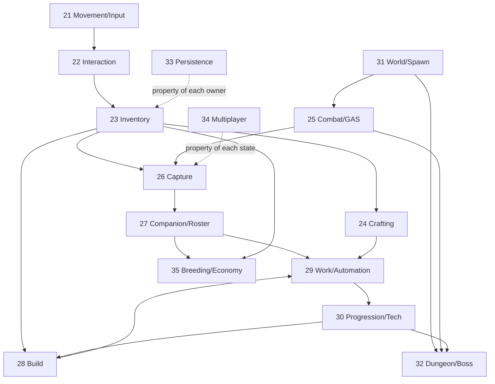

# Chương 37 — Độ phức tạp thật và lộ trình hoàn thành 21–35

## 37.1 — Có đánh giá “chính xác” độ phức tạp được không?

**Không thể chính xác theo giờ ở thời điểm này.** Ta chưa chốt phiên bản Palworld mục tiêu, chưa có content count đầy đủ, nhiều logic KYWorld nằm trong Blueprint binary, và chưa có human runtime baseline cho mọi normal path. Một con số như “còn 172 giờ” tạo cảm giác chắc chắn giả.

Ta có thể đánh giá đủ chính xác để ra quyết định theo ba lớp:

1. **Độ phức tạp tương đối:** system nào khó hơn và khó vì loại vấn đề nào.
2. **Dependency:** work nào mở khoá nhiều system khác.
3. **Evidence confidence:** phần nào có source, phần nào chỉ là asset/doc/inference/unknown.

Giờ công chỉ được estimate sau khi một thin vertical slice của chính system đã qua compile + human gate. Khi đó velocity có dữ liệu thay vì tưởng tượng.

## 37.2 — Bảy nguồn khó

Mỗi trục 1–5. Tổng chỉ để xếp nhóm, không phải phép đo tuyến tính; một trục 5 có thể chi phối toàn bộ system.

| Trục | Đo gì | Câu hỏi bắt buộc |
|---|---|---|
| `S` — State | số state/transition/invariant | Có state nào half-commit hoặc không khôi phục được không? |
| `N` — Network | authority/replication/prediction/reconnect | Client được gửi intent nào; server tự tính gì? |
| `A` — AI | perception/decision/path/reservation/recovery | AI chỉ biểu diễn intent hay đang lén sở hữu domain state? |
| `U` — UX | input/UI/animation/VFX/feedback | Người chơi nhìn thấy pending/reject/success bằng gì? |
| `C` — Content | data row/asset/map/animation/sound cần có | Một implementation đúng nhưng chỉ có một row có thành game chưa? |
| `R` — Rules | công thức/ordering/tuning/balance | Nguồn nào chứng minh luật và edge case? |
| `I` — Integration | số owner/transaction/schema cùng tham gia | Producer/consumer có typed/versioned contract không? |

Nhóm: 7–14 thấp, 15–20 vừa, 21–26 cao, 27–35 cực cao. Sai số hợp lý khoảng ±3 điểm.

## 37.3 — Bảng độ phức tạp

| Ch. | Hệ thống | S/N/A/U/C/R/I | Tổng | Nhóm | Vì sao khó nhất |
|---:|---|---|---:|---|---|
| 21 | Di chuyển/input | 2/3/1/2/4/2/3 | **17** | Vừa | nhiều movement mode và feel, nhưng owner/input path tương đối rõ |
| 22 | Tương tác/thu thập | 3/3/1/3/4/2/4 | **20** | Vừa | generic focus + target kind + contest/resource lifecycle |
| 23 | Inventory | 4/4/1/5/4/3/5 | **26** | Cao | transaction nhiều container, UI lớn, persistence/network delta |
| 24 | Crafting | 4/3/1/4/4/4/5 | **25** | Cao | reservation/queue/cancel/rollback và Work/Inventory integration |
| 25 | Combat | 5/5/4/4/5/5/5 | **33** | Cực cao | GAS/prediction, targeting, element/status/weapon/AI/content |
| 26 | Capture | 5/4/3/4/4/5/5 | **30** | Cực cao | công thức + projectile + transaction Inventory/Health/Creature/World |
| 27 | Companion | 4/4/5/4/5/4/5 | **31** | Cực cao | AI mode/skill/mount/roster/lease/ownership/persistence |
| 28 | Build | 5/4/2/5/5/4/5 | **30** | Cực cao | spatial validation, ghost/snap/support/permission/save/materialize |
| 29 | Work/automation | 5/4/5/4/5/5/5 | **33** | Cực cao | scheduler/reservation/logistics/needs/offline/AI recovery |
| 30 | Progression/tech | 4/3/1/5/5/3/5 | **26** | Cao | graph/content/UI và event từ hầu hết gameplay owner |
| 31 | World/life | 5/4/4/3/5/4/5 | **30** | Cực cao | ecology/population/time/weather/streaming/persistence budget |
| 32 | Dungeon/boss | 5/4/4/4/5/4/5 | **31** | Cực cao | seeded run, level/room lifecycle, boss phase, co-op/reward/resume |
| 33 | Persistence | 5/5/1/3/4/5/5 | **28** | Cực cao | irreversible failure, schema/migration/player scope/relation recovery |
| 34 | Multiplayer | 5/5/2/4/3/5/5 | **29** | Cực cao | cross-cut authority/reconnect/relevancy/guild/persistent world |
| 35 | Breeding/economy | 5/4/3/5/5/5/5 | **32** | Cực cao | dataset/di truyền/time economy/atomic entity mutation/UI/content |

Điều bảng này nói rõ: phần khó còn lại không phải tạo thêm state struct. Nó là **AI, UX, content, rule evidence và integration** — đúng những trục PR #135–#157 làm ít nhất.

## 37.4 — Tám năng lực nền mở khoá 15 hệ thống

Không có nghĩa tạo tám module mới. Đây là dependency/capability phải chứng minh bằng vertical use:

1. **Stable identity + actor lease:** Creature, item, structure, player, world entity sống qua spawn/despawn/save.
2. **Typed command/query/event:** chặn schema lệch khi producer/consumer cùng compile.
3. **Atomic item/entity transaction:** reserve/commit/compensate/idempotency cho craft/build/capture/breeding/economy.
4. **GAS/Health canonical authority:** ability, cost, cooldown, damage/status/tag/cue; không dual health authority.
5. **AI activity coordinator:** một Pal có đúng một activity owner; scheduler reserve job, AI chỉ thi hành/feedback.
6. **C++ view-model + presentation boundary:** UI đọc snapshot, gửi intent, hiển thị pending/reject/success; Blueprint không sở hữu state.
7. **Definition registry + content schema:** definition read-only, instance mutable, one-row vertical proof trước bulk content.
8. **Player/world-scoped persistence:** snapshot participant, numeric generation, migration, relation resolution, reconnect-safe identity.

Nếu tám năng lực này được xây ngang không có consumer, ta lặp lại sai lầm cũ. Mỗi năng lực chỉ được thêm ở đúng vertical slice cần nó.

## 37.5 — Dependency graph của gameplay

Persistence và multiplayer không phải “làm xong cuối cùng rồi rắc lên game”. Contract identity/authority của chúng có từ đầu, còn runtime acceptance sâu được hoãn tới milestone phù hợp.

## 37.6 — Work breakdown để đạt parity chức năng

### 21 — Di chuyển và input

- chốt semantic actions/mapping-context ownership và conflict resolver;
- locomotion camera-relative + animation state;
- stamina/sprint/dodge;
- swim/climb/glide;
- mount/dismount và movement capability theo Pal;
- network behavior/reconciliation theo cơ chế engine;
- accessibility/rebind và human feel tuning.

### 22 — Tương tác và thu thập

- generic focus query, target identity/kind, prompt;
- server validation range/LOS/permission;
- pickup/resource node/harvest state;
- contention/idempotency và respawn;
- animation/outline/audio/rejection feedback;
- reward transaction vào Inventory.

### 23 — Inventory

- definition/fragment và instance/stable ID;
- player/Pal/chest/station container;
- stack/split/move/swap/transfer atomic;
- pickup/drop/use/equip/weight;
- Fast Array/read model;
- grid/drag-drop/tooltip/quickbar;
- player-scoped save/migration.

### 24 — Crafting

- recipe definition/query/unlock;
- station capability;
- input reservation và atomic output;
- queue/timer/cancel/refund;
- player/Pal work contribution;
- UI/progress/notification;
- save/reconcile offline policy.

### 25 — Combat

- ASC/AttributeSet/tag/ability input và canonical Health;
- melee/ranged/weapon/ammo/projectile/targeting;
- damage execution, element, status, resistance, crit;
- dodge/block/stagger/death/loot;
- AI combat behavior;
- animation/montage/cue/VFX/audio/UI;
- network prediction/reconciliation và content/tuning.

### 26 — Capture

- authoritative target/health/status/sphere tier snapshot;
- projectile/impact/reservation;
- sourced formula và deterministic roll server-side;
- shake/timeline/pending/rejection presentation;
- atomic sphere settlement + creature transfer + world actor removal;
- retry/idempotency/disconnect;
- roster/UI/save/network.

### 27 — Companion

- persistent creature record và actor lease;
- party/storage/selection UI;
- summon/recall/follow/stay/aggressive/passive modes;
- Pal combat skill/ability/equipment;
- mount/glide capability;
- ownership/reconnect/save;
- interaction với Work/Breeding/Condenser.

### 28 — Build

- build definition/tech/cost;
- ghost/trace/grid/snap/rotate;
- terrain/overlap/support/base/permission validation;
- atomic material consume + structure spawn;
- structure identity/health/repair/demolish/refund;
- chest/station/power network;
- save/materialize/network/UI/content set.

### 29 — Work và automation

- job/station/output definition;
- suitability/priority/assignment;
- reservation scheduler;
- AI travel/arrival/work/recovery;
- hauling/input/output container;
- hunger/rest/sanity/condition modifiers;
- offline simulation/reconciliation;
- UI/debug story/save/network/content.

### 30 — Progression và technology

- XP source/event và level curve;
- stat/technology points;
- versioned technology DAG/prerequisite/cost;
- unlock query dùng bởi craft/build/ability;
- reward/achievement/boss/dungeon link;
- UI/search/filter/notification;
- save/migration/content graph.

### 31 — World và nhịp sống

- biome/spawn definition, population budget và relevancy;
- day/night/weather/temperature;
- resource respawn và creature ecology;
- fast travel/checkpoint/death respawn;
- raid/faction/crime/NPC/vendor hooks;
- streaming/despawn với stable identity;
- world save/reconcile/content maps.

### 32 — Dungeon và boss

- entrance/eligibility/party transition;
- seeded run/room graph/encounter state;
- room streaming/spawn/clear/door progression;
- boss ability/phase/arena/reset;
- reward claim exactly-once;
- death/rejoin/resume/timeout;
- UI/audio/VFX/content/save/network.

### 33 — Persistence

- player/world/domain snapshot ownership;
- stable ID/relation graph;
- numeric generation/manifest/checksum/backup;
- validate→migrate→plan→apply→resolve;
- crash/partial write recovery;
- schema compatibility policy;
- async storage and diagnostics;
- human restart/load acceptance tại milestone.

### 34 — Multiplayer

- state-by-state authority matrix;
- replicated read model/owner-only/relevancy;
- RPC/command rate-limit/idempotency;
- session/join/reconnect/identity;
- guild/base permission/shared asset;
- persistent world conflict policy;
- dedicated/server lifecycle và milestone test;
- security/observability.

### 35 — Breeding và economy

- breeding pair/assignment/farm state;
- sourced combination/genetics/passive inheritance;
- egg/incubation/time modifiers;
- child entity creation exactly-once;
- condenser sacrifice/upgrade atomic mutation;
- currency/vendor/stock/buy/sell/price refresh;
- ranch/output/source/sink balance;
- UI/content/save/network.

Đây là functional WBS. “100%” còn cần content catalog/tuning/visual/audio và một phiên bản Palworld mục tiêu; không thể suy ra từ class list.

## 37.7 — Lộ trình theo wave

### Wave 0 — Design gate và evidence hygiene

- duyệt ADR-001;
- chốt phiên bản Palworld mục tiêu;
- dùng `[C++]/[Asset]/[Doc]/[Inference]/[Unknown]`;
- freeze plugin/raw bus expansion;
- chốt log/test-card contract.

### Wave 1 — Signature vertical spine

Interaction target/kind → Inventory Sphere → Combat/Health → Capture settlement → Creature roster → Summon → Work arrival → Output.

Mục tiêu: chứng minh identity, transaction, AI, UI và log trên một flow thật.

### Wave 2 — Survival/base loop

Harvest → Inventory → Craft → Build → Station/container → Pal automation → Progression unlock.

Mục tiêu: biến một capture thành nền kinh tế căn cứ tự vận hành.

### Wave 3 — World/dungeon loop

Biome spawn/time/weather → exploration → dungeon run → boss → reward → progression → world persistence.

### Wave 4 — Depth/parity

Movement modes, weapon/element/status breadth, companion skill/mount, Work needs/logistics, build set, breeding/economy datasets và UI/content breadth.

### Wave 5 — Online/persistence hardening

Reconnect, guild/base permission, persistent multi-player scope, dedicated acceptance, migration/backward compatibility và performance budget.

Wave 5 test sâu được hoãn, nhưng authority/stable ID/schema contract không được hoãn.

## 37.8 — Định nghĩa hoàn thành

Mỗi system đi qua:

`DESIGNED → SOURCE_PRESENT → COMPILED → INTEGRATED → PLAYER_OBSERVABLE → USER_VERIFIED → PARITY_EVIDENCED`.

Phần trăm ở Chương 36 chỉ là dashboard. Definition of Done thực là evidence chain này.

## 37.9 — Nguồn và bài học

- Đường học của 13 khoá theo từng system: [Phụ lục D](../PhuLuc/D-kiem-ke-13-khoa-hoc.md).
- Giáo trình câu hỏi 15 system: [Chương 38](38-giao-trinh-15-khoa-hoc.md).
- KYWorld case study: [Phụ lục E](../PhuLuc/E-case-study-kyworld.md).
- Nguồn Epic và điều được phép suy ra: [Phụ lục F](../PhuLuc/F-nguon-chinh-thuc.md).
- Kiến trúc proposed: [Chương 39](../Q6-Kien-Truc-VibeCoding/39-kien-truc-hoi-tu-vibecoding.md).

Không bắt đầu code theo roadmap này trước khi ADR-001 được Soliz duyệt.
