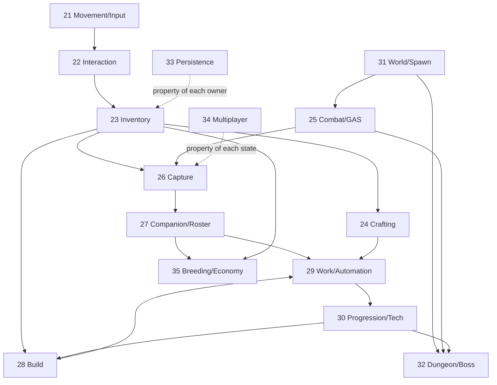

# Chương 37 — Độ phức tạp thật và lộ trình hoàn thành 21–35

## 37.1 — Có đánh giá “chính xác” độ phức tạp được không?

Sau một bản kiểm toán, câu hỏi thường đến ngay là: “Vậy còn bao lâu nữa?”. Một con số theo giờ tạo cảm giác dự án đã nằm gọn trong tay, nhưng ở thời điểm này sự chính xác ấy chỉ là hình thức. Ta chưa chốt phiên bản Palworld mục tiêu, chưa có content count đầy đủ, nhiều logic KYWorld còn nằm trong Blueprint binary và chưa có human runtime baseline cho mọi normal path. Nói “còn 172 giờ” sẽ chính xác tới hàng đơn vị trên một nền dữ liệu chưa chính xác tới hàng chục.

Điều đó không có nghĩa ta không thể lập kế hoạch. Ta có thể đánh giá đủ chắc để quyết định theo ba lớp:

1. **Độ phức tạp tương đối:** system nào khó hơn và khó vì loại vấn đề nào.
2. **Dependency:** work nào mở khoá nhiều system khác.
3. **Evidence confidence:** phần nào có source, phần nào chỉ là asset/doc/inference/unknown.

Giờ công chỉ nên được ước lượng sau khi một thin vertical slice của chính system đã đi qua compile và human gate. Lúc ấy velocity bắt đầu có dữ liệu: ta biết contract mất bao lâu, integration vấp ở đâu và người chơi tìm thấy lỗi gì. Trước mốc đó, hãy dùng độ phức tạp để xếp thứ tự, không dùng nó để hứa ngày.

## 37.2 — Bảy nguồn khó

Một hệ thống không “khó” theo một cách duy nhất. Combat có thể nặng ở prediction và content; Build nặng ở không gian, UX và validation; Persistence nặng ở hậu quả không thể đảo ngược. Bảy trục dưới đây tách chữ “khó” thành những nguyên nhân có thể thảo luận.

Mỗi trục được chấm từ 1 tới 5. Tổng chỉ dùng để xếp nhóm, không phải phép đo tuyến tính: một trục 5 — chẳng hạn failure không thể phục hồi — có thể chi phối toàn bộ system dù tổng điểm chưa cao nhất.

| Trục | Đo gì | Câu hỏi bắt buộc |
|---|---|---|
| `S` — State | số state/transition/invariant | Có state nào half-commit hoặc không khôi phục được không? |
| `N` — Network | authority/replication/prediction/reconnect | Client được gửi intent nào; server tự tính gì? |
| `A` — AI | perception/decision/path/reservation/recovery | AI chỉ biểu diễn intent hay đang lén sở hữu domain state? |
| `U` — UX | input/UI/animation/VFX/feedback | Người chơi nhìn thấy pending/reject/success bằng gì? |
| `C` — Content | data row/asset/map/animation/sound cần có | Một implementation đúng nhưng chỉ có một row có thành game chưa? |
| `R` — Rules | công thức/ordering/tuning/balance | Nguồn nào chứng minh luật và edge case? |
| `I` — Integration | số owner/transaction/schema cùng tham gia | Producer/consumer có typed/versioned contract không? |

Các khoảng 7–14, 15–20, 21–26 và 27–35 lần lượt được đọc là thấp, vừa, cao và cực cao, với sai số hợp lý khoảng ±3 điểm. Điều đáng nhìn không chỉ là tổng, mà là hình dạng bảy con số: nó cho biết cần mua rủi ro bằng loại prototype và bằng chứng nào.

## 37.3 — Bảng độ phức tạp

Đặt mười lăm hệ thống lên cùng bảy trục làm lộ một điều mà số lượng class thường che đi: phần việc khó nhất còn lại nằm ở nơi code phải gặp người chơi, content và các owner khác.

| Ch. | Hệ thống | S/N/A/U/C/R/I | Tổng | Nhóm | Vì sao khó nhất |
|---:|---|---|---:|---|---|
| 21 | Di chuyển/input | 2/3/1/2/4/2/3 | **17** | Vừa | nhiều movement mode và feel, nhưng owner/input path tương đối rõ |
| 22 | Tương tác/thu thập | 3/3/1/3/4/2/4 | **20** | Vừa | generic focus + target kind + contest/resource lifecycle |
| 23 | Inventory | 4/4/1/5/4/3/5 | **26** | Cao | transaction nhiều container, UI lớn, persistence/network delta |
| 24 | Crafting | 4/3/1/4/4/4/5 | **25** | Cao | reservation/queue/cancel/rollback và Work/Inventory integration |
| 25 | Combat | 5/5/4/4/5/5/5 | **33** | Cực cao | GAS/prediction, targeting, element/status/weapon/AI/content |
| 26 | Capture | 5/4/3/4/4/5/5 | **30** | Cực cao | công thức + projectile + transaction Inventory/Health/Creature/World |
| 27 | Companion | 4/4/5/4/5/4/5 | **31** | Cực cao | AI mode/skill/mount/roster/lease/ownership/persistence |
| 28 | Build | 5/4/2/5/5/4/5 | **30** | Cực cao | spatial validation, ghost/snap/support/permission/save/materialize |
| 29 | Work/automation | 5/4/5/4/5/5/5 | **33** | Cực cao | scheduler/reservation/logistics/needs/offline/AI recovery |
| 30 | Progression/tech | 4/3/1/5/5/3/5 | **26** | Cao | graph/content/UI và event từ hầu hết gameplay owner |
| 31 | World/life | 5/4/4/3/5/4/5 | **30** | Cực cao | ecology/population/time/weather/streaming/persistence budget |
| 32 | Dungeon/boss | 5/4/4/4/5/4/5 | **31** | Cực cao | seeded run, level/room lifecycle, boss phase, co-op/reward/resume |
| 33 | Persistence | 5/5/1/3/4/5/5 | **28** | Cực cao | irreversible failure, schema/migration/player scope/relation recovery |
| 34 | Multiplayer | 5/5/2/4/3/5/5 | **29** | Cực cao | cross-cut authority/reconnect/relevancy/guild/persistent world |
| 35 | Breeding/economy | 5/4/3/5/5/5/5 | **32** | Cực cao | dataset/di truyền/time economy/atomic entity mutation/UI/content |

Vì vậy phần khó còn lại không phải tạo thêm state struct. Nó là **AI, UX, content, bằng chứng cho rule và integration** — đúng những trục PR #135–#157 đầu tư ít nhất. Roadmap tốt phải đưa các trục ấy vào sớm, thay vì để chúng thành phần “hoàn thiện” ở cuối.

## 37.4 — Tám năng lực nền mở khoá 15 hệ thống

Nhiều hệ thống chia sẻ cùng một loại khó. Nếu mỗi chương tự giải stable identity, transaction hay UI boundary theo cách riêng, ta sẽ có mười lăm bản gần giống nhưng không tương thích. Tám năng lực dưới đây là những đòn bẩy mở khóa nhiều hệ thống — **không phải lời đề nghị tạo thêm tám module**. Mỗi năng lực chỉ có giá trị khi được chứng minh trong một vertical use:

1. **Stable identity + actor lease:** Creature, item, structure, player, world entity sống qua spawn/despawn/save.
2. **Typed command/query/event:** chặn schema lệch khi producer/consumer cùng compile.
3. **Atomic item/entity transaction:** reserve/commit/compensate/idempotency cho craft/build/capture/breeding/economy.
4. **GAS/Health canonical authority:** ability, cost, cooldown, damage/status/tag/cue; không dual health authority.
5. **AI activity coordinator:** một Pal có đúng một activity owner; scheduler reserve job, AI chỉ thi hành/feedback.
6. **C++ view-model + presentation boundary:** UI đọc snapshot, gửi intent, hiển thị pending/reject/success; Blueprint không sở hữu state.
7. **Definition registry + content schema:** definition read-only, instance mutable, one-row vertical proof trước bulk content.
8. **Player/world-scoped persistence:** snapshot participant, numeric generation, migration, relation resolution, reconnect-safe identity.

Xây ngang cả tám capability mà chưa có consumer sẽ lặp lại đúng sai lầm cũ dưới tên gọi mới. Một capability chỉ nên xuất hiện ở lát cắt đầu tiên thực sự cần nó, và phải rời lát cắt ấy cùng một bằng chứng sử dụng. Nền móng không được tính bằng số lớp; nó được tính bằng số đường chơi đã đặt được sức nặng lên trên.

## 37.5 — Dependency graph của gameplay

Các mũi tên dưới đây không nói mọi feature phải chờ feature trước hoàn thành 100%. Chúng nói outcome nào cần contract hoặc state từ outcome nào để có thể khép một vòng có nghĩa.

Hai đường nét đứt là một lời nhắc quan trọng. Persistence và multiplayer không phải lớp gia vị được “rắc lên game” sau cùng: stable identity, scope và authority của chúng phải có từ đầu. Điều được hoãn tới milestone phù hợp là runtime acceptance sâu, không phải contract khiến state về sau có thể lưu và đồng bộ đúng.

## 37.6 — Work breakdown để đạt parity chức năng

Từ dependency graph, ta có thể hạ từng hệ thống thành các outcome kỹ thuật và trải nghiệm. Danh sách sau là functional work breakdown: nó mô tả những năng lực phải tồn tại để gọi một hệ thống là phủ đủ chức năng, chứ không chỉ ra mỗi năng lực phải nằm trong class hay plugin nào.

### 21 — Di chuyển và input

- chốt semantic actions/mapping-context ownership và conflict resolver;
- locomotion camera-relative + animation state;
- stamina/sprint/dodge;
- swim/climb/glide;
- mount/dismount và movement capability theo Pal;
- network behavior/reconciliation theo cơ chế engine;
- accessibility/rebind và human feel tuning.

### 22 — Tương tác và thu thập

- generic focus query, target identity/kind, prompt;
- server validation range/LOS/permission;
- pickup/resource node/harvest state;
- contention/idempotency và respawn;
- animation/outline/audio/rejection feedback;
- reward transaction vào Inventory.

### 23 — Inventory

- definition/fragment và instance/stable ID;
- player/Pal/chest/station container;
- stack/split/move/swap/transfer atomic;
- pickup/drop/use/equip/weight;
- Fast Array/read model;
- grid/drag-drop/tooltip/quickbar;
- player-scoped save/migration.

### 24 — Crafting

- recipe definition/query/unlock;
- station capability;
- input reservation và atomic output;
- queue/timer/cancel/refund;
- player/Pal work contribution;
- UI/progress/notification;
- save/reconcile offline policy.

### 25 — Combat

- ASC/AttributeSet/tag/ability input và canonical Health;
- melee/ranged/weapon/ammo/projectile/targeting;
- damage execution, element, status, resistance, crit;
- dodge/block/stagger/death/loot;
- AI combat behavior;
- animation/montage/cue/VFX/audio/UI;
- network prediction/reconciliation và content/tuning.

### 26 — Capture

- authoritative target/health/status/sphere tier snapshot;
- projectile/impact/reservation;
- sourced formula và deterministic roll server-side;
- shake/timeline/pending/rejection presentation;
- atomic sphere settlement + creature transfer + world actor removal;
- retry/idempotency/disconnect;
- roster/UI/save/network.

### 27 — Companion

- persistent creature record và actor lease;
- party/storage/selection UI;
- summon/recall/follow/stay/aggressive/passive modes;
- Pal combat skill/ability/equipment;
- mount/glide capability;
- ownership/reconnect/save;
- interaction với Work/Breeding/Condenser.

### 28 — Build

- build definition/tech/cost;
- ghost/trace/grid/snap/rotate;
- terrain/overlap/support/base/permission validation;
- atomic material consume + structure spawn;
- structure identity/health/repair/demolish/refund;
- chest/station/power network;
- save/materialize/network/UI/content set.

### 29 — Work và automation

- job/station/output definition;
- suitability/priority/assignment;
- reservation scheduler;
- AI travel/arrival/work/recovery;
- hauling/input/output container;
- hunger/rest/sanity/condition modifiers;
- offline simulation/reconciliation;
- UI/debug story/save/network/content.

### 30 — Progression và technology

- XP source/event và level curve;
- stat/technology points;
- versioned technology DAG/prerequisite/cost;
- unlock query dùng bởi craft/build/ability;
- reward/achievement/boss/dungeon link;
- UI/search/filter/notification;
- save/migration/content graph.

### 31 — World và nhịp sống

- biome/spawn definition, population budget và relevancy;
- day/night/weather/temperature;
- resource respawn và creature ecology;
- fast travel/checkpoint/death respawn;
- raid/faction/crime/NPC/vendor hooks;
- streaming/despawn với stable identity;
- world save/reconcile/content maps.

### 32 — Dungeon và boss

- entrance/eligibility/party transition;
- seeded run/room graph/encounter state;
- room streaming/spawn/clear/door progression;
- boss ability/phase/arena/reset;
- reward claim exactly-once;
- death/rejoin/resume/timeout;
- UI/audio/VFX/content/save/network.

### 33 — Persistence

- player/world/domain snapshot ownership;
- stable ID/relation graph;
- numeric generation/manifest/checksum/backup;
- validate→migrate→plan→apply→resolve;
- crash/partial write recovery;
- schema compatibility policy;
- async storage and diagnostics;
- human restart/load acceptance tại milestone.

### 34 — Multiplayer

- state-by-state authority matrix;
- replicated read model/owner-only/relevancy;
- RPC/command rate-limit/idempotency;
- session/join/reconnect/identity;
- guild/base permission/shared asset;
- persistent world conflict policy;
- dedicated/server lifecycle và milestone test;
- security/observability.

### 35 — Breeding và economy

- breeding pair/assignment/farm state;
- sourced combination/genetics/passive inheritance;
- egg/incubation/time modifiers;
- child entity creation exactly-once;
- condenser sacrifice/upgrade atomic mutation;
- currency/vendor/stock/buy/sell/price refresh;
- ranch/output/source/sink balance;
- UI/content/save/network.

Danh sách này vẫn chưa phải nghĩa đầy đủ của “100%”. Parity còn cần catalog content, tuning, visual, audio và một phiên bản Palworld mục tiêu đã chốt. Class list chỉ cho biết ta đã chuẩn bị bao nhiêu hộp; nó không cho biết các hộp chứa đủ thế giới người chơi mong đợi hay chưa.

## 37.7 — Lộ trình theo wave

Nếu làm theo số chương, đội sẽ mở nhiều mặt trận trước khi một vòng chơi đem lại feedback. Các wave dưới đây sắp công việc theo khả năng khép outcome và mở khóa outcome kế tiếp. Mỗi wave phải để lại một đường có thể kiểm chứng, không chỉ thêm breadth.

### Wave 0 — Design gate và evidence hygiene

- duyệt ADR-001;
- chốt phiên bản Palworld mục tiêu;
- dùng `[C++]/[Asset]/[Doc]/[Inference]/[Unknown]`;
- freeze plugin/raw bus expansion;
- chốt log/test-card contract.

### Wave 1 — Signature vertical spine

Interaction target/kind → Inventory Sphere → Combat/Health → Capture settlement → Creature roster → Summon → Work arrival → Output.

Mục tiêu không phải làm đầy đủ từng hệ thống trên đường đi, mà chứng minh identity, transaction, AI, UI và log có thể cùng sống trên một flow thật. Đây là lát cắt dạy cho dự án biết các contract có thực sự ghép được hay không.

### Wave 2 — Survival/base loop

Harvest → Inventory → Craft → Build → Station/container → Pal automation → Progression unlock.

Mục tiêu là biến một lần capture thành nền kinh tế căn cứ tự vận hành: thứ người chơi mang về phải đi qua inventory, craft, build và lao động để tạo ra khả năng mới.

### Wave 3 — World/dungeon loop

Biome spawn/time/weather → exploration → dungeon run → boss → reward → progression → world persistence.

### Wave 4 — Depth/parity

Movement modes, weapon/element/status breadth, companion skill/mount, Work needs/logistics, build set, breeding/economy datasets và UI/content breadth.

### Wave 5 — Online/persistence hardening

Reconnect, guild/base permission, persistent multi-player scope, dedicated acceptance, migration/backward compatibility và performance budget.

Các bài test sâu của Wave 5 có thể đợi tới khi gameplay đủ hình dạng để đáng harden. Authority, stable ID và schema contract thì không thể đợi, bởi mọi state viết trước đó sẽ mang quyết định của chúng ngay từ ngày đầu.

## 37.8 — Định nghĩa hoàn thành

Chữ “xong” trở nên nguy hiểm khi nó không nói xong ở tầng nào. Mỗi system của Paldark vì thế phải đi qua một chuỗi bằng chứng có thứ tự:

`DESIGNED → SOURCE_PRESENT → COMPILED → INTEGRATED → PLAYER_OBSERVABLE → USER_VERIFIED → PARITY_EVIDENCED`.

Phần trăm ở Chương 36 là dashboard để nhìn xu hướng. Definition of Done thật nằm trong evidence chain: source có mặt không thay cho compile; compile không thay cho integration; integration không thay cho điều người chơi nhìn thấy; và một lần nhìn thấy vẫn chưa chứng minh parity.

## 37.9 — Nguồn và bài học

Roadmap này không đứng một mình. Mỗi lớp quyết định có một tài liệu phía sau để người đọc quay lại kiểm tra đường suy luận:

- Đường học của 13 khoá theo từng system: [Phụ lục D](../PhuLuc/D-kiem-ke-13-khoa-hoc.md).
- Giáo trình câu hỏi 15 system: [Chương 38](38-giao-trinh-15-khoa-hoc.md).
- KYWorld case study: [Phụ lục E](../PhuLuc/E-case-study-kyworld.md).
- Nguồn Epic và điều được phép suy ra: [Phụ lục F](../PhuLuc/F-nguon-chinh-thuc.md).
- Kiến trúc proposed: [Chương 39](../Q6-Kien-Truc-VibeCoding/39-kien-truc-hoi-tu-vibecoding.md).

Ở snapshot được mô tả trong chương, ADR-001 vẫn là design gate: chưa có phê duyệt của Soliz thì roadmap chỉ dùng để thảo luận thứ tự và rủi ro, không phải quyền bắt đầu code. Một lộ trình tốt không chỉ nói nên đi đâu; nó còn nói rõ cánh cổng nào chưa được mở.
