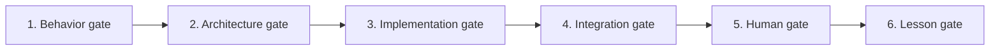

# Chương 40 — Giao thức VibeCoding đa tác nhân

Một wave không có write-set có thể giao ba việc nghe rất độc lập: một agent sửa Capture, một agent làm Roster, một agent nối HUD. Cuối ngày, cả ba branch đều compile riêng, nhưng mỗi branch đã tự chọn một result type, một chỗ giữ creature ID và một cách báo “thành công”. Không ai cần viết code cẩu thả để kết quả này xảy ra; task chỉ không nói ai được quyết định những seam chung.

Mục tiêu của giao thức không phải làm agent viết nhiều code hơn. Mục tiêu là để **nhiều agent tạo ra những thay đổi có thể ghép**, trong khi quyết định thiết kế vẫn thuộc về người dùng. Nó biến một player outcome thành chuỗi quyền hạn rõ: điều gì phải được duyệt, ai được sửa file nào, bằng chứng nào agent tự tạo và khoảnh khắc nào phải trao tay cho người chơi thật.

## 40.1 — Đơn vị công việc đúng là một behavior, không phải một folder

Folder là nơi thay đổi nằm; behavior mới là lý do thay đổi tồn tại. Nếu giao việc bằng tên class hoặc subsystem, agent có thể hoàn tất cấu trúc mà không biết retry có nhân đôi state hay người chơi có nhìn thấy kết quả hay không. Hãy so hai cách đóng gói cùng một việc capture:

Task tốt:

> Khi capture thành công, đúng world Pal bị disable một lần, đúng creature ID vào roster một lần, Sphere được settle đúng, HUD nhận typed result, và retry cùng command không nhân đôi state.

Task không đủ:

> Tạo `CaptureSubsystem`, thêm JSON, thêm log và QA command.

Task đầu tiên có outcome, state owner, invariant và failure path. Task thứ hai có thể hoàn thành mà người chơi không có thêm gameplay.

Một behavior đủ nhỏ vẫn có thể chạm nhiều domain, nhưng nó chỉ có một câu chuyện kiểm thử. Nhờ câu chuyện đó, Inventory, Creature, World và HUD biết mình đang góp phần vào cùng một kết quả, thay vì mỗi bên tự gọi phần mình là “done”.

## 40.2 — Sáu gate bắt buộc

Behavior không đi thẳng từ câu mô tả tới code. Mỗi lần chuyển trách nhiệm — từ ý định người chơi sang kiến trúc, từ source sang integration, từ máy sang mắt người — cần một điểm dừng có bằng chứng. Sáu gate dưới đây tạo thành một chiều đi; gate sau không được dùng để hợp thức hóa quyết định còn bỏ trống ở gate trước.



1. **Behavior gate:** player value, input/output, failure và nguồn bằng chứng đã rõ.
2. **Architecture gate:** owner, invariant, dependency và public API được Soliz duyệt.
3. **Implementation gate:** C++ compile đúng target; không mở rộng scope.
4. **Integration gate:** normal path thật đi qua Experience, owner và typed result; QA flag không thay thế.
5. **Human gate:** Soliz chạy test card, trả log/ảnh/video và cảm nhận.
6. **Lesson gate:** bài giảng ghi lại câu hỏi, lựa chọn, code proof và điều feedback đã sửa.

Agent không code trước gate 2. Người dùng không phải review mọi dòng implementation; người dùng review **quyết định** trước khi implementation bắt đầu.

Điều này giữ đúng tải nhận thức cho từng vai trò. Soliz xác nhận game nên làm gì và boundary nào chấp nhận được; agent chịu trách nhiệm biến quyết định đó thành source compile được; normal path và người test sau đó mới trả lời implementation có thực sự trở thành gameplay hay chưa. Lesson gate khép vòng bằng cách ghi lại điều feedback đã làm thay đổi, không chỉ chép lại thiết kế ban đầu.

## 40.3 — Task packet chuẩn

Mỗi task được mô tả bằng một file text/YAML. Đây là contract giao việc, không phải bureaucracy; trường nào không giúp merge/test thì bỏ.

Hãy đọc packet từ trên xuống như một phép thu hẹp: bắt đầu bằng giá trị người chơi, đi qua điều kiện và invariant, rồi mới tới write path, compile target và test card. Khi hai agent cần chạm cùng một owner hoặc cùng một file, xung đột lộ ra ngay trong packet thay vì sau vài giờ viết code.

```yaml
task_id: VS-CAPTURE-SETTLEMENT-001
title: Capture settlement removes the world Pal exactly once
player_value: "Bắt thành công làm Pal biến khỏi world và xuất hiện trong roster"

behavior_contract:
  given: "Wild Pal còn sống, trong range, player có một Sphere"
  when: "server chấp nhận capture command"
  then:
    - "Sphere được consume đúng một lần"
    - "world Pal bị disable/destroy đúng một lần"
    - "creature stable ID vào roster đúng một lần"
    - "retry trả cùng terminal result, không mutate lại"

evidence:
  palworld_behavior: "video/export/tài liệu đã chốt"
  engine_pattern: "course/source hoặc Epic URL"
  donor_code: "Lab/V2/V3/KYWorld path + giới hạn"

state_owners:
  inventory: Inventory
  health: Health/GAS
  creature_record: Creature
  world_actor_lease: World

invariants:
  - "client không gửi final damage hoặc capture verdict"
  - "không half-commit Inventory và Creature"
  - "CommandId idempotent"

api_versions:
  capture_command: 1
  capture_result: 1

allowed_write_paths:
  - "PaldarkKit/.../Capture/..."
  - "PaldarkKit/.../Creature/..."
forbidden_paths:
  - "PaldarkKit/Source/PaldarkCore/**"
  - "PaldarkKit/PaldarkKit.uproject"
  - "main Experience/generated assets"

public_api_delta: "separate approval PR or none"
compile_target: "PaldarkKitEditor Win64 Development"
expected_logs:
  - "corr=<id> phase=validated result=accepted"
  - "corr=<id> phase=committed inventory_rev=<n> roster_rev=<m>"
human_test_card: "HT-CAPTURE-001"
countdown_deadline: "2026-08-05T10:00:00+07:00"
```

Packet này không nói implement bằng class nào. Nó cố ý khóa những thứ khó đổi sau khi code đã tách nhánh: exactly-once, quyền verdict của server, transaction giữa Inventory và Creature, phạm vi file và hình dạng bằng chứng. Phần implementation còn lại vẫn để agent chọn trong boundary đã duyệt.

## 40.4 — Luật write-set

Trong một wave song song, conflict Git chỉ là phần dễ thấy. Nguy hiểm hơn là hai branch cùng hợp lệ về cú pháp nhưng cùng trở thành writer của một contract hoặc một artifact composition. Write-set biến quyền sửa thành dữ liệu có thể kiểm trước khi merge:

1. Một file chỉ có một owner trong cùng wave.
2. Feature agent không sửa `.uproject`, root config, Core, main Experience hoặc generated `.uasset` nếu task packet không giao quyền rõ.
3. Shared API change là một task riêng: bằng chứng → proposal → Soliz duyệt → version → implementation song song.
4. Merge order: contract trước, domain implementation sau, composition cuối.
5. Composition integrator là owner duy nhất của manifest tổng và generated asset.
6. Domain agent chỉ public thứ consumer thật sự cần; không export concrete subsystem “để tiện”.
7. Không giữ global registry bằng một header/file mà mọi feature phải sửa. Dùng feature-owned registration fragment và deterministic composition.
8. Một agent gặp nhu cầu sửa ngoài write-set phải dừng ở boundary, viết yêu cầu API cụ thể và tiếp tục phần độc lập nếu còn.

Luật số 8 là van an toàn, không phải lý do để bỏ dở. Agent vẫn tiếp tục phần private không phụ thuộc; chỉ phần cần quyền mới được tách thành yêu cầu API. Nhờ vậy một nhu cầu integration không âm thầm mở rộng task thành refactor Core hay sửa Experience chung.

## 40.5 — Ba vai trò tối thiểu trong một wave

Một behavior đi qua ba loại quyết định: contract phải có hình dạng gì, mỗi domain hiện thực phần của mình ra sao, và các phần được ghép vào normal path thế nào. Nếu một người giữ cả ba mà không có checkpoint, việc “cho chạy” rất dễ sửa ngược invariant. Vì thế wave tối thiểu tách ba vai trò:

| Vai trò | Sở hữu | Không làm |
|---|---|---|
| Contract/architecture owner | behavior decomposition, owner/invariant, API version, ADR | không viết thay tất cả implementation trước khi duyệt |
| Domain implementer | private implementation trong write-set, compile, structured log | không tự đổi shared contract/composition |
| Composition integrator | Experience fragment, dependency wiring, compile toàn slice | không thay domain rule để “cho chạy” |

Human tester là vai trò thứ tư do Soliz đảm nhiệm: mở Editor/game, input, quan sát, ghi video/log và đánh giá cảm giác. Content/data entry lặp lại cũng nên được giao cho người hoặc tool sau khi schema đã ổn định.

Ba vai trò kỹ thuật không nhất thiết là ba con người cố định; điều bắt buộc là ba quyền quyết định không bị nhập nhằng. Người đang integration không được tự đổi domain rule để qua lỗi, và người đang implement không được mở rộng public API chỉ vì tiện cho code private của mình.

## 40.6 — Compile và test chia thế nào

Một handoff tốt không đẩy việc khó cho người dùng. Agent phải tự đóng mọi câu hỏi mà source, compiler và static audit trả lời được; người dùng chỉ nhận những câu hỏi cần Editor, input và cảm giác trực tiếp. Ranh giới đó tạo hai gói trách nhiệm rõ ràng.

### Agent chịu trách nhiệm

- code C++ đúng contract;
- compile target đã chốt;
- sửa compile/link/UHT lỗi do thay đổi của mình;
- static audit normal entry point và dependency;
- viết log có correlation;
- viết test card chính xác;
- nếu có test C++ nhỏ, tập trung invariant/failure path có giá trị cao.

### Người dùng chịu trách nhiệm

- Blueprint wiring/asset assignment mà agent không thể thao tác an toàn;
- mở map/build, bấm input;
- đánh giá camera, animation, UI, timing, “có vui/có đúng cảm giác không”;
- trả video/ảnh/log cùng bước cuối thành công;
- test multiplayer, cook/package chỉ ở milestone hoặc khi người dùng chủ động yêu cầu.

Không dùng câu “hãy test giúp”. Mỗi test card phải là câu hỏi đóng, ví dụ: “Sau shake thứ ba, Pal có biến mất trước khi roster icon xuất hiện không? Trả `YES/NO`, video 10 giây và các dòng cùng `corr`.”

Câu hỏi đóng làm failure có điểm bắt đầu. Nếu câu trả lời là “NO sau shake thứ ba”, agent có thể đối chiếu presentation và settlement theo cùng correlation; còn “capture có vẻ lỗi” buộc cả hai phía lặp lại công việc quan sát mà vẫn chưa biết seam nào sai.

## 40.7 — Loại bỏ công việc lặp lại không tạo gameplay

Thời gian của một sprint có thể bị tiêu hết bởi những hoạt động trông rất chuyên nghiệp nhưng không kéo dài vertical spine thêm một mắt xích. Trong sprint compiler-gated hiện tại, mặc định **không làm**:

- cook/package mỗi PR;
- listen/client smoke test mỗi PR;
- theo dõi check tĩnh đỏ từ base không liên quan;
- sinh thêm QA-only subsystem cho một system chưa có normal path;
- scaffold đủ 15 plugin/module trước khi có consumer;
- chỉnh format/tên/file hàng loạt giữa lúc vertical spine đang mở;
- nhập data/content số lượng lớn trước khi schema và một row mẫu đã qua human gate.

Vẫn làm khi có lý do cụ thể:

- compile/UHT/link bắt buộc cho mỗi PR;
- cook/package tại packaging milestone hoặc khi thay asset/mount rule cần chứng minh;
- network test khi behavior authority/reconnect là acceptance của milestone;
- CI validator khi nó bắt một invariant mà compile không bắt và failure không phải nợ cũ.

Phép phân biệt không phải “automation tốt hay xấu”, mà là phép kiểm đó đang giảm rủi ro nào của outcome hiện tại. Khi acceptance chạm packaging, network hoặc asset mount, gate tương ứng trở thành cần thiết; trước thời điểm đó, chạy nó theo thói quen chỉ lấy thời gian khỏi contract đang chặn gameplay.

## 40.8 — PR và commit countdown

Mục này ghi lại quy ước của sprint ADR-001 tại thời điểm nó diễn ra, không phải một deadline mới cho mọi đợt phát triển sau này. Sprint đó dùng deadline cố định `2026-08-05 10:00 +07`; đồng hồ không reset sau mỗi PR.

Countdown buộc mỗi commit nói thật về ngân sách còn lại. Một PR mở muộn không được mang lại con số của lúc lập kế hoạch, vì con số sai làm đội ngũ tưởng còn chỗ cho một dependency mới trong khi thực tế chỉ đủ khép invariant đang mở.

Tên PR/commit:

```text
<Player outcome hoặc invariant> + <thời gian còn lại>
```

Ví dụ:

```text
Capture settlement exactly-once + 08h12m
```

Footer bắt buộc:

```text
Countdown: T-08h12m | deadline 2026-08-05 10:00 +07
```

Thời gian được tính khi tạo commit/PR và ghi tới phút. Không dùng `+11h` cố định sau khi thời gian đã trôi; countdown sai còn nguy hiểm hơn không có countdown.

Tên commit vì thế nối hai thứ: giá trị vừa khép và thời gian thật còn lại. Nó không chứng minh PR đã được merge hoặc gameplay đã PASS; các trạng thái đó vẫn phải đi qua Definition of Done phía sau.

## 40.9 — Definition of Done nhiều tầng

“Xong” là từ gây hiểu nhầm nhất trong một đội vừa có agent, compiler và người test. Source có mặt là một sự thật; build thành công là sự thật khác; người chơi quan sát được lại là một sự thật khác nữa. Bảy nhãn dưới đây giữ các bằng chứng ấy không bị nén vào một dấu tích:

| Nhãn | Bằng chứng |
|---|---|
| `DESIGNED` | ADR/behavior contract đã duyệt |
| `SOURCE_PRESENT` | implementation nằm đúng write-set |
| `COMPILED` | target compile thành công, có command/log |
| `INTEGRATED` | normal path qua producer/consumer thật, không fixture tự set state |
| `PLAYER_OBSERVABLE` | UI/animation/world state cho thấy kết quả |
| `USER_VERIFIED` | human test card được Soliz trả kết quả |
| `PARITY_EVIDENCED` | behavior đối chiếu được với phiên bản Palworld mục tiêu |

Không rút gọn bảy nhãn này thành một chữ “done”. User chỉ yêu cầu agent compile không có nghĩa tài liệu được phép gọi gameplay đã nghiệm thu.

Các nhãn tạo thành hành trình bằng chứng, nhưng không phải mọi task đều mặc định đạt tầng cuối. Một thay đổi contract có thể dừng hợp lệ ở `DESIGNED`; một lát cắt gameplay chỉ được gọi `USER_VERIFIED` khi test card đã trở về. `PARITY_EVIDENCED` còn đòi nguồn đối chiếu riêng, không tự sinh ra từ việc người dùng thích cảm giác của build.

## 40.10 — Cách biến implementation thành bài giảng kiểu Stephen Ulibarri

Sau khi behavior đi qua các gate, tài liệu không nên biến thành nhật ký liệt kê class vừa thêm. Người học cần gặp lại chính vấn đề mà đội ngũ đã gặp, hiểu vì sao lựa chọn đầu tiên không đủ, rồi nhìn thấy contract giải quyết nó như thế nào. Cấu trúc tám nhịp giữ bài giảng đi theo quá trình nhận thức ấy:

Mỗi bài chỉ trả lời một câu hỏi mà người học vừa gặp:

1. **Hook:** cho thấy symptom/cảm giác bị thiếu.
2. **Why:** vì sao symptom tồn tại ở tầng state/ownership.
3. **Model:** vẽ state transition hoặc dependency nhỏ nhất.
4. **Decision:** chọn một thiết kế; nêu ít nhất một phương án bị loại.
5. **Implementation:** dẫn file/commit, không dán lại khối code dài.
6. **Compile checkpoint:** command và expected result.
7. **Human checkpoint:** bấm gì, thấy gì, log gì.
8. **Reflection:** nếu thay authority/lifecycle thì thiết kế hỏng ở đâu?

Bài giảng được hoàn tất ở lesson gate, sau feedback. Nhờ vậy tài liệu không mô tả một game tưởng tượng đi trước code, và code không chạy xa khỏi lý do ban đầu.

Chương này dừng ở giao thức giao việc. Chương tiếp theo theo một behavior sau khi đã được implement: log phải kể lại hành trình ra sao, và agent phải đóng gói bằng chứng thế nào để người thật chỉ cần nhìn, bấm và trả một kết quả có thể hành động được.
