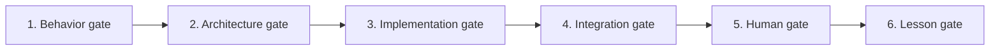

# Chương 40 — Giao thức VibeCoding đa tác nhân

Mục tiêu của giao thức không phải làm agent viết nhiều code hơn. Mục tiêu là để **nhiều agent tạo ra những thay đổi có thể ghép**, trong khi quyết định thiết kế vẫn thuộc về người dùng.

## 40.1 — Đơn vị công việc đúng là một behavior, không phải một folder

Task tốt:

> Khi capture thành công, đúng world Pal bị disable một lần, đúng creature ID vào roster một lần, Sphere được settle đúng, HUD nhận typed result, và retry cùng command không nhân đôi state.

Task không đủ:

> Tạo `CaptureSubsystem`, thêm JSON, thêm log và QA command.

Task đầu tiên có outcome, state owner, invariant và failure path. Task thứ hai có thể hoàn thành mà người chơi không có thêm gameplay.

## 40.2 — Sáu gate bắt buộc



1. **Behavior gate:** player value, input/output, failure và nguồn bằng chứng đã rõ.
2. **Architecture gate:** owner, invariant, dependency và public API được Soliz duyệt.
3. **Implementation gate:** C++ compile đúng target; không mở rộng scope.
4. **Integration gate:** normal path thật đi qua Experience, owner và typed result; QA flag không thay thế.
5. **Human gate:** Soliz chạy test card, trả log/ảnh/video và cảm nhận.
6. **Lesson gate:** bài giảng ghi lại câu hỏi, lựa chọn, code proof và điều feedback đã sửa.

Agent không code trước gate 2. Người dùng không phải review mọi dòng implementation; người dùng review **quyết định** trước khi implementation bắt đầu.

## 40.3 — Task packet chuẩn

Mỗi task được mô tả bằng một file text/YAML. Đây là contract giao việc, không phải bureaucracy; trường nào không giúp merge/test thì bỏ.

```yaml
task_id: VS-CAPTURE-SETTLEMENT-001
title: Capture settlement removes the world Pal exactly once
player_value: "Bắt thành công làm Pal biến khỏi world và xuất hiện trong roster"

behavior_contract:
  given: "Wild Pal còn sống, trong range, player có một Sphere"
  when: "server chấp nhận capture command"
  then:
    - "Sphere được consume đúng một lần"
    - "world Pal bị disable/destroy đúng một lần"
    - "creature stable ID vào roster đúng một lần"
    - "retry trả cùng terminal result, không mutate lại"

evidence:
  palworld_behavior: "video/export/tài liệu đã chốt"
  engine_pattern: "course/source hoặc Epic URL"
  donor_code: "Lab/V2/V3/KYWorld path + giới hạn"

state_owners:
  inventory: Inventory
  health: Health/GAS
  creature_record: Creature
  world_actor_lease: World

invariants:
  - "client không gửi final damage hoặc capture verdict"
  - "không half-commit Inventory và Creature"
  - "CommandId idempotent"

api_versions:
  capture_command: 1
  capture_result: 1

allowed_write_paths:
  - "PaldarkKit/.../Capture/..."
  - "PaldarkKit/.../Creature/..."
forbidden_paths:
  - "PaldarkKit/Source/PaldarkCore/**"
  - "PaldarkKit/PaldarkKit.uproject"
  - "main Experience/generated assets"

public_api_delta: "separate approval PR or none"
compile_target: "PaldarkKitEditor Win64 Development"
expected_logs:
  - "corr=<id> phase=validated result=accepted"
  - "corr=<id> phase=committed inventory_rev=<n> roster_rev=<m>"
human_test_card: "HT-CAPTURE-001"
countdown_deadline: "2026-08-05T10:00:00+07:00"
```

## 40.4 — Luật write-set

1. Một file chỉ có một owner trong cùng wave.
2. Feature agent không sửa `.uproject`, root config, Core, main Experience hoặc generated `.uasset` nếu task packet không giao quyền rõ.
3. Shared API change là một task riêng: bằng chứng → proposal → Soliz duyệt → version → implementation song song.
4. Merge order: contract trước, domain implementation sau, composition cuối.
5. Composition integrator là owner duy nhất của manifest tổng và generated asset.
6. Domain agent chỉ public thứ consumer thật sự cần; không export concrete subsystem “để tiện”.
7. Không giữ global registry bằng một header/file mà mọi feature phải sửa. Dùng feature-owned registration fragment và deterministic composition.
8. Một agent gặp nhu cầu sửa ngoài write-set phải dừng ở boundary, viết yêu cầu API cụ thể và tiếp tục phần độc lập nếu còn.

## 40.5 — Ba vai trò tối thiểu trong một wave

| Vai trò | Sở hữu | Không làm |
|---|---|---|
| Contract/architecture owner | behavior decomposition, owner/invariant, API version, ADR | không viết thay tất cả implementation trước khi duyệt |
| Domain implementer | private implementation trong write-set, compile, structured log | không tự đổi shared contract/composition |
| Composition integrator | Experience fragment, dependency wiring, compile toàn slice | không thay domain rule để “cho chạy” |

Human tester là vai trò thứ tư do Soliz đảm nhiệm: mở Editor/game, input, quan sát, ghi video/log và đánh giá cảm giác. Content/data entry lặp lại cũng nên được giao cho người hoặc tool sau khi schema đã ổn định.

## 40.6 — Compile và test chia thế nào

### Agent chịu trách nhiệm

- code C++ đúng contract;
- compile target đã chốt;
- sửa compile/link/UHT lỗi do thay đổi của mình;
- static audit normal entry point và dependency;
- viết log có correlation;
- viết test card chính xác;
- nếu có test C++ nhỏ, tập trung invariant/failure path có giá trị cao.

### Người dùng chịu trách nhiệm

- Blueprint wiring/asset assignment mà agent không thể thao tác an toàn;
- mở map/build, bấm input;
- đánh giá camera, animation, UI, timing, “có vui/có đúng cảm giác không”;
- trả video/ảnh/log cùng bước cuối thành công;
- test multiplayer, cook/package chỉ ở milestone hoặc khi người dùng chủ động yêu cầu.

Không dùng câu “hãy test giúp”. Mỗi test card phải là câu hỏi đóng, ví dụ: “Sau shake thứ ba, Pal có biến mất trước khi roster icon xuất hiện không? Trả `YES/NO`, video 10 giây và các dòng cùng `corr`.”

## 40.7 — Loại bỏ công việc lặp lại không tạo gameplay

Trong sprint compiler-gated hiện tại, mặc định **không làm**:

- cook/package mỗi PR;
- listen/client smoke test mỗi PR;
- theo dõi check tĩnh đỏ từ base không liên quan;
- sinh thêm QA-only subsystem cho một system chưa có normal path;
- scaffold đủ 15 plugin/module trước khi có consumer;
- chỉnh format/tên/file hàng loạt giữa lúc vertical spine đang mở;
- nhập data/content số lượng lớn trước khi schema và một row mẫu đã qua human gate.

Vẫn làm khi có lý do cụ thể:

- compile/UHT/link bắt buộc cho mỗi PR;
- cook/package tại packaging milestone hoặc khi thay asset/mount rule cần chứng minh;
- network test khi behavior authority/reconnect là acceptance của milestone;
- CI validator khi nó bắt một invariant mà compile không bắt và failure không phải nợ cũ.

## 40.8 — PR và commit countdown

Sprint hiện tại dùng deadline cố định `2026-08-05 10:00 +07`. Không reset deadline sau mỗi PR.

Tên PR/commit:

```text
<Player outcome hoặc invariant> + <thời gian còn lại>
```

Ví dụ:

```text
Capture settlement exactly-once + 08h12m
```

Footer bắt buộc:

```text
Countdown: T-08h12m | deadline 2026-08-05 10:00 +07
```

Thời gian được tính khi tạo commit/PR và ghi tới phút. Không dùng `+11h` cố định sau khi thời gian đã trôi; countdown sai còn nguy hiểm hơn không có countdown.

## 40.9 — Definition of Done nhiều tầng

| Nhãn | Bằng chứng |
|---|---|
| `DESIGNED` | ADR/behavior contract đã duyệt |
| `SOURCE_PRESENT` | implementation nằm đúng write-set |
| `COMPILED` | target compile thành công, có command/log |
| `INTEGRATED` | normal path qua producer/consumer thật, không fixture tự set state |
| `PLAYER_OBSERVABLE` | UI/animation/world state cho thấy kết quả |
| `USER_VERIFIED` | human test card được Soliz trả kết quả |
| `PARITY_EVIDENCED` | behavior đối chiếu được với phiên bản Palworld mục tiêu |

Không rút gọn bảy nhãn này thành một chữ “done”. User chỉ yêu cầu agent compile không có nghĩa tài liệu được phép gọi gameplay đã nghiệm thu.

## 40.10 — Cách biến implementation thành bài giảng kiểu Stephen Ulibarri

Mỗi bài chỉ trả lời một câu hỏi mà người học vừa gặp:

1. **Hook:** cho thấy symptom/cảm giác bị thiếu.
2. **Why:** vì sao symptom tồn tại ở tầng state/ownership.
3. **Model:** vẽ state transition hoặc dependency nhỏ nhất.
4. **Decision:** chọn một thiết kế; nêu ít nhất một phương án bị loại.
5. **Implementation:** dẫn file/commit, không dán lại khối code dài.
6. **Compile checkpoint:** command và expected result.
7. **Human checkpoint:** bấm gì, thấy gì, log gì.
8. **Reflection:** nếu thay authority/lifecycle thì thiết kế hỏng ở đâu?

Bài giảng được hoàn tất ở lesson gate, sau feedback. Nhờ vậy tài liệu không mô tả một game tưởng tượng đi trước code, và code không chạy xa khỏi lý do ban đầu.
