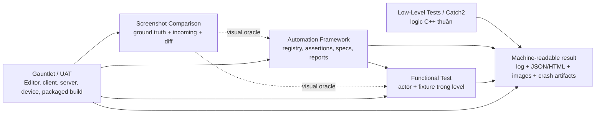

# Chương 46 — Bộ công cụ kiểm thử Epic cho Paldark

Unreal Engine đã có sẵn phần lớn hạ tầng Paldark đang định tự viết: test registry, assertion, level fixture, process orchestration, screenshot baseline, image diff và report. Việc cần làm không phải tạo thêm một autoplay khổng lồ, mà là đặt từng test case vào đúng lớp của Epic.

Kết luận kiến trúc:

> Ba tầng thực thi chính là **Automation → Functional Test → Gauntlet**. **Screenshot Comparison** không phải một tầng orchestration độc lập; nó là visual oracle gắn vào Automation/Functional Test và có thể được Gauntlet chạy trong Editor hoặc packaged session. UE 5.6 còn có **Low-Level Tests/Catch2** nằm thấp hơn Automation, phù hợp nhất với logic C++ thuần.



## 46.1 — Chọn công cụ bằng câu hỏi, không bằng tên feature

| Câu hỏi cần trả lời | Công cụ chính |
|---|---|
| Một hàm toán học, transaction hoặc state transition đúng không? | Low-Level Test; hoặc Automation Test nhỏ nếu chưa có LLT target. |
| UObject, module, asset, Enhanced Input hoặc Game Feature nối đúng không? | Automation Test/Spec. |
| Gameplay trong một `UWorld` nhỏ có tạo đúng outcome không? | Functional Test trong test level. |
| Hình ảnh có khác baseline đã duyệt không? | Screenshot Comparison bên trong Automation/Functional Test. |
| Editor/package có boot, process có crash, nhiều client/server có phối hợp đúng không? | Gauntlet. |
| Cảm giác camera, animation hoặc art có đẹp không? | Human exploratory; screenshot chỉ phát hiện thay đổi, không tự định nghĩa “đẹp”. |

Không dùng Gauntlet để kiểm một phép nhân vector. Không dùng screenshot để chứng minh inventory đã commit. Không dùng unit test để khẳng định packaged build nhận được MouseX. Mỗi lớp có oracle khác nhau.

## 46.2 — Lớp 0: Low-Level Tests/Catch2

Epic mô tả Low-Level Tests của UE 5.6 là framework nhẹ, theo module, dùng Catch2 và tiêu thụ ít tài nguyên compile/runtime hơn các framework khác. Nó hỗ trợ unit, integration, functional, smoke, end-to-end, performance và stress methodology, nhưng giá trị lớn nhất cho Paldark là các test thuần không cần boot một game world.

### Phù hợp với Paldark

- #156: `control yaw → forward/right basis`;
- Capture ballistic: nghiệm low arc, target ngoài envelope, gravity không hợp lệ;
- Capture state machine: failure luôn reset và chỉ có một terminal result;
- inventory/crafting transaction và rollback;
- save codec, versioning và migration;
- input config schema/parser nếu parser được tách khỏi component;
- stable ID, quantity, probability và work eligibility rules.

### Không phù hợp

- possession/local player subsystem;
- asset load và Game Feature activation phức tạp;
- physics/collision trong level thật;
- physical mouse/keyboard path;
- rendering và screenshot.

### Nhận xét cho PaldarkV5

Các test donor V2/Lab hiện dùng `IMPLEMENT_SIMPLE_AUTOMATION_TEST`, nên cách nhanh nhất có thể là port chúng sang Automation trước. Khi V5 tách được logic thuần thành thư viện/module nhỏ, LLT mới đem lại cold-start và isolation tốt hơn. Không cần trì hoãn regression chỉ để đổi framework.

## 46.3 — Lớp 1: Automation Test Framework

Automation Framework là registry và runner C++ engine-aware. Epic chia test thành Unit, Feature, Smoke, Content Stress và Screenshot Comparison. Một điểm dễ hiểu sai: **Smoke là cam kết về tốc độ**, không phải một kiểu assertion khác. Epic yêu cầu Smoke test hoàn tất trong khoảng một giây và chỉ gắn `SmokeFilter` cho unit test hoặc feature test thật nhanh.

Framework này dựa vào hệ thống Engine, nhưng không nằm trong reflection/UObject như Blueprint. Với unit test thuần tuyệt đối, Epic khuyên xem Low-Level Tests; với module, UObject, asset hoặc world seam, Automation phù hợp hơn.

### API đáng dùng

| API/pattern | Khi dùng |
|---|---|
| `IMPLEMENT_SIMPLE_AUTOMATION_TEST` | Một test có một case hoặc tự parameterize trong `RunTest`. |
| `IMPLEMENT_COMPLEX_AUTOMATION_TEST` | Một test được discovery thành nhiều case/parameter. |
| `DEFINE_SPEC` / `BEGIN_DEFINE_SPEC` | BDD, fixture `BeforeEach/AfterEach`, latent/async và composition test dễ đọc. |
| `TestTrue`, `TestFalse`, `TestEqual`, `TestNotNull` | Oracle trực tiếp trong C++. |
| `EAutomationTestFlags` | Chỉ rõ Editor/Client/Server/Commandlet, RHI requirement và filter. |
| Automation Driver | Mô phỏng keyboard/mouse ở platform layer cho input/UI path. |

Tên test nên tạo cây ổn định:

```text
Paldark.Micro.Movement.Config.ValidProduction
Paldark.Micro.Movement.Config.RejectUnknownInputProperty
Paldark.Feature.Movement.LookBinding
Paldark.Feature.Movement.ControlYaw
Paldark.Feature.Capture.FailureReset
Paldark.Smoke.Project.BootContracts
```

### Flags phải mang nghĩa thật

- `SmokeFilter`: body cực nhanh, không load map nặng, không network, không screenshot;
- `ProductFilter`: test thuộc sản phẩm Paldark;
- `EditorContext`, `ClientContext`, `ServerContext`, `CommandletContext`: chỉ chạy nơi test thật sự hỗ trợ;
- `NonNullRHI`: bắt buộc với test cần rendering; không chạy `-NullRHI`;
- không gắn `RequiresUser` cho test muốn agent/CI tự chạy.

### Automation Spec cho “lắp lại feature”

Spec phù hợp với composition test ở Chương 45:

```text
BeforeEach: dựng fixture sạch
It:       chạy đúng một transition hoặc một trace ngắn
AfterEach: dọn object/file/subsystem đã tạo
```

Mỗi `It()` là một test riêng. Nếu Movement có bốn failure mode thì viết bốn `It()`, không gom thành một test “Movement works” dài và chỉ trả một chữ FAIL.

### Automation Driver cho #147/#154

Automation Driver có thể mô phỏng key, mouse move, click, type, scroll và key hold/release ở platform layer. Đây là seam tốt hơn việc autoplay gọi thẳng `AddMovementInput` hoặc trigger action nội bộ.

Ứng dụng Paldark:

```text
hold W
→ Enhanced Input mapping nhận W
→ Move action có axis
→ pawn location đổi

move mouse X
→ LookYaw action trigger
→ control rotation đổi
```

Giới hạn cần nhớ:

- Driver ban đầu tập trung mạnh vào desktop/Slate; scene actor interaction cần project adapter nếu muốn locator cấp actor;
- synchronous API không được block Game Thread; Epic khuyên ghép Driver với Automation Spec/async execution;
- khi Driver được enable, phần lớn input thật bị chặn và thay bằng simulated input;
- Editor test xanh chưa đóng package parity; packaged path phải chạy lại bằng Gauntlet `UE.TargetAutomation`.

### Chạy và xuất report

Epic hỗ trợ chạy từ Test Automation/Session Frontend hoặc command line. Thiết kế runner PowerShell của Paldark có thể gọi:

```powershell
$Project = "G:\Soliz-Devin-Palworld\PaldarkKit\PaldarkKit.uproject"
$Report = "G:\Soliz-Devin-Palworld\PaldarkKit\Saved\TestReports\Movement"

& "$UeRoot\Engine\Binaries\Win64\UnrealEditor-Cmd.exe" `
  $Project `
  -unattended -nop4 -nosplash -NullRHI `
  '-ExecCmds=Automation RunTest Paldark.Micro.Movement;Quit' `
  "-ReportExportPath=$Report"
```

Đây là command mẫu PROPOSED; `$UeRoot` phải do runner resolve từ Engine Association/config. Wrapper phải kiểm **cả process status lẫn JSON report**. Không được coi exit code 0 là đủ nếu report có test `Fail/Error/NotRun`.

Với screenshot, bỏ `-NullRHI`, cố định RHI/resolution và dùng test có `NonNullRHI`.

## 46.4 — Lớp 2: Functional Test trong level

Functional Test dùng `AFunctionalTest` Actor đặt trong Level. Test có thể viết bằng Blueprint hoặc subclass C++. Đây là lớp phù hợp khi outcome phụ thuộc `UWorld`, Actor, collision, movement component, navigation, animation, camera hoặc nhiều owner component cùng chạy.

### Lifecycle có sẵn giải quyết đúng lỗi chờ mù

| Lifecycle | Trách nhiệm |
|---|---|
| `PrepareTest` | Spawn fixture, bắt đầu stream/load/nav/connect và reset state. |
| `IsReady` | Được gọi mỗi frame; chỉ trả true khi precondition thật đã sẵn sàng. |
| `StartTest` / `OnTestStart` | Kích hoạt hành động đang nghiệm thu. |
| Assertions + `FinishTest` | So expected/actual và kết thúc bằng result rõ ràng. |
| `OnTestFinished` | Dọn state; `RegisterAutoDestroyActor` giúp dọn actor tự động. |

Điều này trực tiếp thay các `sleep 5s` hoặc tick diagnostic. Ví dụ test Pal follow không bắt đầu tới khi pawn được possess, Pal spawn xong và Game Feature active; test Work không kết thúc tới khi output revision đổi hoặc timeout có reason.

### Test map phải nhỏ và chuyên biệt

Đề xuất:

```text
L_Test_Movement
  FT_MovementPossession
  FT_CrouchFloor
  FT_CameraCollision

L_Test_Interaction
  FT_PhysicalPickup

L_Test_Capture
  FT_ProjectileHit
  FT_FailureReset

L_Test_CompanionWork
  FT_SummonIdentity
  FT_NoNavFollow
  FT_AutoWork

L_Test_PlayerVisual
  FT_PlayerDefaultScreenshot
  FT_CrouchScreenshot
  FT_AimScreenshot
```

Mỗi map chỉ chứa fixture cần thiết: floor chuẩn, marker, light cố định, camera, một hoặc hai target và test actor. Không dùng open world chính làm mặc định vì streaming, AI, thời tiết và content thừa làm test chậm/nhiễu.

### Bug Paldark phù hợp

- #138: mesh/capsule/spring arm/camera collision;
- #139: head attachment và spawn-floor geometry;
- pawn được possess nhưng WASD không tạo movement;
- physical F → focus → pickup → inventory mutation;
- crouch trước/trong/sau vẫn chạm sàn;
- melee collision chọn đúng target;
- Capture projectile hit, failure reset và lần ném tiếp theo;
- summon/recall giữ stable entity ID;
- no-Nav follow;
- auto-work không cần G và output transaction đúng.

### Oracle nên ưu tiên

Functional Test không đồng nghĩa với “nhìn ảnh”. Oracle chính vẫn là state và invariant:

- actor/component transform;
- stable entity ID;
- inventory/work revision;
- collision query;
- target ID và damage count;
- event/correlation;
- timeout/precondition reason.

Screenshot là oracle bổ sung cho presentation. Một ảnh giống baseline không chứng minh transaction đúng; một transaction đúng cũng không chứng minh mesh không xuyên camera.

## 46.5 — Lớp 3: Gauntlet cho session và nhiều process

Gauntlet là framework của AutomationTool để launch, theo dõi và thu kết quả của một Unreal session. Một session có thể gồm Editor, một client, nhiều client, server hoặc device khác nhau.

Gauntlet cung cấp:

- abstraction cho build, device, app install và process;
- role Client/Server/Editor;
- timeout và session lifecycle;
- parse log/crash/assert/fatal;
- thu dữ liệu trong `Saved` từ device;
- chạy test tuần tự, song song hoặc phụ thuộc;
- `RunUnreal` làm entry point từ UAT.

Gauntlet **không build game**. Nó cần Editor build hoặc cooked/package build đã tồn tại. Nó cũng không tự định nghĩa gameplay đúng là gì; bên trong session vẫn cần Automation Test, Functional Test, Gauntlet Controller hoặc game command có oracle.

### Built-in flow Epic đã cung cấp

| Gauntlet test | Công dụng |
|---|---|
| `UE.BootTest` / `UE.EditorBootTest` | Boot Client/Editor và phát hiện lỗi process cơ bản. |
| `UE.EditorAutomation` | Chạy Automation/Functional tests trong Editor. |
| `UE.TargetAutomation` | Chạy cùng test trên packaged Client. |
| `UE.Networking` | Điều phối networking test nếu map/controller được setup. |

Ví dụ chính thức cho phép:

```powershell
& "$UeRoot\Engine\Build\BatchFiles\RunUAT.bat" RunUnreal `
  -test=UE.EditorAutomation `
  -runtest=Paldark.Feature.Movement `
  -project="G:\Soliz-Devin-Palworld\PaldarkKit\PaldarkKit.uproject" `
  -build=editor
```

Với package:

```powershell
& "$UeRoot\Engine\Build\BatchFiles\RunUAT.bat" RunUnreal `
  -test=UE.TargetAutomation `
  -runtest=Paldark.Feature.Movement.PhysicalInput `
  -project="G:\Soliz-Devin-Palworld\PaldarkKit\PaldarkKit.uproject" `
  -build="<path-to-packaged-build>"
```

Các command là PROPOSED cho Paldark; phải được thử với installed UE 5.6 và layout package thật trước khi đưa thành chuẩn.

### Custom Gauntlet Controller

`UGauntletTestController` là C++ object chạy runtime, phù hợp khi network/session cần state machine riêng. Nó có `OnInit`, map-change callbacks, `OnTick`, state-change callback và `EndTest(ExitCode)`. UAT nhận result từ controller và nâng nó thành result của test.

PR #184 có thể được tái cấu trúc theo hai cách:

1. Giữ autoplay state machine làm game-side driver, Gauntlet chỉ launch/monitor/collect.
2. Chuyển orchestration runtime sang một project `UGauntletTestController`, còn production owner vẫn cung cấp action/read seams.

Không cần rewrite ngay. Điều bắt buộc trước là sửa oracle và process-result policy; đổi class mà vẫn chỉ tìm log `PASS` không làm test đáng tin hơn.

### Bug Paldark cần Gauntlet

- EXE boot nhưng tìm `.uproject` ở absolute path máy build;
- #147/#154/#156 chỉ fail trong packaged input/config;
- cook root hoặc asset không vào package;
- client → server → đúng client replication;
- dedicated/listen server với hai client;
- save ở process A, restart và load ở process B;
- reconnect/migration;
- #184 Capture → Work vertical smoke;
- crash, hang, timeout và soak.

Gauntlet không nên chạy trên mọi edit. Nó chạy theo impact, main/nightly hoặc release; microtest phải chặn phần lớn lỗi trước khi đến tầng này.

## 46.6 — Screenshot Comparison: biến ảnh thành test thật

Screenshot Comparison của Epic tạo ba artifact:

```text
Ground Truth  — baseline đã được duyệt
Incoming      — ảnh của source/build đang test
Difference    — vùng/pixel khác nhau
```

Ảnh mới khác baseline ngoài tolerance sẽ làm test fail. Screenshot Comparison Browser trong Session Frontend cho phép xem lịch sử, blend ảnh và quyết định Add/Replace/Add As Alternative.

Epic hỗ trợ hai cách chính:

1. đặt `Functional Screenshot Test` hoặc `Functional UI Screenshot Test` Actor trong level;
2. chụp screenshot ở một checkpoint bên trong Functional Test đang chạy.

### Paldark hiện có gì và thiếu gì?

`UPaldarkAutoplaySubsystem::RequestStepScreenshot` hiện chỉ gọi:

```cpp
FScreenshotRequest::RequestScreenshot(Filename, true, false);
```

`capture_screenshot.sh` chỉ tìm một PNG mới, kiểm header PNG rồi copy file. Vì vậy current harness mới chứng minh:

```text
“có một file ảnh được tạo”
```

Nó chưa chứng minh:

- ảnh đúng checkpoint;
- camera đúng pose;
- mesh đúng scale;
- head attach đúng;
- camera không xuyên mesh;
- HUD đúng;
- ảnh giống baseline;
- process không crash hoặc timeout;
- khác biệt nằm ở đâu.

Đây là lý do ảnh vẫn phải gửi cho Soliz xem bằng mắt.

### Cấu hình để visual test ổn định

| Nguồn nhiễu | Cách khóa |
|---|---|
| Camera/framing | Camera actor, transform, FOV và aspect ratio cố định. |
| Resolution | Cố định `ResX/ResY`; không dùng kích thước cửa sổ ngẫu nhiên. |
| RHI/shader model | Cùng platform/RHI/shader model; baseline khác nhau khi cần. |
| Temporal noise | Dùng option tắt noisy rendering features khi test gameplay presentation. |
| AA/motion blur/SSR/exposure/contact shadow | Tắt theo Functional Screenshot settings nếu không phải đối tượng đang test. |
| Time/weather/light | Test level có light/time-of-day cố định. |
| Animation | Chờ đúng state/notify hoặc cố định pose/time; không chụp theo sleep mù. |
| Asset streaming | `IsReady` chỉ cho test start khi asset/mesh/material đã sẵn sàng. |
| UI | Cố định locale, DPI scale, resolution và data fixture. |
| Random gameplay | Seed, fake clock và entity IDs cố định. |

Epic cho phép tolerance Zero/Low/Medium/High/Custom, per-channel/brightness tolerance, maximum local/global error, ignore anti-aliasing và ignore colors. Tolerance phải được chọn theo loại ảnh, không tăng dần tới khi test xanh.

### Baseline governance

1. Human duyệt baseline đầu tiên vì máy chưa biết hình nào là đúng về art/product.
2. Baseline được source-control cùng test metadata.
3. AI chạy lại, đọc PASS/FAIL và xem Incoming/Difference.
4. AI được sửa implementation và chạy lại.
5. AI **không tự Replace/Add Alternative** trong cùng thay đổi implementation.
6. Khi visual change có chủ ý, human hoặc reviewer riêng duyệt baseline mới.

Đây là cách loại Soliz khỏi vòng lặp regression hằng ngày mà không giao quyền đổi “đáp án” cho agent.

### Visual suite đầu tiên cho Paldark

| Test ID | Checkpoint cố định | Bắt bug |
|---|---|---|
| `VIS-PLAYER-DEFAULT` | Character idle, camera rear 3/4 | Mesh scale, attachment, material, silhouette. |
| `VIS-PLAYER-HEAD` | Camera close/side, pose cố định | #139 head attachment/leader pose. |
| `VIS-CAMERA-YAW-*` | Yaw/pitch presets quanh character | #138 camera xuyên mesh/framing regression. |
| `VIS-CROUCH-BEFORE/DURING/AFTER` | Ba state với cùng camera | Floating/capsule-presentation mismatch. |
| `VIS-PICKUP-FOCUS` | Pickup đang focus | Crosshair/prompt/readability. |
| `VIS-CAPTURE-AIM` | Aim active, target/reticle cố định | Actor-camera alignment và aiming presentation. |
| `VIS-CAPTURE-FAILURE-RESET` | Sau failed capture terminal | Pal không kẹt/shrink/origin. |
| `VIS-COMPANION-FOLLOW` | Formation marker cố định | Companion visible/orientation/offset. |
| `VIS-WORK-PRODUCED` | Output terminal | Station/Pal/output feedback. |

Mỗi visual test vẫn nên có state assertion trước khi chụp. Nếu checkpoint `CaptureFailureReset` chưa đạt, test phải fail `PRECONDITION`, không chụp một ảnh sai state rồi báo pixel diff khó hiểu.

## 46.7 — Ma trận bug → công cụ Epic

| Bug/rủi ro | Primary test | Closing test | Human còn cần? |
|---|---|---|---|
| #154 config typo | LLT/Automation schema test | Gauntlet TargetAutomation package | Không. |
| #156 actor forward thay control yaw | LLT property test | Functional movement + TargetAutomation | Chỉ đánh giá feel. |
| #147 thiếu Look action/binding | Automation config/binding + Driver | TargetAutomation mouse | Chỉ đánh giá sensitivity/feel. |
| #138 mesh/camera | Functional geometry/collision | Screenshot comparison nhiều pose | Duyệt baseline/feel ban đầu. |
| #139 head/spawn | Automation asset relation + Functional floor | Screenshot close/side | Duyệt visual ban đầu. |
| Crouch lơ lửng | Functional transform invariant | Screenshot three-state | Không nếu tolerance geometry rõ. |
| F không pickup | Functional + Automation Driver | TargetAutomation nếu package-only | Không. |
| Capture ballistic | LLT solver | Functional projectile hit | Visual polish riêng. |
| Capture kéo root về origin | Automation/Functional transform invariant | Failure-reset screenshot | Không. |
| Capture failure kẹt | Automation Spec state machine | Functional fail→success | Không. |
| Melee chọn sai target | Functional collision/damage | Screenshot/video chỉ để debug | Không. |
| Summon sai entity | Automation composition ID | Functional world/party toggle | Không. |
| Pal không follow khi no NavData | Functional no-nav map | Gauntlet soak nếu cần | Chỉ đánh giá naturalness. |
| Auto-work cần G | Functional fake-clock | #184 Gauntlet smoke | Chỉ đánh giá presentation. |
| Save/restart | LLT codec | Gauntlet hai process | Không. |
| Client path/replication | Automation owner contract | Gauntlet server + 2 client | Không cho correctness cơ bản. |
| Package descriptor/cook root | Static/package audit | Gauntlet BootTest/TargetAutomation | Không. |
| Full Capture → Work | Các test nhỏ ở dưới | Gauntlet vertical smoke | Human milestone để tìm bug mới. |

## 46.8 — Kiến trúc test plugin đề xuất

PaldarkKit hiện chưa có C++ Automation Test, `AFunctionalTest`, Gauntlet Controller hay approved screenshot baseline. Chỉ có Markdown playtest và custom autoplay/screenshot scripts. Đề xuất thêm một project-owned test plugin để production features không phụ thuộc ngược vào test framework:

```text
PaldarkKit/
  Plugins/Tests/PaldarkTests/
    PaldarkTests.uplugin
    Source/
      PaldarkTests/                 # Automation specs + shared fixtures
      PaldarkTestRuntime/           # optional Gauntlet controllers in test builds
    Content/
      Maps/
        L_Test_Movement.umap
        L_Test_Interaction.umap
        L_Test_Capture.umap
        L_Test_CompanionWork.umap
        L_Test_PlayerVisual.umap
      Automation/                   # approved screenshot data managed by UE
  Build/Scripts/
    Paldark.Automation.cs           # custom Gauntlet nodes if required
  Scripts/test/
    run.ps1                         # one entry point for agents/users
  Saved/TestReports/                # generated, not source truth
```

Module type và packaging rule phải được spike trên installed UE 5.6. Test code cần có trong Development test target/package mà `UE.TargetAutomation` chạy, nhưng không được vô tình ship trong production Shipping artifact.

### Một entry point, nhiều backend

```powershell
.\PaldarkKit\Scripts\test\run.ps1 -Id MOV-REG-156 -Layer Micro
.\PaldarkKit\Scripts\test\run.ps1 -Id PRS-REG-138-A -Layer Functional
.\PaldarkKit\Scripts\test\run.ps1 -Id VIS-PLAYER-DEFAULT -Layer Visual
.\PaldarkKit\Scripts\test\run.ps1 -Id NET-REG-CLIENTPATH -Layer Session
```

Runner chọn backend:

```text
Micro      → LLT hoặc UnrealEditor-Cmd Automation
Functional → UE.EditorAutomation / functional map
Visual     → non-null RHI + Screenshot Comparison
Session    → RunUAT RunUnreal / Gauntlet
```

Mọi backend trả về một result schema chung để AI không phải học bốn kiểu log khác nhau.

## 46.9 — Thứ tự triển khai thực tế

### Phase 1 — Automation foundation

1. Tạo test plugin/module và bật các built-in testing dependency cần thiết.
2. Tạo runner PowerShell, report JSON/HTML và strict exit policy.
3. Port ba regression Movement #147/#154/#156.
4. Port Ballistics và Save donor tests từ V2.

### Phase 2 — Tiny functional maps

1. `L_Test_Movement` cho possession, crouch và camera collision.
2. `L_Test_Interaction` cho physical F.
3. `L_Test_Capture` cho hit/reset.
4. `L_Test_CompanionWork` cho identity, no-nav và auto-work.

### Phase 3 — Screenshot Comparison

1. `L_Test_PlayerVisual` với fixed camera/light/resolution.
2. Tạo `VIS-PLAYER-DEFAULT`, `VIS-PLAYER-HEAD`, `VIS-CAMERA-*`.
3. Soliz duyệt baseline đầu tiên một lần.
4. Từ đó agent tự chạy Incoming/Difference và chỉ gửi failure evidence khi có regression.

### Phase 4 — Gauntlet

1. BootTest cho relocated package.
2. `UE.TargetAutomation` cho physical W/mouse.
3. custom two-client session.
4. save/restart session.
5. chạy #184 như vertical smoke, không làm default test cho mọi commit.

## 46.10 — Quyết định

Epic đã có công cụ để giảm mạnh việc Soliz phải test tay, nhưng không có một nút “AI tự test game”. Cần ghép đúng:

```text
logic oracle       → LLT/Automation
world oracle       → Functional Test
visual oracle      → Screenshot Comparison
process/session     → Gauntlet
subjective quality → Human
```

Screenshot Comparison là thay đổi có tác động thấy ngay nhất cho tuần vừa qua: thay vì AI chụp ảnh rồi hỏi “anh thấy đúng chưa?”, Soliz duyệt ground truth một lần; những lần sau Engine tự tạo Incoming/Difference và trả PASS/FAIL. Nhưng để chẩn đoán đúng, visual diff phải đi cùng state assertion và test level tất định.

## 46.11 — Nguồn chính thức Epic

- [Low-Level Tests in Unreal Engine 5.6](https://dev.epicgames.com/documentation/en-us/unreal-engine/low-level-tests-in-unreal-engine?application_version=5.6)
- [Automation Test Framework](https://dev.epicgames.com/documentation/unreal-engine/automation-test-framework-in-unreal-engine?lang=en-US)
- [Automation Spec](https://dev.epicgames.com/documentation/unreal-engine/automation-spec-in-unreal-engine?lang=en-US)
- [Automation Driver](https://dev.epicgames.com/documentation/en-us/unreal-engine/automation-driver-in-unreal-engine)
- [Run Automation Tests](https://dev.epicgames.com/documentation/en-us/unreal-engine/run-automation-tests-in-unreal-engine)
- [Functional Testing in Unreal Engine 5.6](https://dev.epicgames.com/documentation/en-us/unreal-engine/functional-testing-in-unreal-engine?application_version=5.6)
- [Gauntlet Automation Framework Overview](https://dev.epicgames.com/documentation/unreal-engine/gauntlet-automation-framework-overview-in-unreal-engine?lang=en-US)
- [Run Gauntlet Tests in Unreal Engine 5.6](https://dev.epicgames.com/documentation/en-us/unreal-engine/running-gauntlet-tests-in-unreal-engine?application_version=5.6)
- [Gauntlet Controller in Unreal Engine 5.6](https://dev.epicgames.com/documentation/en-us/unreal-engine/gauntlet-controller-in-unreal-engine?application_version=5.6)
- [Screenshot Comparison Tool in Unreal Engine 5.6](https://dev.epicgames.com/documentation/en-us/unreal-engine/screenshot-comparison-tool-in-unreal-engine?application_version=5.6)

---

**Trạng thái bằng chứng.** Mô tả framework, lifecycle, screenshot workflow và Gauntlet built-in tests bám tài liệu Epic. Việc PaldarkKit hiện chỉ dùng `FScreenshotRequest`, chưa có comparison/Automation/Functional/Gauntlet test được quan sát trực tiếp từ checkout. Tên test, test maps, plugin layout, PowerShell commands và rollout phases là PROPOSED; cần spike bằng UE 5.6 local trước khi coi là command chuẩn.
