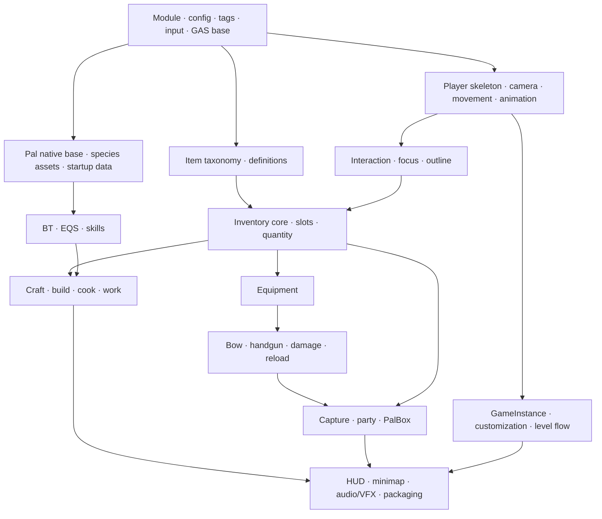
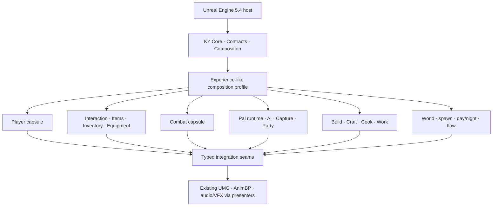
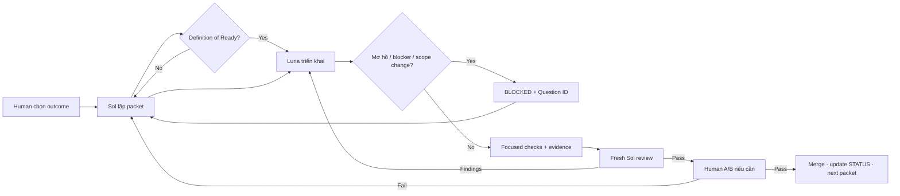

# Tái cấu trúc KYWorld bằng C++ mà không đánh mất gameplay

::: warning Hồ sơ Paldark V4
Tài liệu này được đóng băng như hồ sơ quyết định lịch sử của phương án UE 5.4. Nó không còn là nguồn quyết định hiện hành sau khi Paldark V5 khóa một target duy nhất là Unreal Engine 5.6.1. Xem [Paldark V5](/V5/) để đọc proposal mới.
:::

## Một mô hình về composability, parity và cộng tác đa tác nhân cho Paldark

> **Loại tài liệu:** chuyên khảo canonical duy nhất của dự án
>
> **Trạng thái:** `PROPOSED — READY FOR ARCHITECTURE REVIEW`
>
> **Phiên bản bằng chứng:** 1.0 — 2026-08-16
>
> **Reference tree:** `02.Palworld/Source@a6eab166` · gameplay main kết thúc tại `dc776d8f` · Unreal Engine 5.4
>
> **Trạng thái thực thi:** chưa chuyển đổi gameplay; chưa nâng engine; chưa tích hợp PaldarkKit

Tài liệu này thay thế mọi kế hoạch KYWorld trước đây với tư cách nguồn quyết định hiện hành. Sáu quyển Paldark, các ADR cũ, snapshot tiến độ và bài nghiên cứu trước đây vẫn tồn tại để truy vết lịch sử, nhưng không được dùng để tự động mở scope hoặc ghi đè một quyết định trong chuyên khảo này.

Một file có thể là nguồn giải thích canonical, nhưng một dự án dài không thể sống chỉ bằng văn xuôi. Khi triển khai, trạng thái máy đọc được như baseline, task packet, evidence và câu hỏi mở sẽ nằm trong các ledger nhỏ của repository. Chuyên khảo trả lời **vì sao**; ledger trả lời **đang ở đâu và làm gì tiếp theo**.

---

## Tóm tắt

PaldarkKit đã chứng minh rằng AI có thể dựng nhanh module, Game Feature, hợp đồng dữ liệu, authority check, stable identity, reservation và test seam. Nó chưa chứng minh rằng việc mở rộng liên tục theo chiều ngang sẽ tự hội tụ thành một trò chơi có độ hoàn thiện cao. Hai human gate lớn nhất cho thấy khoảng cách ấy: Task 52 trải qua một wall-clock envelope gần bốn ngày; Task 54/55 kéo dài hơn hai ngày nhưng tại snapshot kiểm toán vẫn chưa đạt `USER_VERIFIED`. Các lỗi tập trung ở điểm mà compile và static test không nhìn thấy đầy đủ: principal identity, target selection, root motion, orientation, animation, carry và chuỗi hành vi qua nhiều hệ thống.

KYWorld có giá trị theo hướng ngược lại. Repository hiện có 10.173 tracked paths, 10.039 `.uasset`, 51 `.umap`, nhưng chỉ 34 `.cpp`, 36 `.h`, 3 `.cs` và khoảng 2.919 dòng native C++ vật lý. Phần lớn gameplay và polish nằm trong Blueprint, animation, UMG, data và content graph. Lịch sử main có 539 commit, trong đó 161 merge; các workstream player/GAS, inventory/UI, weapon/combat và build/craft/world chạy song song. Đây là một reference giàu hành vi, không phải một architecture C++ để dịch nguyên xi.

Chuyên khảo đi đến bốn kết luận.

Thứ nhất, cách bảo toàn polish ít gây nhiễu nhất là **branch-by-abstraction trên chính snapshot UE 5.4**, với một reference worktree bất biến và một candidate worktree. Việc tạo project rỗng UE 5.6 rồi chép lại sẽ đồng thời thay asset path, default, engine semantics và implementation; khi parity fail, không thể biết biến nào gây ra sai khác. “Làm lại từ đầu” vì vậy phải có nghĩa là xây lại quyền sở hữu và dependency bằng C++, không phải vứt bỏ asset graph đã tạo nên presentation.

Thứ hai, “Everything is a Plugin” chỉ hữu ích nếu tách được năm khái niệm: **package**, **feature instance**, **capability**, **effect receipt** và **gameplay transaction**. Một delegate registration có thể thu hồi; damage đã gây ra thì không. Một Game Feature Plugin có thể chứa nhiều capability; một Actor Component không tự trở thành plugin; một native DLL thường không được unload an toàn chỉ vì feature đã deactivate.

Thứ ba, chuyển đổi phải diễn ra theo từng behavior row nhỏ: đặc tả reference, thêm native seam ở trạng thái dormant, chuyển đúng một quyền thực thi, so sánh A/B, rồi mới retire graph C/D cũ. Blueprint data và presentation phù hợp vẫn được giữ. Thành công được đo bằng state, timing, presentation, reference và runtime parity, không bằng phần trăm file “đã C++ hóa”.

Thứ tư, công việc dài phải dựa vào artifact thay vì ký ức chat. GPT-5.6 Sol giữ vai trò planner/architect và fresh reviewer; GPT-5.6 Luna chỉ triển khai packet đã đóng. Luna bắt buộc dừng khi contract mơ hồ, owner không rõ, cần mở rộng write-set hoặc một giả thuyết thất bại lặp lại. Sau restart, task mới đọc `STATUS`, baseline, packet, decision và evidence thay vì cố phục dựng cuộc hội thoại cũ.

Mục tiêu trước mắt không phải viết gameplay. Mục tiêu là duyệt architecture, khóa reference, tạo regression atlas, phân loại Blueprint và mở một pilot nhỏ đủ chứng minh phương pháp.

---

## 1. Bài toán nghiên cứu

### 1.1. Hai loại giá trị đang nằm ở hai project khác nhau

PaldarkKit có giá trị kiến trúc: domain boundary, owner, versioned payload, idempotency, automation và cấu trúc phù hợp với nhiều agent. KYWorld có giá trị trải nghiệm: movement, bow, inventory, capture, PalBox, build/craft, riding/flying, HUD, animation, sound, VFX và nhiều chi tiết đã được chỉnh trong một vòng phát triển ngắn nhưng dày đặc.

Nếu tiếp tục PaldarkKit theo lối cũ, ta phải tái phát minh từng chi tiết polish rồi nhờ người kiểm tra một chuỗi ngày càng dài. Nếu chép Blueprint KYWorld nguyên trạng, ta giữ cảm giác nhưng giữ luôn coupling, quyền ghi ẩn và graph khó chia việc. Bài toán không phải chọn một trong hai. Bài toán là **giữ nguyên lời hứa player-facing của KYWorld trong khi thay dần biểu diễn và quyền sở hữu bằng một kiến trúc C++ có thể ghép, review và rollback**.

### 1.2. Các câu hỏi

- **RQ1 — Reference:** KYWorld thực sự được hình thành theo thứ tự nào, và lịch sử Git cho biết dependency nào đáng tin?
- **RQ2 — Parity:** điều gì phải giữ nguyên để nói conversion không làm mất gameplay hoặc polish?
- **RQ3 — Modularity:** phần nào của Cordis, DeepSeek Harness, Lyra, Game Features, GAS và UEFN có thể chuyển sang Unreal C++ mà không cường điệu guarantee?
- **RQ4 — Migration:** làm sao thay Blueprint gameplay bằng C++ mà vẫn giữ object path, asset defaults, presentation và một build chơi được ở mọi checkpoint?
- **RQ5 — Collaboration:** làm sao Sol, Luna, reviewer và human gate phối hợp mà task vẫn tiếp tục được sau khi tắt máy?
- **RQ6 — Learning:** dữ liệu PaldarkKit cho thấy rework tập trung ở đâu, và metric nào nên thay thế LOC, số plugin hoặc countdown?

### 1.3. Luận đề

Gọi một capability đã polish là tập các quan sát:

```text
P = <S, T, V, R, X>
```

trong đó `S` là gameplay state, `T` là thứ tự và timing, `V` là presentation, `R` là asset/reference graph, và `X` là runtime health. Một migration unit chỉ đạt parity khi candidate tương đương reference trên tập quan sát và tolerance đã khóa; C++ sạch hơn không tự tạo ra tương đương này.

Luận đề trung tâm là:

> Một phép chuyển đổi ít rủi ro cần giữ cố định bốn biến — engine, asset identity, scenario và presentation — trong khi thay đúng một ownership path. Branch-by-abstraction làm được điều đó; một clean project hoặc một đợt dịch hàng loạt thì không.

### 1.4. Phạm vi và non-goals

Phạm vi là feature thực sự có trong reference: level flow, player, input/camera/movement, interaction, item/inventory/UI, equipment/combat, Pal AI/capture/party/PalBox, build/craft/cook/work, world flow và presentation liên quan. Multiplayer, persistence production, dungeon/boss, breeding/economy hoặc feature chỉ có tên trong backlog không được thêm trong giai đoạn parity nếu reference không có hành vi chứng minh được.

Không có mục tiêu biến mọi `.uasset` thành source text; viết lại artist-authored AnimBP, Behavior Tree, EQS, UMG layout, material, VFX hay audio bằng C++ thường vừa vô ích vừa làm mất khả năng authoring. Không nâng UE 5.4 trong cùng chuỗi commit với conversion. Không dùng số commit gốc như schedule cam kết. Không public asset hoặc media proprietary; site này chỉ public phương pháp, số liệu và kết luận kiến trúc.

---

## 2. Phương pháp và kỷ luật bằng chứng

### 2.1. Thứ bậc nguồn

Nghiên cứu dùng bốn lớp bằng chứng, theo thứ tự ưu tiên:

1. source code, manifest, Git object, test result và runtime observation được khóa version;
2. specification gốc, README và tài liệu dự án;
3. tài liệu primary của Cordis, DeepSeek Harness, Epic Games và OpenAI;
4. review, bài giảng và tài liệu tổng hợp dùng để đặt câu hỏi, không dùng để thay primary evidence.

Mọi claim được gắn một trong năm nhãn:

| Nhãn | Nghĩa |
|---|---|
| `MEASURED` | Đếm hoặc tính trực tiếp từ artifact được pin |
| `SOURCE_OBSERVED` | Thấy trực tiếp trong source/manifest/history |
| `DOCUMENTED` | Nguồn tài liệu nói như vậy nhưng chưa runtime-verify |
| `INFERRED` | Suy luận có giải thích từ nhiều signal |
| `UNKNOWN` | Chưa đủ bằng chứng; không được lấp bằng phỏng đoán |

Maturity của implementation dùng một ladder khác:

```text
DISCOVERED → SPECIFIED → SOURCE_PRESENT → COMPILED
→ AUTOMATED_PASS → EDITOR_PASS → PLAYER_OBSERVABLE
→ USER_VERIFIED → PARITY_EVIDENCED
```

Hai ladder không được trộn. Một claim `MEASURED` về số file không làm feature thành `PLAYER_OBSERVABLE`; một compile pass không chứng minh camera, animation hoặc inventory flow.

### 2.2. Cách kiểm toán KYWorld

Git history được tách merge/non-merge, committer date, author identity và path cluster. Các commit import vendor/VFX lớn được coi là dependency import, không phải hàng nghìn feature. Thứ tự feature được suy từ ancestry, co-change, path, specification và native seam. Vì `.uasset` là binary, dependency hard/soft đầy đủ vẫn là `UNKNOWN` cho đến khi Asset Registry hoặc Reference Viewer export được lưu ở W0.

Gameplay main được phân biệt với ba commit README về sau. Nhánh `origin/TestTest` được giữ như một hypothesis vì có một tweak cuối chưa merge; nó không tự trở thành gold reference.

### 2.3. Cách kiểm toán PaldarkKit

Elapsed time là khoảng giữa timestamp commit đầu và cuối. Nó bao gồm nghỉ, chờ human, công việc song song và máy tắt; tuyệt đối không gọi là person-hours. Corrective keyword trong subject chỉ là proxy rework. Churn lớn cho biết review surface, không cho biết chất lượng. Một report cũ không được dùng để nâng HEAD mới nếu build hash, engine, map, config, observer và media hash không khớp.

### 2.4. Giới hạn

Static audit không nhìn đầy đủ latent Blueprint order, collision, animation blend, root motion, focus, audio mix hoặc cảm giác camera. Commit chronology cho thấy quá trình, không chứng minh causal optimality. Cordis formalize một calculus có premise rõ; các theorem không tự áp dụng cho arbitrary Unreal code. Human A/B vẫn có sai số và phải được ghi kèm environment.

---

## 3. KYWorld như một corpus thực nghiệm

### 3.1. Snapshot và census

Submodule `02.Palworld/Source` đang trỏ tới `a6eab166bedeb3a48ea1fa6c082e2560e59b8134`. Ba commit sau gameplay chỉ sửa README, nên `dc776d8f` ngày 2025-01-06 là điểm kết thúc gameplay main và packaging repair cuối. Snapshot hiện hành giữ cùng content gameplay nhưng thuận tiện cho provenance.

| Thuộc tính | Giá trị đo được |
|---|---:|
| Tracked paths | 10.173 |
| `.uasset` | 10.039 |
| `.umap` | 51 |
| `.cpp` / `.h` / `.cs` | 34 / 36 / 3 |
| Dòng native C++/header vật lý | khoảng 2.919 |
| Kích thước asset/content tracked | khoảng 8,78 GB |
| Runtime module trong `.uproject` | 1 (`Palworld_Base`) |
| Game Feature Plugin riêng | 0 |

`Content/Blueprint` có 1.433 asset, trong đó cluster Character khoảng 904, Component khoảng 357, Item 64, Build 48 và Craft 28. `Content/VFX`, `Content/PalworldAsset` và `Content/DreamscapeSeries` chiếm phần lớn dung lượng. Đây là lý do conversion phải bắt đầu bằng manifest và reference graph, không bằng một lệnh export toàn thư mục.

### 3.2. “Năm tuần” có ba mốc khác nhau

Specification gốc ghi 2024-12-09 đến 2025-01-03 và đội bốn người; README về sau gọi là dự án năm tuần. Git kể chi tiết hơn:

- bootstrap đầu tiên: 2024-11-28;
- project `Palworld_Base` sau reset: 2024-12-05;
- gameplay main và packaging: đến 2025-01-06;
- 3 commit README: 2025-05-27, 2025-05-28 và 2025-08-03.

Main có **539 commit = 378 non-merge + 161 merge**. Giai đoạn gameplay có 536 commit = 375 non-merge + 161 merge. Git ghi sáu author string và năm email identity, trong khi spec/README nói bốn người; không có `.mailmap`, vì vậy không tự hợp nhất identity ngoài bằng chứng.

| Giai đoạn | Khoảng | Total | Non-merge | Ý nghĩa |
|---|---:|---:|---:|---|
| Bootstrap | 11/28–12/08 | 16 | 15 | reset project, native spine, input/GAS/player animation |
| W1 | 12/09–12/15 | 107 | 82 | player, Pal/AI, item/inventory, bow, build cùng khởi chạy |
| W2 | 12/16–12/22 | 124 | 88 | interaction, capture/party, handgun, glider, build integration |
| W3 | 12/23–12/29 | 123 | 82 | production craft, AI/EQS, riding, minimap, frontend |
| W4/polish | 12/30–01/06 | 166 | 108 | cooking, day/night, UI, audio/VFX, demolition, packaging |

Phân bố daily `total/non-merge` cho thấy integration diễn ra liên tục, không có một “ngày feature” tuyến tính:

```text
11/28 3/3
12/02 4/4   12/05 4/4   12/06 4/3   12/07 1/1
12/09 26/22 12/10 11/8  12/11 17/12 12/12 11/8
12/13 22/15 12/14 13/11 12/15 7/6
12/16 25/17 12/17 25/18 12/18 22/13 12/19 14/12
12/20 24/15 12/21 9/8   12/22 5/5
12/23 29/21 12/24 23/15 12/25 2/2   12/26 23/15
12/27 28/17 12/28 14/9  12/29 4/3
12/30 34/22 12/31 31/20 01/02 27/19 01/03 36/21
01/04 29/18 01/05 8/7   01/06 1/1
```

Raw author strings không đồng nhất với số người, nên được báo cáo nguyên trạng:

| Author string | Total | Non-merge | Workstream nổi bật |
|---|---:|---:|---|
| `naioooo` | 148 | 104 | C++/GAS, player, Pal AI/capture |
| `DESKTOP-HAOF24A\user` | 139 | 92 | inventory/UI |
| `kdh19217` | 131 | 93 | weapon, movement, combat |
| `KimTaeHyun` | 88 | 59 | build/craft/world |
| `DESKTOP-O7V0JEH\kumsi` | 23 | 23 | weapon/movement polish |
| `KGA6` | 7 | 4 | inventory/UI; cùng email với một identity ở trên |

### 3.3. Chronology chức năng đã chuẩn hóa

**Phase 0 — native spine.** `4f970528` tạo project, player, controller, Enhanced Input và startup DataAsset; `043d61cb` hình thành animation hierarchy; `f7560a10` thêm movement abilities; `67bc28ba` materialize module native và content base. Input tags, ability grants và player skeleton có trước feature phụ thuộc.

**Phase 1 — bốn vertical foundation song song.** Player/GAS thêm attack, crouch, roll và swim. Pal/AI thêm native Pal base, AI controller, behavior tree và startup abilities. Inventory đi từ taxonomy item tới manager, DataTable, grid, equipment và PalBox prototype. Combat/build đi từ bow/arrow tới aim/shoot, build component, craft test và world map. Sự song song này giải thích 161 merge commit và cảnh báo chống việc “replay lịch sử theo ngày”.

**Phase 2 — integration.** `PalDataComponent`, Pal inventory, capture overlap/animation, stored Pal, party profile, preview, handgun, glider và build material checks xuất hiện khi foundation đã đủ. Capture không phải một feature độc lập: nó phụ thuộc sphere equip/throw, collision, Pal identity, storage và UI.

**Phase 3 — production loops.** Craft test bị bỏ để chuyển sang production craft; inventory quantity/consume nối với workbench; Pal AI nhận state/EQS/skill; riding/flying, minimap, progress UI, start menu và customization level được hoàn thiện. Một commit 271 file đưa startup data, skill và montage vào từng species là content integration, không phải một atomic behavior.

**Phase 4 — closure và polish.** Cooking, day/night, spawn, level-up, minimap, sound cue, sleep, per-species preview camera, demolition và crafting Niagara được nối trước packaging cleanup. `dc776d8f` xóa 918 asset test/vendor không dùng và sửa package cuối. `origin/TestTest@0fbf2517` thêm riding/world tweak nhưng chưa merge, nên cần A/B riêng trước khi nhận làm chuẩn.

### 3.4. Dependency order rút ra từ history



History được dùng như **regression atlas và dependency evidence**, không như một danh sách 539 task mới. Merge, revert/reapply và binary import làm mapping `một commit cũ = một feature` sai ngay từ tiền đề. Lịch sử mới sẽ atomic hơn: một behavior claim, một native seam hoặc một asset switch cho mỗi commit reviewable.

---

## 4. Retrospective PaldarkKit

### 4.1. Những gì đo được

| Phạm vi | Commit | Wall-clock envelope |
|---|---|---:|
| Code-only | `ce1119df → 40245693` | 12d 22h 33m 22s |
| Code + packet/doc cuối | `ce1119df → a8d63560` | 12d 22h 34m 24s |
| Docs + code toàn kỳ | `778b45bf → a8d63560` | 12d 22h 59m 43s |
| PR #135–157 | `099fc590 → 5e70218d` | 15h 03m 03s |
| PR #158–178 | `8735afdd → 09e9b5e7` | 3h 27m 36s |
| ADR-001 capture→work | `61c3aaac → 50acd945` | 25h 52m 09s |
| Regression tooling | `1ce2448f → a884500a` | 2h 06m 53s |
| Wave 2 A–E | `1b56af49 → 1aa92a2b` | 34h 05m 42s |
| Wave 2B | `0e1f0837 → a912b519` | 25h 05m 38s |
| Wave 2C | `f5a96264 → 408a97aa` | 1h 41m 01s |
| Wave 2D | `5c57853c → 796597b3` | 25m 28s |
| Wave 2E | `7e8724ed → 1aa92a2b` | 3h 40m 39s |
| Task 52 | `1075ec53 → 672eb66f` | 4d 03h 55m 28s |
| Task 54/55 | `73404963 → a8d63560` | 2d 01h 01m 03s |

Đây là khoảng lịch, không phải thời gian lao động. Wave 2A không có timestamp gate độc lập nên duration của nó là `UNKNOWN`, không phải 0.

Trong 160 commit chạm `PaldarkKit`, có 18 merge và 142 non-merge. 25/142 commit non-merge có churn ít nhất 1.000 dòng; 26/142 chạm ít nhất 20 file; top 10 chiếm 34,6% gross text churn. Có 37 subject khớp corrective keyword rộng và 17 subject bắt đầu bằng `Fix`. Những số này không kết luận “waste”; chúng chỉ cho thấy review surface và correction cluster lớn.

### 4.2. Giá trị cần giữ

- 21 feature manifest tạo language về owner, interface, event và owned state.
- Stable identity, authority validation và versioned payload là nền đúng.
- Reservation/escrow và idempotency phân biệt validate với commit.
- `SubmitIntent` là seam thực, có nhiều caller, thay vì UI tự sửa domain state.
- Evidence ladder mới phân biệt `SOURCE_PRESENT`, `COMPILED` và `USER_VERIFIED`.
- 12 validator M0 có pass/poison phase, 8 UE Automation Test NullRHI và 17 historical bug record đã tạo một nền regression hữu ích.

### 4.3. Nợ kiến trúc và test

Tất cả 21 plugin hiện `Active/Enabled`, nên chúng chứng minh packaging boundary tĩnh chứ chưa chứng minh activation/deactivation giữa session. Sáu manifest không có composition action/component. `ResolveDefinitions` và `ValidateDefinitions` luôn false; `FreezeRegistry` là no-op. Event bus broadcast đồng bộ, không phải durable log, replay hoặc queue.

Modular giữa plugin nhưng chưa modular bên trong plugin: Work khoảng 4.088 dòng, Inventory 2.943, PalBehavior 2.457 và HUD 2.164. Work trộn assignment, transport, production, persistence, replication, QA và presentation. Đây là microkernel ở tên gọi nhưng god component ở implementation.

CI hiện chạy Python M0, chưa chạy UE compile/Automation. NullRHI không tạo pixel evidence. UE report 8/8 pass vẫn có 11–14 warning và `comparisonExported=false`; report mới nhất cũ hơn HEAD nhiều commit. World, Dungeon, Persistence, Multiplayer và Breeding/Economy là QA-only; không thể tính chúng như normal-play completion.

### 4.4. Hai case study của rework

Task 52 dùng Unreal `AActor::Owner` như faction/principal, khiến friendly-target, sight flee và reciprocal combat sai. Sau capture, E-summon thiếu strict Player principal identity, nên Work/Unarmed/Bow downstream không thể đánh giá. Human gate A–D kéo gần 100 giờ và vẫn sinh follow-up về Player HP và Work/carry.

Task 54/55 có ba lỗi quan sát được: V không chọn đúng target, Work lunge/root-motion snap và carry upside-down. Snapshot chỉ chứng minh source/compile/review; `PLAYER_OBSERVABLE`, `USER_VERIFIED` và version-locked runtime vẫn pending. Initial Task 54 thêm riêng 1.175 dòng trong `WorkFeatureComponent.cpp`, rồi cần Unity collision fix một giờ sau.

### 4.5. Bài học chuyển sang KYWorld

1. Metric chính là behavior row đi qua `PLAYER_OBSERVABLE → USER_VERIFIED → PARITY_EVIDENCED`, không phải LOC, plugin count hoặc countdown.
2. Một human gate chỉ kiểm tra một seam trong 3–5 phút; không gom capture, summon, combat, carry và production vào một card.
3. Một task production nên có ngưỡng reviewability ban đầu: tối đa khoảng 10 production file và 800 dòng handwritten net. Generated output và asset binary tách commit. Đây là guardrail, không phải luật vật lý.
4. Cùng một runtime failure lặp hai lần hoặc hypothesis thứ hai thất bại thì Luna dừng và quay lại Sol.
5. Mỗi visual bug sinh một invariant tự động thấp nhất có thể: exact target, transform delta, upright orientation, montage state, screenshot diff hoặc trace ngắn.
6. Candidate đang chờ human không tiếp tục thay đổi; giữ frozen commit và evidence hash.
7. Countdown bị loại khỏi KPI. Theo dõi first-pass gate rate, implementation-to-gate latency, rework-after-handoff, escaped bugs, warning debt và evidence freshness.

---

## 5. Nền lý thuyết: composability có điều kiện

### 5.1. Temporal và spatial composability

Cordis mô hình hóa một component hoạt động trong context. Một installation effect có thể viết khái niệm:

```text
e: Γ → (Γ′, e⁻¹)
```

Effect thay context `Γ` thành `Γ'` và trả một inverse witness. Nhiều effect trong cùng component được thu hồi LIFO. Temporal composability không yêu cầu allocator hoặc object address trở lại giống hệt; nó yêu cầu context sau tháo **tương đương quan sát** với context trước cài trong domain đã tuyên bố.

Spatial composability thêm `requires/provides`. Consumer chỉ active khi provider phù hợp tồn tại. Khi provider biến mất, runtime phải làm provider unavailable, quiesce dependent, thu dependent theo reverse dependency order, rồi mới thu provider. Provider identity/generation quan trọng: một provider mới có cùng value không phải instance cũ.

Paper formalize Cordis và dùng Koishi làm case study. DeepSeek Harness chính thức hiện nói rõ nó được Cordis hỗ trợ và dùng “Everything is a Plugin”, nhưng repository vẫn ở developer preview. Các kết quả recovery/confluence của paper không tự chứng minh mọi Harness plugin thỏa premise; self-evolving harness được paper nêu như hướng validation tương lai.

### 5.2. Hai miền không được trộn

**Installation effect** tồn tại để cài một capability:

- delegate hoặc message subscription;
- Enhanced Input mapping context;
- Game Framework component request;
- GAS ability/effect/attribute grant handle;
- timer, async cancellation token;
- UI extension, asset lease, spawn lease.

Các effect này phải trả typed receipt, chạy LIFO trong feature và reverse-topology giữa feature.

**Committed gameplay transaction** thay canonical domain state:

- damage đã settle;
- item đã chuyển quantity;
- Pal đã capture;
- building đã đặt;
- craft output đã tạo;
- save/RPC đã vượt system boundary.

Nó có dạng:

```text
T(S, C) → (S′, Result, Events)
```

với validation, authority, idempotency, reservation/escrow, commit barrier và khi cần compensation. `ClearAbility`, unbind delegate hoặc deactivate plugin không được gọi là rollback của `T`.

### 5.3. Năm khái niệm của một feature capsule

| Khái niệm | Câu hỏi |
|---|---|
| Package | Code/content được build, cook và phân phối ở đâu? |
| Feature instance | Instance nào đang active trong world/player/session nào? |
| Capability | Hợp đồng typed nào được cung cấp cho consumer? |
| Effect receipt | Registration hoặc lease nào phải được thu hồi? |
| Domain transaction | Gameplay state nào đã commit và ai sở hữu nó? |

Nếu đồng nhất năm thứ này thành “plugin”, architecture sẽ hoặc tạo hàng trăm module, hoặc giả vờ rằng unload package có thể hoàn tác gameplay. Định nghĩa hữu ích hơn là:

> Mọi capability có vòng đời thay thế độc lập phía trên một composition kernel ổn định là một feature capsule; không phải mọi class, actor hay helper đều là plugin.

### 5.4. Các mệnh đề có điều kiện

**Mệnh đề 1 — cleanup cục bộ.** Nếu mọi installation mutation đi qua mediated context và trả receipt đúng, LIFO cleanup khôi phục miền registration của một feature. Nó không đúng nếu code gọi global singleton, filesystem, network hoặc subsystem ngoài context mà không ghi receipt.

**Mệnh đề 2 — cleanup liên feature.** Nếu dependency graph acyclic, provider bị revoke trước teardown và dependent được thu reverse-topology, consumer không quan sát provider đã bị hủy trong quiescent state. Nó không bảo đảm arbitrary async callback, replication packet hoặc latent Blueprint đã được cancel nếu chúng không tham gia lifecycle.

**Mệnh đề 3 — migration isolation.** Nếu engine, asset path, baseline scenario và presentation được giữ cố định, rồi chỉ một authoritative path được switch, sai khác A/B có tập nguyên nhân nhỏ hơn so với rebuild ở project mới. Đây là lập luận kiểm soát biến, không phải định lý về chất lượng code.

**Mệnh đề 4 — single-writer convergence.** Nếu mỗi canonical state có đúng một domain owner và integration chỉ gửi command/đọc event, parallel work giảm semantic conflict. Git conflict vẫn có thể xảy ra ở asset binary hoặc contract chung.

---

## 6. Đối chiếu với Unreal, Lyra và UEFN

| Cơ chế | Điều học được | Điều không được suy ra |
|---|---|---|
| UE Module | compile/link/package boundary, startup/shutdown | reactive provider graph hoặc exact unload |
| Game Feature Plugin | feature bundle, activation action, content boundary | action tự có inverse đúng hoặc native DLL được unload |
| Modular Gameplay | actor extension callback và request handle | typed capability registry tổng quát |
| GAS | ability/effect/tag, prediction, grant handle | rollback damage, inventory, capture hoặc save |
| Lyra Experience | desired session composition, PawnData, action set | Experience thay GameMode hoặc hot-switch hoàn chỉnh |
| Subsystem | typed service với Engine/World/GameInstance/Player lifetime | dependency hiển thị, provider replacement hoặc receipt ledger |
| Gameplay Message | publisher/listener tách nhau | durable state, authority, ordering hoặc transaction |
| Mass | fragment/tag composition, processor query | undo arbitrary side effect hoặc gameplay plugin lifecycle |
| UEFN Device/Verse | placeable capability, `@editable` wiring, event subscription | universal inverse cho engine/world mutation |

Lyra cung cấp hai analogue tốt. `FLyraAbilitySet_GrantedHandles` giữ handles để thu abilities/effects/attribute sets (`LyraAbilitySet.h:85`, `LyraAbilitySet.cpp:32`). `GameFeatureAction_AddAbilities` giữ component-request và grant handles rồi reset rõ ràng (`GameFeatureAction_AddAbilities.cpp:22`). Nhưng source snapshot cũng ghi teardown action “should be handled FILO”, partial-loaded teardown còn TODO, async action deactivation chưa được hỗ trợ đầy đủ và feature cuối cùng chỉ deactivated chứ chưa fully unloaded (`LyraExperienceManagerComponent.cpp:385–465`). `SetCurrentExperience` yêu cầu chưa có experience hiện tại ở dòng 56. Vì vậy Lyra là mẫu composition manifest và localized receipt, không phải implementation của Cordis temporal exactness.

UEFN gợi một bề mặt designer tốt: đặt một device, nối reference `@editable`, subscribe event và cancel subscription. KYWorld có thể học bề mặt ấy bằng Actor/Actor Component + DataAsset + typed command/event. Tuy nhiên spatial placement không được biến Actor thành database. Domain owner vẫn giữ canonical state; device chỉ cấu hình, gửi command và trình bày result.

### 6.1. Quy tắc tiếp thu

- Dùng UE Module cho boundary compile ổn định, số lượng ít.
- Dùng Game Feature Plugin cho bundle có lifecycle/session composition thật, không cho từng class.
- Dùng Actor Component cho capability gắn lên actor; chỉ dùng Actor khi cần transform, presence, replication hoặc editor placement.
- Dùng GAS cho action/effect/tag có semantics phù hợp, không bắt mọi transaction đi qua ability.
- Dùng DataAsset/PrimaryAsset cho definition và authored config.
- Dùng Blueprint cho data và presentation; C++ giữ C/D gameplay ownership.
- Dùng integration component/capsule để phá cycle, không cho hai feature import lẫn nhau.
- Bắt đầu bằng dependency manifest tĩnh và startup validation. Chỉ xây runtime provider registry khi có use case thay provider thật.

---

## 7. Kiến trúc mục tiêu

### 7.1. Topology



Kernel nhỏ chứa ID, result/failure, gameplay tags, logging, descriptor, lifecycle receipt và dependency validation. Nó không chứa inventory, combat, capture hoặc work. Một composition profile cho Frontend, Customization và MainWorld chọn desired feature set; nó bổ sung cho GameMode, không thay GameMode.

Feature capsule là đơn vị ownership và lifecycle logic. Package vật lý có thể gộp nhiều capability gần nhau để tránh microplugin explosion. Presentation nằm gần feature owner thông qua presenter/view model; không tạo một “UI god module” có quyền ghi mọi state.

### 7.2. Descriptor đề xuất

```text
Feature = <Id, Version, Scope, AuthorityRole,
           Requires, Provides, ActivationActions>

CapabilityId = <NamespacedInterfaceOrGuid, SemanticVersion,
                Scope, Cardinality, AuthorityRole>

Scope = GameInstance → World → Experience → Player → Actor
        × Server / OwningClient / Client
```

Lifecycle:

```text
Discovered → Loading → Activating → Active
                              ↓
Inactive ← Deactivating ← Quiescing
                ↘ Failed / RolledBack
```

Quy tắc:

1. activation đang bay mang generation và cancellation fence;
2. kết quả async đến muộn không được resurrect feature đã quiescing;
3. provider được đánh dấu unavailable trước khi dependent teardown;
4. consumer ghi provider identity/generation để tránh ABA;
5. receipt chạy LIFO nội bộ, reverse dependency order liên feature;
6. native code có thể vẫn loaded; acceptance là cleanup registration/state view, không phải magical DLL unload;
7. hai writer lên cùng state cần single owner, precedence edge, broker/aggregator hoặc merge algebra được định nghĩa.

Tên C++ như `FModularFeatureDescriptor`, `FModularCapabilityId`, `IModularFeature`, `FModularFeatureReceipt`, `UModularFeatureCoordinatorSubsystem` mới là API candidate. W1 phải chứng minh use case và lifecycle test trước khi freeze. Không tạo service locator chỉ vì paper có context.

### 7.3. Boundary vật lý đề xuất

| Boundary | Trách nhiệm | Không được sở hữu |
|---|---|---|
| `KYCoreRuntime` | IDs, results, tags, log, scope, lifecycle primitives | gameplay domain state |
| `KYCompositionRuntime` | descriptor, profile reconcile, dependency validation, receipt stack | inventory/damage/capture |
| `KYGameplayRuntime` | shared Character/GAS/Input primitives và neutral interfaces | feature orchestration toàn cục |
| `KYMigrationEditor` | Blueprint manifest/export audit/reference reports | runtime dependency |
| `GF_Frontend` | Start/Customization/Main flow, appearance handoff | player inventory/combat |
| `GF_Player` | pawn, movement, camera, animation handshake | item quantity hoặc capture |
| `GF_Items` | interaction, item definitions, inventory, equipment | combat damage hoặc Pal state |
| `GF_Combat` | weapon action, damage/death, hit feedback | item ledger hoặc creature storage |
| `GF_Creatures` | Pal base, AI integration, capture/party/PalBox/riding | crafting inventory settlement |
| `GF_Production` | craft/build/cook/work transactions | player input shell hoặc world clock |
| `GF_World` | resource/spawn/day-night/minimap/world flow | UI canonical state |

Tên và mức gộp là proposal, không phải lệnh tạo 11 plugin ngay lập tức. Sau W0, dependency graph có thể chứng minh một boundary nên gộp hoặc tách. Mục tiêu là cohesion và parallel write-set, không tối đa số module.

### 7.4. Device façade cho designer

Một device có bốn phần:

```text
Device = Placement/Lifetime + Editable Definition
       + Typed Inputs/Commands + Typed Outputs/Events
```

`UActorComponent` là mặc định khi capability sống cùng actor. `AActor` chỉ dùng khi cần transform, collision, replication hoặc tồn tại độc lập trong level. DataAsset giữ config. Device không tick nếu có thể event-driven; không dùng tag string làm substitute cho typed payload; không tự mutate inventory, damage hoặc capture chỉ vì nhận event.

Ví dụ Workstation Device phát `Craft.Request` chứa station ID, recipe ID, principal và idempotency key. Production owner validate và commit; device nhận `Craft.Accepted/Rejected/Progress` để chạy widget/VFX. Designer lắp ráp được mà không cần biết implementation, nhưng quyền ghi vẫn chứng minh được.

### 7.5. Owner và transaction

| State | Owner duy nhất | Consumer điển hình |
|---|---|---|
| Item quantity/slot/container | Inventory | UI, Craft, Build, Equipment |
| Equipped loadout và active equipment instance | Equipment; possession/quantity vẫn thuộc Inventory | Combat, Anim, HUD |
| Current HP, health status và death state | Health | Combat, UI, AI, VFX |
| Attack/hit/damage resolution | Combat; HP mutation chỉ commit qua Health contract | Health, animation, audio/VFX |
| Pal record/profile/party/PalBox storage | CreatureRoster; Capture chỉ yêu cầu transaction qua contract | Party UI, summon, Work |
| Capture attempt và resolution | Capture; roster membership chỉ được commit qua CreatureRoster | Inventory sphere, Combat, presentation |
| Craft/build reservation/output | Production | Inventory, UI, world actor |
| Assignment/progress/output | Work trong Production | PalBehavior/movement, UI |
| View state | Presenter/view model | UMG/Anim/audio/VFX |

UI, device và adapter không bao giờ là canonical writer. Event chỉ báo kết quả đã commit; command là yêu cầu chưa tin cậy. External emission qua save/RPC cần idempotency/outbox/compensation, không đưa vào receipt ledger.

---

## 8. Phương pháp chuyển Blueprint sang C++

### 8.1. Branch-by-abstraction

Mỗi migration unit đi qua chuỗi:

```text
Characterize reference
→ Add native seam dormant
→ Shadow-observe read-only nếu phù hợp
→ Switch một authoritative path
→ A/B verify
→ Retire C/D graph cũ
```

Reference worktree giữ nguyên `a6eab166`/gold decision; candidate worktree ở branch riêng. Không đổi tên, move hoặc gom `/Game/...` path trong parity phase. Blueprint gốc được reparent hoặc gọi native seam có kiểm soát, giữ serialization-visible property, default, component hierarchy, soft/hard reference và presentation asset.

Không giữ `_OLD`, `_BACKUP` trôi nổi trong Content; Git, tag và worktree là backup. Old/new path có thể cùng tồn tại nhưng chỉ một path được phép commit mutation. Shadow path chỉ đo và log.

### 8.2. Phân loại A/B/C/D ở cấp graph

| Loại | Dấu hiệu | Disposition |
|---|---|---|
| A — Data-only | defaults, tables, config, asset references | giữ asset; có thể reparent native type |
| B — Presentation-only | UMG layout/animation, AnimBP, montage, material, audio/VFX | giữ asset; nhận state từ presenter/native owner |
| C — Gameplay logic | validation, calculation, authoritative mutation, damage/inventory/capture/build rule | chuyển ownership sang C++ |
| D — Integration/orchestration | level flow, global cast/find, spawn/wiring, bootstrapping | chuyển sang host/subsystem/component/profile |
| Hybrid | cùng asset có A/B và C/D | tách graph; giữ A/B, migrate C/D |

Phân loại theo từng function/graph, không gắn nhãn cả asset cho tiện. Widget tự add item có phần C dù layout là B. AnimBP quyết định damage có phần C dù animation graph là B. Behavior Tree/EQS có thể vẫn là authored asset; native task/service và domain owner giữ mutation.

### 8.3. Dùng Blueprint → C++ exporter

Exporter là công cụ khai quật và scaffold, không phải source of truth:

1. chỉ chọn graph C/D đã `READY`, không export cả folder;
2. pin tool version, config hash, input package hash và output hash;
3. output vào staging, không overwrite production source;
4. ghi unsupported nodes và warnings;
5. audit event/evaluation order, Timeline/Delay/Gate/DoOnce, Construction Script, dispatcher bind/unbind, metadata/defaults, references, UMG focus, Enhanced Input, GAS handles, notify/montage, tick và replication;
6. normalize theo capability contract, không dịch coupling sai 1:1;
7. thêm native path dormant;
8. reparent/switch có kiểm soát;
9. chạy gate rồi mới xóa C/D graph;
10. ledger ghi `adopted`, `rewritten` hoặc `rejected`.

Compile của generated code chỉ chứng minh cú pháp/type có thể build. Nó không chứng minh latent order, asset reference, gameplay ownership hoặc parity.

### 8.4. Trạng thái của một unit

```text
DISCOVERED → CLASSIFIED → CHARACTERIZED → READY
→ GENERATED_STAGING? → NATIVE_DORMANT → NATIVE_SHADOW?
→ BP_CHILD_ACTIVE → PARITY_PENDING → VERIFIED → C/D_RETIRED

A/B có thể kết thúc ở RETAINED.
Mọi trạng thái có thể chuyển BLOCKED kèm Question ID.
```

---

## 9. Reconstruction backlog

### 9.1. Dependency order

```text
BASE / FLOW
├─ PLAYER / INPUT / CAMERA / ANIMATION HANDSHAKE
│  └─ INTERACTION
├─ ITEM DEFINITIONS
│  └─ INVENTORY CORE
│     ├─ PICKUP / CONTAINER / INVENTORY UI
│     ├─ EQUIPMENT → COMBAT
│     │               └─ PAL RUNTIME / AI → CAPTURE / PARTY / PALBOX
│     └─ CRAFT / BUILD / WORK
└─ PRESENTATION CONTRACTS

ALL PARITY CAPABILITIES
└─ CROSS-SYSTEM POLISH → UE 5.4 PARITY FREEZE
   └─ PALDARKKIT ADAPTERS
      └─ ENGINE UPGRADE, nếu có decision riêng
```

Presentation được A/B trong mọi wave; sơ đồ chỉ nói dependency của canonical state.

### 9.2. Các wave

| Wave | Phạm vi | Exit evidence |
|---|---|---|
| W0 — Freeze & characterize | gold decision, reference/candidate worktree, UE 5.4 matrix, maps/config, Asset Registry, Blueprint manifest, regression atlas | reference flows tái hiện; mỗi capability có owner, scenario, unknown và A/B/C/D manifest |
| W1 — Minimal native seams | contracts, tags, identity, logs, static dependency manifest, activation receipt ledger | không đổi gameplay; nhiều vòng activate/deactivate không duplicate/leak; không cycle |
| W2 — Session/player | Start → Customization → Main, appearance, pawn/input/movement/camera, AnimBP handshake | flow và movement/camera/animation A/B pass; asset path giữ nguyên |
| W3 — Interaction/items | interact/cancel/look/focus/outline, item identity/definition | target và failure giống baseline; item defaults/reference chính xác |
| W4 — Inventory core | add/find/remove/drop, stack, transfer/swap, slot validation, 42 inventory/4 weapon/5 food | exact state parity; invalid/retry không mutate hoặc duplicate |
| W5 — Inventory UI/equipment | grid/slot, drag/drop, detail, toast 2 giây, HUD count, equip | UMG/layout/animation giữ; UI không làm owner; human A/B pass |
| W6 — Combat | GAS/action, bow/handgun, damage/death, montage/notifies, feedback | timing/state/presentation parity; handles cleanup; committed damage tách lifecycle |
| W7 — Pal runtime | native Pal base, BT/EQS integration, AI, capture, party, PalBox, riding/flying | identity/storage/selection parity; capture success/failure; authored AI assets còn dùng |
| W8 — Production | craft, build, cook, container, work | transaction atomic; invalid/cancel không mất item; placement/UI/VFX A/B pass |
| W9 — Cross-system polish | frontend/death UI, minimap, audio/VFX/material, transitions, edge cases | full scripted regression, không reference loss/log error mới, human polish sign-off |
| W10 — UE 5.4 parity freeze | packaged smoke, performance/reference audit, rollback drill, deviation closure | C/D in-scope native hoặc exception; A/B manifest; candidate tag `KYWorld-CPP-Parity-UE5.4` |
| W11 — Paldark convergence | capability-by-capability Adopt/Adapt/Keep/Replace/Reject | adapter parity suite; không rewrite hàng loạt |
| W12 — Engine migration | nâng engine chỉ nếu cần | full parity suite chạy lại; không trộn gameplay/architecture changes |

Wave không phải tuần. Lịch sử gốc giúp đặt dependency, nhưng tốc độ mới phụ thuộc số Blueprint graph, quality exporter, baseline reproducibility và human capacity chưa đo được. Bất kỳ lịch 5 tuần nào ở thời điểm này đều là estimation không có denominator.

### 9.3. First playable proof

Pilot nên là một chuỗi nhỏ nhưng end-to-end:

1. boot → customization → main giữ appearance;
2. player movement/camera bằng input bình thường;
3. focus một resource, outline và cancel đúng;
4. pickup đúng một item vào slot;
5. HUD phản ánh quantity;
6. invalid target và retry không đổi/nhân đôi state.

Chuỗi này không làm trong một task. Nó được chia thành behavior rows và gate riêng; chỉ cuối wave mới chạy full slice. Nếu phương pháp không giữ được first slice với same assets, không mở Combat hoặc Pal.

### 9.4. Regression scenarios tối thiểu

- Start/Customization/Main và appearance handoff.
- Focus/interact/cancel item/object.
- Pickup mới, merge/full stack, inventory full, remove/drop.
- Transfer/swap, drag đúng/sai type, 42/4/5 slot.
- Detail, outline, pickup toast, HUD weapon/ammo/count.
- Equip/switch bow/handgun, aim/fire/reload, damage/death/restart.
- Pal detect/AI/combat/capture success/failure.
- Party carousel/profile/PalBox/summon/recall/riding/flying.
- Recipe valid/invalid, workbench/cooking, chest transfer.
- Build preview valid/invalid/cancel/demolish, consume đúng một lần.
- Full loop với camera, animation, audio/VFX và minimap.

---

## 10. Parity và bảo toàn polish

### 10.1. Năm hợp đồng parity

| Dimension | Điều phải chứng minh |
|---|---|
| State | quantity, stack, slot, HP, equipped item, Pal state/profile, recipe/build result |
| Temporal | event/notify/delegate order và timing trong tolerance đo được |
| Presentation | cùng UMG layout/animation, montage, material, sound/VFX, camera feedback |
| Reference | không mất hard/soft reference, object path, class default, editor-exposed value |
| Runtime | không crash/ensure/Accessed None, double delegate/input/mutation, leak/tick mới; performance trong tolerance |

Giá trị rời rạc và canonical state có tolerance mặc định bằng 0. Movement, animation timing, frame time và load time chỉ có tolerance sau khi đo reference trên cùng map, config, fps cap và hardware. Không đặt “±5%” chung để hợp thức hóa sai khác chưa đo.

### 10.2. Evidence pack

Mỗi gate human hoặc parity lưu:

- reference và candidate commit/build hash;
- engine, target, map, config, input device, fps cap, hardware;
- behavior row và Given/When/Then;
- exact state assertions và timing sample;
- logs/warnings;
- observer và timestamp;
- screenshot/video/report SHA-256 ở private evidence store;
- deviation ID nếu khác có chủ ý;
- kết quả `PASS`, `FAIL`, `BLOCKED` hoặc `APPROVED_DEVIATION`.

Site công khai không chứa proprietary media. Hash cho phép chứng minh artifact nào đã được review mà không phân phối nội dung.

### 10.3. Human gate ngắn

Human gate 3–5 phút kiểm tra đúng một seam bằng normal input. Fixture/save seed được phép tạo precondition nhưng không được seed outcome cần chứng minh. Ví dụ gate inventory stack có thể mở map với hai item sẵn; nó không được set trực tiếp quantity cuối rồi tuyên bố pickup pass.

Human tập trung vào thứ máy khó kết luận: target đúng, camera feel, transition, root motion, orientation, focus, layout, âm thanh, VFX và reject clarity. Mỗi lỗi quan sát sinh automated invariant nếu có thể. Candidate commit bị freeze trong lúc chờ observer; evidence của commit A không được tái dùng cho commit B.

### 10.4. Gate map

| Gate | Khi chạy | Điều kiện |
|---|---|---|
| G0 Baseline | trước unit/wave | reference scenario tái hiện; nếu fail thì không migrate |
| G1 Static/build | mỗi commit | module/include, asset reference, Blueprint compile, no cycle |
| G2 Focused automation | mỗi unit | exact state, reject, retry, idempotency |
| G3 Lifecycle | feature seam | lặp activate/deactivate hoặc spawn/destroy; không receipt leak |
| G4 Editor/PIE | mỗi unit | reopen asset/map, nhiều PIE cycle, không Live Coding-only evidence |
| G5 Human A/B | feel/polish seam | cùng script trên reference/candidate |
| G6 Wave regression | cuối wave | unit mới và toàn upstream scenario pass |
| G7 Package/perf | W9–W10 | Win64 smoke, load map/assets, full loop, baseline compare |
| G8 Fresh Sol review | trước merge | scope, architecture, evidence, rollback; reviewer không sửa code |

CI theo chi phí: PR chạy M0/schema, targeted UE test, non-unity và forced-unity Windows compile; nightly chạy functional map/screenshot; milestone chạy package và human normal-input gate. Warning mới fail hoặc cần allowlist versioned. Full suite không chạy sau từng edit nhỏ nếu focused suite đủ, nhưng không được bỏ ở checkpoint wave.

---

## 11. Harness cộng tác trong ChatGPT/Codex App

### 11.1. Separation of powers

| Vai trò | Trách nhiệm | Bị cấm |
|---|---|---|
| Human | duyệt scope, visual truth, asset policy, merge/publish decision | dùng một chữ “works” không build/version |
| Sol planner/architect | nghiên cứu, dependency/owner, packet, decision, stop condition | lén biến kế hoạch thành implementation |
| Luna implementer | sửa đúng write-set, chạy focused checks, ghi evidence/question | tự đổi architecture, mở scope hoặc đoán contract |
| Fresh Sol reviewer | đọc packet + diff + evidence trong context mới; PASS/FAIL/findings | vừa review vừa sửa |

Đây là policy của project, không phải claim rằng model name tự đảm bảo hành vi. Prompt, write-set, gate và artifact mới thực thi separation of powers.

### 11.2. Workflow



Tối đa 3–4 stream song song và chỉ khi write-set/asset/contract trực giao. Shared foundation có một owner. Hai task không cùng sửa một `.uasset`; inventory core và UI không chạy song song nếu chúng cùng chạm Widget Blueprint binary.

### 11.3. Artifact để sống qua restart

Private execution area đề xuất `Documents/KYWorld-Reconstruction/`:

| Artifact | Nội dung |
|---|---|
| `baseline.yaml` | reference/gold commit, engine/plugins/config, maps, args, fps cap, hardware, seed/save, build hash |
| `blueprints.csv` | object path/hash, parent, interface/component, A/B/C/D per graph, tick/latent/dispatcher/dependency/owner |
| `capabilities/*.yaml` | contract, owner, requires/provides, scenario, tolerance, non-goals |
| `migrations/*.yaml` | allowlist, old graph, generated candidate, native target, switch và rollback |
| `parity-results/*.yaml` | builds, automated/editor/human result, measurements, reviewer, deviations |
| `decisions.md` | ADR nhỏ: vấn đề, lựa chọn, lý do, hệ quả |
| `questions.md` | Question ID, evidence, lý do dừng, quyết định Sol/human |
| `deviations.yaml` | sai khác có chủ ý, impact, approver và xử lý |
| `STATUS.md` | baseline, candidate, last-known-good, wave/unit, blocker, exact next action |

Sau restart, task đầu tiên đọc `STATUS`, baseline, packet hiện tại, ADR liên quan và evidence gần nhất. Chat chỉ là transport; commit và artifact là memory.

### 11.4. Definition of Ready

Luna chỉ nhận unit khi đã có:

- baseline commit/build/map/scenario;
- scope allowlist cụ thể;
- classification A/B/C/D theo graph;
- parent/interface/component/default/property/reference inventory;
- Timeline/latent/dispatcher/input/notify/construction/tick inventory;
- Given/When/Then và reference evidence;
- canonical owner và dependency direction;
- tolerance được duyệt nếu không exact;
- non-goals, rollback và stop conditions;
- test data/map/save với baseline đang pass;
- exporter version/config/hash nếu dùng;
- Sol approval rằng không còn architecture decision ẩn.

Thiếu một mục, packet là `BLOCKED`, không phải “đủ để Luna tự hiểu”.

### 11.5. Khi Luna bắt buộc dừng

- baseline, spec và runtime observation mâu thuẫn;
- không xác định được owner;
- cần chạm ngoài allowlist hoặc protected path;
- phát hiện cycle hoặc phải thêm module/plugin/dependency;
- cần đổi public contract, gameplay tag, asset path hoặc serialized property;
- exporter bỏ sót node ảnh hưởng semantics;
- cần engine/project setting/build target mới;
- có hai architecture hợp lý với hệ quả dài hạn khác nhau;
- reference không tái hiện ổn định;
- runtime failure giống nhau lặp hai lần hoặc hypothesis thứ hai thất bại;
- unit vượt guardrail và đòi “sửa tiện” feature khác;
- cần phán đoán visual/feel hoặc có nguy cơ mất default/reference/save.

Luna trả `BLOCKED` với Question ID, actual/expected, evidence, hypotheses đã thử, files đã chạm, last-known-good và câu hỏi quyết định. Sol sửa packet hoặc thu nhỏ unit; Luna không tiếp tục bằng phỏng đoán.

### 11.6. Prompt contracts dùng trong App

**Sol planning task**

```text
Bạn là planner/architect. Đọc STATUS, baseline, decisions và evidence được chỉ định.
Không viết gameplay code. Tạo đúng một task packet nhỏ: outcome quan sát được,
owner/dependencies, allowlist, non-goals, A/B/C/D scope, acceptance, rollback,
human gate và stop conditions. Mọi unknown phải có Question ID.
```

**Luna implementation task**

```text
Bạn là implementer. Chỉ thực hiện packet đã duyệt trong allowlist.
Không thay architecture hoặc mở scope. Nếu gặp stop condition, dừng ngay và
trả BLOCKED packet; không đoán. Chạy focused checks, cập nhật evidence/STATUS,
và không gọi task done nếu thiếu mức bằng chứng bắt buộc.
```

**Fresh Sol review task**

```text
Bạn là reviewer trong context mới. Chỉ đọc task packet, diff/commit, logs,
parity result và decisions. Không sửa file. Trả PASS hoặc FAIL với findings
có severity, path/evidence và acceptance bị vi phạm. Không suy ra human parity
từ compile hoặc static test.
```

Trong Codex App, ba vai trò nên là các task riêng, với branch/worktree riêng khi có thay đổi. Architecture task của Sol có thể được pin làm cửa vào; implementation task không trở thành nơi quyết định scope. Fresh review không fork từ lịch sử hội thoại triển khai nếu có thể tránh, vì mục tiêu là kiểm tra artifact chứ không đồng cảm với quá trình.

---

## 12. Commit, rollback và merge policy

Một migration unit thường có tối đa bốn commit logic:

1. `test/characterize`: contract và regression evidence, không đổi behavior;
2. `refactor/native-seam`: native seam dormant, build xanh;
3. `migrate`: switch đúng một behavior sang native path;
4. `verify/cleanup`: evidence và retire graph C/D sau sign-off.

Mỗi commit buildable, reviewable, revertable và chỉ có một thay đổi player-observable hoặc một thay đổi infrastructure được định nghĩa. Không trộn engine upgrade, asset move, framework refactor và gameplay migration. Binary asset edit ở commit nhỏ riêng kèm object path và before/after evidence. Generated code có provenance trailer.

Trailer đề xuất:

```text
Baseline: a6eab166
Capability: KY-INV-STACK-001
Contract: inventory.stack.merge.v1
Parity-Result: PR-KY-INV-STACK-001
Generated-From: <tool/version/input-hash>, nếu có
```

Blueprint graph cũ chỉ bị xóa sau parity; fallback tồn tại nhưng exclusive. Rollback drill phải chứng minh có thể quay lại old path bằng một revert/unit độc lập. Freeze/revert ngay khi có asset corruption, missing reference, lost/duplicated state, old/new double mutation, repeated crash/ensure, accidental engine change hoặc rollback không còn độc lập.

Luna có thể commit task branch sau checks nếu packet cho phép; fresh Sol review commit ấy; human duyệt gate cần thiết rồi mới merge. Push/merge chỉ theo quyền được ghi trong packet. Một commit gốc không tương ứng một commit mới: commit history mới tối ưu cho review và rollback, không tái diễn nhiễu merge/import của năm 2024.

---

## 13. Điều kiện hội tụ vào PaldarkKit

Không bắt đầu adapter cho đến khi có tag candidate `KYWorld-CPP-Parity-UE5.4` thỏa:

- toàn bộ C/D in-scope đã native hoặc có exception được duyệt;
- A/B retained có manifest và owner seam;
- không missing reference, Blueprint compile error, crash/ensure hoặc severe log mới;
- full regression và packaged smoke pass;
- human sign-off movement, UI, combat, Pal, production và cross-system polish;
- performance trong tolerance đo được;
- rollback drill pass;
- không còn deviation nghiêm trọng mở.

Sau đó từng capability được quyết định riêng:

| Quyết định | Khi dùng |
|---|---|
| Adopt | contract PaldarkKit tương đương và parity suite chứng minh |
| Adapt | semantics giống nhưng interface/lifecycle khác; viết adapter |
| Keep KYWorld | abstraction PaldarkKit hiện làm mất behavior/polish |
| Replace later | lợi ích có thật nhưng migration risk cao; hoãn |
| Reject | speculative/coupled hoặc không có use case |

PaldarkKit không phải donor architecture toàn phần. Stable identity, authority, transaction và evidence ladder nên được tái dùng; 21 always-active plugin, stub registry, synchronous event bus và god component không được copy. Engine upgrade là wave độc lập sau convergence decision.

---

## 14. Evaluation plan

### 14.1. Metric chính

- số behavior row đạt từng rung và số đạt `PARITY_EVIDENCED` mỗi tuần;
- first-pass automated/editor/human gate rate;
- implementation-to-gate latency và thời gian chờ observer;
- rework commit sau handoff/review;
- số escaped bug theo capability;
- evidence freshness so với candidate HEAD;
- warning debt và allowlist age;
- lifecycle leak count;
- asset/reference regression;
- activation, command, frame, memory và load delta sau khi có baseline.

Không dùng LOC, commit count, plugin count, countdown hoặc “% game hoàn thành” không có denominator làm KPI chính.

### 14.2. Failure injection

- provider mất giữa activation;
- async activation hoàn tất sau deactivation;
- provider generation đổi/ABA;
- callback/timer/latent task còn sau teardown;
- retry cùng idempotency key;
- reservation hết hạn giữa validate/commit;
- target ngoài range/LOS hoặc authority sai;
- actor lease despawn trước arrival;
- capture/craft/build bị ngắt ở từng phase;
- message duplicate/out-of-order;
- asset/reference mất sau reparent;
- editor restart/PIE restart và packaged launch;
- root motion/orientation sai trong normal input;
- rollback candidate về Blueprint path.

### 14.3. Ablation nhỏ để kiểm chứng architecture

Không cần xây framework lớn rồi mới biết có ích. W1 có thể dùng ba thí nghiệm:

1. activate/deactivate cùng feature 100 vòng và đo duplicate/leak;
2. thay provider generation trong test world và xác nhận dependent rebind/quiesce;
3. chạy cùng một inventory behavior bằng BP owner rồi native owner, so exact state/event trace.

Nếu manifest tĩnh và explicit handles đủ, không xây registry động. Nếu branch-by-abstraction không rollback sạch với một pilot, dừng trước khi mở rộng. Đây là cách cho phép giả thuyết kiến trúc thất bại với chi phí nhỏ.

---

## 15. Rủi ro và quyết định còn mở

### 15.1. Rủi ro chính

**Binary opacity.** Tên asset và Git path không cho biết toàn graph. W0 cần Blueprint/exporter manifest và Asset Registry; không bắt đầu conversion từ census.

**Asset corruption/reference drift.** Reparent, property rename và component hierarchy có thể làm mất default dù compile xanh. Vì vậy reference parity là dimension độc lập.

**False modularity.** Nhiều plugin có thể che god component hoặc dependency qua `GetSubsystem`, cast và component discovery. Review kiểm owner/contract, không đếm folder.

**Lifecycle overclaim.** Unreal native code, UObject, CDO, reflection, NetGUID và asset cooking không tương đương TypeScript closure/module cache/GC. Mục tiêu là deterministic deactivation của instance/registration, không exact binary unload.

**Polish loss.** Cùng asset không đảm bảo cùng timing nếu event order, notify, component transform hoặc input focus đổi. Mọi slice cần A/B normal-input gate.

**Human capacity.** Observer có thể trở thành bottleneck. Gate phải ngắn, candidate frozen, queue rõ và metric chờ được ghi.

**IP/distribution.** Công việc là nghiên cứu cá nhân; proprietary assets/media ở private workspace. Public docs không cấp license và không chứa asset. Bất kỳ distribution khác cần decision riêng.

### 15.2. Sáu decision cần human duyệt trước W0 exit

1. Gold baseline là gameplay main `dc776d8f`/current tree `a6eab166`, hay nhận thêm unmerged `0fbf2517` sau A/B?
2. Máy, fps cap, map/config và input device chuẩn cho baseline là gì?
3. Blueprint exporter hỗ trợ node/metadata nào, version nào được pin?
4. Evidence media private được lưu ở đâu và retention ra sao?
5. Human gate cadence/capacity và ai có quyền approve deviation?
6. Target engine của PaldarkKit sau parity là gì, và điều kiện nào thật sự buộc upgrade?

### 15.3. Stop conditions cấp chương trình

Dừng hoặc quay lại architecture nếu reference không build/reproduce; owner không thể đơn nhất; conversion đòi move asset hàng loạt; candidate mất serialized defaults; old/new path double commit; human parity fail lặp mà không định lượng được delta; framework phình trước pilot; hoặc phải nâng engine để tiếp tục một task parity.

Stop là kết quả hợp lệ. Có thể thu nhỏ unit, viết observation mới, giữ BP exception hoặc reject abstraction. Không tiếp tục chỉ vì đã đầu tư thời gian.

---

## 16. Hành động tiếp theo

Sau khi human duyệt chuyên khảo, chỉ mở **W0 — Freeze & characterize**, chưa mở gameplay conversion:

1. ghi decision baseline và xử lý riêng `origin/TestTest@0fbf2517`;
2. tạo reference worktree bất biến và candidate branch/worktree;
3. xác nhận UE 5.4 build, maps/config và packaged/editor launch;
4. tạo Asset Registry/reference dump và Blueprint A/B/C/D manifest;
5. tạo Graft graph riêng cho native source và text export của submodule; root graph hiện không thay thế graph của nested repository;
6. quay private baseline evidence cho regression scenarios;
7. chạy exporter pilot trên đúng một graph C/D nhỏ, không overwrite production;
8. Sol lập packet W1 hoặc trả `BLOCKED` nếu pilot làm mất semantics/default/reference.

Không có lý do kỹ thuật để bắt đầu Combat, Capture hay Work trước khi first slice và rollback method đã được chứng minh.

---

## 17. Kết luận

KYWorld không chỉ có “nhiều feature”; nó chứa một asset/reference/presentation graph đã được bốn workstream tích hợp và polish. Giá trị ấy sẽ mất nếu conversion đồng thời đổi engine, path, architecture và gameplay. PaldarkKit không chỉ có “nhiều code”; nó chứa những bài học đúng về identity, authority, transaction và evidence, cùng bằng chứng rằng breadth và gate lớn tạo review/rework khó kiểm soát.

Giải pháp không phải copy một bên sang bên kia. Giải pháp là giữ KYWorld làm control, thay từng ownership path bằng C++, đo parity đa chiều và chỉ hội tụ vào PaldarkKit sau một mốc UE 5.4 được chứng minh. Cordis cho vocabulary về effect/coeffect và lifecycle; Unreal cung cấp mechanism cục bộ; project phải tự trả phần còn thiếu bằng owner, receipt, transaction, generation, gate và evidence.

Kiến trúc chỉ đứng vững khi nó cho phép ba điều cùng lúc: một feature có thể được hiểu độc lập, một thay đổi có thể được tháo hoặc rollback trong đúng boundary, và người chơi vẫn nhận cùng lời hứa. Harness chỉ đứng vững khi task mới có thể tiếp tục từ artifact sau restart, Luna biết lúc phải dừng, Sol review mà không tự bào chữa cho implementation, và human chỉ phải xác nhận những gì máy thật sự chưa thấy.

Quyết định hiện tại vì vậy là đơn giản nhưng nghiêm ngặt: **duyệt hoặc sửa chuyên khảo; sau đó characterize reference; chưa code gameplay**.

---

# Phụ lục A — Commit landmarks của KYWorld

## A.1. Bootstrap/native spine

- `69f9d86b` — prototype map/widget.
- `50b27182` — xóa prototype cũ.
- `4f970528` — tạo `Palworld_Base`, player/controller/input/startup/native module.
- `043d61cb` — modular player animation hierarchy.
- `f7560a10` — `GA_Run`, `GA_Jump`, `GA_Roll` và startup grants.
- `67bc28ba` — chuyển project lên root, materialize native/content base.

## A.2. Player, item, AI và combat foundation

- `88bb8eff`, `61e0e5c3`, `561a8b11`, `b8464328` — Pal base và AI.
- `0e02adc1`, `57041ac8`, `235109f3`, `67026cc1`, `71ac2314` — item/equipment/inventory/data.
- `c913e823`, `0db6ffff`, `1cc4cda1`, `66fc3ac0` — bow/arrow/aim/shoot.
- `69cf16e7`, `86a7f002`, `2fffd8a2` — build/craft prototype.
- `7b6ae73c` — WorldMap/Dreamscape integration.

## A.3. Capture và production integration

- `1e88b6c8`, `f5fe5ace`, `e2f7d2dd` — Pal data/inventory.
- `ba142197`, `3208266d`, `43d9e7ea`, `0326bd13` — resource/capture/storage/profile.
- `5c0c7828`, `d723d145`, `d5da2a82` — build on player, ability/input, material checks.
- `f5f848b9`, `fe394cf7`, `0a342481`, `379df3ce` — production craft/minimap/workbench.
- `69c5ad8f` — per-species startup/skill/montage integration.
- `41baf4cc` — riding/flying completion.
- `659eab68`, `324e400a` — start/customization flow.

## A.4. Polish và packaging

- `785caecf`, `a881620a`, `9d8c7c9d`, `ecab0496` — bonfire/kitchen/recipe/cooking.
- `5378f967` — day/night/spawn box.
- `e9214148`, `0c5d98f6` — minimap.
- `3fa8f1ec`, `5114ed5b`, `a3f8dc95` — audio integration.
- `73f3bd2d`, `f065b7ad` — sleep và preview camera tuning.
- `5f8ea96b`, `3ea11482`, `e015ef35` — demolition flow.
- `75bfbf71` — crafting Niagara.
- `6f7bba31`, `dc776d8f` — packaging repair.

---

# Phụ lục B — Task packet và evidence schema

## B.1. Migration unit

```yaml
id: KY-INV-STACK-001
baseline: a6eab166
capability: inventory.stack
scope_allowlist:
  blueprints: []
  source: []
classification:
  retained: [A, B]
  migrated: [C, D]
contract:
  scenarios: []
  exact_state_assertions: []
  timing_tolerances: []
dependencies: []
owner: null
non_goals: []
tool_provenance:
  exporter_version: null
  config_hash: null
  input_hash: null
  output_hash: null
rollback:
  checkpoint: null
  procedure: []
stop_conditions: []
gates:
  automated: []
  editor: []
  human: []
status: DISCOVERED
next_action: ""
```

## B.2. Escalation packet

```yaml
question_id: Q-KY-0001
task: KY-INV-STACK-001
status: BLOCKED
expected: ""
actual: ""
evidence: []
hypotheses_tried: []
files_touched: []
last_known_good: ""
decision_needed: ""
safe_options: []
```

## B.3. Human parity result

```yaml
result_id: PR-KY-INV-STACK-001
reference_commit: a6eab166
candidate_commit: null
engine: 5.4
map: null
config: null
hardware: null
fps_cap: null
observer: null
timestamp: null
behavior_row: KY-INV-STACK-001
normal_input_steps: []
state_assertions: []
visual_checkpoints: []
known_deltas: []
media_sha256: []
result: BLOCKED
reviewer: null
```

---

# Phụ lục C — Nguồn

## C.1. Corpus cục bộ đã kiểm toán

1. `02.Palworld/Source@a6eab166` và full Git history của main/TestTest.
2. `02.Palworld/Documents/PalWorld_Development_Specifications_compressed.pdf` — specification gốc, text-only.
3. `Documents/KYWorld/paper.pdf` — *A Programming Paradigm for Spatiotemporal Composability*, text-only.
4. `Documents/KYWorld/paper-review.txt` — secondary review, chỉ dùng để đặt câu hỏi.
5. `Documents/KYWorld/claudecode_note.txt` — ghi chú *How I Tamed Claude*.
6. `Documents/KYWorld/guide.txt` — inventory tài nguyên/hệ thống.
7. `Documents/KYWorld/LyraFramework_Overview.pdf` — secondary synthesis, text-only.
8. `PaldarkKit` Git history, manifests, tests, reports và `Documents` packets.

## C.2. Nguồn public primary

- [Cordis paper repository](https://github.com/cordiverse/paper) và [Cordis](https://github.com/cordiverse/cordis).
- [DeepSeek Harness](https://github.com/deepseek-ai/deepseek-harness), [architecture](https://raw.githubusercontent.com/deepseek-ai/deepseek-harness/master/docs/architecture.md), [Cordis primer](https://raw.githubusercontent.com/deepseek-ai/deepseek-harness/master/docs/cordis-primer.md) và [capability seams](https://raw.githubusercontent.com/deepseek-ai/deepseek-harness/master/docs/capability-seams.md).
- Epic Games: [Game Features and Modular Gameplay](https://dev.epicgames.com/documentation/en-us/unreal-engine/game-features-and-modular-gameplay-in-unreal-engine), [Lyra Sample Game](https://dev.epicgames.com/documentation/en-us/unreal-engine/lyra-sample-game-in-unreal-engine), [Game Framework Component Manager](https://dev.epicgames.com/documentation/en-us/unreal-engine/game-framework-component-manager-in-unreal-engine), [Gameplay Modules](https://dev.epicgames.com/documentation/en-us/unreal-engine/gameplay-modules-in-unreal-engine), [Plugins](https://dev.epicgames.com/documentation/en-us/unreal-engine/plugins-in-unreal-engine), [Mass Entity](https://dev.epicgames.com/documentation/unreal-engine/overview-of-mass-entity-in-unreal-engine), [Subsystems](https://dev.epicgames.com/documentation/en-us/unreal-engine/programming-subsystems-in-unreal-engine), [UEFN Devices](https://dev.epicgames.com/documentation/en-us/fortnite/using-devices-in-fortnite) và [Editable Properties in Verse](https://dev.epicgames.com/documentation/en-us/fortnite/editable-properties-in-verse).
- OpenAI: [GPT-5.6 Sol](https://developers.openai.com/api/docs/models/gpt-5.6-sol) và [GPT-5.6 Luna](https://developers.openai.com/api/docs/models/gpt-5.6-luna). Model descriptions support routing choices; project policy and gates enforce the roles.

## C.3. Quy tắc đọc nguồn

Primary mechanism docs chứng minh API hoặc architecture được công khai; chúng không chứng minh KYWorld/PaldarkKit đã dùng đúng mechanism. Local source chứng minh snapshot, không cấp quyền phân phối. Secondary review giải thích vocabulary, không được đứng cao hơn paper/source. Mọi claim thiếu build/version/runtime evidence giữ `UNKNOWN`.
