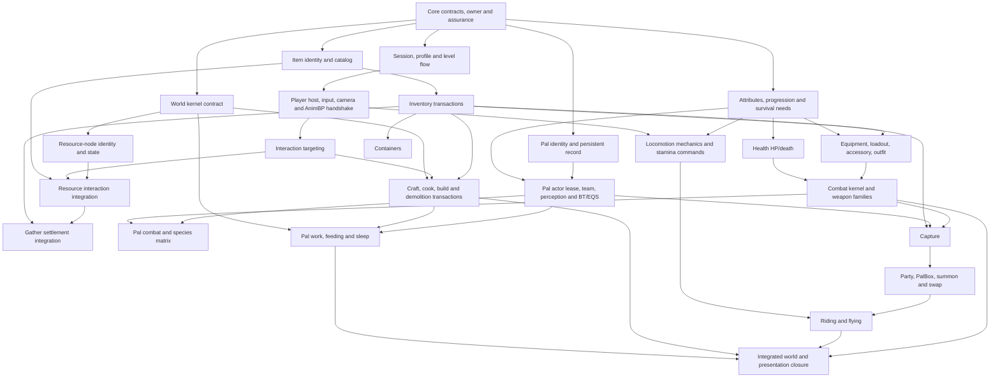

# V5.3 — Gameplay dependency roadmap

> **Trạng thái:** `PROPOSED — GAMEPLAY PLAN GATE P3`
>
> Wave là dependency boundary, không phải tuần. Chưa được gắn lịch cho tới khi W0 có denominator graph thật và pilot đo throughput.

## 1. Cơ sở dữ liệu

Snapshot đang xét có:

- 10.173 tracked path;
- 10.040 `.uasset`, 51 `.umap`;
- 34 `.cpp`, 36 `.h` trong một monolithic runtime module `Palworld_Base`;
- 145 Gameplay Ability: 62 Player, 83 Pal;
- 75 `W_*`, 3 `WBP_*`, 35 `ABP_*`;
- 7 BT Task, 5 BT Service, 2 BT Decorator và 4 EQS;
- 17 Pal species;
- 87 Inventory UI asset, 48 Build asset và 28 Craft asset;
- ít nhất 5 Level Blueprint có `ExecuteUbergraph`.

Main có 539 commit, trong đó 378 non-merge. Chronology không được copy thành schedule, nhưng xác nhận dependency thực tế:

| Giai đoạn lịch sử | Capability xuất hiện |
|---|---|
| 05–09/12 | Character/GAS, input, movement, animation, Pal base, item/inventory, AI |
| 10–16/12 | Inventory/equipment/UI, bow, build skeleton, PalBox, swimming |
| 17–24/12 | Resource hit, capture, storage, build/craft UI, reload, riding/flying, Pal state |
| 26–31/12 | Pal AI/EQS/skills, stats/weight/stamina, production/cooking, day/night/spawn |
| 02–06/01 | Level-up, minimap, audio/VFX, demolition, death UI, foliage và packaging fixes |

Hai kết luận:

1. Player, item/inventory và state foundation phải đi trước Combat/Pal/Production.
2. Presentation đi cùng từng vertical slice; không dồn animation/UI/audio/VFX thành “polish cuối”.

## 2. Dependency DAG



Task sau chỉ được phụ thuộc capability contract đã certificate, không phụ thuộc concrete implementation hoặc lời hứa “gần xong”.

## 3. W0–W12 mới

Old engine-migration wave bị xóa. Upgrade xảy ra một lần ở W0; mọi wave sau chỉ dùng UE 5.8.1.

### W0 — Import, upgrade và gold freeze

**Units:**

- `BASE-001` full seed và provenance manifest;
- `BASE-002` toolchain/plugin compatibility;
- `BASE-003` controlled asset resave nếu bắt buộc;
- `BASE-004` classify 51 map và runtime roots;
- `BASE-005` Asset Registry/reference/Blueprint graph export;
- `BASE-006` gold behavior atlas và human rehearsal.

**Exit:** gold 5.8.1 chạy đúng critical flow, clean build/cook/package/cold launch; engine-caused deviations đã quyết định; candidate sinh từ cùng tag; không gameplay refactor.

### W1 — V5 foundation và assurance harness

**Units:**

- `CORE-001` ID/result/reason/revision/authority/scope;
- `CORE-002` command/query/snapshot/event conventions;
- `COMP-001` descriptor, dependency DAG, provider generation và receipt ledger;
- `DATA-001` definition identity/validation;
- `PERSISTENCE-SEAM-001` typed codec/registrar/recovery contracts; không tự mở disk-save scope;
- `HOST-001` runtime scopes và host shell;
- `WORLD-KERNEL-001` world identity/time/resource/spawn public contracts, chưa triển khai full world runtime;
- `GAS-001` ASC/ability set/input grant foundation;
- `ASSURE-001` coverage ledgers, BP ownership lint, certificate commandlet và fixtures.
- `TOOL-001` fork/pin Soliz-Blueprint-C và pass `TQ0`, gồm clean UE 5.8.1 build, real-asset fixtures và differential runtime semantics.

**Exit:** Core TDD đã duyệt; no duplicate owner/cycle/forbidden dependency; 100 activation cycles trở về baseline; legacy violation snapshot không tăng; `TQ0` pass. P4 representative migration pilot cũng phải pass trước khi mở W2 implementation; gameplay delta W1 bằng 0.

### W2 — Session, profile, actor và stat base

**Units:**

- `SESSION-001` GameInstance/GameMode/controller/Level Blueprint flow;
- `SESSION-002` exact `StartLevel → CustomizationLevel → WorldMap` transition;
- `PROFILE-001` name/gender/head/hair/eye/outfit;
- `PLAYER-IDENTITY-001` PlayerState identity/profile;
- `PAL-PROFILE-001` creature record base;
- `ATTR-001` subject-agnostic rules cho attack, defense, work speed, stamina, carry capacity, resistance và non-vital modifier set; loại trừ max/current HP, hunger, XP-level và carried weight;
- `PROGRESSION-001` XP/level-up owner, modifier command và presentation handoff;
- `NEEDS-001` hunger/sleep need owner và consume/satisfy contract.

**Exit:** cross-level identity/profile và stat rules tái tạo; Attributes/Progression/Survival Needs có owner riêng; Locomotion/Equipment chỉ gửi command chứ không ghi stat; effective max/current HP/death vẫn thuộc Health ở W6; owner/persistence scope chốt; all W2 C/D native; level paths resolve/cook/load.

### W3 — Player locomotion vertical

**Units:**

- `CONTROL-001` Enhanced Input context stack;
- `MOVE-001` move/look/run/crouch/jump;
- `MOVE-002` roll và double jump;
- `MOVE-003` swimming;
- `MOVE-004` glide mechanics bằng fixed eligibility fixture; chưa claim glider-item/equipment parity;
- `MOVE-005` stamina cost/recovery;
- `CAMERA-001` camera/zoom/orientation;
- `ANIM-PLAYER-001` native locomotion state→AnimBP handshake.

**Exit:** mỗi traversal mechanic có state/timing/camera/animation/audio gate; invalid transition không mutate; asset/montage/default/reference giữ nguyên. Full glider eligibility/equipment gate nằm ở `GLIDE-EQUIP-001` W5.

### W4 — Interaction, items và world resources

**Units:**

- `INTERACT-001` look/focus/range/LOS/outline;
- `INTERACT-002` execute/cancel/retry;
- `ITEM-001` stable item ID/catalog/default resolution;
- `ITEM-002` pickup/drop/use request;
- `RESOURCE-001` tree/stone/berry/crystal node identity/state owner và hit interaction trên `WORLD-KERNEL-001`;
- `RESOURCE-002` gather consequence intent/reservation seam, chưa commit Inventory reward.

**Exit:** success/out-of-range/LOS/invalid/cancel/retry parity; no duplicate pickup; resource-node state/paths accounted. Full node→Inventory settlement chỉ pass sau `RESOURCE-003` W5; production consequence có contract nhưng chưa cần implementation W9.

### W5 — Inventory, container, equipment và UI

**Units:**

- `INV-001` add/find/remove/drop;
- `INV-002` stack/merge/full-capacity;
- `INV-003` slot validate/swap/transfer;
- `INV-004` weight/encumbrance;
- `INV-005` generic subject/container ports và transaction boundary; chưa claim Pal hoặc Production integration;
- `RESOURCE-003` node reward→Inventory atomic settlement;
- `EQUIP-001` equip/unequip/loadout;
- `EQUIP-002` outfit/accessory modifier;
- `GLIDE-EQUIP-001` glider item/equipment eligibility→W3 glide integration;
- `INVUI-001` grid/slot/detail/HUD count/toast;
- `INVUI-002` drag/drop/focus/cancel.

**Exit:** 42 inventory/4 weapon/5 food accounted; generic Inventory và resource settlement state exact; reject/retry không mutate/duplicate; glider-equipment integration pass; UI chỉ view model + command; human A/B pass. Pal inventory và production container chưa được claim ở wave này.

### W6 — Combat kernel và toàn bộ weapon family

**Units:**

- `HEALTH-001` effective max/current HP atomic revision, max-health policy, damage/death/hit-react/ragdoll;
- `HEALTH-EQUIP-001` Equipment/Progression max-health modifier→Health integration; no Attributes duplicate owner;
- `COMBAT-001` action state, targeting và attack resolution;
- `WEAPON-001` unarmed/melee/bat/spear;
- `WEAPON-002` axe/pickaxe và resource/combat distinction;
- `WEAPON-003` bow/arrow;
- `WEAPON-004` handgun/rifle/ammo/reload/zoom;
- `WEAPON-005` launcher/projectile;
- `COMBAT-PRES-001` montage/notifies/camera/audio/VFX/damage indicators.

**Exit:** không chỉ bow/handgun; Combat sở hữu attack nhưng Health sở hữu HP/death; committed damage tách receipt cleanup; cancel/timing/state/presentation parity; grant/notify handles sạch.

### W7 — Pal base, AI, combat và species matrix

**Units:**

- `PAL-IDENTITY-001` record↔active actor lease;
- `PAL-AI-001` team/perception/friend-enemy state;
- `PAL-AI-002` encounter/far/near/hit/death/sleep;
- `PAL-AI-003` BT/EQS native task/service mutation seam;
- `PAL-COMBAT-001` AI/skill→Combat action request + target integration; không tạo action/damage owner thứ hai;
- `PAL-SPECIES-*` archetype + 17-species/83-ability variant matrix.

**Exit:** mọi species/ability asset terminalized; BT/EQS chỉ declarative; `paldark.combat.action → paldark.creature.combat` certificate pass; canonical action/damage chỉ do Combat/Health commit; behavior/combat/presentation parity theo archetype và variant exceptions explicit.

### W8 — Capture và Pal ownership/traversal

**Units:**

- `CAPTURE-001` sphere throw/reservation;
- `CAPTURE-002` success/failure/consume/rollback;
- `ROSTER-001` party membership;
- `PALBOX-001` storage/preview/selection;
- `PAL-INV-001` Pal record/active actor↔generic Inventory integration;
- `SUMMON-001` summon/recall/swap;
- `RIDE-001` mount/dismount;
- `RIDE-002` riding/flying/partner action.

**Exit:** no duplicate/lost sphere, creature hoặc Pal inventory item; identity/team/storage exact; success/failure parity; traversal kế thừa W3 và không tạo locomotion/Inventory owner thứ hai.

### W9 — Production transactions

**Units:**

- `PROD-001` validate/reserve/commit/cancel protocol;
- `CONTAINER-001` production container model;
- `PROD-CONTAINER-001` Production↔generic Inventory container integration;
- `CRAFT-001` recipe/workbench/job/output;
- `COOK-001` bonfire/cooking;
- `BUILD-001` placement/material validation/continuous build;
- `BUILD-002` structure commit;
- `DEMOLISH-001` demolition/Chaos consequence;
- `PRODUI-001` craft/build/workbench UI.

**Exit:** invalid/cancel atomic; no lost/duplicated items; Inventory là settlement owner; placement/demolition/UI/VFX parity.

### W10 — Pal work và world runtime

**Units:**

- `WORK-001` assignment/intent/progress;
- `WORK-002` carry/transport;
- `WORK-003` deforest/mining/watering/cooking/common work/architecture;
- `SURVIVAL-001` feeding/Work/sleep integration qua Survival Needs owner đã certificate ở W2;
- `WORLD-001` clock/day-night;
- `WORLD-002` GameState/SpawnManager/respawn;
- `WORLD-003` foliage/resource lifecycle;
- `LEVEL-001` remaining Level Blueprint/global orchestration retirement.

**Exit:** Work không ghi Inventory hoặc Pal state trực tiếp; clock/spawn/world state có owner; Pal behavior/Production/World nối qua contracts; no authoritative Level Blueprint.

### W11 — Integrated world và polish closure

**Units:**

- `UI-001` frontend/options/death/level-up/party;
- `NAVUI-001` minimap/compass;
- `TRANSITION-001` travel/loading/respawn transitions;
- `PRESENT-001` remaining global audio/VFX/material/camera;
- `EDGE-001` cross-system cancel/death/full-capacity/travel cases;
- `PLAYTHROUGH-001` canonical full-loop regression.

Presentation của W2–W10 đã phải pass tại wave gốc. W11 chỉ đóng cross-system/global remainder, không chứa unit chưa từng được phân loại.

**Exit:** `UNASSIGNED=0` từ entry; full scripted playthrough; human blind A/B khi khả thi; zero new reference loss/error/ensure.

### W12 — Completeness certificate

**Units:**

- `CLOSE-001` tracked/package/graph/mutation/behavior/reference closure;
- `CLOSE-002` native code disposition cho cả 70 `.h/.cpp` cũ;
- `CLOSE-003` retained Blueprint allowlist audit;
- `CLOSE-004` clean build/cook/package/cold launch;
- `CLOSE-005` performance/rollback/Paldark conformance;
- `CLOSE-006` final human sign-off và certificate.

**Exit:** mọi tỷ lệ closure 100%; zero unknown/unassigned/duplicate owner/legacy authoritative BP/unresolved adapter/high-critical deviation; phát hành certificate exact build.

## 4. Scope overlay phải chèn trước P3

`Q-V5-005/006` không được để thành ghi chú “làm sau”. P3 validator đọc product-scope manifest và áp quy tắc:

### Khi có local/durable disk save

| Wave | Unit bắt buộc |
|---|---|
| W1 | `PERSISTENCE-001` save version, codec registry, atomic manifest/journal và recovery fixture |
| W2 | `PROFILE-SAVE-001` profile/attributes/progression/needs round-trip |
| W5 | `INV-SAVE-001` inventory/equipment reservation + idempotency recovery; `RESOURCE-SAVE-001` ResourceSettlement decision journal/roll-forward |
| W8 | `PAL-SAVE-001` creature record/party/PalBox/active-lease recovery; `CAPTURE-SAVE-001` sphere+Inventory+Creature commit-decision recovery |
| W9 | `PROD-SAVE-001` craft/build/container commit-decision journal |
| W10 | `WORLD-SAVE-001` clock/spawn/resource/work state round-trip |
| W11 | `SAVE-MIGRATION-001` old-schema migration, corrupt/interrupted write, cold restart |

### Khi target là listen hoặc dedicated

| Wave | Unit bắt buộc |
|---|---|
| W1 | `NET-001` authority/ownership/relevancy/time-source/replication test matrix |
| W2–W10 | `SESSION/PLAYER/INV/COMBAT/PAL/PROD/WORLD-NET-001` trong wave của domain tương ứng |
| W11 | `RECONNECT-001` join/rejoin/travel/disconnect/late RPC/idempotent retry |
| W12 | packaged server + ít nhất hai client chạy full network matrix và certificate pin topology |

Nếu scope chọn disk/listen/dedicated mà unit/capability/gate tương ứng chưa nằm trong catalog và certificate, `P3 = BLOCKED`. Nếu scope solo session-only, các gate này ghi `NOT_APPLICABLE` kèm exact scope decision ID; không được để trống.

## 5. Gate chung W2–W11

Mỗi wave chỉ pass khi:

- mọi assigned Unit ID terminal;
- dependency certificate đã tồn tại;
- old path inactive hoặc shadow read-only;
- một canonical state có một native writer;
- focused + upstream regression pass;
- human gate pass với presentation-sensitive row;
- rollback độc lập pass;
- evidence trỏ candidate HEAD/build;
- coverage ledger giảm đúng số row, không làm denominator biến mất;
- fresh review pass.

## 6. Scope closure

Package lifecycle và graph conversion là hai trục độc lập. Mỗi package có đúng một lifecycle:

```text
RETAINED | REPLACED_OR_REMOVED | EXCLUDED_PROVED
```

Mỗi graph/unit trong retained package có role `A | B | DCL | C | D` và terminal riêng:

```text
A/B/DCL → RETAINED_VERIFIED
C/D     → NATIVE_VERIFIED | LEGACY_C/D_TEMPORARY
```

`HYBRID` chỉ là derived label cho package vừa giữ A/B/DCL vừa retire C/D; nó không ép package vào hai lifecycle category. `LEGACY_C/D_TEMPORARY` phải bằng 0 ở W12. Retained presentation/data asset không phải conversion exception.

## 7. Điểm cần owner quyết định trước khóa P3

1. Gold dùng `main@a6eab166` hay lấy thêm `origin/TestTest@0fbf2517`, nhánh chưa merge thay ba asset riding/startup/world.
2. Trong 11 map `Content/Level`, map nào shipping và map nào fixture; 40 vendor/demo map giữ hay loại.
3. Release đầu là solo-only, listen co-op hay dedicated/replication-ready.
4. Persistence chỉ giữ state qua level hay phải save/load ra disk.
5. Target platform, hardware baseline và performance tolerance.
6. Canonical playthrough/video/save/input setup nào là gold.
7. Human gate capacity thực tế để planner điều chỉnh kích thước packet.

Không có câu trả lời này, roadmap vẫn đủ để nghiên cứu nhưng chưa đủ để phát hành master implementation schedule.
