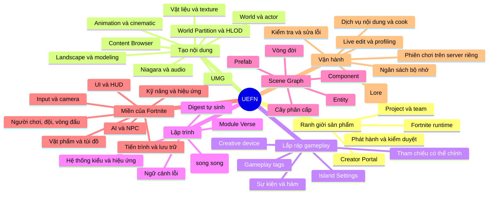
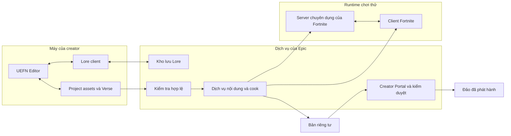
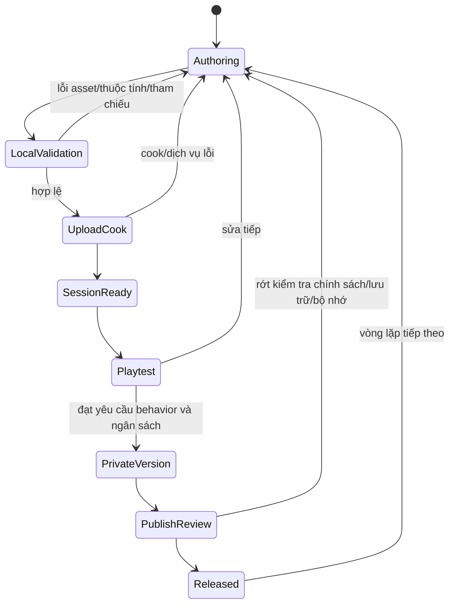
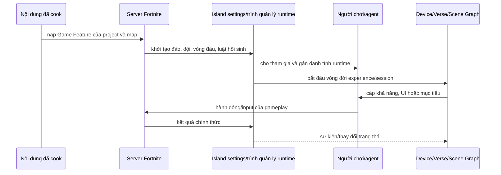
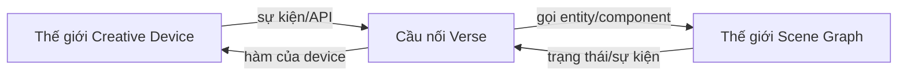
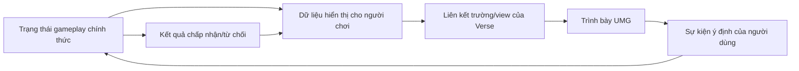
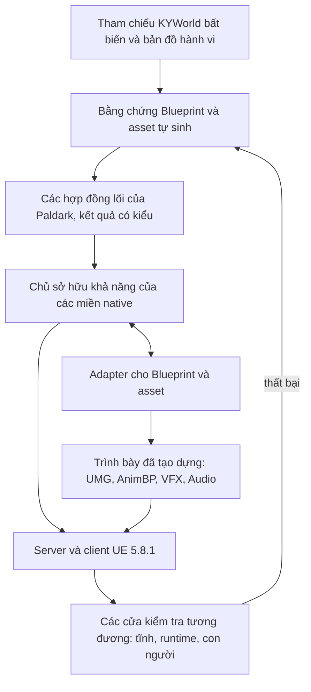
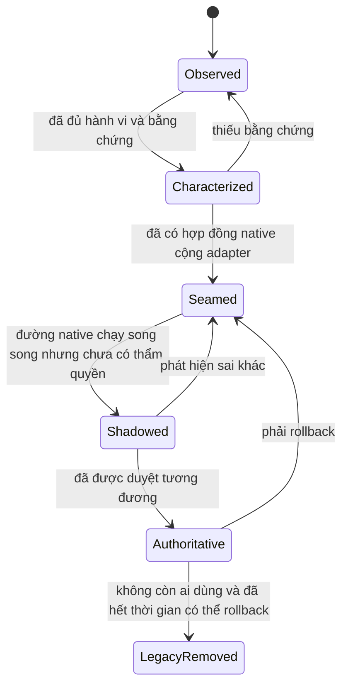

# UEFN hoạt động như thế nào, và Paldark V5 học được gì từ nó

> Đây là bản viết lại cho dễ đọc. Nội dung gốc là tài liệu nghiên cứu nội bộ, dùng để bàn bạc và ra quyết định thiết kế — nó **chưa phải** lệnh viết code. Bản này giữ gần hết ý của bản gốc, chỉ đổi cách nói cho dễ nắm bắt hơn.

## 0. Tài liệu này để làm gì?

### 0.1. Đọc xong bạn sẽ nắm được gì?

- UEFN không chỉ là "Unreal Editor có thêm ngôn ngữ Verse". Nó là một **nền tảng đầy đủ**, gồm nhiều lớp khác nhau.
- Phân biệt được 4 "khu vực": Editor (nơi bạn chỉnh sửa), Fortnite runtime (nơi game thực sự chạy), các dịch vụ của Epic (server, kiểm duyệt...), và Creator Portal (nơi phát hành). Mỗi khu vực "giữ" một loại dữ liệu riêng, không được lẫn lộn.
- Hiểu cách các mảnh ghép — world, Island Settings, device, Verse, Scene Graph, gameplay, UI, AI, item, ability, mạng, lưu trữ, kiểm tra, hiệu năng, làm việc nhóm, phát hành — liên hệ với nhau.
- Đoán được (có căn cứ) Epic đang cố giải bài toán gì, và họ chấp nhận đánh đổi ra sao.
- Biết rõ phần nào Paldark V5 nên **học theo tinh thần**, phần nào nên **chuyển đổi cho phù hợp với Unreal Engine thường**, phần nào **giữ nguyên như cũ**, và phần nào **không nên bắt chước**.

Tài liệu này **không phải**:
- hướng dẫn dùng công cụ MCP;
- giáo trình học cú pháp Verse;
- lời khẳng định UEFN phù hợp 100% để làm game C++ thuần;
- kế hoạch chuyển đổi Blueprint;
- tài liệu quảng cáo liệt kê tính năng.

Nói "toàn diện" ở đây nghĩa là toàn diện về **kiến trúc tổng thể** — đủ để thấy ranh giới, ai sở hữu cái gì, luồng dữ liệu đi đâu, và cái gì đánh đổi với cái gì. Nó không liệt kê hết từng device, từng class hay từng ô thuộc tính trong bảng Details.

### 0.2. Cách trình bày

Tài liệu mẫu (Lyra) có nhịp trình bày rất dễ học: sơ đồ tổng quan → sơ đồ khối → vấn đề/giải pháp → hệ thống con → luồng chạy → tích hợp → ví dụ thực tế → lợi ích/đánh đổi → kết luận.

Tài liệu về UEFN này giữ cách trình bày đó (đi từ tổng quan xuống chi tiết, có hình trước), nhưng bổ sung thêm:
- ghi rõ version/build đang xét;
- trích nguồn chính thức;
- nói rõ ranh giới hệ thống và ai là "chủ" của trạng thái nào;
- có cả đường chạy suôn sẻ **và** đường xử lý khi có lỗi;
- gắn nhãn để phân biệt: cái gì là sự thật, cái gì là quan sát, cái gì là suy luận;
- ghi rõ mức độ trưởng thành: Ổn định / Beta / Thử nghiệm / Lộ trình tương lai;
- không trình bày các đề xuất cho Paldark như thể đó là sự thật của Epic.

### 0.3. Các nhãn dùng trong tài liệu

| Nhãn | Nghĩa | Có dùng để chốt quyết định cho Paldark ngay không? |
|---|---|---|
| **EPIC-FACT** | Epic công bố công khai, còn hiệu lực | Có, trong đúng version và phạm vi |
| **OBSERVED-42** | Quan sát trực tiếp trên UEFN bản 42.00 đang chạy | Có, nhưng chỉ đúng cho bản này |
| **INFERENCE** | Suy luận hợp lý từ nhiều sự kiện/quan sát | Chỉ dùng sau khi có người review |
| **ROADMAP** | Epic công bố hướng đi tương lai | Không được coi là năng lực đã có sẵn hiện tại |
| **PALDARK-PROPOSAL** | Đề xuất áp dụng cho Paldark V5 | Cần có quyết định thiết kế chính thức (ADR) và người phê duyệt |
| **UNKNOWN** | Chưa đủ bằng chứng, cần kiểm tra thực tế | Không được đoán bừa |

Nếu một câu không có nhãn, hãy hiểu theo ngữ cảnh gần nhất. Các con số quan sát chỉ là ảnh chụp nhanh, không phải cam kết API lâu dài.

### 0.4. Bảng phiên bản đang xét

| Đối tượng | Phiên bản | Vai trò |
|---|---|---|
| UEFN cài trên máy | Fortnite Release 42.00, CL 56878558 | Bằng chứng trực tiếp |
| Project UEFNPaldark | tương thích 42.00; đã bật Scene Graph/Verse/Python | Phòng thí nghiệm quan sát |
| Tài liệu chính thức Epic | kiểm tra ngày 22/08/2026 | Nguồn thông tin sản phẩm/API |
| Khóa học 16 | 6 phần, 18 bài, 11 giờ 24 phút | Giáo trình Verse nhập môn — không phải tài liệu kiến trúc |
| PaldarkV5 | Unreal Engine 5.8.1 | Mục tiêu, độc lập với UEFN |
| UE6 | lộ trình công bố 22/06/2026 | Chỉ để tham khảo, không phải nền tảng hiện tại |

## 1. UEFN, gói gọn trong một câu

**UEFN là một môi trường tạo nội dung dựa trên Unreal Engine, nhưng đích đến của nó là Fortnite — một game trực tuyến, đa nền tảng, có server sống, và mọi thứ đều bị Epic kiểm soát chặt.**

Câu này quan trọng hơn bất kỳ danh sách tính năng nào. Unreal Editor thông thường cho studio toàn quyền sửa engine, viết code C++ gốc, tự quyết định server, tự build và tự phát hành. UEFN thì trao cho người sáng tạo (creator) rất nhiều công cụ của Unreal, nhưng mọi mở rộng đều phải đi qua: API được Epic cho phép, hệ thống kiểm duyệt nội dung, dịch vụ "nấu" (cook) nội dung, server/client của Fortnite, và chính sách phát hành.

Vì vậy UEFN không phải một khối duy nhất, mà gồm 7 lớp:

1. **Lớp sản phẩm:** trình duyệt project, làm việc nhóm, Creator Portal, phát hành.
2. **Lớp tạo nội dung Unreal:** viewport, World Partition (chia thế giới thành khu), asset, vật liệu, animation, hiệu ứng Niagara, âm thanh, giao diện UMG.
3. **Lớp lắp ráp gameplay:** Island Settings (cài đặt đảo), các Creative device, gán sự kiện trực tiếp.
4. **Lớp lập trình:** Verse, các "bản tóm tắt API" tự sinh, các tham chiếu có thể chỉnh.
5. **Mô hình dựng cảnh mới:** Scene Graph — gồm entity/component/prefab.
6. **Lớp gameplay của Fortnite:** người chơi, agent, nhân vật, đội, vòng đấu, vật phẩm, túi đồ, kỹ năng, AI, camera, UI.
7. **Lớp vận hành:** kiểm tra hợp lệ, dịch vụ nội dung, cook, phiên chơi thử trên server riêng, tính toán bộ nhớ, kiểm duyệt và phát hành.

Vì vậy, UEFN giống một **nền tảng làm game có giới hạn** hơn là một framework mẫu như Lyra.

## 2. Sơ đồ tư duy: toàn bộ "cơ thể" của UEFN



Có 3 tầng để đọc sơ đồ này:

- **Tầng triết lý:** tự do có giới hạn, lắp ghép (composition), hợp đồng dữ liệu máy đọc được, sự thật nằm ở runtime nhiều người chơi, kiểm tra trước khi phát hành.
- **Tầng hệ thống:** chính là các nhánh trong sơ đồ trên.
- **Tầng cơ chế:** asset, thuộc tính của device, hiệu ứng Verse, vòng đời component, job cook, bản riêng tư (private version).

Nếu bạn nhảy thẳng vào cú pháp Verse hay một device cụ thể, bạn sẽ chỉ thấy "một cái cây" mà không thấy "cả khu rừng".

## 3. Vì sao Epic phải tạo ra UEFN?

### 3.1. Bài toán không đơn giản là "làm editor dễ dùng hơn"

Epic phải cân bằng nhiều yêu cầu vốn mâu thuẫn nhau:

| Yêu cầu | Nếu chỉ dùng Unreal Editor thường | UEFN giải quyết thế nào |
|---|---|---|
| Người không biết code vẫn phải lắp được gameplay | C++/Blueprint và đóng gói có đường học rất dốc | Device có tùy chọn, sự kiện, hàm — nhìn thấy trực quan |
| Người làm chuyên nghiệp cần logic tùy biến sâu | Device cố định sớm bị "chạm trần" | Có Verse và API của Fortnite |
| Một đảo (island) phải chạy được trên mọi nền tảng Fortnite | Creator có thể lỡ dùng asset/API không tương thích | Danh sách cho phép, kiểm tra, cook, giới hạn bộ nhớ |
| Gameplay phải được thử trên môi trường thật | Play-in-Editor không mô phỏng đủ Fortnite thật | Dịch vụ nội dung + phiên chơi trên server riêng + client Fortnite |
| Nhiều người cùng sửa file nhị phân | Merge file nhị phân rất khó, dễ mất công | OFPA (tách actor thành gói riêng) + hệ thống checkout/revision (Lore) |
| Epic phải liên tục nâng cấp Fortnite | Project công khai có thể lỡ phụ thuộc vào chi tiết nội bộ | API công khai ổn định, digest tự sinh, kiểm tra tham chiếu |
| Nội dung phải tái sử dụng ở quy mô lớn | Cây class Actor và copy asset gây phụ thuộc chồng chéo | Entity/component/prefab và ranh giới nội dung dùng chung |
| Phát hành phải an toàn cho cả hệ sinh thái | "Build chạy được" chưa đủ điều kiện phát hành | Bản riêng tư, kiểm tra chính sách, kiểm duyệt, Creator Portal |

### 3.2. Ý tưởng cốt lõi: tự do trong một "hành lang" có kiểm soát

**Đây là suy luận (INFERENCE):** mục tiêu xuyên suốt của UEFN là tăng tự do sáng tạo mà không cho phép phá vỡ nền tảng chung.

Creator được **tự do** về:
- cách bố trí thế giới và định hướng nghệ thuật;
- cấu hình luật chơi;
- kết hợp các khả năng có sẵn;
- viết logic Verse trong phạm vi API cho phép;
- UI, cảnh quay, vật liệu, hiệu ứng, âm thanh và nội dung tùy chỉnh được phép.

Epic **giữ quyền kiểm soát** về:
- bề mặt runtime công khai/gốc (native);
- loại asset/thuộc tính/tham chiếu nào được chấp nhận;
- quá trình cook và runtime chính thức;
- giới hạn bộ nhớ/nền tảng;
- phát hành, kiểm duyệt và kinh tế trong game.

Đây không phải giới hạn ngẫu nhiên. Nó là điều kiện bắt buộc để hàng triệu trải nghiệm khác nhau có thể cùng sống trên một game trực tuyến đa nền tảng.

### 3.3. Có tầm nhìn dài hạn, nhưng đừng nhầm "kế hoạch tương lai" với "hiện tại"

Epic gọi Scene Graph là lớp nền hướng tới việc thống nhất cách nhìn giữa editor và runtime. Trong bài công bố ["Con đường tới Unreal Engine 6"](https://www.unrealengine.com/news/the-road-to-ue-6), Epic nói UE6 sẽ hợp nhất hai nhánh UE5 và UEFN, và UEFN chính là nơi "thử lửa" mô hình lập trình mới trên môi trường sống thật.

Đọc cho đúng:
- **ROADMAP (kế hoạch tương lai):** Scene Graph/Verse và mô hình mới sẽ ảnh hưởng đến Unreal trong tương lai.
- **EPIC-FACT (sự thật hiện tại):** Actor, device và Scene Graph đang cùng tồn tại song song; nhiều tính năng của Scene Graph/gameplay vẫn còn ở mức Beta hoặc Thử nghiệm.
- **Không được suy diễn rằng:** PaldarkV5 (đang dùng UE5.8.1) phải tự viết một bản sao Scene Graph, hoặc phải chờ tới UE6 mới được thiết kế.

## 4. Bốn ranh giới hay bị nhầm lẫn với nhau



**Chú thích:** mũi tên một chiều là luồng dữ liệu/điều khiển; mũi tên hai chiều là đồng bộ hoặc giao thức runtime. Sơ đồ này không thể hiện quyền sở hữu.

### 4.1. Bảng "ai làm chủ cái gì"

| Trạng thái/dữ liệu | Chủ sở hữu chính thức | Ai dùng nó | Lỗi hay gặp |
|---|---|---|---|
| Thay đổi chưa lưu trên máy | Tiến trình UEFN | creator | tưởng đã thành bản chia sẻ cho cả team |
| Bản đã checked-in vào project | Kho Lore (khi bật Lore) | team/editor | dùng thêm một hệ quản lý phiên bản khác trên cùng dữ liệu mà không xác định rõ ai là chủ |
| Mã nguồn Verse và asset của project | Bản project | trình biên dịch/cook | tự ý sửa file digest tự sinh |
| Bề mặt API công khai của Fortnite | Bản phát hành của Epic | Verse/trình biên dịch | dựa vào asset hoặc cách cài đặt nội bộ |
| Nội dung đã cook để chơi thử | Job/phiên bản của dịch vụ nội dung | server/client | tưởng "Save/Compile" tương đương với "đã deploy lên runtime" |
| Trạng thái gameplay trong trận đấu | server chuyên dụng/hệ thống runtime | client/UI | để widget hay trạng thái editor tự coi mình là chủ |
| Dữ liệu người chơi lưu lâu dài | dịch vụ lưu trữ, theo schema của Verse | runtime của đảo | đổi schema mà không giữ tương thích ngược |
| Metadata phát hành | Creator Portal | Discover/người chơi | tưởng bản riêng tư đã là bản công khai |

### 4.2. Vòng đời từ đầu tới cuối



Thiết kế này biến "phát hành" thành một chuỗi trạng thái có nhiều cửa kiểm tra, chứ không phải chỉ bấm một nút Build.

## 5. Mô hình project và nội dung

### 5.1. Một project UEFN thực tế gồm những gì?

Một project UEFN tối thiểu có:
- mô tả project và metadata về tương thích;
- một đường dẫn/mount riêng cho project;
- Game Feature Data làm asset khởi đầu;
- một World/map mặc định;
- Island Settings/Experience Settings trong world;
- các gói actor bên ngoài (khi dùng OFPA);
- lớp HLOD và metadata World Partition;
- mã nguồn Verse nếu creator có thêm logic;
- digest tự sinh phản ánh API và asset được phép dùng.

**OBSERVED-42 — tình trạng hiện tại của UEFNPaldark:**

| Thành phần | Quan sát |
|---|---|
| Mô tả project | tương thích 42.00; đã bật Scene Graph, Python và các bộ công cụ |
| GameFeatureData | class FortGameFeatureData; tên PrimaryAssetName là UEFNPaldark |
| Map mặc định | /UEFNPaldark/UEFNPaldark |
| Thẻ đăng ký map | có phân vùng, actor folder, actor bên ngoài; streaming đang tắt |
| HLOD | project có DefaultHLODLayer, phụ thuộc vật liệu HLOD của Fortnite |
| Asset của project | 4 mục ở gốc: GameFeatureData, World, HLOD layer, digest Verse tự sinh |
| Digest Verse của project | mới chỉ có phần header; chưa có asset nào của project được phản ánh vào |

Điều này cho thấy project UEFN không chỉ là một thư mục chứa script. Nó là một gói nội dung/game feature được gắn vào Fortnite.

### 5.2. Content Browser thực chất là một đồ thị asset, không chỉ là ổ đĩa

Mỗi asset trong Unreal có:
- lớp/kiểu (class/type);
- đường dẫn ổn định trong không gian nội dung;
- các thẻ đăng ký và metadata;
- các cạnh phụ thuộc/tham chiếu;
- dạng đã cook;
- chính sách về việc asset nào được công khai/tham chiếu.

World của phòng thí nghiệm này phụ thuộc vào map asset, actor điều khiển thời gian trong ngày, GameMode Creative của Fortnite, lớp HLOD và các gói actor bên ngoài. GameFeatureData phụ thuộc vào map mặc định. Đây là một đồ thị phụ thuộc mà máy có thể đọc được, chứ không chỉ là quan hệ "file nằm cạnh file".

**Ý định thiết kế:** danh tính nội dung và mối phụ thuộc phải tồn tại độc lập với việc creator có mở asset lên xem hay không. Nhờ vậy, việc kiểm tra, cook, phân tích bộ nhớ và các công cụ khác có thể làm việc trước hoặc ngoài lúc chạy runtime.

### 5.3. Asset reflection: biến nội dung nhị phân thành mã có kiểu

[Asset Reflection](https://dev.epicgames.com/documentation/fortnite/exposing-assets-with-asset-reflection-to-verse-in-unreal-editor-for-fortnite) tự sinh ra file Assets.digest.verse để asset có thể trở thành một định danh (identifier) trong Verse. Thư mục trở thành module; tên asset phải theo đúng quy tắc đặt tên; digest là kết quả tự sinh, không phải file để sửa tay.

Luồng hoạt động:

```text
File uasset đã lưu + là loại asset được hỗ trợ
→ đăng ký asset/reflection
→ khai báo Verse được tự sinh
→ trình biên dịch kiểm tra tên và kiểu
→ Verse dùng asset đó qua một ký hiệu công khai
```

Ý định thiết kế không chỉ là "cho Verse nhìn thấy texture". Epic tạo ra một **cầu nối được trình biên dịch nhìn thấy** giữa việc tạo nội dung và việc lập trình.

### 5.4. Bài học cho PaldarkV5

**PALDARK-PROPOSAL (đề xuất, cần duyệt):**
- Mỗi khả năng gameplay phải có một danh tính nội dung ổn định, một người sở hữu, và một bản kê phụ thuộc.
- File nhị phân của Blueprint cần có một "gói bằng chứng" (digest) để cả C++ lẫn con người đều đọc được; đừng biến kết quả của công cụ chuyển đổi thành nguồn sự thật duy nhất.
- Đường dẫn/tham chiếu asset là một phần của hợp đồng tương đương hành vi (parity). Dù C++ compile thành công, nếu mất tham chiếu asset thì vẫn coi là thất bại.
- Không sao chép nguyên xi mô hình GameFeatureData của Fortnite; chỉ dùng Primary Assets/Game Features của Unreal khi chúng thật sự giải đúng bài toán kích hoạt và quyền sở hữu của Paldark.

### 5.5. Nguồn gốc nội dung: project, Fortnite và Fab không có cùng quyền

UEFN phân biệt:
- **Nội dung của project:** creator sở hữu/chỉnh sửa được trong phạm vi project.
- **Nội dung của Fortnite/Epic:** được tuyển chọn kỹ, nhiều asset chỉ đọc, chỉ tập con công khai mới được tham chiếu.
- **Nội dung từ Fab:** có thể được dùng dưới dạng tham chiếu, hoặc trở thành asset chỉnh sửa được, tùy quy trình/giấy phép/loại nội dung.
- **Nguồn nhập từ ngoài:** phải chuyển thành asset của Unreal rồi mới qua kiểm tra/cook.

Ý định thiết kế là giữ "nguồn gốc" và "quyền sử dụng" đi liền với nội dung. "Thấy được trong Content Browser" không có nghĩa là "được phép sửa, phản ánh vào Verse, hoặc phát hành".

### 5.6. Ngay cả việc mở project cũng là một quy trình có kiểm soát

**OBSERVED-42:** log khi mở UEFNPaldark cho thấy chuỗi các bước:

```text
đặt quyền editor
→ thu thập nội dung được tham chiếu
→ kiểm tra mô tả
→ đồng bộ project/module với dịch vụ nội dung
→ kết nối kho lưu revision
→ gán đường dẫn Verse và tập tính năng
→ cài đặt/nạp Game Feature của project
→ thu thập/build/liên kết các gói Verse/VNI
→ tự sinh digest
→ nạp map dùng World Partition
→ yêu cầu giới hạn kích thước project
```

**Suy luận (INFERENCE):** ngay cả việc "mở project" cũng đã thiết lập danh tính, chính sách, hợp đồng và trạng thái dịch vụ. UEFN không đợi đến khi bấm Publish mới bắt đầu quản trị.

## 6. Tạo thế giới: từ một level thành một world có thể tải theo luồng (streaming)

### 6.1. Các thành phần

| Thành phần | Vai trò |
|---|---|
| World/Level | không gian chứa và điểm bắt đầu của đảo |
| Actor | mô hình object truyền thống của Unreal, vẫn được dùng rất nhiều trong UEFN |
| OFPA/External Actors | tách actor trong world thành các gói riêng để giảm xung đột khi nhiều người cùng sửa |
| World Partition | chia world thành lưới/ô (cell) |
| Streaming source | quyết định ô nào cần nạp quanh người chơi |
| HLOD | thay nhóm actor ở xa bằng phiên bản đơn giản hơn |
| Data Layers | nhóm actor theo tình huống tạo nội dung/runtime |
| Landscape/modeling | tạo địa hình và hình khối |
| Môi trường/ánh sáng | thời gian trong ngày, bầu khí quyển, hậu kỳ và diện mạo world |

[Streaming and HLODs](https://dev.epicgames.com/documentation/fortnite/streaming-and-hlods-in-unreal-editor-for-fortnite) mô tả World Partition, streaming và HLOD như nền tảng cho các đảo lớn, đồng thời cảnh báo rằng kích thước ô/khoảng cách nạp phải phù hợp với nội dung thực tế, chứ không nên chỉnh tùy tiện.

### 6.2. Vì sao Epic vẫn giữ Actor/World Partition song song với Scene Graph?

Scene Graph chưa thay thế toàn bộ hệ thống world của Unreal. Landscape, world settings, nhiều device, actor cảnh quay và các hệ thống của Fortnite vẫn dựa trên Actor/UObject.

**Suy luận (INFERENCE):** Epic đang dùng chiến lược "bắc cầu rồi hội tụ dần":
1. giữ nguyên hệ thống tạo nội dung đã trưởng thành;
2. đưa vào mô hình entity/component/prefab như một lựa chọn mới;
3. để hai hệ thống cùng tồn tại;
4. mở rộng dần cầu nối công khai qua Verse và API tự sinh;
5. chỉ ngừng dùng mô hình cũ khi mô hình mới đủ chín muồi.

Đây là bài học về chuyển đổi quan trọng hơn cả bản thân Scene Graph: đừng phá vỡ cả hệ sinh thái nội dung chỉ để đạt được "kiến trúc sạch" ngay lập tức.

### 6.3. Bằng chứng từ một map trống

**OBSERVED-42:** map của UEFNPaldark hiện có 24 actor, gồm:
- Island/Experience Settings;
- hai prop Creative Player Spawner và hai player-start actor của Fortnite;
- WorldDataLayers, WorldPartitionMiniMap và LevelBounds;
- bốn actor mặt lưới (grid-plane);
- actor điều khiển chu kỳ ngày-đêm;
- SimulationEntity;
- các trình quản lý engine/runtime.

Không có Data Layer nào của project, và chưa có Scene Graph entity nào do creator tự đặt. Một "project trống" vẫn được nền tảng khởi động sẵn bằng rất nhiều actor/hệ thống.

### 6.4. Các tình huống có thể sai

- Tắt streaming, hoặc cấu hình sai cell/HLOD, có thể làm lệch mục tiêu bộ nhớ/hiệu năng.
- HLOD không thay thế việc đo hiệu năng thực tế (profiling); nó chỉ thay đổi cách hiển thị theo khoảng cách.
- OFPA giảm xung đột khi ghi ở cấp gói dữ liệu, nhưng không tự giải quyết xung đột về ý nghĩa nội dung.
- Dùng sai chủ sở hữu Data Layer có thể khiến actor gameplay bị nạp/gỡ ngoài dự kiến.
- Một world chạy được trong editor chưa chứng minh được rằng phiên chơi trên server riêng dùng đúng phiên bản nội dung.

### 6.5. Bài học cho PaldarkV5

- Giữ nguyên map, đường dẫn asset, môi trường và animation đã được tạo dựng công phu khi tái cấu trúc quyền sở hữu gameplay.
- Tách việc tổ chức world ra khỏi việc sở hữu khả năng (capability).
- Dùng World Partition/HLOD dựa trên bằng chứng thực tế của map và phần cứng mục tiêu, không phải theo trào lưu kiến trúc.
- Trong quá trình chuyển đổi, cho phép Blueprint actor, component gốc (native) và adapter cùng tồn tại theo từng đợt (wave); không yêu cầu "đổi toàn bộ mô hình đối tượng" trước khi đạt được tương đương hành vi.

## 7. Island Settings và vòng đời gameplay cấp cao

### 7.1. Island Settings là gì?

[Island Settings](https://dev.epicgames.com/documentation/fortnite/island-settings-in-uefn-and-fortnite-creative) định nghĩa luật chơi ở mức toàn cục: chế độ chơi, số vòng, đội, cách hồi sinh, luật người chơi/world/UI và quyền hạn. Nó không thay thế mọi hệ thống gameplay; nó là cấu hình gốc để Fortnite khởi tạo một phiên chơi.

Một số khái niệm vòng đời quan trọng:
- **island/experience:** nội dung và bộ luật đã được phát hành;
- **session (phiên):** một lần triển khai runtime/chơi thử;
- **game (ván chơi):** một lượt chơi trong một phiên;
- **round (vòng):** một đoạn thi đấu/lặp lại;
- **playspace:** tập hợp người chơi/agent và ngữ cảnh luật chơi;
- **team/class (đội/lớp):** cách phân nhóm, ảnh hưởng tới vị trí hồi sinh, luật đồng đội và trang bị;
- **agent/player/fort_character:** các khái niệm về danh tính/góc nhìn runtime khác nhau — không được dùng lẫn lộn tùy tiện.

### 7.2. Luồng khởi động khái quát



Đây là luồng khái niệm; tên hàm callback cụ thể còn tùy vào API/device/component thực tế.

### 7.3. Ý định thiết kế

Epic đặt các "nút vặn" cấu hình chế độ chơi mà designer có thể chỉnh mà không cần code; còn hành vi chi tiết thì đi qua device hoặc Verse. Cách làm này:
- giảm số lượng script chỉ để đặt giá trị mặc định;
- tạo ra một schema mà editor, hệ thống kiểm tra và tài liệu đều hiểu chung;
- giữ luật nền tương thích với Fortnite;
- cho phép có nhiều biến thể template mà không cần phân nhánh runtime.

### 7.4. Bài học cho PaldarkV5

Paldark cần một **định nghĩa experience** hoặc bản mô tả khởi động rõ ràng, nhưng không nên để một "god-object" thay thế GameMode:
- luật chế độ chơi/phiên là dữ liệu;
- vòng đời chính thức nằm ở GameMode/GameState/subsystem phù hợp;
- danh tính người chơi và pawn/avatar là hai khái niệm khác nhau;
- việc kích hoạt tính năng phải có "biên nhận" (receipt) và có dọn dẹp khi kết thúc;
- luồng frontend → tùy chỉnh nhân vật → world chính phải là một cỗ máy trạng thái có thể quan sát được.

## 8. Creative device: khả năng có thể lắp ráp sẵn

### 8.1. Device giải quyết bài toán gì?

Epic gọi device là "viên gạch" cốt lõi của cơ chế game. Một device thường đóng gói:
- một khả năng đã có sẵn cách cài đặt gốc (native);
- các tùy chọn có thể chỉnh trong bảng Details;
- các sự kiện phát ra;
- các hàm nhận vào;
- vòng đời bật/tắt/reset;
- bộ lọc theo đội/lớp/người chơi;
- cách hiển thị hoặc thẩm quyền theo phong cách Fortnite.

Ví dụ: Player Spawner (điểm hồi sinh), Trigger, Timer, Score Manager (quản lý điểm), Item Granter (cấp vật phẩm), HUD Message, Camera, NPC Spawner, Conversation, Save Point.

**OBSERVED-42:** UEFN hiện liệt kê 383 device qua bề mặt editor công khai; 377 thuộc nhóm khả năng nội dung/legacy và 6 là class device thuộc Verse/nội bộ. Con số này là ảnh chụp kiểm kê, không phải cam kết API lâu dài.

### 8.2. Gán sự kiện trực tiếp (Direct Event Binding)

[Direct Event Binding](https://dev.epicgames.com/documentation/fortnite/direct-event-binding-in-unreal-editor-for-fortnite) nối sự kiện của device A với hàm của device B bằng cách chỉ định trực tiếp, thay vì dùng một "kênh số" dùng chung như trước.

Ví dụ khái niệm:

```text
PlayerSpawner.OnPlayerSpawned
    → ItemGranter.GrantItem
    → HUDMessage.Show
```

So với hệ thống kênh (channel bus) cũ, cách này tốt hơn vì:
- phụ thuộc được nhìn thấy rõ theo từng device/hàm;
- không cần quản lý một không gian tên kênh chung toàn cục;
- copy một cụm device có thể giữ nguyên quan hệ nội bộ;
- bề mặt API được mô tả bằng sự kiện/hàm rõ ràng, thay vì một "giao thức chuỗi ký tự" mơ hồ.

Nhưng gán sự kiện trực tiếp không tự động tạo ra kiến trúc tốt. Một đảo vẫn có thể trở thành mớ bòng bong (spaghetti) nếu có hàng trăm device gọi chéo nhau, đặt tên kém, không rõ ai sở hữu trạng thái nào, và không ai kiểm kê lại đồ thị sự kiện.

### 8.3. Tham chiếu có thể chỉnh (editable reference) — giống "tiêm phụ thuộc" lúc tạo nội dung

Device tự viết bằng Verse có thể để lộ ra một tham chiếu/cấu hình để designer gán trong editor. Ý tưởng cốt lõi:

```text
code định nghĩa hợp đồng và hành vi
editor gắn cụ thể implementation/asset/cấu hình
trình biên dịch + kiểm tra xác nhận kiểu/tham chiếu
runtime dùng phần đã gán, đã được cook
```

Đây là kiểu "tiêm phụ thuộc" (dependency injection) nhưng diễn ra ở thời điểm tạo nội dung, không nên hiểu nó như một DI container tổng quát.

### 8.4. Device và Scene Graph chưa phải là một mô hình duy nhất

Epic ghi rõ: Creative device và các component/entity của Scene Graph có thể cùng tồn tại trên một đảo, nhưng không tương thích trực tiếp với nhau; Verse tự viết thường phải đóng vai trò cầu nối. Đây là bằng chứng cho thấy UEFN hiện đang ở giai đoạn kiến trúc chuyển tiếp:



### 8.5. Các điểm dễ sai và đánh đổi

- Các giá trị mặc định ẩn/tùy theo ngữ cảnh làm hành vi khó đoán nếu không ghi lại cấu hình.
- Việc gán theo tên/định danh có thể khó đọc nếu đặt tên không tốt.
- Trạng thái của device và trạng thái Verse có thể cạnh tranh nhau về "ai là chủ".
- Đầu vào/device đi qua mạng nên phụ thuộc vào độ trễ server.
- Khả năng đóng gói sẵn giúp nhanh nhưng giới hạn khả năng mở rộng sâu.
- Cầu nối giữa Actor/device/Scene Graph tạo thêm một "khe hở" về vòng đời.

### 8.6. Bài học cho PaldarkV5

**Nên học theo (Adopt):** khả năng nhỏ gọn, cấu hình có kiểu rõ ràng, hợp đồng sự kiện/hàm, phụ thuộc tường minh.

**Nên chuyển đổi phù hợp (Adapt):** mỗi tính năng gameplay gốc nên có một "mặt tiền" (façade) dành cho designer bằng BlueprintCallable/events/data asset, nhưng C++/server vẫn giữ quyền quyết định.

**Không nên làm (Reject):** coi "mỗi chức năng = một Actor device đặt trong map" là kiến trúc mặc định. Paldark cần subsystem/component/service phù hợp với vòng đời của từng tính năng.

**Điều kiện đạt chuẩn (Gate):** một khả năng chỉ coi là hoàn thành khi biết rõ: đầu vào, đầu ra, ai sở hữu, vòng đời, lý do khi thất bại, cách dọn dẹp, và kịch bản sử dụng thực tế — chứ không chỉ vì "gọi API chạy được".

## 9. Verse: mô hình lập trình an toàn trên một nền tảng đang sống

### 9.1. Vai trò thật sự của Verse

Verse không thay thế toàn bộ cách cài đặt gốc của Fortnite. Nó là ngôn ngữ và lớp hợp đồng để creator:
- định nghĩa device/component tùy chỉnh;
- gọi các API công khai của Fortnite/Unreal/Verse;
- phối hợp sự kiện, người chơi, entity và asset;
- biểu diễn logic bất đồng bộ (async);
- lưu trạng thái theo schema được phép;
- biên dịch trước khi nội dung được triển khai.

Nhiều API của Verse có ghi chú **native**: phần khai báo nằm trong Verse, nhưng phần cài đặt thực sự do C++ đảm nhận. Vậy kiến trúc thật sự là:

```text
Verse do creator viết
→ hợp đồng API tự sinh/công khai
→ cách cài đặt gốc của Fortnite/Unreal
→ runtime đã kiểm tra và đang chạy thật
```

### 9.2. Module và digest là "hàng rào" kiến trúc

**OBSERVED-42:** ba digest nền hiện lộ ra 66 khai báo module công khai, chia thành:
- **/Verse.org:** các thứ nguyên thủy của ngôn ngữ/runtime — Simulation, SceneGraph, Tags, Concurrency, SpatialMath, Assets, Input, UI;
- **/UnrealEngine.com:** các kiểu hướng về engine như Assets, UI, Diagnostics, Itemization, Abilities, Conversations, Progression;
- **/Fortnite.com:** Devices, Characters, Teams, Playspaces, Game, AI, Items, Itemization, Abilities, UI, Cameras, Vehicles, Weapons.

Digest của riêng project được tự sinh riêng. Việc phân tầng theo không gian tên như vậy cho thấy Epic không đưa toàn bộ nội bộ của Fortnite thành một API toàn cục duy nhất; creator import hợp đồng theo từng lĩnh vực.

### 9.3. Kiểu và hiệu ứng: chữ ký hàm nói cả "làm gì" lẫn "được phép làm gì"

Chữ ký hàm trong Verse có thể diễn đạt:
- kiểu đầu vào/đầu ra;
- mức truy cập như public/internal/private;
- có thể thất bại hay không;
- có thay đổi dữ liệu mà có thể hoàn tác hay không;
- có tạm dừng (suspend) hay không;
- được cài đặt bằng native hay bằng Verse.

Ví dụ minh họa (chỉ là pseudocode, không phải code thật lấy từ project):

```text
FindItem(Id:item_id)<transacts><decides>:item
WaitForReady()<suspends>:void
```

**Ý định thiết kế:** hiệu ứng phụ (side effect) và khả năng thất bại không bị giấu hoàn toàn bên trong thân hàm. Người gọi phải biết rằng thao tác này có thể thất bại/tạm dừng, và phải đặt nó trong đúng ngữ cảnh cho phép. Trình biên dịch trở thành một phần của việc quản trị kiến trúc.

### 9.4. Ngữ cảnh lỗi và "thực thi suy đoán" (speculative execution)

[Speculative execution](https://dev.epicgames.com/documentation/fortnite/speculative-execution) cho phép thử một chuỗi các biểu thức có thể thất bại trong một "ngữ cảnh lỗi". Nếu tất cả thành công, hiệu ứng có thể được xác nhận (commit); nếu thất bại, phần hiệu ứng thuộc giao dịch đó có thể được hoàn tác.

Không nên biến điều này thành khẩu hiệu "mọi giao dịch Verse đều tự động atomic":
- các API có ghi chú **no_rollback** thì không thể tùy ý hoàn tác;
- cách cài đặt native có ranh giới riêng của nó;
- mạng, âm thanh, hiệu ứng hình ảnh hoặc các hành động ra ngoài hệ thống không mặc nhiên có thể đảo ngược;
- hiệu ứng của trình biên dịch là một hợp đồng cần đọc kỹ theo từng lệnh gọi.

Điểm đáng học nhất ở đây là: **thất bại là một nhánh bình thường của luồng chạy**, không phải chỉ là một ngoại lệ hiếm gặp.

### 9.5. Concurrency có cấu trúc là cách quản lý vòng đời

Verse đưa concurrency (chạy song song) vào chính ngôn ngữ, thông qua các biểu thức async và từ khóa **suspends**. Scene Graph còn mô tả các tác vụ mô phỏng trong component có thể tự bị hủy khi component bị xóa hoặc trò chơi kết thúc.

Cách này giải quyết ba vấn đề:
1. diễn đạt trình tự thời gian/gameplay rõ ràng hơn so với timer rời rạc;
2. gắn công việc bất đồng bộ với vòng đời của chủ sở hữu nó;
3. giảm tình trạng chuỗi callback mà không ai biết ai phải dọn dẹp.

Nhưng kiểu "khởi chạy rồi bỏ mặc" (spawn-and-forget) vẫn có thể gây ra race condition hoặc hành vi khó hủy nếu dùng sai cấu trúc. Cú pháp có cấu trúc tốt không tự động thay thế được việc thiết kế cho khả năng hủy, tính idempotent (làm nhiều lần vẫn ra một kết quả) và quyền quyết định.

### 9.6. Verse không tự giải quyết thay cho thiết kế miền (domain design)

Một hàm có kiểu tốt vẫn có thể:
- chọn sai người sở hữu trạng thái;
- đăng ký (subscribe) trùng lặp;
- xử lý sai khi người chơi rời trận;
- gọi device và component theo thứ tự sai;
- tạo UI riêng cho từng người chơi nhưng vẫn giữ mô hình dữ liệu toàn cục;
- thay đổi túi đồ trước khi kiểm tra hợp lệ xong.

Sự an toàn của ngôn ngữ chỉ loại bỏ được một lớp lỗi; nó không chứng minh được rằng hành vi gameplay đã đúng như mong đợi.

### 9.7. Bài học cho PaldarkV5

Paldark không cần bắt chước cú pháp Verse. Cần chuyển các ý tưởng đó thành hợp đồng bằng C++:

| Ý tưởng của Verse | Cách chuyển đổi cho Paldark |
|---|---|
| API có kiểu/hiệu ứng rõ ràng | request/result có kiểu, tôn trọng const, có quy ước đánh dấu quyền quyết định |
| biểu thức có thể thất bại | kết quả trả về chứa status/lý do, không trả về bool mơ hồ |
| giao dịch/hoàn tác | Validate → Plan → Commit; chỉ bù trừ (compensation) khi thật sự cần |
| concurrency có cấu trúc | task/timer/delegate được gắn vào phạm vi sở hữu (owner-scoped) |
| không gian tên theo module | ranh giới module/plugin, header công khai tối thiểu |
| digest tự sinh | bản kê khai Blueprint/asset/khả năng, máy đọc được |

Mục tiêu không phải là "làm Verse bằng C++", mà là làm cho hiệu ứng phụ, khả năng thất bại và vòng đời khó bị giấu đi.

## 10. Scene Graph: entity, component, cây phân cấp và prefab

### 10.1. Bài toán gốc

Cây class kế thừa từ Actor rất mạnh, nhưng dễ dẫn tới:
- một class gánh quá nhiều trách nhiệm;
- copy/nhân bản object thay vì tái sử dụng một định nghĩa chung;
- khác biệt giữa cách hiển thị trong editor và cách thể hiện lúc chạy;
- khó đóng gói một object phức tạp có nhiều phần/vòng đời khác nhau;
- phải kế thừa sâu chỉ để tạo biến thể.

Scene Graph giải quyết bằng cách lắp ghép (composition):

```text
entity = danh tính + vị trí trong cây phân cấp
component = một khả năng/mối quan tâm về dữ liệu, tập trung riêng
quan hệ cha-con = quan hệ về transform + vòng đời
prefab = cây phân cấp đã tạo dựng sẵn, tái sử dụng được
Verse component = hành vi tùy chỉnh
```

[Epic mô tả Scene Graph](https://dev.epicgames.com/documentation/fortnite/getting-started-in-scene-graph-in-fortnite) là hệ thống "native" của Verse, nhằm thống nhất khả năng nhìn thấy và chỉnh sửa cảnh ở cả editor lẫn runtime, đồng thời tái sử dụng object qua prefab.

### 10.2. Entity không phải là "Actor đổi tên"

Actor và entity là hai mô hình đối tượng khác nhau, cùng tồn tại song song.

Entity:
- có cây phân cấp tự nhiên;
- nhận hành vi/dữ liệu từ component;
- có thể được tạo ra từ prefab;
- được Verse truy cập/chỉnh sửa ngay lúc chạy;
- có vòng đời gắn liền với "tổ tiên" (ancestor) của nó.

Actor:
- vẫn là nền tảng của World, Landscape, nhiều device, cảnh quay và các hệ thống trưởng thành của Unreal;
- dùng mô hình reflection/component truyền thống của UObject;
- có replication/tick/công cụ editor riêng.

**Lỗi hay gặp:** thấy chữ "component" rồi kết luận rằng component của Scene Graph tương đương với ActorComponent. Chúng có chung ý tưởng lắp ghép, nhưng hợp đồng, vòng đời và cách chạy lúc runtime là khác nhau.

### 10.3. Component tập trung và quy tắc lắp ghép

[Components](https://dev.epicgames.com/documentation/fortnite/components-in-unreal-editor-for-fortnite) cung cấp dữ liệu/hành vi cho entity. Một entity chỉ chứa một component thuộc cùng một họ class/subclass; khi cần lặp lại một khả năng, creator thường thêm một entity con.

**OBSERVED-42:** bề mặt editor hiện lộ ra 1.482 class entity và 170 class component. Phân loại thực tế gồm:

| Nhóm | Ví dụ component quan sát được |
|---|---|
| Cốt lõi | transform, replication, phạm vi nội dung, icon, độ hiếm, xếp chồng được |
| Hiển thị | mesh, decal, hiển thị chữ, ánh sáng, hạt (particle), âm thanh, trình bày |
| Vật lý/world | rigid body, mô phỏng/replication vật lý, chuyển động keyframe, streaming, điều hướng |
| UI/camera | widget/container/grid, gốc viewport, HUD cục bộ, camera phối cảnh/trực giao, đạo diễn camera |
| AI/NPC | mục tiêu, quyết định, nhận thức, hành động, hành vi, sinh vật hoang dã, đồng đội |
| Tương tác | có thể tương tác, lời mời, khối động, hội thoại, nhân vật |
| Vật phẩm/túi đồ | item, túi đồ, chiến lợi phẩm, nhặt được, thanh hotbar, đạn, tiền tệ, tài nguyên |
| Kỹ năng/vũ khí | hiệu ứng kỹ năng, đạn bay, vũ khí bắn tia, mesh vũ khí |
| Phương tiện | động cơ, bánh xe, hệ treo, hộp số, cánh khí động, động cơ đẩy |

Những con số này chứng minh độ rộng của mô hình trong bản 42.00; không chứng minh mọi class đều công khai, ổn định hoặc có thể phát hành.

### 10.4. Cây phân cấp thể hiện transform và quyền sở hữu

"Tổ tiên" kiểm soát vòng đời của con cháu: xóa/gỡ tổ tiên thì con cháu bị xóa theo. Transform cục bộ mặc định là tương đối so với cha/gốc. Điều này biến cây phân cấp trong Outliner thành một cấu trúc có ý nghĩa, không chỉ là "thư mục cho gọn mắt".

Lợi ích:
- một object phức tạp có một gốc rõ ràng;
- việc dọn dẹp có thể đi theo cây;
- một instance của prefab mang theo nguyên vẹn cấu trúc;
- transform tương đối và điểm xoay (pivot) dễ tái sử dụng;
- mỗi khả năng của con cháu có chủ sở hữu cụ thể.

Rủi ro:
- cây phân cấp quá sâu tạo ra phụ thuộc ngầm;
- dùng quan hệ cha-con chỉ để "gom cho gọn" có thể vô tình gắn cả vòng đời vào nhau;
- quy tắc "một component mỗi họ" có thể buộc phải thêm entity trung gian;
- tham chiếu chéo giữa các cây vẫn cần danh tính/tag/API rõ ràng.

### 10.5. Vòng đời của component

[Custom Verse component](https://dev.epicgames.com/documentation/fortnite/creating-your-own-component-using-verse-in-unreal-editor-for-fortnite) trải qua các trạng thái:

```text
Khởi tạo
→ Được thêm vào cảnh
→ Bắt đầu mô phỏng
→ Kết thúc mô phỏng
→ Đang bị gỡ khỏi cảnh
→ Đang hủy khởi tạo
```

Các tác vụ mô phỏng có cơ chế hủy gắn liền với việc dispose hoặc kết thúc game. Đây là một thiết kế rất đáng học: thiết lập, mô phỏng và dọn dẹp là các giai đoạn chính thức, thay vì chỉ dựa vào quy ước rời rạc.

### 10.6. Prefab là một "object tái sử dụng đã được tạo dựng"

Prefab đóng gói cây phân cấp entity và giá trị của các component. Instance nhận thay đổi từ định nghĩa gốc nhưng vẫn có thể ghi đè (override). Class prefab được phản ánh vào Assets.digest.verse để có thể spawn bằng code.

Ý định thiết kế:
- biến thể không nhất thiết cần tạo subclass;
- artist/designer tạo dựng một object hoàn chỉnh;
- code nhìn thấy object đó thông qua một class asset có kiểu;
- sửa định nghĩa gốc có thể lan truyền xuống nhiều instance;
- ranh giới chia sẻ rõ ràng hơn so với copy-paste.

### 10.7. Mức độ trưởng thành

Scene Graph được Epic ghi là **Beta**; một số quy trình/prefab/tính năng item hóa vẫn được đánh dấu **Thử nghiệm (Experimental)** và có cảnh báo về tương thích ngược/khả năng phát hành. Vì vậy:
- học ý định thiết kế: được;
- làm thí nghiệm: được;
- coi API hiện tại là ổn định lâu dài: không nên;
- đưa project production phụ thuộc sâu vào nó khi chưa qua thử nghiệm phát hành: không nên.

### 10.8. Bài học cho PaldarkV5

**Nên học theo:** cách lắp ghép, vòng đời rõ ràng, biến thể theo dữ liệu qua prefab, dọn dẹp theo phạm vi sở hữu.

**Nên chuyển đổi phù hợp:** Actor + ActorComponent + UObject/DataAsset + Game Feature hiện có của Unreal đã đủ để áp dụng phần lớn các nguyên lý này; chưa có bằng chứng cho thấy cần tự xây một hệ ECS/Scene Graph riêng.

**Nên giữ nguyên:** các class/asset Blueprint đã tạo dựng, dùng làm lớp trình bày/lắp ghép khi chúng vẫn giữ được độ hoàn thiện (polish); chuyển quyền quyết định sang phía native một cách có kiểm soát.

**Không nên làm:** viết lại toàn bộ cây Actor chỉ để giống lộ trình UE6. Đây là một thay đổi kiến trúc nằm ngoài mục tiêu tương đương hành vi, và làm tăng rủi ro chưa biết trước.

### 10.9. Gameplay Tags: truy vấn theo ý nghĩa, không phải danh tính đối tượng

Verse có thể gắn tag lên device/entity rồi tìm theo cây phân cấp lúc chạy. Tag giúp code phụ thuộc vào vai trò ý nghĩa thay vì tham chiếu cứng tới từng instance:

```text
Tìm các con cháu được gắn tag Interactable.Chest
→ lọc theo khả năng/loại
→ thực hiện thao tác
```

Nhưng tag không tự bảo đảm tính duy nhất, quyền quyết định hay vòng đời. **OBSERVED-42:** kho tag cục bộ có 70.746 chuỗi tag từ toàn bộ Fortnite; độ rộng đó càng cho thấy cần phải có không gian tên/chủ sở hữu rõ ràng.

**Với Paldark:** dùng Gameplay Tags cho việc phân loại/trạng thái/truy vấn khả năng; dùng ID/tham chiếu ổn định cho danh tính; cấm tự ý đặt chuỗi tag mà không đăng ký chủ sở hữu.

## 11. Người chơi, đội, input và camera

### 11.1. Các lớp danh tính

API của UEFN/Fortnite phân biệt:
- **player:** người chơi tham gia playspace;
- **agent:** thực thể có thể hành động, gồm cả player lẫn NPC trong nhiều API;
- **fort_character:** avatar/nhân vật hiện thân trong world;
- **team/class:** nhóm gameplay;
- **playspace:** ngữ cảnh chứa người chơi/đội và vòng đời của họ.

Ý nghĩa thiết kế: danh tính tài khoản/người chơi, actor kiểu "bộ điều khiển" và avatar vật lý không phải là cùng một object. Hồi sinh có thể thay avatar mà không làm thay đổi tiến trình/đội/ngữ cảnh UI của người chơi.

### 11.2. Input

Đầu vào có thể đến từ:
- điều khiển mặc định của Fortnite;
- Input Trigger/lớp trừu tượng của device;
- API Input của Verse/ngữ cảnh ánh xạ;
- hành động/nút bấm trên UI;
- các device camera/điều khiển.

Vòng lặp input đi qua mạng có thể chịu độ trễ mạng; vì vậy không phải mọi lớp trừu tượng input đều phù hợp cho combat cần phản xạ nhanh. Nền tảng phân biệt rõ giữa "nhận ý định (intent)" và "xử lý có thẩm quyền".

### 11.3. Camera

UEFN cung cấp camera mặc định của Fortnite, các device điều khiển kiểu điểm cố định/góc cố định/góc thứ ba, camera điện ảnh/Sequencer, và các component camera của Scene Graph. Hệ thống camera thường dùng độ ưu tiên/kích hoạt, thay vì để bất kỳ ai tùy ý chiếm camera mãi mãi.

### 11.4. Bài học cho PaldarkV5

- Danh tính người chơi, PlayerState/hồ sơ, Controller, Pawn và chế độ camera phải có hợp đồng riêng biệt.
- Việc tùy chỉnh nhân vật/chuyển cảnh không nên chỉ lưu trạng thái trên pawn tạm thời.
- Ánh xạ input là một lớp thể hiện ý định; server/gameplay gốc mới là nơi quyết định kết quả.
- Camera nên dùng một ngăn xếp (stack)/chế độ với "token kích hoạt" và dọn dẹp, tránh việc nhiều tính năng cùng gọi SetViewTarget tranh nhau.

### 11.5. Các hợp đồng khả năng quanh nhân vật

Bề mặt công khai của fort_character kết hợp các mối quan tâm như: có vị trí, có sức khỏe, có thể bị gây sát thương, có thể được hồi máu, có thể được khiên bảo vệ, là người khởi xướng hành động, và là nguồn gây ra hành động. Kết quả gây sát thương còn được tách ra thành: mục tiêu, lượng, người khởi xướng, và nguồn gây ra.

**Ý định thiết kế:** nhân vật, phương tiện, vật thể hoặc device đều có thể tham gia vào một "giao thức" chung mà không cần chung một cây kế thừa cụ thể.

**Với Paldark:** mục tiêu tương tác, có thể bị gây sát thương, người mang túi đồ, có thể cưỡi được và có thể bắt được nên là các hợp đồng khả năng (capability contract) riêng; Player/Pal/công trình chỉ implement phần nào cần thiết.

## 12. AI và NPC: định nghĩa dữ liệu + spawn + hành vi + điều hướng

### 12.1. Các lớp hệ thống

[AI and NPCs](https://dev.epicgames.com/documentation/fortnite/ai-and-npcs-in-unreal-editor-for-fortnite) cho thấy quy trình không chỉ là một "device AI" duy nhất, mà gồm:

1. **Định nghĩa nhân vật NPC:** dữ liệu mô tả loại, ngoại hình và thuộc tính.
2. **Device NPC Spawner:** vòng đời/vị trí spawn và tích hợp vào game.
3. **Hành vi NPC:** logic mặc định hoặc hành vi tự viết bằng Verse.
4. **Điều hướng:** navmesh, bộ điều chỉnh/né tránh và giới hạn của world.
5. **Nhận thức/mục tiêu/quyết định/hành động:** các khả năng của AI.
6. **Animation/vũ khí/hội thoại/nhân vật ảo:** các miền trình bày và tương tác gắn với NPC.

**OBSERVED-42:** kho đăng ký component có các nhóm mục tiêu, quyết định, nhận thức/hành động của lính gác, nhận thức/hành động/hành vi của NPC, sinh vật hoang dã, đồng đội, hành động của bot và animation. Điều này cho thấy AI được phân rã thành nhiều khả năng riêng, dù mức độ trưởng thành công khai khác nhau.

### 12.2. Ý định thiết kế

Epic tách:
- "NPC này là ai" khỏi "khi nào spawn";
- "cảm nhận/ra quyết định" khỏi "thực hiện hành động";
- hành vi khỏi ngoại hình đã tạo dựng sẵn;
- điều hướng/giới hạn world khỏi mục tiêu của miền;
- hành vi gốc của Fortnite khỏi phần mở rộng tùy chỉnh.

Nhờ vậy creator có đường đi nhanh bằng preset/device, và đường đi sâu hơn bằng hành vi tùy chỉnh.

### 12.3. Các tình huống có thể sai

- Spawn thành công không đồng nghĩa với đường đi/điều hướng hợp lệ.
- Khi NPC rời đi/despawn, cần hủy các tác vụ hành vi/đăng ký liên quan.
- Mục tiêu bị hủy hoặc rời khỏi playspace là một nhánh bình thường, không phải lỗi.
- Hành vi tùy chỉnh có thể tranh giành trạng thái với hành vi gốc.
- Phản hồi animation/vũ khí có thể trễ so với quyết định chính thức.

### 12.4. Bài học cho PaldarkV5

Runtime của Pal nên tách tối thiểu các phần:
- danh tính/định nghĩa của Pal;
- avatar được spawn ra;
- bộ điều khiển AI/"bộ não";
- nhận thức/mục tiêu;
- yêu cầu hành động và hành động đã được xác nhận;
- các asset BT/EQS/animation đã tạo dựng sẵn;
- danh tính lưu trữ trong PalBox/party khi bắt được;
- chế độ cưỡi/bay.

Đừng chuyển đổi Blueprint của Pal theo từng file. Hãy chuyển theo từng "lát cắt hành vi" (vertical slice), có kịch bản rõ ràng: spawn → tìm mục tiêu → hành động → mất mục tiêu/despawn → dọn dẹp.

### 12.5. Hội thoại, nhân vật ảo và hành vi xã hội

UEFN còn nối NPC với device/component Conversation, phản ứng theo ngữ cảnh và khả năng Persona. Chúng bổ sung một tầng khác so với AI chiến đấu:
- đồ thị/nội dung hội thoại;
- danh tính người tham gia;
- kích hoạt/lựa chọn/kết quả;
- trình bày/UI/giọng nói;
- hành vi có tính cách/dựa trên dịch vụ (tùy chọn).

Bài học là: không nên nhét hội thoại, quan hệ và quyết định chiến đấu vào chung một "bộ não AI". Paldark chỉ nên áp dụng sự phân tách này khi tính năng thật sự cần đến; Persona/dịch vụ LLM là đặc thù của Fortnite, không phải là một phụ thuộc được đề xuất.

## 13. Vật phẩm, túi đồ, kỹ năng và combat

Phần này liên quan trực tiếp tới Paldark, nhưng cần phân biệt rõ khả năng đã ổn định với bề mặt còn đang thử nghiệm.

### 13.1. Vật phẩm là một entity có khả năng, không chỉ là một dòng dữ liệu

[Custom Items and Inventory](https://dev.epicgames.com/documentation/fortnite/custom-items-and-inventory-overview-in-fortnite) mô tả:
- một entity có item_component thì được coi là một vật phẩm;
- icon/mô tả/độ hiếm/khả năng xếp chồng/khả năng trang bị được thêm bằng component;
- inventory_component biến một entity thành vật chứa;
- vật phẩm được đưa vào túi đồ trở thành con trong cây phân cấp;
- túi đồ của Fortnite có các "túi con" chuyên biệt như thanh vũ khí, đạn, tiền tệ, tài nguyên.

Điều này phân biệt rõ:
- **định nghĩa/prefab:** vật phẩm có thể được tạo ra thành gì;
- **instance/entity:** một vật phẩm cụ thể lúc chạy;
- **vật chứa/chủ sở hữu:** túi đồ nào đang giữ vật phẩm đó;
- **metadata trình bày:** icon/tên/độ hiếm;
- **quy tắc xếp chồng:** tương thích, tách/gộp;
- **trang bị/kỹ năng:** khả năng khi sử dụng.

### 13.2. Túi đồ gốc và túi đồ con

[Inventory Component](https://dev.epicgames.com/documentation/en-us/fortnite/inventory-component-in-fortnite) dùng một điểm vào gốc và các túi con có luật riêng. Hàm AddItemDistribute có thể tự tìm vật chứa phù hợp thay vì bắt caller phải biết cấu trúc nội bộ.

Ý định thiết kế:
- người dùng gọi một "mặt tiền" ổn định;
- vật chứa tự áp dụng giới hạn dung lượng/bộ lọc;
- cây túi đồ thể hiện quyền sở hữu;
- luật có thể mở rộng bằng component/sự kiện;
- HUD của Fortnite chỉ tự hiểu cấu hình chuẩn; túi đồ tùy chỉnh cần UI riêng.

### 13.3. Kỹ năng (ability) tách rõ định nghĩa, ngữ cảnh kích hoạt, hiệu ứng và vòng đời

[Ability System](https://dev.epicgames.com/documentation/fortnite/ability-system-in-unreal-editor-for-fortnite) mô tả bốn phần:
1. **Ability (kỹ năng):** yêu cầu và hợp đồng kích hoạt.
2. **Context (ngữ cảnh):** dữ liệu riêng của một lần kích hoạt.
3. **Effect (hiệu ứng):** entity gameplay được tạo ra.
4. **Effect Component:** hành vi và vòng đời của hiệu ứng.

Vòng đời bắt đầu bằng CanUse/kiểm tra hợp lệ, trước khi tới bước Use/kích hoạt thực sự. Các "điểm hiệu ứng" trên timeline tách riêng các thứ như sát thương, âm thanh, hạt hiệu ứng, animation, hồi máu, đạn bay hoặc hiệu ứng trạng thái.

Đây không phải là hệ GAS của Lyra, nhưng cùng chạm tới một nguyên lý gốc: **yêu cầu kích hoạt, chi phí/trạng thái đã xác nhận, hiệu ứng lúc chạy và phần trình bày không nên gộp chung vào một hàm khổng lồ.**

### 13.4. Đánh đổi và mức độ trưởng thành

- Bề mặt vật phẩm/túi đồ/kỹ năng tùy chỉnh đang ở mức Beta/Thử nghiệm tùy từng trang/tính năng.
- API công khai có thể thay đổi; một số project dùng Itemization còn chưa phát hành được.
- Việc lắp ghép component có thể tạo ra một đồ thị khó hiểu nếu không có danh tính định nghĩa/instance rõ ràng.
- Bộ lọc sự kiện trong cảnh rất mạnh nhưng có thể che giấu đường đi của giao dịch.
- Ngữ nghĩa túi đồ của Fortnite không khớp với số ô và hành vi đặc thù của Palworld.

### 13.5. Bài học cho PaldarkV5

**Học theo nguyên lý, không sao chép API:**
- ID định nghĩa tách biệt với ID instance;
- chủ sở hữu túi đồ là nơi có thẩm quyền, UI không được tự ý thay đổi trực tiếp;
- mỗi thao tác là một giao dịch: kiểm tra hợp lệ → lập kế hoạch thay đổi chính xác → xác nhận (commit) → phát kết quả;
- dung lượng/ô/bộ lọc nằm trong logic nghiệp vụ (domain);
- trang bị là một bước chuyển trạng thái có biên nhận/khả năng hoàn tác;
- yêu cầu kỹ năng tách riêng chi phí/thời gian hồi đã xác nhận với vòng đời của hiệu ứng;
- sát thương đã xác nhận không bị "hoàn tác" chỉ vì animation/hiệu ứng hình ảnh bị hủy;
- việc tách/gộp/chuyển vật phẩm phải có các bất biến (invariant) và được kiểm thử về khả năng thử lại/idempotent.

UEFN cho thấy một hướng kiến trúc tốt; nhưng hành vi gốc của KYWorld vẫn là thứ quyết định số ô, thời gian, cách xử lý lỗi và cách trình bày của Paldark.

## 14. UI: việc tạo giao diện và thẩm quyền lúc chạy được nối bằng hợp đồng

### 14.1. Ba con đường UI cùng tồn tại

[UEFN In-Game UI](https://dev.epicgames.com/documentation/fortnite/ingame-user-interfaces-in-unreal-editor-for-fortnite) hiện có:
1. **UI device:** HUD Message, Pop-up Dialog, Map Controller, Conversation và các khả năng đóng gói sẵn khác.
2. **Verse UI:** code tạo cây widget và xử lý logic riêng cho từng người chơi.
3. **UMG + Trường dữ liệu/Viewmodel của Verse:** UMG tạo bố cục/kiểu dáng/animation; Verse cập nhật dữ liệu và nhận sự kiện qua liên kết đã được phản ánh.

UI tùy chỉnh được gắn theo từng người chơi. Một widget trông giống nhau không có nghĩa là trạng thái của nó được chia sẻ chung.

### 14.2. Luồng dữ liệu đúng



Widget không sở hữu túi đồ, máu, nhiệm vụ hay giao dịch mua bán. Nó chỉ hiển thị dữ liệu view và phát ra ý định của người dùng.

### 14.3. Vì sao UMG và Verse không loại trừ nhau?

UMG mạnh ở:
- cây phân cấp/bố cục;
- style/vật liệu;
- animation;
- neo vị trí thích ứng (responsive anchor);
- quy trình làm việc của designer.

Verse mạnh ở:
- trạng thái runtime riêng cho từng người chơi;
- đăng ký sự kiện;
- API nền tảng;
- tạo động;
- các quyết định gameplay.

Verse Fields/MVVM là cầu nối để giữ mỗi bên làm đúng sở trường của mình. **OBSERVED-42:** UEFN hiện có các bề mặt công cụ riêng cho UMG, Verse Fields, Widget Animation và liên kết MVVM — cho thấy pipeline UI được thiết kế thành nhiều lớp, chứ không phải một đồ thị widget duy nhất.

### 14.4. Các tình huống có thể sai

- giữ dữ liệu chính thức trong widget khiến việc tạo lại UI (respawn/recreate) làm mất trạng thái;
- không dọn dẹp đăng ký sự kiện gây ra click/cập nhật bị nhân đôi;
- mô hình UI toàn cục làm người chơi A nhìn thấy trạng thái của người chơi B;
- coi việc animation chạy xong là gameplay đã hoàn tất;
- liên kết sai kiểu dữ liệu làm UI im lặng hoặc hiển thị dữ liệu cũ;
- HUD mặc định của Fortnite và HUD tùy chỉnh có thể chồng lên nhau.

### 14.5. Bài học cho PaldarkV5

- Giữ nguyên bố cục UMG, vật liệu, animation và đường dẫn asset đã được hoàn thiện.
- ViewModel/presenter native đọc trạng thái từ nơi có thẩm quyền và phát ra dữ liệu view có kiểu, bất biến.
- UI gửi lệnh; logic nghiệp vụ trả về kết quả/lý do; thông báo hiện 2 giây là cách trình bày kết quả, không phải bộ đếm giờ của giao dịch.
- Mỗi màn hình có phạm vi vòng đời riêng để bind/unbind.
- Việc kiểm tra thủ công (A/B gate) phải xem cả timing, tiêu điểm (focus), điều hướng bằng tay cầm, animation và phản hồi — không chỉ chụp màn hình.

## 15. Lớp trình bày và các "cửa ngõ" mô phỏng vật lý

### 15.1. UEFN tái sử dụng công cụ tạo nội dung của Unreal, không viết lại từ đầu

UEFN mở có chọn lọc các hệ thống đã trưởng thành:
- Static/Skeletal Mesh và pipeline import;
- Vật liệu/Material Instance/texture;
- hệ thống hạt Niagara;
- device/component âm thanh;
- Control Rig, IK Retargeting và animation sequence;
- Sequencer/Level Sequence;
- rig camera, hậu kỳ và ánh sáng;
- công cụ Landscape/modeling.

[Animation and Cinematics](https://dev.epicgames.com/documentation/fortnite/animation-and-cinematics-in-unreal-editor-for-fortnite) cho thấy cảnh quay đã tạo dựng được kích hoạt trong gameplay qua Cinematic Sequence Device hoặc bề mặt Scene Graph/Verse. Đây là một "khe hở" rất rõ:

```text
tạo dựng timeline/nội dung trong công cụ chuyên dụng
→ lưu thành asset
→ gameplay kích hoạt qua một hợp đồng khả năng
→ runtime phát/dừng theo vòng đời
```

### 15.2. Ý định thiết kế

- Không bắt lập trình viên gameplay phải tự viết code để tái tạo animation/hiệu ứng/âm thanh.
- Không để timeline nội dung tự quyết định thẩm quyền gameplay.
- Dùng danh tính asset để tái sử dụng/cook/kiểm tra.
- Nối các công cụ chuyên ngành vào runtime thông qua device/component/API hẹp.

### 15.3. Bài học cho PaldarkV5

Khi chuyển đổi từ Blueprint sang C++, đừng "native hóa" mọi thứ:
- AnimBP, montage, notify, curve, sequence, Niagara, vật liệu và âm thanh nên tiếp tục là asset đã tạo dựng, nếu đó vẫn là định dạng phù hợp.
- C++ quyết định **khi nào/cần yêu cầu gì**; asset quyết định **trình bày ra sao**.
- Notify chỉ nên xác nhận thay đổi gameplay khi hợp đồng và thẩm quyền yêu cầu điều đó; nếu không, notify chỉ nên phát tín hiệu trình bày.
- Bằng chứng tương đương hành vi phải bao gồm cả: thời điểm, điểm neo (socket), chuyển động hòa trộn (blend), camera, độ suy giảm âm thanh, trạng thái vật liệu và dọn dẹp.

### 15.4. Vật lý không phải là một "hiệu ứng animation"

Vật lý trong UEFN có mức độ trưởng thành riêng trong Island Settings, có các component vật lý rigid-body/mô phỏng cảnh/replication và các "cửa ngõ" chuyển động riêng. Sequencer hay chuyển động hình ảnh dựng bằng keyframe không mặc nhiên thay thế được va chạm/thẩm quyền của hệ vật lý thật.

**Ý định thiết kế:** creator chọn đúng "cửa ngõ" mô phỏng cho kết quả cần tương tác, trong khi nền tảng vẫn giữ ranh giới về ngân sách và mạng. Một nền tảng di chuyển "trông như đang chuyển động" và một object có tương tác vật lý thật là hai hợp đồng khác nhau.

**Với Paldark:** việc đặt công trình, đạn bay, cưỡi/bay và ragdoll phải ghi rõ ai có thẩm quyền/va chạm/replication; montage, timeline hay animation transform không được dùng làm bằng chứng cho việc trúng đòn/di chuyển gameplay đã đúng.

### 15.5. Phương tiện là sự lắp ghép của nhiều khả năng

**OBSERVED-42:** bề mặt Scene Graph có các component động cơ, ly hợp, hộp số, bánh xe, hệ treo, cánh khí động, động cơ đẩy, input và phương tiện dạng module. Điều này cho thấy phương tiện không được xem như một hàm di chuyển đơn lẻ.

**Với Paldark:** cưỡi/bay Pal cần tách riêng ghế ngồi/người ngồi, định tuyến input, chế độ di chuyển, camera, vật lý, thể lực/kỹ năng, vòng đời cưỡi và thẩm quyền trên mạng. Không nên dồn tất cả vào Blueprint của PlayerCharacter.

## 16. Lưu trữ và tiến trình: schema sống lâu hơn một phiên chơi

### 16.1. Các "tuổi thọ" khác nhau

UEFN không dùng chung một "SaveGame toàn cục" cho mọi thứ:

| Tuổi thọ | Ví dụ | Cơ chế |
|---|---|---|
| Tác vụ/khung hình | chờ animation, thử tương tác | trạng thái cục bộ/phạm vi async |
| Vòng đấu | điểm số/thứ tự trong một vòng | runtime của vòng/phiên |
| Phiên chơi | trạng thái dùng trong một phiên | trình quản lý runtime/weak map theo phiên |
| Xuyên suốt nhiều phiên (theo người chơi) | hồ sơ, chỉ số, mở khóa | weak_map theo người chơi hoặc khả năng lưu trữ |
| Do device quản lý | công tắc/tracker/timer/điểm lưu | các device lưu trữ |
| Schema đã phát hành | hình dạng của bản ghi lưu lâu dài | hợp đồng tương thích ngược |

[Persistable Data in Verse](https://dev.epicgames.com/documentation/fortnite/using-persistable-data-in-verse) mô tả dữ liệu theo từng người chơi được nạp khi họ tham gia, và chỉ truy cập được khi họ còn trong phiên. Nếu nạp thất bại, có thể chặn người chơi tham gia để tránh ghi đè lên dữ liệu cũ.

### 16.2. Lưu trữ là vấn đề tương thích API, không chỉ là chi tiết serialize

Khi một đảo đã được phát hành, schema mới phải đọc được dữ liệu cũ. Quy trình phát hành còn có bước kiểm tra tương thích ngược của dữ liệu lưu trữ. Điều đó biến việc di chuyển dữ liệu (migration) thành trách nhiệm thiết kế:

```text
danh tính người chơi ổn định
→ bản ghi có đánh số phiên bản
→ giá trị mặc định cho trường mới
→ luật migration/tương thích
→ chính sách khi nạp thất bại
→ cửa kiểm tra khi phát hành
```

### 16.3. Tiến trình (progression) khác với lưu trữ (persistence)

Lưu trữ trả lời câu hỏi "dữ liệu sống bao lâu và nạp/lưu thế nào". Tiến trình trả lời:
- mục tiêu nào đã đạt được;
- phần thưởng/mở khóa nào đã được cấp;
- luật nào tính tiến độ;
- nhiệm vụ/hoạt động nào đang diễn ra;
- dữ liệu nào thuộc về người chơi, đội hay đảo.

**OBSERVED-42:** bề mặt module/component công khai có Progression, Quest Manager/Participant/Granter và các khả năng liên quan tới hành động/phản ứng. Điều này cho thấy Epic tách riêng cơ chế lưu trữ nguyên thủy khỏi ý nghĩa nghiệp vụ.

### 16.4. Các tình huống có thể sai

- lưu một bản ghi quá "rộng" làm việc di chuyển sau này khó khăn;
- đổi kiểu dữ liệu/xóa trường phá vỡ tính tương thích;
- người chơi rời phiên giữa lúc đang lưu bất đồng bộ;
- thử lại việc cấp thưởng gây ra thưởng trùng lặp;
- UI hiển thị tiến trình "lạc quan" (optimistic) nhưng server lại từ chối;
- quyền lưu trữ bị trộn lẫn với instance Actor lúc chạy.

### 16.5. Bài học cho PaldarkV5

- Tách riêng: hồ sơ, đội/PalBox, túi đồ, thế giới/căn cứ, và trạng thái combat tạm thời.
- Mỗi khối dữ liệu lưu lâu dài cần có: ID ổn định, số phiên bản schema, giá trị mặc định, quy trình migration, và bài kiểm tra tương thích.
- Không tuần tự hóa (serialize) trực tiếp đồ thị của Actor/Widget/Blueprint.
- Việc cấp thưởng/bắt Pal/chế tạo phải có tính idempotent hoặc có mã giao dịch/biên nhận.
- Không được suy ra "lưu thành công" chỉ vì UI đã hiện thông báo.

## 17. Phiên runtime, nhiều người chơi và quyền quyết định

### 17.1. UEFN thử nghiệm trong Fortnite thật, không chỉ trong editor

UEFN không dùng Blueprint gameplay/Play-in-Editor như một project UE đầy đủ. Việc lặp lại đi qua các bước:

```text
tạo nội dung trên máy
→ kiểm tra hợp lệ
→ upload/cook module
→ server chuyên dụng của Fortnite
→ client Fortnite
→ quan sát khi chơi thử
```

[Session Inspector](https://dev.epicgames.com/documentation/fortnite/uefn-session-inspector) hiển thị trạng thái các job của dịch vụ nội dung, các phụ thuộc, mức độ sẵn sàng của server/client và thời gian thực tế. Điều đáng học không phải bản thân bảng UI, mà là việc Epic làm cho pipeline triển khai trở nên **quan sát được**.

### 17.2. Các con đường lặp lại

- **Live Edit:** áp dụng thay đổi (giao dịch/editor) được hỗ trợ ngay vào phiên đang chạy.
- **Push Verse Only:** build/đẩy logic Verse phù hợp.
- **Push Changes:** đưa các thay đổi nội dung/module cần cook.
- **Full launch/recook:** khi phụ thuộc hoặc trạng thái phiên đòi hỏi.

Các con đường này khác nhau về chi phí và độ đầy đủ. Con đường nhanh không nên được dùng để chứng minh điều mà chỉ full cook mới phát hiện ra.

### 17.3. Cần diễn đạt "thẩm quyền" một cách thận trọng

**EPIC-FACT (sự thật):** chơi thử dùng server/client của Fortnite; trạng thái playspace/đội/người chơi do runtime của Fortnite cung cấp; một số device input chịu ảnh hưởng bởi độ trễ mạng.

**INFERENCE (suy luận):** nền tảng gameplay có ranh giới quyền quyết định nằm ở server.

**Không được tự suy ra:** chi tiết replication/RPC/rollback của Verse giống hệt như một project Unreal C++. Creator không được điều khiển trực tiếp replication thô theo cùng cách.

### 17.4. Phạm vi runtime

**OBSERVED-42:** API tự sinh thể hiện một cấu trúc phân cấp khái niệm:

```text
simulation entity
└─ playspace
   ├─ trình quản lý vòng đấu
   ├─ người chơi/agent
   ├─ đội
   └─ các dịch vụ gameplay
```

Callback/task của vòng đấu có vòng đời gắn với vòng đấu đó. Người chơi và AI có thể cùng đi qua chung một hợp đồng "agent", nhưng người chơi thật vẫn là một danh tính riêng biệt.

### 17.5. Các tình huống bắt buộc phải kiểm thử

- người chơi tham gia sau khi ván đã bắt đầu;
- người chơi rời đi giữa lúc đang chạy coroutine/tương tác;
- hồi sinh làm thay đổi fort_character;
- mất kết nối/kết nối lại;
- hai client gửi ý định cạnh tranh nhau;
- UI của client bị cũ (stale);
- lệnh bị trùng lặp/phát lại;
- phiên live edit dùng phiên bản nội dung khác với ổ đĩa cục bộ;
- server đã sẵn sàng nhưng client chưa nạp xong.

### 17.6. Bài học cho PaldarkV5

Mọi khả năng có liên quan tới mạng phải có kịch bản kiểm thử tương ứng cho cả server chuyên dụng lẫn chế độ listen server:
- nguồn sự thật nằm ở server/chủ sở hữu native;
- dự đoán phía client và phần trình bày phải được tách riêng;
- có cơ chế tái tạo trạng thái khi tham gia giữa chừng (join-in-progress);
- tính idempotent/khả năng thử lại;
- gắn kết muộn (late binding) khi pawn/asset chưa sẵn sàng;
- log phải chứa danh tính người chơi/phiên/thao tác;
- kiểm thử trên runtime thật là cửa bắt buộc, quan sát trong editor chỉ là bằng chứng phụ.

## 18. Kiểm tra hợp lệ và ranh giới tin cậy

### 18.1. Vì sao UEFN cần kiểm tra sâu như vậy?

Project UEFN chạy trên hạ tầng và client của Epic. Nội dung do creator tạo ra không thể được tin tưởng như mã nguồn nội bộ của Fortnite. [Validation and Fix-Up](https://dev.epicgames.com/documentation/fortnite/validation-and-fixup-tool-in-unreal-editor-for-fortnite) kiểm tra:
- loại asset/kiểu được phép;
- thuộc tính được phép sửa;
- tham chiếu chỉ trỏ tới nội dung công khai/ổn định;
- giới hạn texture/nền tảng;
- khả năng cook được;
- bộ nhớ;
- tính tương thích với cách cài đặt của Fortnite.

Kiểm tra chạy trước khi upload, và chạy lại một lần nữa trên server của Epic. Luật kiểm tra có thể thay đổi theo từng bản phát hành, vì nền tảng cũng thay đổi.

### 18.2. "API công khai" không bằng "mọi thứ có trên máy"

Bản cài đặt cục bộ chứa rất nhiều Blueprint nội bộ, asset và class gốc. Creator chỉ được tham chiếu tới phần bề mặt đã được công bố/cho phép.

**OBSERVED-42:**
- chính sách Valkyrie có 26.389 mục Blueprint được cho phép (UGC allowlist) và 1.516 mục class;
- API asset tách riêng asset công khai với asset nội bộ của Epic;
- có nhiều bậc tin cậy: UGC thông thường, Early Access, Epic Developer và Partner;
- các khai báo Verse tự sinh phân biệt: public, native, epic_internal, available và deprecated.

Ý nghĩa:

```text
implementation có tồn tại
≠ creator được phép gọi
≠ hợp đồng đã ổn định
≠ project được phép phát hành
```

### 18.3. Kiểm tra hợp lệ là "chính sách được viết thành dữ liệu"

**OBSERVED-42:** editor đăng ký 120 validator được quan sát (116 native, 3 Blueprint, 1 tùy chỉnh), bao phủ: tham chiếu, Game Feature, biên dịch/biến Blueprint, thuộc tính Verse, Entity Prefab, lưu trữ, widget, gameplay tags, giới hạn world, World Partition/HLOD, input, texture/vật liệu/mesh và các thiết lập thử nghiệm.

Con số này là ảnh chụp của một bản cụ thể. Bài học là: các quy tắc kiến trúc được biến thành các bài kiểm tra tự động chạy được, thay vì chỉ là một checklist truyền miệng.

### 18.4. Ý định thiết kế về bảo mật

**Suy luận (INFERENCE):** Epic dùng bốn lớp phòng thủ:
1. **Bề mặt tạo nội dung hẹp:** không cho code C++/reflection tùy ý.
2. **Hợp đồng công khai có kiểu:** các module/digest của Verse.
3. **Chính sách tĩnh:** danh sách cho phép, kiểm tra thuộc tính/tham chiếu.
4. **Xử lý/runtime trên hạ tầng của Epic:** kiểm tra trên server, cook và phiên chơi Fortnite thật.

Không có lớp nào một mình là đủ.

### 18.5. Bài học cho PaldarkV5

Paldark không cần một "sandbox cho creator" giống Fortnite, nhưng cần có ranh giới tin cậy nội bộ:
- module/plugin nào được phép phụ thuộc vào module nào;
- đường dẫn asset nào là hợp đồng công khai;
- Blueprint nào vẫn còn giữ thẩm quyền;
- việc nạp động (dynamic load) nào được phép;
- schema lưu trữ nào tương thích;
- handle vòng đời nào chưa được dọn dẹp;
- khả năng nào còn thiếu bằng chứng/chưa qua kiểm tra thủ công.

Mỗi quy tắc quan trọng nên có một validator/báo cáo tự động, không chỉ ghi trong tài liệu.

## 19. Bộ nhớ, streaming và hiệu năng

### 19.1. Hai loại bằng chứng không thể thay thế cho nhau

[Memory Management](https://dev.epicgames.com/documentation/fortnite/memory-management-in-unreal-editor-for-fortnite) phân biệt:
- **tính toán bộ nhớ lúc cook:** có tính xác định, giống nhau cho cùng phiên bản đảo, cùng build và cùng thiết bị; dùng làm mức nền/cửa kiểm tra phát hành;
- **đo hiệu năng lúc chạy (profiling):** đo hành vi thực tế, việc spawn, logic và điểm nóng khi chơi thật.

```text
Ngân sách lúc cook trả lời: nội dung nền có vừa bộ nhớ không?
Đo hiệu năng lúc chạy trả lời: trải nghiệm vận hành có ổn không?
```

Một kết quả tốt không thể suy ra kết quả kia cũng tốt.

### 19.2. World Partition/HLOD chỉ là một phần của bài toán

Hiệu năng của UEFN còn chịu ảnh hưởng bởi:
- số lượng actor/entity/device;
- tần suất tick/cập nhật;
- hiệu ứng Niagara/VFX chồng chéo (overdraw);
- độ phức tạp vật liệu/số lệnh vẽ (draw call);
- dung lượng texture đang thường trú;
- số lượng âm thanh đồng thời;
- AI/điều hướng;
- entity/vật phẩm được spawn lúc chạy;
- tần suất cập nhật UI;
- lưu lượng mạng.

### 19.3. Ý định thiết kế

Epic buộc creator phải nghĩ về đa nền tảng ngay từ đầu, vì cùng một bản phát hành phải phục vụ PC, console, mobile và nhiều cấu hình client khác nhau. Ngân sách bộ nhớ là một ràng buộc sản phẩm được đưa thẳng vào vòng lặp tạo nội dung.

### 19.4. Bài học cho PaldarkV5

Mỗi hồ sơ tính năng nên khai báo rõ:
- phụ thuộc asset cứng/mềm;
- luôn thường trú hay tải theo luồng;
- giới hạn spawn/số lượng đồng thời;
- chính sách tick/timer/delegate;
- pool/vòng đời;
- mức độ liên quan tới mạng;
- kịch bản nền và kịch bản chịu tải cao;
- chỉ số đo trước/sau.

Đừng để hiệu năng chờ tới giai đoạn "W10" mới bắt đầu "đánh bóng". Giai đoạn cuối chỉ nên là chốt lại và kiểm tra thoái lui toàn hệ thống.

## 20. Làm việc nhóm và quyền sở hữu bản revision

### 20.1. Vì sao file nhị phân biến việc làm nhóm thành một vấn đề kiến trúc?

Hai lập trình viên có thể merge code văn bản bằng cách so sánh từng dòng. Nhưng hai designer cùng sửa một world/widget/Blueprint dạng nhị phân thường cần checkout, công cụ so sánh hiểu asset, hoặc phải chọn một bản để giữ lại.

UEFN trả lời bằng:
- OFPA cho các gói actor trong world;
- kho revision Lore;
- tự động checkout/khóa;
- tự động hoàn tác khi sửa asset mà người khác đang giữ;
- giao diện đồng bộ/check-in/lịch sử/hoàn tác/xung đột;
- trạng thái hiển thị ngay trong Outliner/Content Browser.

[Lore](https://dev.epicgames.com/documentation/fortnite/lore-version-control-in-unreal-editor-for-fortnite) được Epic mô tả như nguồn sự thật cho các bản revision của project. Epic cảnh báo không nên bật nhiều hệ quản lý phiên bản khác nhau trên cùng một vị trí/tập dữ liệu ghi.

### 20.2. Ý định thiết kế

- quyền sở hữu hiện rõ ngay tại nơi tạo asset;
- xung đột được ngăn chặn trước khi nhiều giờ công sức bị mất;
- mỗi bản revision đều có mô tả đi kèm;
- trạng thái nhị phân có lịch sử/khả năng hoàn tác;
- việc làm nhóm là mối quan tâm mặc định ngay từ template, không phải thứ chắp vá thêm sau này.

### 20.3. Đánh đổi

- khóa file giảm xung đột nhưng cũng cản trở làm việc song song;
- một asset quá lớn sẽ trở thành điểm nghẽn;
- check-in không thay thế được review code/hành vi;
- Lore không tự hiểu được sự tương đương về mặt ý nghĩa (semantic parity);
- các nguồn media từ bên ngoài vẫn cần có chính sách riêng.

### 20.4. Bài học cho PaldarkV5

Paldark tiếp tục dùng Git/LFS, nhưng cần:
- một nguồn sự thật duy nhất cho mỗi tập dữ liệu ghi;
- một sổ ghi chép quyền sở hữu khả năng/asset;
- không để hai đợt (wave) làm việc cùng sửa một Blueprint/package;
- tách map/nội dung khi hợp lý;
- các commit ứng viên nhỏ, có thể rollback được;
- không trộn lẫn việc nâng cấp engine, tái cấu trúc kiến trúc và chuyển đổi gameplay trong cùng một thay đổi;
- không commit các sản phẩm trích xuất/build ra như mã nguồn gốc, trừ khi chính sách nói rõ điều đó.

## 21. Phát hành và phân phối cũng là một hệ thống

### 21.1. Luồng phát hành

[Publishing Projects](https://dev.epicgames.com/documentation/fortnite/publishing-projects-in-unreal-editor-for-fortnite) tách rời UEFN khỏi Creator Portal:

```text
khởi chạy/cook một phiên
→ tính toán bộ nhớ
→ bản riêng tư
→ chơi thử/review
→ metadata trên Creator Portal
→ xếp hạng độ tuổi, ghi công, truyền thông
→ kiểm duyệt
→ hiển thị/phát hành
```

UEFN không phát hành trực tiếp. "Có bản riêng tư" chưa có nghĩa là "đã công khai".

### 21.2. Ý định thiết kế

Epic coi việc phát hành là tổng hợp của:
- tính đúng đắn kỹ thuật;
- hiệu năng trên các nền tảng;
- khả năng tương thích dữ liệu;
- pháp lý/ghi công tác giả;
- xếp hạng độ tuổi khán giả;
- an toàn/kiểm duyệt;
- metadata sản phẩm và khả năng được tìm thấy.

Một file chạy được không phải là toàn bộ sản phẩm.

### 21.3. Bài học cho PaldarkV5

Một bản ứng viên phát hành phải là một artifact có thể định danh được, đi qua:
- tag/commit nguồn;
- kiểm tra nội dung/tham chiếu;
- biên dịch/cook/đóng gói;
- kiểm tra khói (smoke test) trên runtime thật;
- bộ kiểm tra tương đương hành vi (parity);
- ngân sách hiệu năng;
- kiểm tra di chuyển dữ liệu lưu;
- sổ ghi các sai khác đã biết;
- người phê duyệt cuối cùng;
- diễn tập rollback.

Đó chính là phiên bản Paldark của "bản riêng tư → phát hành", chứ không phải sao chép Creator Portal.

### 21.4. Hệ sinh thái và kinh tế cũng ảnh hưởng tới kiến trúc

Creator Portal, ghép trận (matchmaking), Discover, sự tương tác/kinh tế và các API giao dịch trong đảo biến một đảo thành một sản phẩm trong cả hệ sinh thái, chứ không chỉ là một file chạy được. Điều đó giải thích vì sao danh tính, kiểm duyệt, lưu trữ, bản địa hóa, input UI và tính tương thích ngược được nền tảng coi trọng.

Paldark không sao chép nền kinh tế của Fortnite. Bài học có thể áp dụng là: các yêu cầu sản phẩm nằm ngoài combat — tài khoản, quyền sở hữu, bản địa hóa, tương thích dữ liệu lưu và chính sách phát hành — phải xuất hiện trong kiến trúc từ sớm, nếu chúng nằm trong phạm vi dự án.

## 22. Kiến trúc hỗn hợp: Blueprint, Actor, Device và Scene Graph cùng tồn tại

Đây là kết luận quan trọng nhất rút ra từ việc "khảo cổ" trực tiếp trên UEFN.

### 22.1. Creator không có Blueprint gameplay, nhưng Fortnite vẫn dùng Blueprint

[UEFN vs UE](https://dev.epicgames.com/documentation/en-us/fortnite/uefn-vs-ue-in-unreal-editor-for-fortnite) nói rằng lập trình trực quan bằng Blueprint gameplay không mở cho creator. Điều đó **không** có nghĩa là bản thân runtime của UEFN "không có Blueprint".

**OBSERVED-42:**
- project trống dùng BP_Creative_Player_Spawner_Prop_C;
- Island Settings chính là Device_ExperienceSettings_V2_UEFN_C;
- danh sách cho phép chứa hàng chục nghìn class được tạo từ Blueprint;
- cách cài đặt của Epic là sự pha trộn giữa C++, Blueprint và các hệ thống của Fortnite.

Mô hình đúng là:

```text
Cách cài đặt của Epic
  C++ + Blueprint + các hệ thống engine/Fortnite

Bề mặt dành cho creator
  asset/device được tuyển chọn
  + thuộc tính/sự kiện có kiểu
  + Verse
  + Scene Graph
  + kiểm tra hợp lệ
```

### 22.2. Project của creator thực chất là một Game Feature Plugin được quản trị

**OBSERVED-42:** file UEFNPaldark.uplugin cho phép cả nội dung lẫn Verse, được nạp một cách tường minh, không tự động kích hoạt sẵn (built-in auto-activate); GameFeatureData là FortGameFeatureData. Editor/Valkyrie cài đặt rồi nạp project như một Game Feature Plugin.

Điều đó giải thích được nhiều thứ:
- project có danh tính module riêng;
- Fortnite đóng vai trò máy chủ (host);
- việc kích hoạt/nạp do nền tảng điều phối;
- phụ thuộc và đường dẫn nội dung có ranh giới rõ ràng;
- creator không sở hữu toàn bộ file thực thi của game.

### 22.3. Các "cầu nối có kiểu" nối các mô hình đối tượng lại với nhau

API tự sinh có các cầu nối khái niệm giữa:
- object/device Creative và simulation entity;
- fort_character và entity;
- entity và playspace;
- asset/prefab và class Verse tự sinh.

**Suy luận (INFERENCE):** Epic đang thực hiện việc chuyển đổi bằng cách "cho cùng tồn tại + dùng adapter", chứ không phải viết lại toàn bộ một lần (big-bang rewrite).

### 22.4. Bài học trực tiếp cho việc chuyển Paldark từ Blueprint sang C++

Đừng đặt mục tiêu "xóa hết Blueprint". Hãy đặt mục tiêu:
1. xác định ai có thẩm quyền với trạng thái/hành vi;
2. tạo hợp đồng native tại điểm nối (seam);
3. giữ asset Blueprint làm lớp lắp ghép/trình bày khi phù hợp;
4. dùng adapter để giữ nguyên đường dẫn asset và các tham chiếu đã tạo dựng;
5. chuyển từng lát cắt hành vi một;
6. kiểm tra A/B để so sánh tương đương;
7. chỉ loại bỏ thẩm quyền cũ khi không còn ai dùng tới nó nữa.

UEFN là bằng chứng thực tế rằng một nền tảng rất lớn vẫn có thể tiến hóa mô hình đối tượng/lập trình qua nhiều thế hệ mà vẫn giữ cho hệ thống cũ tiếp tục chạy.

## 23. Các luồng liên kết toàn hệ thống

### 23.1. Từ nội dung tới runtime

```text
Import/Tạo asset
→ Nội dung của project và phụ thuộc trong registry
→ Lưu + asset reflection/digest
→ Tham chiếu bởi Device/Component/Prefab
→ Kiểm tra hợp lệ
→ Upload/Cook
→ Phiên chơi trên server riêng
→ Quan sát runtime/bộ nhớ/nhiều người chơi
→ Bản riêng tư
→ Kiểm duyệt/Phát hành
```

### 23.2. Gameplay dùng device

```text
Sự kiện từ người chơi/world
→ Gán trực tiếp hoặc Verse đăng ký
→ Hàm của device/điều phối bằng Verse
→ Trạng thái runtime chính thức của Fortnite
→ sự kiện kết quả
→ trình bày UI/âm thanh/hiệu ứng
```

### 23.3. Object của Scene Graph

```text
Asset đã tạo dựng
→ component tập trung
→ cây phân cấp entity
→ định nghĩa prefab
→ các instance dùng chung + override
→ vòng đời/streaming
→ truy vấn/spawn/thay đổi lúc chạy
```

### 23.4. Hành động có lưu trữ

```text
Ý định
→ kiểm tra danh tính/luật/dung lượng
→ xác nhận thay đổi chính thức
→ phát biên nhận/kết quả
→ cập nhật trình bày
→ lưu bản ghi có đánh số phiên bản
→ cửa kiểm tra tương thích/phát hành
```

### 23.5. Bảng tích hợp

| Bên dùng | Bên cung cấp | Hợp đồng | Chủ sở hữu | Lỗi thường gặp |
|---|---|---|---|---|
| Logic Verse | Device | sự kiện/hàm + tham chiếu có thể chỉnh | device/runtime | bị tắt, thiếu gán, người chơi không hợp lệ |
| Verse | Asset | ký hiệu trong digest tự sinh | nội dung project | chưa lưu/không được hỗ trợ/trùng tên |
| Component của Scene Graph | Cây entity | vòng đời cha/component | entity tổ tiên | đã bị dispose, sai giai đoạn, trùng họ component |
| UI | Trạng thái runtime | dữ liệu view/binding theo từng người chơi | chủ sở hữu gameplay | người chơi cũ, widget bị tạo lại |
| Ability | Túi đồ/tài nguyên | kiểm tra hợp lệ/ngữ cảnh/kết quả | server/logic nghiệp vụ | chi phí/thời gian hồi/mục tiêu không hợp lệ |
| Hành vi AI | NPC/điều hướng | các hợp đồng khả năng | NPC/playspace | mất mục tiêu, điều hướng lỗi, despawn |
| Cook | Đồ thị project | tham chiếu/schema được cho phép | dịch vụ của Epic | asset/thuộc tính/phụ thuộc không hợp lệ |
| Phát hành | Bản riêng tư | bằng chứng bộ nhớ/chính sách/schema | Creator Portal | kiểm duyệt, tương thích, ngân sách |

UEFN không phải là một tập hợp các hệ thống con độc lập. Giá trị nằm ở hợp đồng giữa chúng với nhau.

## 24. Ý định thiết kế của Epic — tổng hợp có căn cứ

Phần này là **suy luận (INFERENCE)**, không phải trích nguyên văn một bản tuyên ngôn của Epic. Mỗi nguyên tắc được suy ra từ nhiều hệ thống độc lập.

### 24.1. Tạo nội dung chuyên nghiệp, thực thi có giới hạn

**Bằng chứng:** UEFN giữ viewport/nội dung/vật liệu/animation/UMG của Unreal nhưng không mở gameplay C++/Blueprint; project phải đi qua API công khai, kiểm tra và runtime được host.

**Ý định suy ra:** creator dùng công cụ cấp độ studio, trong một giới hạn thực thi đủ an toàn cho một nền tảng đang sống.

**Với Paldark:** tách quyền tự do tạo nội dung ra khỏi quyền thay đổi trạng thái chính thức.

### 24.2. Bộc lộ dần độ phức tạp (progressive disclosure)

```text
Đảo mặc định
→ device có thể cấu hình
→ gán sự kiện trực tiếp
→ điều phối bằng Verse
→ component/prefab tùy chỉnh
```

Người mới có kết quả chơi được ngay từ sớm; người có kỹ năng sâu hơn thì không bị khóa cứng ở các preset.

**Với Paldark:** một khả năng nên có: giá trị mặc định hợp lý, bề mặt cho designer, điểm mở rộng cho native, và công cụ chẩn đoán chi tiết — không bắt buộc ai cũng phải đụng vào chi tiết nội bộ của class.

### 24.3. Lắp ghép (composition) trước, kế thừa sâu sau

**Bằng chứng:** mặt tiền khả năng của device, component tập trung của Scene Graph, instance/override của prefab, các hợp đồng khả năng của fort_character.

**Với Paldark:** Actor/Component/DataAsset/interface đã có sẵn có thể đạt được mục tiêu này mà chưa cần một mô hình đối tượng mới.

### 24.4. Định nghĩa, instance, ngữ cảnh và trình bày là các danh tính khác nhau

**Bằng chứng:** định nghĩa nhân vật NPC khác với spawner/instance/hành vi; prefab khác với instance; ability khác với ngữ cảnh kích hoạt/hiệu ứng; định nghĩa vật phẩm khác với entity/túi đồ; UMG khác với trạng thái riêng từng người chơi.

**Với Paldark:** đây là nguyên tắc bắt buộc cho Pal, vật phẩm, hành động và UI.

### 24.5. Phụ thuộc phải nhìn thấy được

**Bằng chứng:** gán sự kiện trực tiếp, tham chiếu có thể chỉnh, các cạnh trong registry asset, import module, digest, phụ thuộc plugin, danh sách cho phép.

**Với Paldark:** cấm dùng chuỗi đường dẫn/tên sự kiện rải rác làm hợp đồng cốt lõi; phải có bản kê khai tự sinh liệt kê phụ thuộc và bên tiêu thụ.

### 24.6. Cầu nối giữa nội dung và code phải do máy sinh ra

**Bằng chứng:** các digest của Verse/Unreal/Fortnite và Assets.digest.verse.

**Với Paldark:** gói bằng chứng Blueprint phải có tính xác định, được đánh số phiên bản và chỉ đọc; LLM chỉ đọc digest, không được coi là nguồn thẩm quyền.

### 24.7. Vòng đời là một phần của API

**Bằng chứng:** bật/tắt device, các giai đoạn của component trong Scene Graph, vòng đời gắn theo cây phân cấp, phạm vi theo vòng đấu/phiên, cơ chế hủy.

**Với Paldark:** biên nhận kích hoạt, chủ sở hữu của delegate/timer/task, và việc dọn dẹp khi vô hiệu hóa phải là bắt buộc.

### 24.8. Thất bại là luồng chạy bình thường

**Bằng chứng:** ngữ cảnh quyết định/thất bại của Verse, kiểm tra hợp lệ vật phẩm/túi đồ, CanUse của ability, các cửa kiểm tra hợp lệ/cook/phát hành.

**Với Paldark:** thao tác nghiệp vụ phải trả về lý do thất bại chính xác; trường hợp không hợp lệ/thử lại không được làm thay đổi dữ liệu.

### 24.9. Runtime thật mới là sự thật

**Bằng chứng:** phiên chơi trên server riêng, client Fortnite, Session Inspector, xem trước nhiều người chơi và pipeline cook.

**Với Paldark:** việc biên dịch/mô phỏng trong editor không thay thế được sự tương đương hành vi khi đã đóng gói/chạy trên server chuyên dụng.

### 24.10. Quản trị bằng cách xây dựng sẵn vào hệ thống

**Bằng chứng:** bề mặt công khai/nội bộ, danh sách cho phép, validator, cửa kiểm tra bộ nhớ, tương thích schema, kiểm duyệt.

**Với Paldark:** các quy tắc kiến trúc phải có bài kiểm tra tự động chạy được và bằng chứng khi phát hành.

### 24.11. Làm việc nhóm phải được thiết kế ngay từ template

**Bằng chứng:** project trống đã có sẵn OFPA, metadata phân vùng và Lore; quyền sở hữu file nhị phân hiện ngay trong editor.

**Với Paldark:** phải chốt rõ ai sở hữu file/asset nào, LFS và ranh giới từng đợt (wave) trước khi chuyển đổi hàng loạt.

### 24.12. Tiến hóa qua cầu nối, không qua đứt gãy đột ngột

**Bằng chứng:** Actor/Blueprint Device và Scene Graph cùng tồn tại; có cầu nối API; lộ trình của Epic nói sẽ đưa các project hiện có đi theo một con đường chuyển đổi có kiểm soát.

**Với Paldark:** hợp đồng native + adapter + kiểm tra tương đương + chuyển giao thẩm quyền dần dần là chiến lược mặc định.

## 25. Đánh đổi, mức độ trưởng thành và các giới hạn thật sự

Một bài đánh giá kiến trúc khách quan phải nói cả về cái giá phải trả.

### 25.1. Các đánh đổi nền tảng

| Lợi ích của UEFN | Cái giá phải trả |
|---|---|
| Có sẵn runtime, ghép trận, phân phối của Fortnite | không sở hữu engine/runtime/lớp mạng |
| Device cho kết quả chơi được rất nhanh | giá trị mặc định ẩn và đồ thị sự kiện có thể phình to |
| API công khai của Verse có kiểu rõ ràng | không truy cập tùy ý vào native/reflection |
| Kiểm tra/cook trên hạ tầng Epic | phụ thuộc dịch vụ, việc lặp lại có độ trễ |
| Mặc định hướng tới đa nền tảng | asset/bộ nhớ/thuộc tính bị giới hạn |
| Lắp ghép/prefab của Scene Graph | độ phức tạp khi hai hệ cùng tồn tại, API còn thay đổi |
| Quy trình Lore hiểu asset | có ràng buộc về khóa file và nguồn sự thật |
| Phân phối qua Creator Portal | có chính sách/kiểm duyệt nằm ngoài phạm vi kỹ thuật thuần túy |

### 25.2. Bảng mức độ trưởng thành snapshot bản 42.00

| Hệ thống | Mức nên ghi nhận | Ảnh hưởng tới quyết định |
|---|---|---|
| Creative Device cốt lõi | nền tảng chính; mỗi device có trạng thái riêng | dùng được nhưng vẫn nên ghi lại version/mặc định |
| Ngôn ngữ/runtime Verse | bề mặt production cho creator, vẫn tiếp tục phát triển | ghim chặt (pin) phiên bản/API |
| Lõi Scene Graph | Beta | học và triển khai một cách thận trọng, có kế hoạch phục hồi |
| Vật phẩm/Túi đồ tùy chỉnh | Beta + tính năng Thử nghiệm | không lấy hình dạng API hiện tại làm mục tiêu ổn định |
| Ability System | Thử nghiệm trong bản 42.00 | chỉ dùng làm bằng chứng thiết kế/thí nghiệm |
| Vật lý | Beta | phải kiểm thử trên đúng nền tảng/thiết bị |
| Định nghĩa nhân vật NPC | Early Access | không coi schema là đã ổn định |
| NPC Spawner | Beta | cần có cửa kiểm tra khi chạy runtime |
| API camera/di chuyển | Beta/Thử nghiệm tùy tính năng | đọc kỹ cảnh báo theo đúng trang/bản phát hành |
| Lore | quy trình production đã tích hợp | vẫn cần chính sách riêng của team |

Nếu banner trong tài liệu và ghi chú phát hành mâu thuẫn nhau, hãy ghi lại cả hai, ưu tiên bản phát hành hiện hành, và đánh dấu UNKNOWN thay vì chọn câu nào tiện hơn.

### 25.3. Các kiểu lỗi kiến trúc thường gặp

1. **Mớ bòng bong device (device spaghetti):** quá nhiều cạnh sự kiện/hàm mà không rõ ai sở hữu.
2. **Race điều kiện giữa các vòng đời hỗn hợp:** device khởi động trước/sau component khác của Scene Graph ngoài dự kiến.
3. **Ký hiệu tự sinh dễ vỡ:** di chuyển/đổi tên asset làm ký hiệu digest thay đổi theo.
4. **Lệch phiên bản dịch vụ:** bản sửa cục bộ, module đã cook và client không cùng một bản.
5. **Ảo tưởng an toàn từ sandbox:** asset thấy được trong bản cài đặt nhưng không công khai/tham chiếu được.
6. **Xáo trộn ở giai đoạn Beta:** prefab/component/schema thay đổi giữa các bản phát hành.
7. **Tranh chấp khóa file:** asset nhị phân quá lớn khiến team không thể làm song song.
8. **Điểm mù của ngân sách tĩnh:** bộ nhớ lúc cook thì ổn nhưng lúc spawn/hiệu ứng/AI thực tế lại quá tải.
9. **Bị khóa vì lưu trữ:** schema không tương thích làm người chơi không thể tham gia.
10. **Rò rỉ thẩm quyền vào lớp trình bày:** UI/notify/cảnh quay lại quyết định kết quả gameplay.

## 26. UEFN và Lyra: học được từ cả hai, nhưng không cùng một cấp độ

| Trục so sánh | Lyra | UEFN |
|---|---|---|
| Bản chất | game/framework mẫu về kiến trúc trên UE | nền tảng creator được host, chạy trong Fortnite |
| Quyền của lập trình viên | rộng: C++/Blueprint/toàn bộ project nguồn | bề mặt cho creator bị quản trị |
| Tính module | Game Features, Experience, Modular Gameplay | module Game Feature của creator + device/Verse/Scene Graph |
| Mô hình gameplay | Actor/Component của Unreal, GAS, Enhanced Input | khả năng của Fortnite, device, Verse, Scene Graph hỗn hợp |
| Runtime | studio tự build/tự triển khai | dịch vụ của Epic + server/client Fortnite |
| Phân phối | nằm ngoài phạm vi Lyra | Creator Portal/kiểm duyệt/Discover là cốt lõi |
| Kiểm tra hợp lệ | theo quy ước engine/project và test | danh sách cho phép/thuộc tính/tham chiếu/cook/bộ nhớ được bắt buộc |
| Mục tiêu học | cách tổ chức một game nhiều người chơi có tính module | cách thiết kế một hệ sinh thái creator an toàn, vận hành được |

Hai nguồn này bổ sung cho nhau:
- Lyra dạy cách tổ chức một game multiplayer gốc (native) và cách kích hoạt tính năng.
- UEFN dạy cách thiết kế bề mặt khả năng công khai, hợp đồng tự sinh, lắp ghép có kiểm soát, kiểm tra hợp lệ và vòng lặp vận hành trên môi trường sống.

Đừng dùng UEFN để "chứng minh Lyra sai" hay ngược lại. Chúng giải hai bài toán có giao nhau nhưng ranh giới khác nhau.

## 27. Bảng phân loại Nên học / Nên chuyển đổi / Nên giữ / Không nên làm, cho PaldarkV5

### 27.1. Nên học theo nguyên lý

| Bài học | Quyết định đề xuất cho Paldark |
|---|---|
| Khả năng có config/lệnh/truy vấn/sự kiện/vòng đời rõ ràng | chuẩn hóa hợp đồng khả năng native |
| Định nghĩa khác với instance/ngữ cảnh | bắt buộc áp dụng cho Pal, vật phẩm, ability/hành động, công trình |
| Digest tự sinh | tự sinh bản kê khai bằng chứng Blueprint/asset/khả năng |
| Vòng đời theo phạm vi sở hữu | biên nhận kích hoạt + sổ dọn dẹp |
| Kiểm tra trước khi xác nhận | API giao dịch cho túi đồ/chế tạo/xây dựng/bắt Pal |
| Sự thật ở runtime | các cửa kiểm tra tương đương ở bản đóng gói/server chuyên dụng/con người |
| Lưu trữ có đánh số phiên bản | bộ schema + migration + kiểm tra tương thích |
| Kiểm tra kiến trúc | kiểm tra tự động về phụ thuộc/tham chiếu/chủ sở hữu |

### 27.2. Nên chuyển đổi cho phù hợp với UE 5.8.1

| Cơ chế của UEFN | Cách chuyển đổi cho Paldark |
|---|---|
| Component của Scene Graph | ActorComponent/UObject nhỏ gọn dạng service/interface |
| Prefab | class Blueprint/DataAsset/PrimaryAsset/asset lắp ghép |
| Tham chiếu có thể chỉnh của Verse | UPROPERTY/data asset/config có kiểm tra kiểu |
| Hiệu ứng/thất bại của Verse | kết quả có kiểu + Validate/Plan/Commit |
| Gán trực tiếp của device | hợp đồng delegate/message có chủ sở hữu và bản kê khai |
| Digest của Assets | Asset Registry + digest bằng chứng BPScaffold/đồ thị |
| Dịch vụ nội dung/bản riêng tư | CI cook/package + artifact/tag ứng viên |
| Cửa kiểm tra bộ nhớ/phát hành | cửa kiểm tra hiệu năng/tham chiếu/tương đương |

### 27.3. Nên giữ nguyên — không chuyển đổi chỉ vì có thể

- Map, landscape, cấu hình World Partition/HLOD.
- Class Blueprint dùng để lắp ghép và đặt giá trị mặc định.
- AnimBP, montage, notify, Control Rig/sequence.
- Cây widget UMG, animation, vật liệu và style.
- Niagara, âm thanh, vật liệu/texture/mesh.
- DataTable/DataAsset khi chúng là định nghĩa đã tạo dựng phù hợp.
- BT/EQS và các asset AI đã tạo dựng, nếu hợp đồng runtime vẫn đúng.

### 27.4. Không nên sao chép

- Bản sao ngôn ngữ/runtime của Verse.
- Tự viết Scene Graph/ECS khi chưa có yêu cầu thực tế.
- Mỗi cơ chế gameplay là một Actor/device trong map.
- Hệ thống sự kiện toàn cục không có chủ sở hữu/vòng đời.
- Mô hình playspace/island/phát hành đặc thù của Fortnite.
- Dùng Lore trên cùng một tập dữ liệu ghi với Git/LFS.
- Lấy API còn Thử nghiệm làm nền tảng mà không có adapter.
- Coi "xóa hết Blueprint" là thước đo thành công.

## 28. Kiến trúc mục tiêu của PaldarkV5, rút ra từ UEFN

Đây là **đề xuất (PALDARK-PROPOSAL)**, cần được chốt bằng một quyết định thiết kế chính thức (ADR) trước khi viết code.



### 28.1. Trách nhiệm của từng lớp

| Lớp | Sở hữu gì | Không được sở hữu |
|---|---|---|
| Tham chiếu gốc | hành vi thật, asset và cấu hình gốc | các thay đổi ứng viên |
| Lớp bằng chứng | bản kê khai, đồ thị, giá trị mặc định, tham chiếu, kịch bản | thẩm quyền gameplay |
| Hợp đồng lõi | danh tính, tag, request/result, từ vựng vòng đời | cách cài đặt tính năng cụ thể |
| Chủ sở hữu miền | trạng thái chính thức và các giao dịch | chi tiết trình bày UMG |
| Adapter | nối Blueprint/asset cũ vào hợp đồng | trạng thái trùng lặp mang tính chính thức |
| Trình bày | bố cục, animation, phản hồi âm thanh/hình ảnh | kết quả túi đồ/combat/lưu trữ |
| Runtime | trạng thái chính thức của phiên/mạng | các giả định lấy từ editor |
| Cửa kiểm tra | bằng chứng, các sai khác, khả năng rollback | hành vi tính năng |

### 28.2. Cấu trúc bắt buộc của mỗi khả năng

Mỗi khả năng cần có:

```text
Danh tính
Định nghĩa/cấu hình
Chủ sở hữu và thẩm quyền
Lệnh (command)
Truy vấn (query)
Sự kiện (event)
Vòng đời
Các lý do thất bại
Chính sách lưu trữ/mạng
Biên nhận trình bày
Kiểm tra hợp lệ
Kịch bản kiểm thử với con người
Điểm có thể hoàn tác (rollback)
```

### 28.3. Hướng phụ thuộc

```text
Paldark Core
   ↑
Các module khả năng theo miền
   ↑
Adapter của UE và mặt tiền Blueprint đã tạo dựng
   ↑
UI/trình bày/nội dung
```

Việc thay đổi dữ liệu xuyên miền phải đi qua hợp đồng. UI hoặc Blueprint không được include/cast thẳng vào chủ sở hữu cụ thể riêng tư chỉ để lấy trạng thái.

### 28.4. Cỗ máy trạng thái cho việc di chuyển (migration)



Không đợt (wave) nào được phép nhảy thẳng từ "đã export được đồ thị" sang "đã loại bỏ mã cũ".

## 29. Các quyết định phải chốt trước khi bắt đầu code

Tài liệu này chỉ hỗ trợ ra quyết định; nó không tự động chốt thay cho người chịu trách nhiệm.

### 29.1. Đề nghị phê duyệt V5-ADR-013

> **Ranh giới tham chiếu UEFN:** UEFN là kiến trúc tham chiếu và phòng thí nghiệm thử nghiệm. PaldarkV5 áp dụng các nguyên lý có bằng chứng, không phụ thuộc vào runtime UEFN/Verse. Công cụ nghiên cứu không ảnh hưởng tới kiến trúc mục tiêu.

### 29.2. Các ADR tiếp theo cần có

| ADR | Câu hỏi cần chốt |
|---|---|
| Mô hình lắp ghép | ActorComponent/UObject/DataAsset/Game Feature dùng trong trường hợp nào? |
| Mô hình thẩm quyền | server, PlayerState, component, subsystem hay aggregate nào sở hữu trạng thái của từng miền? |
| Ranh giới UI | hợp đồng chuẩn cho ViewModel/kết quả/sự kiện là gì? |
| Mô hình giao dịch | Validate/Plan/Commit/Receipt và tính idempotent dùng như thế nào? |
| Vòng đời bất đồng bộ | task/timer/delegate handle được gắn phạm vi/hủy ra sao? |
| Hợp đồng asset | chính sách tham chiếu cứng/mềm và schema digest tự sinh |
| Lưu trữ | aggregate, phiên bản, migration và rollback |
| Kích hoạt tính năng | đồ thị phụ thuộc (DAG), biên nhận và đảm bảo khi vô hiệu hóa |
| Kiểm tra hợp lệ | luật nào phải tự động làm fail CI/editor |
| Bằng chứng phát hành | artifact/tag, bộ kiểm tra tương đương, người phê duyệt và chính sách sai khác |

### 29.3. Cửa kiểm tra bởi con người cho chính tài liệu kiến trúc này

Trước khi dùng tài liệu này làm nền tảng, cần:
1. Người chịu trách nhiệm đọc được sơ đồ tư duy và tự kể lại được bốn ranh giới chính.
2. Chỉ ra được ít nhất ba chỗ mà UEFN đang ở dạng hỗn hợp, thay vì "Scene Graph thay thế hoàn toàn mọi thứ".
3. Review lại bảng Nên học/Nên chuyển đổi/Nên giữ/Không nên làm.
4. Không còn câu nào biến một tính năng ở mức ROADMAP/Beta thành sự thật đã sẵn sàng cho production.
5. Mỗi đề xuất PALDARK-PROPOSAL được chuyển thành một ADR, hoặc đánh dấu UNKNOWN, hoặc bị từ chối.
6. Chỉ cập nhật khóa học/lộ trình triển khai sau khi đã có quyết định chính thức.

## 30. Lộ trình học UEFN như một khóa học kiến trúc

Mỗi module dùng chung một khung: **vấn đề → ranh giới → thành phần → chủ sở hữu → luồng chạy → tình huống lỗi → thí nghiệm thực tế → suy luận cho Paldark**.

| Module | Nội dung | Thí nghiệm quan sát | Bằng chứng kết thúc |
|---|---|---|---|
| U0 | Ranh giới sản phẩm và mô hình bốn lớp | mở project, phân biệt local/revision/session/release | tự giải thích được ma trận thẩm quyền |
| U1 | Đồ thị Project/Game Feature/nội dung | xem GameFeatureData, map, HLOD, các phụ thuộc | sơ đồ ngữ cảnh project |
| U2 | World/Actor/World Partition/OFPA | kiểm tra actor descriptor, phân vùng, HLOD/Data Layer | sơ đồ quyền sở hữu world |
| U3 | Island Settings/device | tạo một luật + hai device gán trực tiếp | bản kê khai gán + kiểm thử tình huống lỗi |
| U4 | Mô hình lập trình Verse | biến có kiểu, hàm có thể thất bại, async có phạm vi | bằng chứng biên dịch + hủy tác vụ |
| U5 | Scene Graph | entity/component/prefab/vòng đời | tạo instance prefab + quan sát dọn dẹp |
| U6 | Người chơi/input/camera/UI | UI và chính sách camera riêng cho từng người chơi | kiểm thử khả năng nhìn/quyền sở hữu với hai người chơi |
| U7 | AI/NPC | định nghĩa, spawner, hành vi, lỗi điều hướng | dấu vết spawn/despawn/mất mục tiêu |
| U8 | Vật phẩm/túi đồ/ability | định nghĩa-instance-ngữ cảnh-hiệu ứng | giao dịch bị từ chối không để lại thay đổi dữ liệu |
| U9 | Trình bày | kích hoạt sequence/VFX/audio | trạng thái gameplay độc lập với việc phát trình bày |
| U10 | Lưu trữ | bản ghi người chơi có đánh số phiên bản | kế hoạch kiểm thử reload + schema không tương thích |
| U11 | Phiên/mạng | đường push, tham gia giữa chừng, rời/thử lại | bản ghi nhiều client trên server chuyên dụng |
| U12 | Kiểm tra/hiệu năng/phát hành | tham chiếu bất hợp lệ, ngân sách cook, bản riêng tư | báo cáo đầy đủ về các cửa kiểm tra |
| U13 | Chuyển giao kiến trúc | ánh xạ bằng chứng sang các ADR của Paldark | bảng Nên học/Nên chuyển đổi/Nên giữ/Không nên làm đã được review |

### 30.1. Khóa học 16 nằm ở đâu trong bức tranh này?

Khóa học 16 hiện có, gồm 6 phần/18 bài:
- Verse cơ bản;
- các tham chiếu có thể chỉnh/tùy chọn của device;
- các API/interface của Fortnite;
- một bài tập Oneshot;
- Verse UI và lưu trữ;
- bài tập tổng hợp Gun Game.

Chính phần giới thiệu khóa học đã nói rõ khóa học này **không** bao phủ thiết kế UEFN chuyên sâu. Vì vậy:
- dùng Khóa học 16 cho các module U3, U4, và một phần U6/U10;
- không dùng nó làm nguồn cho Scene Graph, mô hình project của Game Feature, World Partition, ranh giới tin cậy, vật phẩm/ability mới, Lore, dịch vụ nội dung hay kiến trúc phát hành;
- mọi cú pháp/API cũ cần được kiểm tra lại với bản phát hành 42.00.

Đây không phải lời phê bình khóa học; nó đang làm đúng vai trò của một khóa học nhập môn Verse. Sai lầm trước đây là kỳ vọng một khóa học ngôn ngữ trả lời các câu hỏi về kiến trúc nền tảng.

## 31. Bằng chứng trực tiếp từ UEFNPaldark 42.00

### 31.1. Ảnh chụp số liệu

| Đối tượng | Quan sát | Cách đọc cho đúng |
|---|---:|---|
| Asset gốc của project | 4 | project mới, không đại diện cho toàn bộ nền tảng |
| Actor descriptor trong map | 24 | gồm actor khởi động/runtime/editor |
| Gói actor bên ngoài | 10 | các gói đã tạo dựng sẵn cho map trống |
| Data Layer của project | 0 | tính năng có sẵn nhưng phòng thí nghiệm chưa dùng tới |
| Scene Graph entity do creator đặt | 0 | bật tính năng không có nghĩa là đã có nội dung được tạo dựng |
| Danh mục asset device trong editor | 383 | bề mặt đặt nội dung |
| Class device được lộ ra cho Verse | 141 | bề mặt API bằng code, khác định nghĩa với con số 383 |
| Trường có thể lắng nghe của device | 415 | ảnh chụp số lượng xuất hiện/API |
| Cặp Enable/Disable | 112/112 | mẫu năng lực, không phải mọi device |
| Class entity nhìn thấy được | 1.482 | gồm cả class công khai/nội bộ/dạng template |
| Class component nhìn thấy được | 170 | mức độ trưởng thành và khả năng phát hành khác nhau |
| Gameplay tag đã đăng ký | 70.746 | độ rộng của kho đăng ký Fortnite, không phải tất cả đều thuộc project/công khai |
| Khai báo module công khai | 66 | trong ba digest gốc có sẵn |
| Danh sách cho phép Blueprint UGC | 26.389 | bề mặt runtime đã được Epic tuyển chọn |
| Validator quan sát được | 120 | kho đăng ký đặc thù cho từng build |

Các con số khác nhau không "mâu thuẫn" nếu chúng đang đo các tập khác nhau. Tài liệu luôn ghi rõ định nghĩa của từng con số.

### 31.2. Đường dẫn bằng chứng cục bộ

- E:/Buckminsterfullerene02/Soliz-Devin-Palworld/UEFNPaldark/UEFNPaldark.uefnproject
- E:/Buckminsterfullerene02/Soliz-Devin-Palworld/UEFNPaldark/UEFNPaldark.uplugin
- E:/Buckminsterfullerene02/Soliz-Devin-Palworld/UEFNPaldark/Content/GameFeatureData.uasset
- E:/Fortnite/FortniteGame/Plugins/VerseDevices/ScriptTemplates/DeviceTemplate.verse
- E:/Fortnite/FortniteGame/Plugins/ValkyrieFortnite/ValkyrieSentryManifest.json
- E:/Fortnite/FortniteGame/Plugins/ValkyrieFortnite/ValkyriePluginAPI.json
- C:/Users/soliz/AppData/Local/UnrealEditorFortnite/Saved/VerseProject/UEFNPaldark/Digests/
- C:/Users/soliz/AppData/Local/UnrealEditorFortnite/Saved/Logs/UnrealEditorFortnite.log

Đây là ảnh chụp trên máy cục bộ, không phải một liên kết nguồn dùng chung được. Khi bản phát hành thay đổi, cần chạy lại kiểm kê và ghi lại phần khác biệt.

### 31.3. Phương pháp nghiên cứu — chỉ là công cụ, không phải mục tiêu

Việc khảo sát dùng bốn nguồn:
1. tài liệu chính thức của Epic;
2. các file mô tả project/cài đặt và digest tự sinh;
3. registry asset, kiểm kê class/component/device và log của editor;
4. các truy vấn chỉ đọc trên editor để xác nhận trạng thái world/project.

MCP chỉ giúp gọi một số truy vấn chỉ đọc có schema vào UEFN đang chạy. Nó không có chương kiến trúc riêng, không tham gia vào runtime mục tiêu, và tự nó không chứng minh được ý định thiết kế.

## 32. Sổ ghi các luận điểm và nguồn chính thức

### 32.1. Ranh giới sản phẩm và editor

- [UEFN vs UE](https://dev.epicgames.com/documentation/en-us/fortnite/uefn-vs-ue-in-unreal-editor-for-fortnite)
- [Tài liệu tham khảo giao diện UEFN](https://dev.epicgames.com/documentation/en-us/fortnite/user-interface-reference-for-unreal-editor-for-fortnite)
- [Con đường tới Unreal Engine 6](https://www.unrealengine.com/news/the-road-to-ue-6)

### 32.2. Project, nội dung và world

- [Starting and Organizing a Project](https://dev.epicgames.com/documentation/fortnite/starting-and-organizing-a-project-in-fortnite)
- [Asset Reflection](https://dev.epicgames.com/documentation/fortnite/exposing-assets-with-asset-reflection-to-verse-in-unreal-editor-for-fortnite)
- [Streaming and HLODs](https://dev.epicgames.com/documentation/fortnite/streaming-and-hlods-in-unreal-editor-for-fortnite)
- [Island Settings](https://dev.epicgames.com/documentation/fortnite/island-settings-in-uefn-and-fortnite-creative)

### 32.3. Lắp ráp gameplay và lập trình

- [Getting Started with Devices](https://dev.epicgames.com/documentation/fortnite/getting-started-with-devices-in-fortnite)
- [Direct Event Binding](https://dev.epicgames.com/documentation/fortnite/direct-event-binding-in-unreal-editor-for-fortnite)
- [Book of Verse](https://dev.epicgames.com/documentation/fortnite/verse-language-book-of-verse-reference)
- [Speculative Execution](https://dev.epicgames.com/documentation/fortnite/speculative-execution)

### 32.4. Scene Graph và các miền gameplay

- [Getting Started in Scene Graph](https://dev.epicgames.com/documentation/fortnite/getting-started-in-scene-graph-in-fortnite)
- [Working with Entities and Components](https://dev.epicgames.com/documentation/fortnite/working-with-entities-and-components-in-unreal-editor-for-fortnite)
- [Creating a Verse Component](https://dev.epicgames.com/documentation/fortnite/creating-your-own-component-using-verse-in-unreal-editor-for-fortnite)
- [Custom Items and Inventory](https://dev.epicgames.com/documentation/fortnite/custom-items-and-inventory-overview-in-fortnite)
- [Ability System](https://dev.epicgames.com/documentation/fortnite/ability-system-in-unreal-editor-for-fortnite)
- [AI and NPCs](https://dev.epicgames.com/documentation/fortnite/ai-and-npcs-in-unreal-editor-for-fortnite)

### 32.5. UI, runtime và vận hành

- [In-Game User Interfaces](https://dev.epicgames.com/documentation/fortnite/ingame-user-interfaces-in-unreal-editor-for-fortnite)
- [Session Inspector](https://dev.epicgames.com/documentation/fortnite/uefn-session-inspector)
- [Using Persistable Data](https://dev.epicgames.com/documentation/fortnite/using-persistable-data-in-verse)
- [Validation and Fix-Up](https://dev.epicgames.com/documentation/fortnite/validation-and-fixup-tool-in-unreal-editor-for-fortnite)
- [Memory Management](https://dev.epicgames.com/documentation/fortnite/memory-management-in-unreal-editor-for-fortnite)
- [Lore Version Control](https://dev.epicgames.com/documentation/fortnite/lore-version-control-in-unreal-editor-for-fortnite)
- [Publishing Projects](https://dev.epicgames.com/documentation/fortnite/publishing-projects-in-unreal-editor-for-fortnite)

## 33. Kết luận

UEFN không dạy PaldarkV5 rằng "hãy dùng Verse" hay "hãy thay Actor bằng Scene Graph". Bài học sâu sắc hơn là:

> Một hệ thống lớn vẫn có thể mở rộng nhanh mà không mất kiểm soát, nếu: mỗi khả năng có một hợp đồng công khai nhỏ gọn; nội dung được phản ánh thành dữ liệu máy đọc được; chủ sở hữu trạng thái và vòng đời luôn rõ ràng; mô hình cũ và mới được nối với nhau qua adapter; và mọi thay đổi đều đi qua kiểm tra hợp lệ cùng bằng chứng chạy trên runtime thật.

Với PaldarkV5, các kết luận thiết kế là:
1. giữ KYWorld làm tham chiếu gốc, không thay đổi;
2. biến Blueprint/nội dung thành bằng chứng có cấu trúc;
3. chốt các hợp đồng native và ai có thẩm quyền trước khi bắt đầu cài đặt;
4. chuyển đổi hành vi theo từng lát cắt (vertical slice), thông qua adapter;
5. giữ nguyên phần trình bày/hoàn thiện đã được tạo dựng;
6. chứng minh sự tương đương trên runtime thật;
7. chỉ loại bỏ mã cũ sau khi đã đóng xong các mối phụ thuộc, vòng đời và khả năng rollback.

Đó là cách áp dụng đúng tinh thần của UEFN mà không biến Paldark thành một bản sao của Fortnite.
