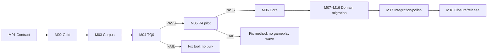

# Paldark V5 — Evidence-Driven Blueprint-to-C++ Migration

> **Curriculum status:** `DESIGNED — EXECUTION LOCKED BY TQ0/P4`
>
> **Engine:** Unreal Engine **5.8.1 only**, changelist `56057345`.
>
> 18 module · 127 bài · theory → archaeology → design → practice → proof.

Đây là giáo trình tái dựng KYWorld bằng C++ mà không đánh mất gameplay đã polish. Nó không kể lại lịch sử commit như một lịch làm việc, cũng không dùng converter output làm thiết kế. Mỗi module bắt đầu bằng câu hỏi “hệ thống này tồn tại để tạo outcome nào?”, khảo cổ evidence thật, khóa owner/contract, thực hành trên một unit nhỏ rồi kết thúc bằng proof có thể bác bỏ implementation.

Machine-readable curriculum: [`course.yaml`](./course.yaml).

**Required foundation:** trước M04 và M06, đọc [V5.9 — Kiến trúc UEFN và bài học cho PaldarkV5](/V5/09-uefn-architecture-and-paldarkv5). Chương này giải phẫu UEFN hiện hành, kiểm toán đúng phạm vi Course 16 và khóa ranh giới UEFN-lab với target UE5.8.1. Đây là prerequisite reading, không thêm module nên tổng vẫn là 18 module/127 bài.

## 1. Học xong khóa này nghĩa là gì

Người học không chỉ biết gõ lại Blueprint node thành C++. Họ có thể:

- dựng gold oracle và closed corpus cho một Unreal project lớn;
- dùng Epic MCP để quan sát UObject live mà không nhầm observation với design;
- dùng BPScaffold/NodeToCode để tạo zero-silent-omission evidence bundle cho surface, node, pin và edge topology;
- đọc graph như state machine/transaction/presentation contract;
- tách authoritative gameplay khỏi data, UMG, AnimBP, BT/EQS và authored presentation;
- thiết kế module DAG, single state owner, lifecycle và rollback seam phù hợp Paldark;
- chuyển từng capability qua dormant → shadow → switched → parity-evidenced;
- chứng minh toàn bộ W0–W12 đã khép kín bằng ledger, automated test và human A/B.

Khóa học không hứa logic auto-convert 100%. Kết quả cuối là 100% **authority closure**: executable gameplay/orchestration C/D in-scope có native owner hoặc terminal disposition được duyệt; retained asset/presentation/declarative surface có allowlist và vẫn giữ polish.

## 2. Cấu trúc một bài

Mỗi bài có cùng nhịp để kiến thức không dừng ở slide:

1. **Outcome** — người chơi hoặc hệ thống cần quan sát gì.
2. **First principles** — state, invariant, authority và failure model tối thiểu.
3. **Archaeology** — MCP, Asset Registry, source, graph, defaults, history và gold runtime nói gì.
4. **Design** — owner, contract, dependency, retained surface và rollback seam.
5. **Practice** — một thay đổi hoặc artifact nhỏ, có write-set rõ.
6. **Proof** — automated assertion, runtime trace, human checkpoint và exit digest.
7. **Anti-pattern** — cách implementation vẫn compile nhưng sai semantics.
8. **Handoff** — artifact nào trở thành input bắt buộc của bài sau.

Một bài chỉ hoàn tất khi proof chạy trên exact build/hash. “Đã đọc”, “đã generate” và “compile được” không phải terminal state.

## 3. Nguồn bằng chứng và cách dùng history

KYWorld source repository có lịch sử thật: 539 commit tổng, 378 non-merge trong census hiện tại. Riêng `BP_PlayerCharacter` có 105 commit khi theo rename/history và 55 commit ở current path. Dữ liệu này cho biết điểm nóng, ordering và reason-for-change; nó không tự biến thành dependency graph hay lịch 5 tuần đáng sao chép.

Thứ tự nguồn:

1. runtime observation trên gold đã pin;
2. asset/source/config/graph + hash/GUID;
3. commit/diff/blame có context;
4. tài liệu khóa học/donor/Epic source;
5. LLM inference, luôn gắn nhãn và cách kiểm chứng.

## 4. Bản đồ 18 module

| Module | Bài | Trọng tâm | Exit artifact | Wave |
|---|---:|---|---|---|
| M01 | 6 | Conversion contract | Program charter + vocabulary + state machine | Pre-bulk |
| M02 | 6 | Freeze gold/reference | Immutable baseline + canonical playthrough | W0 |
| M03 | 7 | Closed corpus | Asset/config/dynamic-load denominator | W0 |
| M04 | 8 | Qualify MCP/converter | `TQ0` certificate hoặc explicit failure | W0–W1 |
| M05 | 8 | Representative P4 pilot | One unit S0→S11 + rollback/human sign-off | P4 |
| M06 | 7 | Core foundations | Module DAG, owner/contracts/lifecycle receipts | W1 |
| M07 | 7 | Session & player profile | Start→Customization→Main native seams | W2 |
| M08 | 7 | Pawn, input, movement, camera | Locomotion/AnimBP handshake parity | W2 |
| M09 | 7 | Interaction & item identity | Focus/interact/cancel/drop target parity | W3 |
| M10 | 7 | Inventory core | Atomic 42/4/5 slot model and transaction tests | W4 |
| M11 | 7 | Inventory UI & equipment | UMG as presentation, equip/count/toast parity | W5 |
| M12 | 7 | Combat | GAS/action/damage/death timing parity | W6 |
| M13 | 7 | Pal species, runtime & AI | Native Pal owner with retained BT/EQS | W7 |
| M14 | 7 | Capture, party, PalBox, ride | Identity/storage/selection/capture parity | W7 |
| M15 | 7 | Craft/build/cook/container | Atomic production transactions | W8 |
| M16 | 7 | Work automation & world | Work assignment, time/world transition parity | W8 |
| M17 | 7 | Integration & polish | Full regression atlas, audio/VFX/UI/reference health | W9 |
| M18 | 8 | Closure, convergence, release | W10 freeze, W11 Paldark convergence, optional W12 engine gate | W10–W12 |
| **Tổng** | **127** |  |  |  |

## 5. Module guide

### M01 — Conversion contract · 6 bài

Khóa định nghĩa “converted”, taxonomy A/B/C/D/DCL, single authority và operational 12-state workflow. Bài cuối tạo charter đủ chặt để cấm các metric giả như LOC, số function sinh ra hoặc phần trăm node nhận diện.

**Proof:** mọi thuật ngữ trong certificate có denominator và terminal condition; `TQ0`, `P4`, wave exit không bị nhập làm một.

### M02 — Freeze gold/reference · 6 bài

Pin KYWorld commit, UE 5.8.1 toolchain, maps/config/plugins, build và canonical playthrough. Học viên rehearsal success/failure/cancel path trước khi đụng candidate.

**Proof:** gold tái tạo được từ clean checkout/build recipe; asset/runtime observation mang hash và human evidence.

### M03 — Closed corpus · 7 bài

Asset Registry chưa đủ cho string/config/dynamic load. Module xây denominator cho Blueprint, WidgetBlueprint, AnimBlueprint, struct, enum, table, map, config, plugin content và runtime roots; mỗi surface có stable ID và disposition.

**Proof:** closure query deterministic, denominator > 0 và unknown/unassigned được tính thay vì giấu.

### M04 — Tool qualification · 8 bài

Mổ xẻ Epic MCP, bridge, BPScaffold, NodeToCode và LLM theo vai trò. `BP_PlayerCharacter` 11-vs-8, 123-vs-118 và 145-vs-129 là ba laboratory khác nhau: surface closure, knot representation và data-edge fan-out loss. Bài học đi tiếp tới pin provenance, authoritative execution/data edge arrays, identity digest, processor disposition, strict serializer round-trip, enum numeric semantics, real-uasset fixture matrix và differential runtime semantics.

**Proof:** `TQ0` chỉ pass khi surface/node/edge closure, strict round-trip, processor completeness, clean build/test/cook/package và semantic fixtures cùng pass. Count-only hoặc deterministic reproduction của một schema mất edge đều không đủ. Hiện trạng: **NOT PASSED**.

### M05 — Representative P4 pilot · 8 bài

Chọn một unit đủ đại diện, chạy đầy đủ dossier → extraction → LLM review → target design → native dormant → shadow → switch → A/B → rollback → retire. `ABPPlayerCharacterNativePilot` hiện đã có dormant implementation cho 11/11 surface mà không sửa Content/reparent original Blueprint; đây là artifact để review, không phải parity certificate.

**Proof:** unit đi S0→S11 và owner/human ký. V3 đã sửa 16 data edge thiếu và deterministic qua fresh processes, nhưng 59 partial nodes cùng non-topology closure vẫn fail; native parity mới `PARTIAL`, nên **P4 NOT PASSED**.

### M06 — Core foundations · 7 bài

Từ failure của V1–V4, khóa module DAG, stable identity, tags, contracts, logging/correlation, capability registration, activation receipts và transaction boundary. Core không trở thành god module.

**Proof:** dependency graph acyclic; 100 activation/deactivation cycle không duplicate/leak; gameplay delta bằng 0.

### M07 — Session & player profile · 7 bài

Phân tích flow Start → Customization → Main, profile/appearance ownership, travel/session lifetime và player identity. Converter chỉ hỗ trợ khảo cổ; target model bắt đầu từ persistence/authority invariant.

**Proof:** flow và appearance parity, retry/travel không duplicate state, asset path giữ nguyên.

### M08 — Pawn, input, movement, camera · 7 bài

Tách Controller/PlayerState/Pawn/ASC lifetime, Enhanced Input, movement modes, camera boom và AnimBP handshake. Pose graph vẫn authored nếu không phải authority.

**Proof:** input, movement vector, camera framing, montage/AnimBP signal và respawn/repossess pass A/B.

### M09 — Interaction & item identity · 7 bài

Từ player intention tới focus/outline/interact/cancel, trace/target policy và item definition/instance identity. Failure path được xem là behavior hạng nhất.

**Proof:** cùng target, prompt, outline, range, cancel và invalid response như gold; defaults/references đúng.

### M10 — Inventory core · 7 bài

Xây state model/transaction cho add/find/remove/drop, stack, transfer/swap và slot validation; giữ chính xác 42 inventory, 4 weapon, 5 food slots của reference.

**Proof:** exact state diff; invalid/retry không mutate hoặc duplicate; transaction atomic/idempotent theo scope.

### M11 — Inventory UI & equipment · 7 bài

UMG giữ layout/animation nhưng không sở hữu inventory. Module nối grid/slot/drag-drop/detail/toast 2 giây/HUD count/equipment vào read model và command contract.

**Proof:** UI không mutate authoritative array; equip/unequip/count/toast pass human A/B.

### M12 — Combat · 7 bài

GAS/action là provider, không nuốt domain ownership. Module mô hình hóa bow/handgun, cost/commit, damage/death, montage/notifies, feedback và handle cleanup.

**Proof:** state, committed damage, ordering/timing/presentation parity; cancel/death cleanup không leak.

### M13 — Pal species, runtime & AI · 7 bài

Tách persistent Pal record khỏi active actor; species/data/identity, native runtime owner, perception/decision/action seam và retained BT/EQS asset.

**Proof:** spawn/despawn/selection/AI intent parity; BT/EQS là declarative consumer, không duplicate state owner.

### M14 — Capture, party, PalBox, ride · 7 bài

Capture là transaction nhiều owner; party/PalBox là storage/selection, riding/flying là possession/movement/lifecycle seam. Module đi cả success/failure/cancel/full-capacity path.

**Proof:** identity không đổi, capture atomic, storage/selection và mount/dismount/reconnect lifecycle pass.

### M15 — Craft, build, cook, container · 7 bài

Mỗi operation được biểu diễn thành command + validation + reservation + commit/compensation. Placement ghost, progress UI và VFX là presentation đọc transaction state.

**Proof:** invalid/cancel/retry không mất/nhân item; placement/result/UI/VFX pass A/B.

### M16 — Work automation & world · 7 bài

Kết nối Pal work assignment, production station, resource settlement, day/night, map transition, minimap/world feedback mà không tạo integration god object.

**Proof:** assignment/reassignment/cancel/travel ordering đúng; coordinator chỉ sở hữu transaction state của nó.

### M17 — Integration & polish · 7 bài

Chạy scripted regression từ frontend tới death/return, UI/minimap/audio/VFX/material/transition và edge case. Reference health, log health và performance được xem ngang gameplay state.

**Proof:** full atlas pass, zero reference loss/new error, human polish sign-off, deviation ledger đóng.

### M18 — Closure, convergence, release · 8 bài

W10 freeze UE5.8.1 parity; W11 đối chiếu từng capability với Paldark bằng `Adopt/Adapt/Keep/Replace/Reject`; W12 chỉ mở nếu có engine migration mới được duyệt, không trộn gameplay change. Module kết thúc bằng independent audit và Completion Certificate.

**Proof:** corpus/behavior/owner/reference closure 100%, zero forbidden authority, packaged smoke/performance/rollback pass, product owner ký.

## 6. Artifact chain

```text
A00 Program Charter
→ A01 Gold Baseline Lock
→ A02 Closed Corpus Ledger
→ A03 TQ0 Certificate
→ A04 P4 Pilot Packet
→ A05 Core Contract Pack
→ A06 Session/Profile Dossier
→ A07 Locomotion Dossier
→ A08 Interaction/Item Dossier
→ A09 Inventory Core Dossier
→ A10 Inventory Presentation Dossier
→ A11 Combat Dossier
→ A12 Pal Runtime/AI Dossier
→ A13 Capture/Party/Ride Dossier
→ A14 Production Dossier
→ A15 Work/World Dossier
→ A16 Regression Atlas
→ A17 Convergence Ledger
→ A18 Completion Certificate
```

Artifact sau không hợp lệ nếu input digest của artifact trước đã stale.

## 7. Gate đi qua khóa học



Không học “domain module” bằng cách triển khai production trước TQ0/P4. Có thể đọc lý thuyết và làm fixture, nhưng authority switch vẫn khóa.

## 8. Rubric mỗi bài

| Điểm | Điều kiện |
|---:|---|
| 0 | Chỉ có prose hoặc generated output |
| 1 | Có artifact nhưng thiếu provenance/denominator |
| 2 | Có deterministic evidence và design, chưa chạy proof |
| 3 | Automated proof pass trên pinned build |
| 4 | Automated + human proof + rollback/handoff pass |

Module chỉ pass khi mọi bài required đạt ít nhất 3 và bài human/polish required đạt 4. Bài optional không được dùng để che bài required fail.

## 9. Trạng thái bắt đầu

- UE5.8.1 CL `56057345` full build sau deterministic-pin patch: **PASS**.
- BPScaffold automation: **43/43 PASS** (`PaldarkV5/Saved/Logs/BPScaffoldFull-v5-stable-pin.log`); ConversionPilot: **3/3 PASS** (`ConversionPilot-v3.log`).
- `BP_PlayerCharacter` fresh-process v3: 11/11 surfaces, 169 raw/K2, 164 semantic + 5 knots, 604/604 pins, 65/65 exec edges, 145/145 data edges; 7 non-receipt artifacts byte-identical.
- Analysis vẫn fail-closed đúng thiết kế: 105 processor success, **59 partial** (28 no processor, 21 processor failed, 9 structural port mapping missing, 1 runtime rejection), 0 errors/74 warnings, `graph_coverage_complete=false`, `conversion_ready=false`.
- `ABPPlayerCharacterNativePilot`: dormant source cho 11/11 surfaces; zero tracked Content change, no reparent/no authority switch; behavior parity `PARTIAL / NOT CERTIFIED`.
- Hash v3 đã pin trong [MCP + Blueprint conversion pipeline](/V5/08-mcp-conversion-pipeline); hash v1 được giữ chỉ như superseded archive.
- `TQ0`: **NOT PASSED**.
- `P4`: **NOT PASSED**.
- Bulk conversion: **LOCKED**.
- UE5.6/5.6.1 build/audit trong tài liệu cũ: **STALE HISTORICAL EVIDENCE**, không được dùng làm current target proof.

Quy trình chi tiết: [MCP + Blueprint conversion pipeline](/V5/08-mcp-conversion-pipeline).
