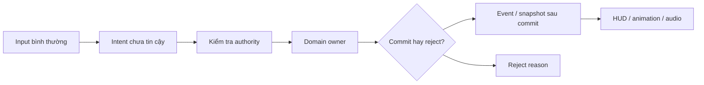

# Tái dựng KYWorld bằng C++ — từ hành vi đã quan sát đến gameplay có thể kiểm chứng

> **Loại tài liệu:** kế hoạch nghiên cứu và triển khai theo clean-room
> **Trạng thái:** kế hoạch kỹ thuật `PROPOSED — AWAITING ARCHITECTURE APPROVAL`
> **Phiên bản tham chiếu:** 0.1 — snapshot 2026-08-16
> **Phạm vi:** phòng thí nghiệm C++ độc lập, sau đó mới xem xét adapter vào PaldarkKit

Đây là trang canonical của dự án cho quyết định tái dựng KYWorld. Bài nghiên cứu composability trước đây vẫn được giữ ở [Nghiên cứu Paldark: composability và harness](/NghienCuu/paldark-composability-harness); bài đó là nền tảng lập luận và bằng chứng, còn trang này là kế hoạch hành động có điều kiện.

## Phần I — Quyết định mà người đọc cần hiểu trước

### 1. Một repository có thể chứa feature mà người chơi vẫn nhận một lời hứa bị hỏng

Bạn đứng trước một mỏ quặng, nhấn `F`, rồi chờ một điều rất nhỏ: quặng biến mất, số lượng trong túi tăng đúng một đơn vị và HUD phản ánh thay đổi ấy. Nếu cả ba cùng xảy ra, bạn không cần biết input đi qua bao nhiêu component. Nếu quặng biến mất nhưng số lượng không đổi, hoặc HUD đứng yên trong khi save đã ghi, người chơi không gọi đó là “một seam chưa được chứng minh”; họ chỉ thấy trò chơi thất hứa.

Một ví dụ khác còn dễ lộ hơn. Bạn nhấn `V` để giữ một con vật, lần đầu nhân vật ngắm đúng và tư thế trông hợp lý. Bạn nhấn `V` lần thứ hai ở một trạm không hợp lệ; thao tác bị từ chối nhưng con vật đột nhiên bị kéo về vị trí cũ. Repository có thể có hàm mang tên `CancelManualHold`, log compile xanh và vài commit sửa animation, nhưng trải nghiệm nhìn thấy vẫn là một cú teleport. Chênh lệch giữa artifact có tên đúng và kết quả người chơi thấy chính là lý do chúng ta đổi hướng.

PaldarkKit hiện có nhiều nền móng đáng giữ: module, GameFeature, data, ability, test và các seam để nhiều người cùng làm. Tuy vậy, càng mở rộng bề ngang, mỗi tính năng càng đụng vào nhiều trạng thái mà chỉ normal play và mắt người mới xác nhận được. Khi một task đã kéo theo camera, animation, input, UI, authority, retry và persistence, việc thêm code nền không còn đồng nghĩa với việc hoàn thành một đường chơi.

Vì vậy, quyết định ở đây không phải “KYWorld có bao nhiêu file để chép”. Câu hỏi là: những hành vi nào đã được quan sát, điều kiện nào làm chúng đáng tin, và làm sao viết lại các lời hứa đó bằng C++ độc lập để chúng ta có thể bỏ một giả thuyết mà không phá PaldarkKit. Từ câu hỏi nhỏ ở mỏ quặng, kế hoạch đi đến một lab tách rời, một chuỗi gate và một quyết định tích hợp chỉ xuất hiện sau cùng.

### 2. Vì sao tạm dừng mở rộng PaldarkKit

Tạm dừng không phải kết luận rằng công việc trước đây thất bại. PaldarkKit đã cho chúng ta biết nhiều bài học về module, quyền ghi, stable ID, authority check, reservation/escrow và review độc lập. Điều cần dừng là cách mở rộng theo chiều ngang trước khi một lát cắt ngắn chạy ổn định bằng input bình thường.

Có bốn mức thường bị gọi chung là “đã làm”. Thứ nhất là breadth: có class, asset, plugin hoặc commit mô tả một tính năng. Thứ hai là seam đã compile và được nối trong environment. Thứ ba là normal path: người chơi thực hiện hành động và nhìn thấy kết quả đúng, kể cả trường hợp từ chối và thử lại. Thứ tư là polish: camera, animation, âm thanh, timing, bố cục HUD và cảm giác chuyển tiếp không phá lời hứa. KYWorld có giá trị đặc biệt ở mức tham chiếu hành vi và polish quan sát được; PaldarkKit cần một cách tiếp cận cho phép học điều đó mà không đẩy mọi giả thuyết chưa kiểm tra vào kernel đang dùng.

Snapshot ngày 2026-08-16 làm ranh giới ấy cụ thể hơn. Cả 21 GameFeature hiện được cấu hình `Active` từ đầu; audit source chưa thấy đường bật/tắt động, nên chúng mới chứng minh biên đóng gói tĩnh chứ chưa chứng minh feature có thể ra vào giữa phiên chơi. `Work` còn phụ thuộc trực tiếp vào `PalBehavior`; registry definition–fragment vẫn là stub; event bus phát đồng bộ trong cùng call stack; persistence và multiplayer mới ở đường QA, chưa phải Save/Quit/Load hay Host/Join/Reconnect của normal play. Những sự thật này không phủ nhận giá trị của code đã có. Chúng cho biết lab và adapter sau này không được giả định dynamic composition, provider discovery, durable event, save hay network đã được giải quyết chỉ vì tên subsystem tồn tại.

AI có thể viết một lượng lớn code nền, nhưng tự động xác nhận một đường chơi phức tạp vẫn có giới hạn. Một test fixture gọi thẳng owner không nói rằng người chơi đã đến đúng khoảng cách, nhìn đúng hướng, thấy animation đúng nhịp hay nhận một reject dễ hiểu. Khi outcome có yếu tố thị giác và timing, human gate là một phần của đặc tả, không phải bước trang trí sau compile.

Bài học thực dụng là thu nhỏ vòng phản hồi. Trước tiên hãy làm một slice từ boot đến movement, interaction, một resource và inventory HUD. Nếu slice này chưa giữ được quantity, identity, reject và retry, thêm capture, Work hay multiplayer chỉ làm số đường lỗi tăng lên. Việc tạm dừng giúp chúng ta giữ những gì PaldarkKit đã học, đồng thời đặt một đường biên nơi giả thuyết mới có thể bị loại bỏ an toàn.

### 3. KYWorld đáng giữ ở đâu, và không phải là gì

KYWorld có giá trị như một behavioral/reference corpus đã được polish ở nhiều lát cắt: movement và input, inventory/UI, equipment, bow combat, creature, capture, PalBox, building/crafting, riding/flying, AI và world/life. Người chơi có thể học được thứ tự một vertical slice trở nên thuyết phục: input phải có cảm giác, vật thể phải phản hồi, quan hệ với creature phải bền hơn một dòng text, và presentation phải hỗ trợ state thay vì che lỗi.

Static census cho thấy corpus này cũng rất rộng: snapshot ghi nhận **10.173 tracked paths**, trong đó **10.040 `.uasset`**, **51 `.umap`**, **34 `.cpp`**, **36 `.h`**, **3 `.cs`**, khoảng **2.919 dòng vật lý native C++**. Tính theo tracked paths, `.uasset` chiếm xấp xỉ **98,7%** ở snapshot đó. Những con số này cho biết nơi cần đặt câu hỏi và vì sao binary breadth vừa phong phú vừa khó đọc; chúng không phải phần trăm behavior đã hoàn thành.

Native layer vẫn có những seam hữu ích. `PlayerCharacter` cho thấy camera, Enhanced Input và camera-relative movement; `BaseAbilitySystemComponent` cho thấy mapping input tag, ability spec và handle; `BaseCharacter` tạo ASC/AttributeSet khi possessed. Ngược lại, inventory quantity, capture, PalBox, UI graph và nhiều behavior quan trọng nằm trong asset hoặc tài liệu mô tả. Một `BP_PalSphere`, một DataTable hay một commit “building/crafting” là manh mối để thiết kế observation, không phải bằng chứng atomicity, persistence, authority hay parity.

Vì thế, KYWorld không phải donor architecture, không phải giấy phép, không phải nguồn để phân phối asset/code và không phải một bản thiết kế có thể dịch Blueprint-to-C++ tự động. Nó là reference cho những lời hứa mà người quan sát được phép ghi lại, cùng với các known unknowns. Chúng ta giữ polish như mục tiêu trải nghiệm, còn implementation phải là code, data và asset nguyên bản hoặc có provenance rõ.

### 4. “Tái dựng” nghĩa là viết lại hành vi, không dịch biểu đạt

Tái dựng bắt đầu từ câu mà người chơi có thể kiểm tra: “Ở gần một mỏ quặng hợp lệ, nhấn `F` một lần làm quantity tăng một lần và HUD cập nhật; target ngoài range hoặc không hợp lệ bị từ chối mà state không đổi.” Câu này không cần nói Blueprint có node gì, biến nào tên gì hay asset donor được nối ra sao. Nó vẫn đủ để đặt pre-state, input, owner, commit point, failure và presentation.

Một contract tốt sẽ mô tả theo trace: `Input → Intent → Owner → State transition → Commit/Reject → Event/Snapshot → Presentation`. Với pickup, `Interaction` chỉ truy vấn target và tạo request; `Inventory` là canonical writer của quantity; `Presentation` đọc snapshot; retry dùng `CorrelationId` hoặc `IdempotencyKey` để không nhân đôi. Nếu target bị phá giữa query và commit, quyền authority sai hoặc reservation hết hạn, contract phải nói rõ reject reason và state nào được giữ nguyên.

Điều này cũng phân biệt hai loại thay đổi. Đăng ký listener, input mapping, timer, provider handle hay một grant có inverse rõ là installation effect; chúng có thể được ghi vào ledger và tháo theo reverse order. Quantity đã chuyển, damage đã settle, capture đã commit, building đã đặt, output đã spawn hoặc save đã ghi là committed gameplay transaction. Gỡ listener không thể trả lại quặng, và gọi `ClearAbility` không phải rollback damage. Với loại sau, domain owner, authority, reservation, idempotency và compensation phải được thiết kế riêng.

Một implementation khác class, graph và bytecode vẫn có thể tương đương trong contract nếu cùng input, pre-state, outcome, reject reason, identity relation và timing tolerance đã khóa. Đây là equivalence có phạm vi, không phải lời hứa “clone hoàn chỉnh”. Chỗ nào reference chỉ có tên asset hoặc mô tả mơ hồ, chúng ta ghi `UNKNOWN` và tạo observation task thay vì lấp khoảng trống bằng suy đoán.

### 5. Lab độc lập là bước đệm an toàn

Nếu vừa xem donor Blueprint vừa sửa PaldarkKit, ba thứ sẽ trộn vào nhau: hành vi tham chiếu, biểu đạt cụ thể và seam riêng của target. Khi test fail, chúng ta không biết lỗi đến từ spec, engine, adapter hay một giả định sao chép. Lab độc lập cho phép một giả thuyết sai bị loại bỏ mà không làm kernel PaldarkKit bẩn thêm.

Kế hoạch đề xuất `PaldarkReconstructionLab` ở compile-time riêng. Phòng quan sát/specification có reference version, normal input, output, timing, failure, build/map/config, media hash và provenance. Phòng implementation chỉ nhận behavioral contract đã freeze, neutral IDs, original hoặc licensed code/assets, test và log. Nếu ambiguity buộc người triển khai xem donor, task dừng và lập provenance decision: ai xem, thấy gì, vì sao cần, ảnh hưởng clean-room ra sao và có cần reset context hay không.

Adapter vào PaldarkKit chỉ được xem xét ở `CR-8`, sau khi lab có contract, transaction, runtime, human gate và provenance đủ mạnh. Adapter không được trở thành domain owner thứ hai; nó dịch neutral command/result về seam của target. Nếu adapter cần copy donor, sửa Core ngoài write-set hoặc tạo duplicate state, stop condition được kích hoạt và slice quay về lab hoặc dừng.

Tách lab có chi phí ban đầu, nhưng nó biến “có thể bỏ đi” thành một thuộc tính thật. Ta có thể giữ một slice nhỏ, thay provider, đổi asset placeholder hoặc bỏ cả giả thuyết mà không phải phục hồi PaldarkKit từ một integration nửa hoàn thành.

### 6. Bộ xương C++ và ranh giới sở hữu

Một kiến trúc dễ đọc không bắt đầu bằng việc biến mọi class thành plugin. Nó bắt đầu bằng câu hỏi ai được phép ghi state nào, state sống ở scope nào và phần nào có thể tháo mà không để lại side effect. Trong lab, `Foundation` giữ stable ID, principal, correlation/idempotency, `Result/Failure`, authority, lifecycle, clock/random policy và activation ledger hẹp. `Data` giữ definition, schema, validator và adapter cho `DataAsset`/`PrimaryAsset`; data không tự settle transaction.

`CompositionHost` chịu trách nhiệm Experience/ruleset, Game Feature activation, `requires/provides`, provider identity/generation, quiescence và teardown. Các domain owner giữ Interaction, Inventory, Crafting, Build, Health, Combat, Creature, Capture, Companion/PalBox và Work. `Presentation` biến event/snapshot thành view model, HUD, animation, audio/VFX; nó không ghi quantity, identity hay assignment. `PaldarkAdapter` chỉ xuất hiện ở CR-8.

Sơ đồ dưới đây có một ý chính: input không đi thẳng từ UI tới Actor tùy ý, và nhánh reject cũng là một outcome có hợp đồng.



Khi `Inventory` commit xong, nó phát event hoặc snapshot; HUD chỉ đọc. Khi `Interaction` reject vì range, UI có thể hiển thị lý do nhưng không tự sửa quantity. Khi provider đổi generation, consumer phải rebind hoặc deactivate; một pointer cũ không được xem là continuity. Ranh giới này làm cho lỗi có chỗ đứng: nếu quantity sai, tìm ở owner/transaction; nếu UI sai mà state đúng, tìm ở presentation; nếu activation để lại listener, tìm ở ledger/quiescence.

### 7. Học từ “Everything is a Plugin” trong một ranh giới có ích

DeepSeek Harness và bài Cordis gợi ra hai cách đặt câu hỏi. Một capability nên có contract, provider/consumer, lifecycle và cách thay thế; một effect chỉ nên được coi là reversible khi inverse thực sự có nghĩa. Các ý tưởng này giúp chúng ta thấy dependency ẩn, nhưng không biến thành bảo đảm sẵn có của Unreal và cũng không cho phép suy ra private chain of thought.

“Everything is a Plugin” nên được đọc như heuristic về boundary, không phải khẩu hiệu tạo plugin cho từng helper. Plugin quá nhỏ làm dependency graph, load order và version burden phình ra; plugin quá lớn trở thành god feature. Granularity hợp lý là domain có owner và một seam có thể quan sát: Interaction, Inventory/Crafting, Combat, Creature, Build, Work.

Lyra Experiences và Game Features minh họa cách chọn ruleset/feature set; Modular Gameplay cho thấy request/extension handle; GAS mạnh ở ability, effect, tag và combat; UEFN devices gợi cách designer nhìn một actor qua config và event. Nhưng không cơ chế nào tự cấp universal rollback, typed provider generation, stable identity qua actor lease hay evidence gate. Vì vậy lab mượn seam, không mượn tên để tuyên bố parity.

### 8. CR-0 đến CR-8 là một hành trình của người chơi

Các stage dưới đây được kể từ outcome mà người quan sát cần thấy. Mỗi stage có packet, prerequisite, automated checks, human gate, exit evidence và stop condition; stage trước không tự động mở stage sau.

**CR-0 — Corpus, provenance và specification.** Người chơi chưa nhận feature mới; điều cần nhìn thấy là một contract có reference version, authorization, observer, input bình thường, success, failure, timing tolerance và unknowns. CR-0 khóa census, evidence ledger, provenance manifest, media hashes và first-slice backlog. Nếu behavior chỉ được suy từ binary, version không khớp hoặc quyền quan sát mơ hồ, dừng ở đây.

**CR-1 — Host và lifecycle skeleton.** Người dùng bật một capability trong session, thấy input/listener/provider xuất hiện, tắt nó và thấy registration biến mất mà không leak callback hay duplicate. Foundation, Data, Composition Host, typed resolver và ledger hẹp được dựng trong lab độc lập. Gate này chỉ nâng installation effect lên compile/integrated; nó không chứng minh transaction gameplay.

**CR-2 — First playable slice.** Một session mới khởi động, pawn di chuyển, camera phản hồi, người chơi đi đến resource, nhấn `F`, thấy quantity và HUD đổi đúng một lần; target ngoài range và retry có kết quả rõ. Đây là lát cắt đầu tiên đạt `PLAYER_OBSERVABLE`, rồi `USER_VERIFIED` khi human chạy normal keys với build/map/config đã ghi. Nếu input chỉ chạy bằng debug command, UI ghi canonical quantity hoặc retry nhân đôi, phải quay lại owner/contract.

**CR-3 — Combat và crafting.** Resource được kiểm tra, reservation/escrow được giữ, bow/ammo được craft một lần, equip và aim/fire tạo damage feedback bởi authority đúng. Invalid material bị từ chối, grant handle tháo đúng, ammo không tự sinh sau retry. Không dùng unregister để rollback damage; nếu client tự quyết quantity/damage, dừng stage.

**CR-4 — Building/crafting.** Người chơi thấy preview, đặt một workstation ở vị trí hợp lệ, bị từ chối ở vị trí sai, cancel không đốt resource, và demolish/compensation theo contract. Preview actor chưa phải canonical building cho đến commit. Đây là một slice có thể kiểm tra valid/invalid/cancel, không phải tuyên bố đã có toàn bộ building kit.

**CR-5 — Creature, capture và PalBox.** Một creature có stable ID đi qua combat, capture, storage, summon và recall; relation không nhân đôi khi actor lease spawn/despawn. Human kiểm tra escape/failure/interruption, cardinality một slot/một party row và rejection. Tên `BP_PalSphere` không đủ để mở gate; cần behavior contract và observation.

**CR-6 — Work.** Một worker đến một station, assignment/progress/output được Work sở hữu, movement/arrival được `PalBehavior` sở hữu, output có escrow và stale arrival bị từ chối. Đây là stage cần behavior spec/direct observation mới, vì corpus hiện tại chưa đủ proof Work bền vững. Gate đặc biệt nhìn bằng mắt để phát hiện teleport, snap, carry sai hướng và assignment trôi.

**CR-7 — Hardening.** Save/load, migration, authority/replication, reconnect và performance được mở bằng packet riêng. Save fixture không phải normal persistence; offline simulation không phải multiplayer. Không có benchmark hiện tại, nên stage này tạo baseline thay vì bịa con số.

**CR-8 — Adapter Paldark.** Một neutral contract đã đạt parity evidence giới hạn hoặc được human chấp thuận như requirement non-parity được map vào seam PaldarkKit. Protected-path audit, teardown, integration test và human normal-input gate phải pass. Nếu adapter cần donor code/asset, duplicate canonical state hoặc sửa Core không được phép, dừng tích hợp.

Kết quả của hành trình không phải một lời hứa “đã convert toàn bộ”. Nó là chuỗi bằng chứng ngày càng mạnh, trong đó mỗi hệ thống có contract và known delta riêng. Một stage có thể dừng lâu ở `UNKNOWN` mà vẫn là kết quả kỹ thuật đúng hơn một dòng trạng thái xanh nhưng không truy được build và observer.

### 9. Công việc phải sống sót qua một lần tắt máy

Restart-safe không có nghĩa là AI nhớ nguyên cuộc trò chuyện. Nó có nghĩa là người mở máy lại đọc được canonical index, branch/HEAD, dirty status, packet hash, transition cuối, diff, review và human artifact rồi biết chính xác hành động kế tiếp. Mỗi packet đóng một seam: goal, non-goals, allowed/forbidden paths, owner, invariant, acceptance, command, evidence level, attempt, next actor và stop signal.

Chu trình thực tế là: Human phê duyệt architecture và phạm vi; Sol tạo packet; Luna sửa đúng write-set và ghi checkpoint; fresh Sol đọc packet/diff/evidence trong context mới; human chạy normal-input gate; kết quả được persist. Nếu Luna gặp ambiguity kiến trúc, provenance exception, protected path, mismatch baseline hoặc failure lặp lại, Luna tạo escalation packet và quay về Sol thay vì tự mở scope. Sau retry có giới hạn, task phải chuyển `CHANGES_REQUESTED` hoặc `RECONCILIATION_BLOCKED`, không chạy cùng lệnh mãi.

Vai trò không dựa trên tuyên bố model nào “giỏi hơn” một cách bản chất. Authority đến từ packet, context, quyền ghi và gate. Human là người duy nhất xác nhận `USER_VERIFIED` và chấp thuận merge/integration; reviewer không tự sửa implementation; Luna không commit, push, deploy hay approve.

### 10. Quyết định cần có ngay bây giờ

Chúng ta chưa bắt đầu viết C++ và cũng chưa cấp quyền chuyển đổi. Để mở CR-0, con người cần quyết định ít nhất: ai là authorized observer và implementer; reference build/version/map/config nào được khóa; provenance chỉ cho placeholder hay asset có license nào; mục tiêu distribution là học tập riêng hay prototype nội bộ; lab UE 5.6 có được chấp thuận không; first slice có đúng boot → movement → interaction/resource → inventory HUD không; human gate cadence, reviewer identity và stop authority là gì.

Nếu một câu trả lời chưa rõ, hành động đúng là tạo `UNKNOWN` và thêm observation/decision task, không phải code trước rồi hy vọng sẽ hợp thức hóa sau. Khi CR-0 đóng được provenance, contract và unknown register, root mới có thể tạo packet CR-1/CR-2. Từ điểm đó, trang này trở thành master plan chi tiết bên dưới; không stage nào tự động thực thi chỉ vì tài liệu đã được viết.

Điều thay đổi sau quyết định pause là cách chúng ta gọi tên tiến bộ. Trước đây, một commit thêm nhiều feature có thể tạo cảm giác đang đi rất nhanh; trong kế hoạch này, một packet nhỏ đạt được một outcome người chơi có thể lặp lại có giá trị hơn một danh sách dài chưa qua gate. Một ngày làm việc có thể kết thúc bằng việc phát hiện target range chưa rõ, hoặc bằng quyết định trì hoãn Work vì không có observation đủ sạch. Cả hai đều là tiến bộ nếu chúng làm giảm điều chưa biết thay vì che nó.

Bạn cũng không cần học toàn bộ Cordis, Harness, Lyra hay Paldark internals để đọc phần đầu. Chỉ cần giữ ba câu hỏi: người chơi vừa thấy gì, state nào phải đổi để điều đó đúng, và bằng chứng nào cho phép chúng ta nói state đã đổi. Các thuật ngữ như provider generation, actor lease hay quiescence xuất hiện sau khi một câu hỏi thực tế cần chúng; nếu chưa có câu hỏi đó, chúng không phải mục tiêu học thuộc.

Khi đọc tiếp, hãy xem mỗi bảng như một lời mời kiểm tra chứ không phải một bảng thành tích. Dòng `S1` của Inventory không nói inventory không tồn tại; nó nói evidence hiện có chưa đủ cho quantity, authority và save. Dòng `CR-6` của Work không phải lời hứa bỏ qua hệ thống; nó nói Work cần một observation packet riêng. Cách đọc ấy cho phép chúng ta giữ sự tôn trọng với công sức trong corpus mà vẫn bảo vệ quyết định kỹ thuật khỏi overclaim.

## Phần II — Master plan và sổ tham chiếu

### 11. “Tái tạo đầy đủ” được định nghĩa thế nào

Trong brief ban đầu, “hoàn chỉnh” thường được hiểu qua cảm giác: animation di chuyển đã mượt, bow có nhịp, inventory phản hồi giống reference, creature và base không còn là placeholder. Đó là một mục tiêu trải nghiệm hợp lệ, nhưng chưa phải một đơn vị triển khai. Muốn một nhóm có thể làm việc lâu dài mà không tranh cãi về chữ “xong”, chúng ta phải phân rã nó thành những điều quan sát được và điều kiện để chấp nhận.

Một behavior row đầy đủ cần ghi ít nhất: input bình thường; pre-state; điều kiện target/range/LOS; authority và role; state transition; commit point; event hoặc snapshot; presentation; timing tolerance; success; reject; retry; restart; identity relation; persistence/network nếu nằm trong contract; known deltas; provenance và evidence gate. “Inventory giống reference” vì vậy được thay bằng nhiều row có thể chạy: stack, split, swap, drop, weight, reservation, save/load, authority, HUD snapshot và lỗi khi target không hợp lệ.

Định nghĩa full recreation của kế hoạch là một backlog có provenance cho behavior, failure, timing, camera, animation, UI, audio, data, save/network khi được yêu cầu, known delta và asset replacement. Backlog đó chưa tồn tại đầy đủ hôm nay. CR-0 mới là nơi observer tạo census, observation script, evidence ledger, unknown register và behavior contract cho first slice; sau đó các stage mở rộng backlog theo dependency. Trang này là master plan và cấu trúc quyết định, không giả vờ rằng chúng ta đã đọc được toàn bộ graph Blueprint hay có conversion backlog chi tiết cho mọi asset.

Thang evidence giúp giữ câu chữ đúng với những gì đang có:

| Mức | Có thể nói | Chưa thể nói |
|---|---|---|
| `DESIGNED` | mục tiêu, giả thuyết hoặc contract đã viết | đã có runtime |
| `SOURCE_PRESENT` | source, asset hoặc tài liệu trace tồn tại | compile hoặc normal play |
| `COMPILED` | UHT/compile/link theo command và target đã ghi | player đã nhìn thấy outcome |
| `INTEGRATED` | seam được nối trong environment chỉ định | human đã xác nhận hoặc parity |
| `PLAYER_OBSERVABLE` | normal path tạo outcome người chơi có thể thấy | user gate hoặc reference match |
| `USER_VERIFIED` | người được ủy quyền đã chạy focused gate | parity rộng hơn contract/version |
| `PARITY_EVIDENCED` | contract khớp reference version, có known delta/provenance | clone hoàn chỉnh hoặc hệ thống không có reference evidence |

Maturity của một row là monotonic trong contract/version cụ thể, không phải nhãn vĩnh viễn cho tên feature. Nếu build hash, map, config hoặc observer metadata bị thiếu, report cũ có thể phải trở về `UNKNOWN`; lịch sử được append finding chứ không xóa. Đây là nguyên tắc để kế hoạch không biến static census thành quảng cáo completion.

### 12. Bản đồ đủ mười lăm hệ thống

Các chương 21–35 trong archive vẫn là nguồn phân tích player-facing. Ở root plan, chúng được gom thành các nhóm để nhìn dependency: movement/input và interaction mở đầu đường chơi; inventory, crafting, combat và building tạo economy hành động; creature, capture, Companion/PalBox và Work tạo quan hệ sống; progression, world/life, dungeon/boss, persistence, multiplayer và breeding/economy làm cho vòng chơi kéo dài. Bảng sau không cấp thêm runtime proof cho KYWorld; nó nói rõ evidence snapshot, lời hứa reconstruction, owner đề xuất, stage và điều CR-0 hoặc observation sau đó còn phải làm.

| Ch. | Hệ thống | Evidence hiện tại | Lời hứa cần tái dựng | Owner đề xuất | Stage | Khoảng trống cần quan sát/đặc tả |
|---:|---|---|---|---|---|---|
| 21 | Movement/Input | S2; Enhanced Input, camera-relative movement, input tags và movement component | di chuyển, camera, jump/sprint/crouch/swim/glide/mount theo contract | Movement/Pawn | CR-2 | state chuyển tiếp, cancel, timing và normal-input trace |
| 22 | Interaction/Gathering | S1–S2; `IInteractInterface`, flow `F`, item/resource docs và asset trace | target query, range/LOS, contention, resource lifecycle, reject/idempotency | Interaction | CR-2 | target invalid, resource respawn, authority và retry |
| 23 | Inventory | S1; GDD/Blueprint slots và native shell | quantity, stack/split/swap/drop/weight, reservation, view snapshot | Inventory | CR-2 | canonical ledger, save/load, authority và UI failure |
| 24 | Crafting | S1–S2; workbench docs, recipes/DataTables, commit history | validate, reserve, output, cancel/refund, recipe relation | Crafting + Inventory | CR-3/4 | atomicity, breadth recipe và persistence |
| 25 | Combat | S2 cho GAS/equipment seam; bow/weapon history | aim/fire, damage authority, death/recovery, effect/status, feedback | Combat + Health | CR-3 | hit authority, normal fire, timing và recovery |
| 26 | Capture | S1–S2; Pal Sphere/capture docs/assets và commits | failure/escape, capture commit, stable identity, interruption | Capture + Creature | CR-5 | escape probability, relation, persistence và cardinality |
| 27 | Companion | S1–S2; Pal base, PalBox/UI docs, riding/flying history | summon/recall, party/storage, defeat/recovery, lease replacement | Companion/PalBox | CR-5 | stable ID, slot transaction và normal summon |
| 28 | Building | S1–S2; tags/assets/commit history, workbench content | preview, valid placement, reject, demolish/compensation | Build + Crafting | CR-4 | collision, quantity commit, preview lifetime |
| 29 | Work/Automation | S1; WorkMenu/AI/cooking/spawn traces, chưa có robust native owner | suitability, assignment, arrival, progress, output và cancel | Work + PalBehavior + Inventory | CR-6 | direct observation, queue, reservation, offline/authority |
| 30 | Progression/Technology | S1; stat/level/DataTable assets và level-up traces | XP, unlock graph, stat ownership, migration | Progression | CR-7 | formula, unlock dependencies và save relation |
| 31 | World/Life | S1; map, day/night, spawn box, stamina traces | clock, weather, population, respawn, deterministic seed | World/Life | CR-7 | normal clock, population, lifecycle và seed |
| 32 | Dungeon/Boss | S0–S1; names/roadmap/content trace hạn chế | room/boss/reward loop, resume và normal claim | Dungeon/Boss | sau CR-6/7 | owned encounter, reward transaction, resume |
| 33 | Persistence | S0; chưa có save/load proof trực tiếp, binary có thể che behavior | save/quit/load, schema, migration, relation integrity | Persistence | CR-7 | build/config, crash boundary và human restart |
| 34 | Multiplayer | S0–S1; dependencies/config, chưa có build/multiplayer proof | authority, replication, travel, reconnect, host/join, identity | Network + domain owners | CR-7 | role matrix, packet loss/retry và reconnect |
| 35 | Breeding/Economy | S0–S1; roadmap/data references | formula, sacrifice/shop/stock, save và normal UI | Breeding + Economy | sau backlog | behavior source, formula, stock và transaction |

Bảng này cho thấy tại sao “có asset” không đồng nghĩa “có hệ thống”. Movement có native seam mạnh hơn Work; capture có flow tài liệu nhưng chưa có identity proof; persistence và multiplayer không được suy ra từ `Build.cs`. First slice vẫn là movement/input → interaction/resource → inventory HUD. Combat/crafting và building mở khi quantity/authority đã ổn; creature mở khi stable record và combat contract đủ; Work, persistence, multiplayer và breeding/economy chỉ mở bằng observation hoặc requirement packet mới.

### 13. Bản đồ module C++ và quyền sở hữu

Topology đề xuất cố định một số trust boundary, nhưng không đóng API trước CR-0/CR-1. `Foundation` là module thấp tầng, không biết PaldarkKit private seam; nó cung cấp `StableId`, `PrincipalId`, `CorrelationId`, `IdempotencyKey`, typed `Result/Failure`, authority role, lifecycle scope, clock/random policy và narrow installation ledger. `Data` cung cấp schema/definition, validator và bridge tới `PrimaryAsset`/`DataRegistry`; data chỉ mô tả, không tự commit.

`CompositionHost` là nơi bootstrap Experience/ruleset, resolve capability graph, theo dõi provider generation, quyết định activation/quiescence và kiểm tra teardown. Game Feature Plugin có thể chứa domain cohesive sau khi host và first slice ổn định. Không tạo plugin cho mỗi class, và không gom tất cả vào một “Paldark framework” khổng lồ. Một domain boundary tồn tại khi nó có owner, lifecycle, contract và observation seam riêng.

Các domain modules hoặc Game Features đề xuất gồm `Interaction`, `Inventory`, `Crafting`, `Build`, `Health`, `Combat`, `Creature`, `Capture`, `Companion/PalBox` và `Work`. `Presentation` chứa view model, HUD, animation, audio/VFX bridge; nó nhận snapshot/event và được phép giữ transient state của view. `PaldarkAdapter` là module/feature chỉ mở ở CR-8, map neutral IDs/commands/results và không thay canonical owner.

State ownership cần được đọc như một bảng quyền ghi chứ không chỉ là danh sách class:

| State | Writer duy nhất trong scope/generation | Actor/UI được phép làm gì |
|---|---|---|
| principal/player relation | `PlayerState` hoặc principal record | Pawn phát intent; HUD đọc snapshot |
| pawn/input embodiment | Pawn/Controller boundary | phát `MoveIntent`, không settle inventory |
| creature identity | Creature record | Actor lease hiển thị và thực thi embodiment |
| inventory quantity/reservation | Inventory domain | Crafting/Interaction yêu cầu, HUD đọc |
| health/damage settlement | Health/Combat authority | GAS là mechanism, domain quyết định semantics |
| capture/party/PalBox | Capture/Companion | UI gửi request, domain giữ relation/cardinality |
| assignment/progress/output | Work | PalBehavior di chuyển; Presentation hiển thị |
| movement/arrival | PalBehavior/Movement | arrival có correlation/target lease |
| HUD/animation/audio | Presentation | không ghi canonical gameplay |
| durable save record | Persistence | serialize owner theo schema/version |

Stable record và Actor lease là ranh giới quan trọng. Creature record giữ `StableCreatureId`, owner relation, progression, party/storage relation; Actor lease giữ transform, embodiment, generation, spawn correlation và teardown handle. Summon tạo lease mới cho cùng record; recall thu lease mà không nhân đôi record. Tương tự, arrival của Work chỉ settle khi worker ID, station ID, generation và task correlation còn khớp. Nếu một contract thật sự buộc Actor là persistence, nó phải ghi limitation thay vì lén coi pointer là identity.

Luồng command/event/transaction được giữ ngắn và có thể audit:

```text
normal input
  → intent chưa tin cậy
  → authority + identity + range/LOS + capability/lease check
  → reservation/escrow nếu có quantity
  → domain commit với correlation/idempotency
  → durable record hoặc post-commit event/snapshot
  → presentation view model
```

`requires/provides` phải ghi capability, semantic version/range, required/optional, scope, network role, cardinality, provider identity/generation, resolution policy, timeout/quiescence, teardown, owner và provenance. Resolver reject missing provider, cycle, generation mismatch hoặc ambiguous cardinality trước khi consumer thấy view nửa cài đặt. Nếu provider thay generation, consumer rebind/deactivate; không giữ pointer vĩnh viễn. Đây là contract proposal, chưa phải header/API đã tồn tại trong PaldarkKit.

### 14. Content, presentation và pipeline polish

Một reconstruction chỉ “đúng” ở quantity nhưng camera giật, bow release sai nhịp, animation chuyển pose gãy hoặc HUD che mất lý do reject thì vẫn chưa đạt lời hứa người chơi. Vì vậy presentation không được để đến cuối như một lớp sơn. Nó phải đi theo behavior row, với tolerance quan sát được và provenance riêng.

Camera/movement bắt đầu từ một cảnh cụ thể: người chơi đổi hướng quanh resource, camera-relative movement giữ cảm giác liên tục, stop/cancel không làm pawn snap, mount hoặc glide có chuyển state dễ nhận biết. CR-2 chưa cần art cuối nhưng cần camera policy, input mapping, acceleration/deceleration, collision và failure script đủ để human ghi “cảm giác đúng trong contract” hoặc “UNKNOWN”. Các tolerance như độ trễ HUD, thời điểm input lock hay góc aim không được bịa; CR-0 phải quan sát hoặc ghi là quyết định mới.

Animation và bow timing cần contract theo checkpoint: montage bắt đầu khi nào, input release được nhận ở frame/phase nào trong tolerance, projectile/damage commit ở đâu, cancel hoặc miss hiển thị gì, và teardown có để lại state không. Một screenshot không chứng minh sequence; media hash và normal-input recording giúp fresh reviewer quay lại đúng artifact. Visual gate cần đủ ngắn để người thật chạy, nhưng đủ cụ thể để bắt drift, carry upside-down, snap hoặc orientation sai.

HUD và layout phải là read-only view model. Pickup thành công tạo snapshot có quantity, slot và feedback; pickup bị reject tạo reason code hiển thị; reload HUD không increment state. Layout acceptance ghi vùng nhìn thấy, thứ tự thông tin, focus/input feedback và breakpoint cần thiết, không nói “giống hệt trade dress”. Audio/VFX là post-commit hoặc transient cue theo consequence: mất một toast khác mất event capture. Khi cần rebind presentation, không được spawn duplicate Actor hay write quantity.

Asset pipeline tách ba nguồn: asset tự tạo; asset có license/provenance rõ; placeholder được tạo để kiểm tra behavior. Manifest mỗi asset/code ghi `origin`, license/evidence, hash, allowed-use, reviewer và distribution scope. Không dùng asset, audio, animation, tên/trade dress hoặc extracted data của KYWorld/Palworld làm donor. Nếu một behavior chỉ tái hiện được bằng asset không rõ nguồn, stop ở provenance gate và dùng placeholder hoặc viết lại contract.

“Polish đạt” không phải đánh giá chủ quan không thể lặp. Mỗi row có human observation checklist, visual tolerance, known delta và evidence level; human ghi build/version/map/config, timestamp, checkpoint và media hash. Điều này không biến cảm giác thành con số giả, nhưng biến một nhận xét mơ hồ thành một gate có thể kiểm tra lại.

Pipeline nội dung nên đi từ rẻ đến đắt theo đúng ranh giới của behavior. Ở CR-2, một resource hình hộp, một âm thanh placeholder và một widget đơn giản vẫn đủ nếu chúng giữ được vị trí target, feedback quantity và nhịp input. Khi contract ổn định, presentation track thay placeholder bằng asset tự author hoặc có license, nhưng không được thay đổi owner hay transaction để làm art “dễ hơn”. Mỗi lần thay asset lớn cần chạy lại focused gate vì collision, socket, montage hoặc bounds có thể làm behavior đổi theo cách code không báo.

Camera, animation và HUD cũng cần tách “tolerance” khỏi “style”. Tolerance là điều kiện người chơi phải nhận ra để contract còn đúng: input không bị nuốt, aim không snap sai target, resource feedback không trễ đến mức gây double press, text không che checkpoint quan trọng. Style là lựa chọn màu, hình khối, âm thanh và nhịp trang trí có thể thay bằng bản nguyên bản. Tách hai loại này giúp chúng ta học từ polish của KYWorld mà không tuyên bố sao chép trade dress, đồng thời giúp reviewer biết một visual delta là blocker hay chỉ là việc của presentation backlog.

Một content packet nên có `BehaviorRowId`, asset manifest, input script, expected visual checkpoint, timing tolerance, known delta và replacement status. Reviewer kiểm tra asset provenance cùng behavior evidence, còn human kiểm tra sequence bằng normal input. Nếu asset mới làm montage dài hơn, camera offset khác hoặc widget thay đổi focus, packet phải cập nhật tolerance và chạy lại gate; không giữ một chữ `USER_VERIFIED` cũ như thể content là bất biến. Đây là cách polish trở thành một phần của acceptance mà vẫn giữ được khả năng thay thế.

### 15. Quyết định phiên bản và nền tảng

Corpus technical plan ghi reference source-architecture ở Unreal **5.4**, trong khi lab đề xuất **UE 5.6** để phù hợp nền tảng Paldark hiện hành. Hai số này không được trộn: hành vi quan sát từ reference version cần được khóa bằng build/map/config; API hoặc behavior engine ở 5.6 phải được kiểm chứng bằng compatibility spike. Một commit hoặc README nói “UE 5.4” không tự chứng minh feature behavior; một compile ở 5.6 không tự chứng minh parity với 5.4.

CR-0 cần tạo version matrix cho engine, target, platform, plugin, Game Feature, GAS, Enhanced Input, rendering mode, input device, save format và network mode. Compatibility spike nhỏ nên kiểm tra boot, module load, Enhanced Input, Game Feature lifecycle, data loading, animation asset placeholder và packaging boundary; nó không mở rộng thành build toàn bộ hệ thống. Nếu provider hoặc API khác biệt làm contract không còn đứng được, fallback là giữ contract trung lập, chọn UE version khác đã được phê duyệt, giảm scope hoặc dừng. Không thêm dependency/package manager mới trong tài liệu này.

Platform matrix cũng phải tách “có thể compile” khỏi “có thể quan sát”. Editor/Win64 Development là target kỹ thuật phổ biến cho compile; human gate cần map/config và normal input tương ứng. Dedicated server, client, console hoặc mobile không được coi là được hỗ trợ chỉ vì module không báo lỗi. CR-7 mới tạo packet network/platform nếu behavior thật sự nằm trong phạm vi.

### 16. Workstreams, dependency và parallelism

Critical path là `CR-0 provenance/specification → CR-1 host/lifecycle → CR-2 first slice → CR-3 combat/crafting và CR-4 building → CR-5 creature → CR-6 Work → CR-7 hardening → CR-8 adapter`. Mỗi mũi có thể có track song song, nhưng prerequisite và owner không thể bỏ qua. Một branch chuẩn bị data không được tự tạo canonical writer; một presentation track không được tự settle quantity để “đỡ chờ domain”.

Các track an toàn để chạy song song sau khi packet cho phép gồm:

- **Corpus/provenance:** index reference, hash, asset manifest, public-source pin và unknown register; không đụng implementation room.
- **Behavior specification:** viết trace normal/reject/retry cho một hệ thống; chỉ dùng output được authorized observer cung cấp.
- **Foundation/composition:** resolver, lifecycle, ledger và test missing provider/cycle; không phát minh behavior domain.
- **Domain slices:** Interaction/Inventory rồi Crafting/Combat/Build theo owner; mỗi packet một seam, protected paths rõ.
- **Presentation/assets:** view model, HUD, animation/audio placeholder và replacement inventory; không chép donor, không ghi canonical state.
- **Validation:** schema lint, static checks, integration test, failure injection và media/hash bookkeeping; không nâng evidence nếu thiếu human gate.
- **Adapter:** chỉ chờ CR-8; có thể chuẩn bị mapping document nhưng không link PaldarkKit sớm.

Safe parallelism có nghĩa là chia câu hỏi, không nhân đôi quyền ghi. Chúng ta không để hai agent cùng sở hữu `Inventory.Quantity`, hai registry cùng resolve một provider, hoặc một adapter và domain cùng commit capture. Packet phải ghi owner, expected HEAD, allowed write-set và artifact authority; dirty baseline hoặc conflict làm restart reconciliation dừng.

Retrospective Paldark cho thấy breadth trước normal path, task nhiều outcome, late Editor discovery, status fragmentation, nhầm Unreal `Owner` với principal, human gate quá dài và manual assignment setup nặng là các nguồn rework. Cách tối ưu ở đây là packet một seam, human gate sớm, compile/static hẹp và chỉ cook/package/multiplayer/CI khi acceptance criteria yêu cầu. Git elapsed time là wall-clock envelope, không chuyển thành person-hours hay so sánh model/người.

### 17. Gate, stop condition và kế hoạch đo

Chín parity gates được giữ nguyên nhưng giải thích bằng câu hỏi người đọc có thể kiểm tra:

| Gate | Câu hỏi | Bằng chứng bắt buộc | Không được suy ra |
|---|---|---|---|
| PG-0 | observer, authorization và provenance có rõ? | decision, hashes, unknowns, manifest | technical review đã cho phép ship |
| PG-1 | reference behavior và failure đã ghi? | traceability row, media/log, version | parity từ asset name/README |
| PG-2 | owner, authority, identity, lifecycle đã đóng? | graph, invariant review | UI hoặc unregister là owner/rollback |
| PG-3 | target/build compile đúng? | command log, target, diff | player behavior, pose, persistence |
| PG-4 | success/reject/retry/idempotency có giữ invariant? | tests, authority log, transaction record | conservation từ happy path duy nhất |
| PG-5 | seam cross-domain chạy trong lab? | integrated test và snapshot | human normal-input proof |
| PG-6 | human đã chạy focused normal input? | report build/map/config/checkpoint | “works” không có bước gate |
| PG-7 | contract có version-locked parity? | comparison, known deltas, provenance | full clone hoặc absent-system parity |
| PG-8 | clean-room/adapter và human approval đã pass? | fresh findings, protected audit, decision | tự động bắt đầu integration |

Compile chỉ trả lời source và toolchain hiện có thể tạo target; observation trả lời người chơi thấy gì ở input bình thường. Human gate không thay automated test, nhưng automated test cũng không thay mắt người ở camera, animation, timing, orientation hoặc UI. Một row chỉ báo cáo gate mạnh nhất đã thật sự có artifact; header cũ không được ghi đè execution report mới.

Failure injection đi theo owner: provider mất giữa activation; provider generation đổi; callback đến sau teardown; retry cùng idempotency key; reservation hết hạn; authority/range/LOS sai; actor lease despawn trước arrival; stale arrival sau reassign; capture ngắt giữa validate/commit; preview bị cancel; save crash trước/trong/sau commit; synchronous listener throw sau domain commit; network duplicate/out-of-order; human observer không tái hiện. Mỗi lỗi cần expected invariant, recovery, evidence và stop reason. Có lỗi phải reject trước commit, có lỗi cần compensation, durable recovery hoặc human escalation; không gọi tất cả là rollback.

Kế hoạch đo sau khi contract ổn định gồm behavior correctness (tỷ lệ case đạt, quantity/identity/cardinality, reject reason, duplicate/ghost actor), composition health (missing provider, cycle, leak listener/timer/grant, generation rebind), integration cost (changed files/lines theo packet, protected-path violation, finding/correction loop, wall-clock), player-observable reliability (fresh-session success, reject clarity, restart/rebind, visual defects) và performance (activation latency, command latency, memory, replication bytes, save/load, frame impact). Hiện chưa có benchmark baseline; kế hoạch không bịa số.

Stop hoặc quay về architecture khi provenance/authorization mơ hồ, contract mâu thuẫn, owner không duy nhất, resolver không deterministic, UI/adapter ghi canonical state, activation leak, retry nhân đôi, stale arrival settle output, save mất relation, multiplayer claim thiếu authority evidence, human gate chỉ dùng debug command hoặc cần donor code/asset để tiếp tục. Stop là một kết quả evidence hợp lệ: ta có thể thu nhỏ slice, tạo placeholder, viết observation mới hoặc quyết định không triển khai.

### 18. CR-0 phải tạo ra những gì

CR-0 là cầu nối giữa master plan và execution packet, không phải tên khác của “bắt đầu code”. Exit của CR-0 phải có một bộ artifact mà fresh Sol, Luna và human có thể đọc lại sau restart:

1. **Corpus index và evidence ledger:** reference build/version/commit, source/document path, snapshot date, claim, evidence label, observation limit và link/section/page/commit.
2. **Provenance manifest:** origin, license/evidence, hash, allowed use, reviewer, distribution scope cho code, data, asset, audio, animation, media và placeholder.
3. **Behavior inventory cho first slice:** movement, camera, interaction, resource, inventory HUD, success, failure, timing, retry, restart và unknowns; không giả vờ inventory toàn bộ opaque Blueprint đã xong.
4. **Observation scripts:** normal keys, precondition, expected checkpoint, invalid target, retry, teardown và media/hash capture; có authorized observer và stop authority.
5. **Reference/media manifest:** map/config, build identity, timestamp, input device, recording/screenshot hash và known delta; thiếu metadata thì giữ `UNKNOWN`.
6. **Unknown register:** câu hỏi chưa thể trả lời từ static evidence, giả thuyết cạnh tranh, signal để phân biệt và task observation tương ứng.
7. **API/ADR decisions:** neutral IDs, owner, authority, stable record/Actor lease, requires/provides, transaction semantics, version/platform spike và fallback; API vẫn là proposal cho đến CR-1.
8. **Feature backlog và dependency graph:** 15 systems, stages, owner, prerequisite, acceptance, risk, safe parallel track và forbidden path.
9. **Asset replacement inventory:** những gì cần self-author hoặc license rõ cho camera, animation, bow, HUD, audio/VFX, creature, building và environment; không dùng donor asset để lấp.
10. **Gate cards:** PG-0…PG-8, test card, human visual card, failure injection và exact validation command; compile, integration, observation và parity được tách.
11. **Packet mở CR-1/CR-2:** write-set nhỏ, expected HEAD, packet hash, non-goals, next actor/action, attempt number, stop signals và reviewer context.

Chỉ sau khi con người phê duyệt architecture, provenance, observer và first slice, root mới tạo packet `CR-0` trạng thái approved. Kế hoạch kỹ thuật local vẫn là **version 0.1 — `PROPOSED — AWAITING ARCHITECTURE APPROVAL`**; không CR stage nào đang mở, không conversion nào được ủy quyền.

### 19. Rủi ro, quyết định còn mở và nguồn

#### 19.1. Những rủi ro không được viết nhỏ đi

**Blueprint và binary opacity.** Static census, tên asset, README và commit history không cho thấy toàn bộ graph, latent timing, collision, replication, persistence, state machine hoặc balance. Native C++ ít không chứng minh behavior ít; native C++ nhiều không chứng minh normal path. Authorized observation hoặc dump có provenance mới thu hẹp được khoảng trống.

**Clean-room và IP.** Không thấy `LICENSE`/`NOTICE` không chứng minh có quyền, và thấy file có thể đọc không chứng minh quyền phân phối. KYWorld được dùng như reference behavior trong phạm vi được phép, không phải donor code/asset. Legal/provenance review, original/licensed replacement và private-learning distribution decision là prerequisite; kế hoạch không đưa ra legal clearance.

**Behavior còn thiếu.** Work, persistence, multiplayer, dungeon/boss, breeding/economy và nhiều polish detail chưa có direct evidence đủ mạnh. Chúng được đặt trong backlog hoặc requirement mới, không tự nâng từ tên asset. CR-0 phải ưu tiên unknowns có ảnh hưởng tới owner, identity, transaction và human gate.

**Giới hạn human gate.** Người quan sát có thể bỏ sót race hiếm, timing dài, multiplayer edge hoặc state sau nhiều giờ. Một report có build/version/checkpoint/media hash là evidence cho contract đã chạy, không phải chứng minh hệ thống hoàn hảo. Lặp fresh session, failure injection và wording giới hạn claim là bắt buộc.

**Giới hạn analogy.** Cordis cung cấp vocabulary effects/coeffects và temporal/spatial composability; DeepSeek Harness cung cấp heuristic plugin/service boundary công khai; Lyra, Game Features, Modular Gameplay, GAS và UEFN chỉ là correspondence. Không nguồn nào tự cung cấp universal inverse, transaction rollback, stable identity, provider generation hay evidence ladder của Paldark. Không có private chain of thought để suy đoán.

**Đánh giá tiến độ.** Git wall-clock, số file, số dòng, số plugin, thời gian command, countdown và documentation volume là các measurement khác nhau. Snapshot KYWorld **10.173 paths / 10.040 `.uasset` / 51 `.umap` / 34 `.cpp` / 36 `.h` / 3 `.cs` / khoảng 2.919 dòng native** là số liệu census, không phải completion. Paldark history và Task 55 là retrospective/process evidence; `Task 55` phải giữ `UNKNOWN`/paused vì thiếu editor build/version ID, map/config, observer timestamp và media SHA-256 cho runtime report. Không dùng compile hash hoặc header cũ để nâng human gate.

#### 19.2. Quyết định con người cần ghi thành record

Trước khi mở CR-0, decision record phải trả lời: authorized observer và implementer là ai; implementer có được xem donor ở mức nào; exception provenance xử lý ra sao; asset policy là placeholder, self-author hay license nào; distribution intent là gì; reference build/map/config và engine version nào; first slice có thu nhỏ hơn không; UE 5.6 lab có được chấp thuận không; human gate cadence, evidence retention, reviewer identity và stop authority là gì. Đây là quyết định về phạm vi và quyền, không phải một việc Luna tự suy ra từ task.

#### 19.3. Nguồn có thể kiểm chứng

Nguồn local được dẫn như parent-workspace provenance reference, không phải public link: kế hoạch `../Documents/KYWorld/ke-hoach-tai-dung-kyworld-clean-room-cpp.md` (version 0.1, trạng thái đề xuất); `../Documents/KYWorld/claudecode_note.txt`; `../Documents/KYWorld/paper-review.txt`; `../Documents/KYWorld/LyraFramework_Overview.pdf`; và corpus `../02.Palworld/Source` cùng `../02.Palworld/Documents`. Các path này giúp người có workspace tương ứng truy trace; chúng không cấp license và không nên xuất hiện như đường dẫn máy cá nhân trong site công khai.

Các nguồn public primary để kiểm chứng mechanism ở CR-0 gồm [Cordis paper repository](https://github.com/cordiverse/paper), [Cordis source](https://github.com/cordiverse/cordis), [DeepSeek Harness](https://github.com/deepseek-ai/deepseek-harness), [tài liệu kiến trúc Harness](https://raw.githubusercontent.com/deepseek-ai/deepseek-harness/master/docs/architecture.md), [Lyra Sample Game](https://dev.epicgames.com/documentation/en-us/unreal-engine/lyra-sample-game-in-unreal-engine), [Game Features and Experiences](https://dev.epicgames.com/documentation/en-us/unreal-engine/game-features-and-experiences-in-unreal-engine), [Modular Gameplay](https://dev.epicgames.com/documentation/en-us/unreal-engine/modular-gameplay-in-unreal-engine), [Gameplay Ability System](https://dev.epicgames.com/documentation/en-us/unreal-engine/gameplay-ability-system-for-unreal-engine), và [UEFN devices](https://dev.epicgames.com/documentation/en-us/fortnite/getting-started-with-devices-in-fortnite). Official docs nói cơ chế công khai; chúng không chứng minh KYWorld đã có behavior tương ứng.

Nghiên cứu nền trước đây ở [NghienCuu/paldark-composability-harness.md](/NghienCuu/paldark-composability-harness) giữ lại evidence ladder, retrospective PaldarkKit, mô hình composability và giới hạn nguồn. Sáu quyển archive, mục lục và phụ lục vẫn giữ route; root này chỉ đổi lời hứa chính sang kế hoạch KYWorld C++.

## Kết luận

KYWorld đáng giá vì cho chúng ta một reference về những lời hứa player-facing đã được polish ở các lát cắt cụ thể, không phải vì nó cho phép copy một architecture hay một kho asset. PaldarkKit đáng giữ vì nó đã tạo ra những boundary và bài học; cần tạm dừng mở rộng breadth để một lab sạch chứng minh behavior, failure, ownership, presentation và evidence bằng C++ độc lập.

Đường đi được đề xuất là quan sát → specification → lab → first slice → các domain stage → hardening → adapter. Mỗi bước có gate và stop condition; compile không được nói thay normal play, asset census không được nói thay parity, và reviewer không được nói thay human. Quyết định tiếp theo của con người là phê duyệt phạm vi, provenance, observer, version và CR-0. Cho đến khi quyết định ấy được ghi, **chưa có code conversion nào bắt đầu**.
